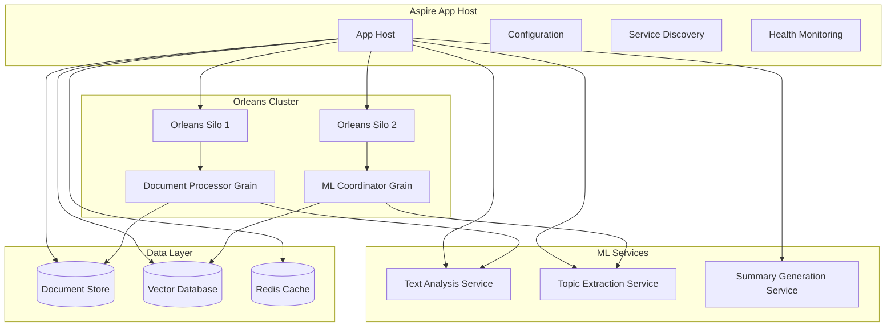

# .NET Aspire Patterns

**Description**: Comprehensive .NET Aspire patterns for orchestrating distributed applications, with focus on Orleans integration and ML document processing pipelines.

**.NET Aspire** is a cloud-ready stack for building observable, production-ready, distributed applications. It provides service orchestration, configuration management, and local development tooling optimized for microservices and distributed systems.

## Key Capabilities for Document Processing

- **Service Orchestration**: Coordinate Orleans silos, ML services, and databases
- **Configuration Management**: Centralized config with automatic reloading
- **Service Discovery**: Automatic registration and health monitoring
- **Local Development**: Integrated dashboard, logging, and distributed tracing
- **Resource Management**: Handle databases, message queues, and external services
- **Observability**: Built-in OpenTelemetry integration

## Index

### Core Patterns

- [Orleans Integration](orleans-integration.md) - Integrating Orleans clusters with Aspire orchestration
- [Service Orchestration](service-orchestration.md) - Coordinating ML pipelines and document services
- [Configuration Management](configuration-management.md) - Managing settings across environments
- [Local Development Workflow](local-development.md) - Development dashboard and debugging

### ML & Document Processing

- [ML Service Coordination](ml-service-orchestration.md) - Orchestrating machine learning workflows
- [Local ML Development](local-ml-development.md) - Local ML setup with Azure emulators and provider patterns
- [Document Pipeline Architecture](document-pipeline-architecture.md) - End-to-end document processing flow
- [Resource Dependencies](resource-dependencies.md) - Managing databases, queues, and external APIs

### Advanced Patterns

- [Health Monitoring](health-monitoring.md) - Service health checks and diagnostics
- [Scaling Strategies](scaling-strategies.md) - Horizontal scaling and resource allocation
- [Production Deployment](production-deployment.md) - Moving from local to cloud environments

## Architecture Overview



## Common Use Cases

### Document Processing Pipeline

- **Document Ingestion**: Upload and initial processing coordination
- **ML Workflow Orchestration**: Coordinate multiple ML models in sequence
- **Result Aggregation**: Combine outputs from various processing services
- **Query Coordination**: Handle complex document search and retrieval

### Development & Operations

- **Local Development**: Full pipeline testing with mocked external services
- **Service Integration Testing**: End-to-end pipeline validation
- **Production Monitoring**: Health checks and performance metrics
- **Configuration Management**: Environment-specific settings and secrets

## Prerequisites

- **.NET 9.0 or later**
- **Visual Studio 2022 17.8+** or **VS Code with C# Dev Kit**
- **Docker Desktop** (for local development dependencies)
- **Basic Orleans knowledge** (see [Orleans documentation](../orleans/readme.md))

## Getting Started

1. **Install Aspire Workload**:

   ```bash
   dotnet workload install aspire
   ```

2. **Create Aspire Project**:

   ```bash
   dotnet new aspire-starter -n DocumentProcessor
   ```

3. **Add Orleans Integration**:

   ```bash
   dotnet add package Microsoft.Orleans.Aspire
   ```

4. **Configure App Host**:

   ```csharp
   var builder = DistributedApplication.CreateBuilder(args);
   
   var orleans = builder.AddOrleans("orleans-cluster")
                       .WithDashboard();
   
   builder.AddProject<Projects.DocumentProcessor>("document-api")
          .WithReference(orleans);
   ```

## Best Practices

### Service Design

- **Keep services focused** - Each service should have a single responsibility
- **Use health checks** - Implement comprehensive health monitoring
- **Design for failure** - Handle service unavailability gracefully
- **Monitor resource usage** - Track CPU, memory, and I/O patterns

### Configuration Management

- **Use strongly-typed configuration** - Avoid magic strings and weak typing
- **Separate by environment** - Different settings for dev/test/prod
- **Secure sensitive data** - Use Azure Key Vault or similar for secrets
- **Version configuration** - Track configuration changes alongside code

### Local Development

- **Use Aspire dashboard** - Leverage built-in monitoring and logging
- **Mock external dependencies** - Use test doubles for external APIs
- **Seed test data** - Provide realistic sample documents for testing
- **Profile performance** - Identify bottlenecks early in development

## Related Patterns

- [Orleans Patterns](../orleans/readme.md) - Virtual actors and grain management
- [ML.NET Patterns](../mlnet/readme.md) - Machine learning model integration
- [GraphQL Patterns](../graphql/readme.md) - API design for document queries
- [Database Design](../database-design/readme.md) - Storage patterns for documents

---

**Key Benefits**: Service orchestration, configuration management, local development experience, built-in observability, Orleans integration

**When to Use**: Building distributed applications with multiple services, coordinating ML pipelines, managing complex service dependencies

**Alternatives**: Docker Compose (simpler but less feature-rich), Kubernetes (more complex but more control), Tye (deprecated predecessor)