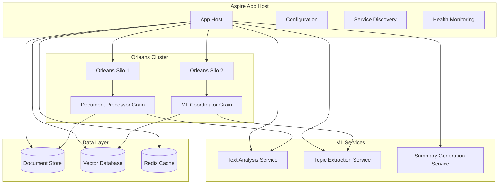

# Enterprise .NET Aspire Cloud-Native Architecture

**Description**: Production-ready .NET Aspire patterns for enterprise-scale cloud-native applications with advanced orchestration, observability, security, and distributed system resilience patterns.

**.NET Aspire** is Microsoft's opinionated cloud-ready stack for building observable, production-ready, distributed applications. It provides comprehensive service orchestration, configuration management, and enterprise development tooling optimized for cloud-native microservices and distributed systems with built-in security, monitoring, and scalability.

## Enterprise Cloud-Native Capabilities

### 🏗️ **Advanced Service Orchestration**

- **Multi-Cluster Coordination**: Orchestrate Orleans silos, Kubernetes workloads, and Azure services
- **Cross-Cloud Integration**: Hybrid and multi-cloud service coordination patterns
- **Resilience Patterns**: Circuit breakers, bulkhead isolation, and graceful degradation
- **Traffic Management**: Advanced load balancing, canary deployments, and blue-green strategies

### ⚙️ **Enterprise Configuration Management**

- **Hierarchical Configuration**: Environment-specific overrides with strong typing and validation
- **Secret Management**: Azure Key Vault integration with automatic rotation
- **Feature Flags**: Dynamic configuration with gradual rollout capabilities
- **Configuration as Code**: GitOps workflows with configuration versioning

### 🔍 **Production Observability**

- **Distributed Tracing**: Full-stack observability with OpenTelemetry and Application Insights
- **Real-Time Monitoring**: Custom metrics, dashboards, and intelligent alerting
- **Performance Profiling**: APM integration with bottleneck identification
- **Security Monitoring**: Threat detection and compliance reporting

### 🛡️ **Enterprise Security & Compliance**

- **Zero-Trust Architecture**: mTLS, service mesh integration, and identity-based authorization
- **Compliance Framework**: GDPR, SOX, HIPAA compliance patterns with audit trails
- **Threat Mitigation**: DDoS protection, rate limiting, and security scanning integration
- **Identity Federation**: Azure AD, OAuth 2.0, and enterprise SSO integration

## Enterprise Pattern Index

### 🏗️ **Cloud-Native Architecture Foundations**

- [Service Orchestration](service-orchestration.md) - Advanced multi-service coordination with resilience patterns
- [Orleans Integration](orleans-integration.md) - Enterprise-scale actor model integration with Aspire orchestration
- [Configuration Management](configuration-management.md) - Hierarchical configuration with security and compliance
- [Resource Dependencies](resource-dependencies.md) - Advanced dependency management with health monitoring

### 🚀 **Production Deployment & Operations**

- [Production Deployment](production-deployment.md) - Enterprise cloud deployment with zero-downtime strategies
- [Deployment Strategies](deployment-strategies.md) - Blue-green, canary, and rolling deployment patterns
- [Scaling Strategies](scaling-strategies.md) - Auto-scaling, load balancing, and performance optimization
- [Health Monitoring](health-monitoring.md) - Comprehensive observability and alerting frameworks

### 🤖 **AI/ML & Real-Time Processing**

- [ML Service Orchestration](ml-service-orchestration.md) - Enterprise ML pipeline coordination with MLOps
- [Document Pipeline Architecture](document-pipeline-architecture.md) - Scalable document processing with AI integration
- [Realtime Processing](realtime-processing.md) - Stream processing and event-driven architectures
- [Local ML Development](local-ml-development.md) - Development workflows for ML services

### 💻 **Development Experience & Compliance**

- [Local Development](local-development.md) - Enterprise development workflows with container orchestration
- [Audit Compliance](audit-compliance.md) - Enterprise compliance patterns for regulated industries

## Architecture Overview



## Common Use Cases

### Document Processing Pipeline

- **Document Ingestion**: Upload and initial processing coordination
- **ML Workflow Orchestration**: Coordinate multiple ML models in sequence
- **Result Aggregation**: Combine outputs from various processing services
- **Query Coordination**: Handle complex document search and retrieval

### Development & Operations

- **Local Development**: Full pipeline testing with mocked external services
- **Service Integration Testing**: End-to-end pipeline validation
- **Production Monitoring**: Health checks and performance metrics
- **Configuration Management**: Environment-specific settings and secrets

## Prerequisites

- **.NET 9.0 or later**
- **Visual Studio 2022 17.8+** or **VS Code with C# Dev Kit**
- **Docker Desktop** (for local development dependencies)
- **Basic Orleans knowledge** (see [Orleans documentation](../orleans/readme.md))

## Getting Started

1. **Install Aspire Workload**:

   ```bash
   dotnet workload install aspire
   ```

2. **Create Aspire Project**:

   ```bash
   dotnet new aspire-starter -n DocumentProcessor
   ```

3. **Add Orleans Integration**:

   ```bash
   dotnet add package Microsoft.Orleans.Aspire
   ```

4. **Configure App Host**:

   ```csharp
   var builder = DistributedApplication.CreateBuilder(args);
   
   var orleans = builder.AddOrleans("orleans-cluster")
                       .WithDashboard();
   
   builder.AddProject<Projects.DocumentProcessor>("document-api")
          .WithReference(orleans);
   ```

## Best Practices

### Service Design

- **Keep services focused** - Each service should have a single responsibility
- **Use health checks** - Implement comprehensive health monitoring
- **Design for failure** - Handle service unavailability gracefully
- **Monitor resource usage** - Track CPU, memory, and I/O patterns

### Configuration Management

- **Use strongly-typed configuration** - Avoid magic strings and weak typing
- **Separate by environment** - Different settings for dev/test/prod
- **Secure sensitive data** - Use Azure Key Vault or similar for secrets
- **Version configuration** - Track configuration changes alongside code

### Local Development

- **Use Aspire dashboard** - Leverage built-in monitoring and logging
- **Mock external dependencies** - Use test doubles for external APIs
- **Seed test data** - Provide realistic sample documents for testing
- **Profile performance** - Identify bottlenecks early in development

## Related Patterns

- [Orleans Patterns](../orleans/readme.md) - Virtual actors and grain management
- [ML.NET Patterns](../mlnet/readme.md) - Machine learning model integration
- [GraphQL Patterns](../graphql/readme.md) - API design for document queries
- [Database Design](../database-design/readme.md) - Storage patterns for documents

---

**Key Benefits**: Service orchestration, configuration management, local development experience, built-in observability, Orleans integration

**When to Use**: Building distributed applications with multiple services, coordinating ML pipelines, managing complex service dependencies

**Alternatives**: Docker Compose (simpler but less feature-rich), Kubernetes (more complex but more control), Tye (deprecated predecessor)
