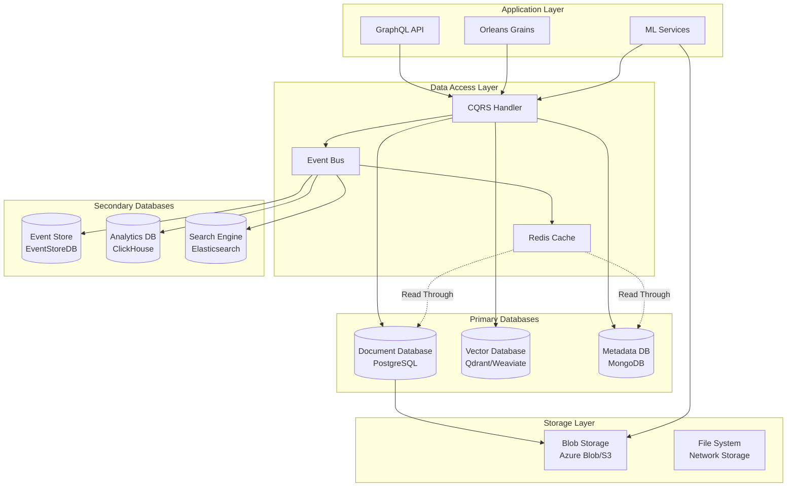

# Database Design Patterns for Document Processing

**Description**: Comprehensive database design patterns for document processing systems, including document storage schemas, vector databases for semantic search, ML metadata management, and scalable architecture patterns for large-scale text processing applications.

**Modern document processing systems** require sophisticated database architectures that handle structured metadata, unstructured content, vector embeddings, ML results, and real-time analytics. This guide covers proven patterns for designing scalable, performant database solutions.

## Key Design Principles

- **Polyglot Persistence**: Use the right database for each data type and access pattern
- **Event-Driven Architecture**: Implement CQRS and event sourcing for audit trails and scalability
- **Vector Storage**: Efficient storage and retrieval of embeddings for semantic search
- **Horizontal Scalability**: Design for distributed storage and processing
- **Performance Optimization**: Indexing strategies for complex query patterns
- **Data Consistency**: Balance consistency requirements with performance needs

## Index

### Core Database Patterns

- [Document Schema Design](document-schema.md) - Primary document storage and metadata patterns
- [Vector Database Integration](vector-storage.md) - Embeddings and semantic search patterns
- [ML Metadata Schema](ml-metadata.md) - Machine learning results and model tracking
- [Event Sourcing Patterns](event-sourcing.md) - Audit trails and state reconstruction

### Advanced Patterns

- [CQRS Implementation](cqrs-patterns.md) - Command Query Responsibility Segregation
- [Sharding Strategies](sharding-patterns.md) - Horizontal scaling and partitioning
- [Caching Patterns](caching-strategies.md) - Multi-level caching for performance
- [ML Database Technologies](ml-databases.md) - Database alternatives for ML development
- [Backup and Recovery](backup-recovery.md) - Data protection and disaster recovery

### Integration Patterns

- [Multi-Database Transactions](distributed-transactions.md) - Cross-database consistency
- [Change Data Capture](change-tracking.md) - Real-time data synchronization
- [Analytics Integration](analytics-patterns.md) - OLAP and reporting database design
- [Search Integration](search-patterns.md) - Full-text and semantic search

## Architecture Overview



## Document Storage Schema Design

### Primary Document Table (PostgreSQL)

```sql
-- Primary document storage with JSONB for flexibility
CREATE TABLE documents (
    id UUID PRIMARY KEY DEFAULT gen_random_uuid(),
    title VARCHAR(500) NOT NULL,
    content_hash VARCHAR(64) NOT NULL, -- SHA-256 of content
    content_preview TEXT, -- First 1000 characters for quick preview
    metadata JSONB NOT NULL DEFAULT '{}',
    
    -- Document properties
    document_type VARCHAR(50) NOT NULL,
    language_code VARCHAR(10),
    author_id UUID,
    source_system VARCHAR(100),
    
    -- Processing status
    processing_status processing_status_enum DEFAULT 'pending',
    processing_started_at TIMESTAMP WITH TIME ZONE,
    processing_completed_at TIMESTAMP WITH TIME ZONE,
    
    -- File properties
    file_size_bytes BIGINT,
    mime_type VARCHAR(100),
    encoding VARCHAR(50),
    
    -- Timestamps and versioning
    created_at TIMESTAMP WITH TIME ZONE DEFAULT NOW(),
    updated_at TIMESTAMP WITH TIME ZONE DEFAULT NOW(),
    version INTEGER DEFAULT 1,
    
    -- Soft delete
    deleted_at TIMESTAMP WITH TIME ZONE,
    
    -- Full text search
    search_vector tsvector GENERATED ALWAYS AS (
        setweight(to_tsvector('english', coalesce(title, '')), 'A') ||
        setweight(to_tsvector('english', coalesce(content_preview, '')), 'B') ||
        setweight(to_tsvector('english', coalesce(metadata->>'description', '')), 'C')
    ) STORED
);

-- Enums for type safety
CREATE TYPE processing_status_enum AS ENUM (
    'pending',
    'in_progress',
    'completed',
    'failed',
    'cancelled'
);

CREATE TYPE document_type_enum AS ENUM (
    'pdf',
    'word',
    'text',
    'markdown',
    'html',
    'email',
    'webpage',
    'other'
);

-- Indexes for performance
CREATE INDEX idx_documents_status ON documents (processing_status);
CREATE INDEX idx_documents_type ON documents (document_type);
CREATE INDEX idx_documents_author ON documents (author_id);
CREATE INDEX idx_documents_created ON documents (created_at DESC);
CREATE INDEX idx_documents_language ON documents (language_code);
CREATE INDEX idx_documents_source ON documents (source_system);
CREATE INDEX idx_documents_search ON documents USING GIN (search_vector);
CREATE INDEX idx_documents_metadata ON documents USING GIN (metadata);

-- Partial indexes for active documents
CREATE INDEX idx_documents_active ON documents (created_at DESC) 
WHERE deleted_at IS NULL;

-- Composite indexes for common queries
CREATE INDEX idx_documents_author_status ON documents (author_id, processing_status)
WHERE deleted_at IS NULL;

-- Trigger for updating timestamps
CREATE OR REPLACE FUNCTION update_updated_at_column()
RETURNS TRIGGER AS $$
BEGIN
    NEW.updated_at = NOW();
    NEW.version = OLD.version + 1;
    RETURN NEW;
END;
$$ language 'plpgsql';

CREATE TRIGGER update_documents_updated_at 
    BEFORE UPDATE ON documents 
    FOR EACH ROW EXECUTE FUNCTION update_updated_at_column();
```

### Document Content Storage

```sql
-- Separate table for large content to optimize document queries
CREATE TABLE document_content (
    document_id UUID PRIMARY KEY REFERENCES documents(id) ON DELETE CASCADE,
    content TEXT NOT NULL,
    content_type VARCHAR(50) DEFAULT 'text/plain',
    
    -- Content analysis
    word_count INTEGER,
    character_count INTEGER,
    paragraph_count INTEGER,
    
    -- Compression and storage optimization
    is_compressed BOOLEAN DEFAULT FALSE,
    compression_algorithm VARCHAR(20),
    
    -- Content validation
    checksum VARCHAR(64), -- SHA-256 of original content
    
    created_at TIMESTAMP WITH TIME ZONE DEFAULT NOW(),
    updated_at TIMESTAMP WITH TIME ZONE DEFAULT NOW()
);

-- Index for content queries
CREATE INDEX idx_document_content_word_count ON document_content (word_count);
CREATE INDEX idx_document_content_type ON document_content (content_type);
```

### Document Relationships and Tags

```sql
-- Document tags for categorization
CREATE TABLE document_tags (
    id SERIAL PRIMARY KEY,
    name VARCHAR(100) UNIQUE NOT NULL,
    description TEXT,
    color VARCHAR(7), -- Hex color code
    created_at TIMESTAMP WITH TIME ZONE DEFAULT NOW()
);

CREATE INDEX idx_document_tags_name ON document_tags (name);

-- Many-to-many relationship for document tags
CREATE TABLE document_tag_assignments (
    document_id UUID REFERENCES documents(id) ON DELETE CASCADE,
    tag_id INTEGER REFERENCES document_tags(id) ON DELETE CASCADE,
    assigned_by UUID, -- User ID who assigned the tag
    assigned_at TIMESTAMP WITH TIME ZONE DEFAULT NOW(),
    confidence FLOAT, -- For ML-assigned tags
    
    PRIMARY KEY (document_id, tag_id)
);

-- Document relationships (similar documents, references, etc.)
CREATE TABLE document_relationships (
    id UUID PRIMARY KEY DEFAULT gen_random_uuid(),
    source_document_id UUID NOT NULL REFERENCES documents(id) ON DELETE CASCADE,
    target_document_id UUID NOT NULL REFERENCES documents(id) ON DELETE CASCADE,
    relationship_type VARCHAR(50) NOT NULL,
    confidence FLOAT,
    metadata JSONB DEFAULT '{}',
    
    created_at TIMESTAMP WITH TIME ZONE DEFAULT NOW(),
    
    UNIQUE(source_document_id, target_document_id, relationship_type)
);

CREATE INDEX idx_document_relationships_source ON document_relationships (source_document_id);
CREATE INDEX idx_document_relationships_target ON document_relationships (target_document_id);
CREATE INDEX idx_document_relationships_type ON document_relationships (relationship_type);
```

## Vector Database Schema (Qdrant)

### Vector Collection Configuration

```json
{
  "collections": {
    "document_embeddings": {
      "vectors": {
        "size": 1536,
        "distance": "Cosine"
      },
      "payload_schema": {
        "document_id": "keyword",
        "content_type": "keyword",
        "language": "keyword",
        "author_id": "keyword",
        "created_at": "datetime",
        "processing_version": "integer",
        "content_preview": "text"
      },
      "optimizers_config": {
        "deleted_threshold": 0.2,
        "vacuum_min_vector_number": 1000,
        "default_segment_number": 2
      },
      "wal_config": {
        "wal_capacity_mb": 32,
        "wal_segments_ahead": 0
      }
    },
    "topic_embeddings": {
      "vectors": {
        "size": 768,
        "distance": "Cosine"
      },
      "payload_schema": {
        "topic_id": "integer",
        "model_version": "text",
        "keywords": "text[]",
        "coherence_score": "float",
        "document_count": "integer"
      }
    },
    "user_query_embeddings": {
      "vectors": {
        "size": 1536,
        "distance": "Cosine"
      },
      "payload_schema": {
        "user_id": "keyword",
        "query_text": "text",
        "timestamp": "datetime",
        "result_count": "integer"
      }
    }
  }
}
```

### C# Vector Operations

```csharp
namespace DocumentProcessor.Data.Vector;

using Qdrant.Client;
using Qdrant.Client.Grpc;

public class DocumentVectorRepository : IDocumentVectorRepository
{
    private readonly QdrantClient _qdrantClient;
    private readonly ILogger<DocumentVectorRepository> _logger;
    private const string CollectionName = "document_embeddings";

    public DocumentVectorRepository(QdrantClient qdrantClient, ILogger<DocumentVectorRepository> logger)
    {
        _qdrantClient = qdrantClient;
        _logger = logger;
    }

    public async Task<bool> StoreDocumentEmbeddingAsync(
        string documentId,
        float[] embedding,
        DocumentEmbeddingMetadata metadata,
        CancellationToken cancellationToken = default)
    {
        try
        {
            var point = new PointStruct
            {
                Id = documentId,
                Vectors = embedding,
                Payload = 
                {
                    ["document_id"] = documentId,
                    ["content_type"] = metadata.ContentType,
                    ["language"] = metadata.Language,
                    ["author_id"] = metadata.AuthorId,
                    ["created_at"] = metadata.CreatedAt.ToString("O"),
                    ["processing_version"] = metadata.ProcessingVersion,
                    ["content_preview"] = metadata.ContentPreview
                }
            };

            var response = await _qdrantClient.UpsertAsync(
                CollectionName,
                new[] { point },
                cancellationToken: cancellationToken);

            return response.Status == UpdateStatus.Completed;
        }
        catch (Exception ex)
        {
            _logger.LogError(ex, "Failed to store embedding for document {DocumentId}", documentId);
            return false;
        }
    }

    public async Task<List<SimilarDocument>> FindSimilarDocumentsAsync(
        float[] queryEmbedding,
        float similarityThreshold = 0.7f,
        int limit = 50,
        VectorSearchFilter? filter = null,
        CancellationToken cancellationToken = default)
    {
        try
        {
            var searchParams = new SearchParams
            {
                Quantization = new QuantizationSearchParams { Ignore = false, Rescore = true }
            };

            var searchRequest = new SearchPoints
            {
                CollectionName = CollectionName,
                Vector = queryEmbedding,
                Limit = (uint)limit,
                ScoreThreshold = similarityThreshold,
                Params = searchParams,
                WithPayload = new WithPayloadSelector { Enable = true }
            };

            // Add filters if provided
            if (filter != null)
            {
                searchRequest.Filter = BuildFilter(filter);
            }

            var response = await _qdrantClient.SearchAsync(searchRequest, cancellationToken: cancellationToken);

            return response.Result.Select(point => new SimilarDocument
            {
                DocumentId = point.Id.Uuid,
                SimilarityScore = point.Score,
                ContentType = point.Payload["content_type"].StringValue,
                Language = point.Payload["language"].StringValue,
                AuthorId = point.Payload["author_id"].StringValue,
                ContentPreview = point.Payload["content_preview"].StringValue,
                CreatedAt = DateTime.Parse(point.Payload["created_at"].StringValue)
            }).ToList();
        }
        catch (Exception ex)
        {
            _logger.LogError(ex, "Failed to search for similar documents");
            return new List<SimilarDocument>();
        }
    }

    private Filter BuildFilter(VectorSearchFilter filter)
    {
        var conditions = new List<Condition>();

        if (!string.IsNullOrEmpty(filter.ContentType))
        {
            conditions.Add(new Condition
            {
                Field = new FieldCondition
                {
                    Key = "content_type",
                    Match = new Match { Keyword = filter.ContentType }
                }
            });
        }

        if (!string.IsNullOrEmpty(filter.Language))
        {
            conditions.Add(new Condition
            {
                Field = new FieldCondition
                {
                    Key = "language",
                    Match = new Match { Keyword = filter.Language }
                }
            });
        }

        if (filter.AuthorIds?.Any() == true)
        {
            conditions.Add(new Condition
            {
                Field = new FieldCondition
                {
                    Key = "author_id",
                    Match = new Match { Any = { Keywords = { filter.AuthorIds } } }
                }
            });
        }

        if (filter.CreatedAfter.HasValue)
        {
            conditions.Add(new Condition
            {
                Field = new FieldCondition
                {
                    Key = "created_at",
                    Range = new Range
                    {
                        Gte = filter.CreatedAfter.Value.ToString("O")
                    }
                }
            });
        }

        return new Filter
        {
            Must = { conditions }
        };
    }
}

public class DocumentEmbeddingMetadata
{
    public string ContentType { get; set; } = string.Empty;
    public string Language { get; set; } = string.Empty;
    public string AuthorId { get; set; } = string.Empty;
    public DateTime CreatedAt { get; set; }
    public int ProcessingVersion { get; set; }
    public string ContentPreview { get; set; } = string.Empty;
}

public class VectorSearchFilter
{
    public string? ContentType { get; set; }
    public string? Language { get; set; }
    public List<string>? AuthorIds { get; set; }
    public DateTime? CreatedAfter { get; set; }
    public DateTime? CreatedBefore { get; set; }
}

public class SimilarDocument
{
    public string DocumentId { get; set; } = string.Empty;
    public float SimilarityScore { get; set; }
    public string ContentType { get; set; } = string.Empty;
    public string Language { get; set; } = string.Empty;
    public string AuthorId { get; set; } = string.Empty;
    public string ContentPreview { get; set; } = string.Empty;
    public DateTime CreatedAt { get; set; }
}
```

## ML Metadata Schema (MongoDB)

### Processing Results Collection

```javascript
// MongoDB schema for ML processing results
db.createCollection("processing_results", {
  validator: {
    $jsonSchema: {
      bsonType: "object",
      required: ["document_id", "processing_type", "status", "created_at"],
      properties: {
        _id: { bsonType: "objectId" },
        document_id: { bsonType: "string" },
        processing_type: {
          enum: ["classification", "sentiment", "topic_modeling", "summarization", "entity_extraction", "keyword_extraction"]
        },
        status: {
          enum: ["pending", "in_progress", "completed", "failed", "cancelled"]
        },
        
        // Processing metadata
        model_version: { bsonType: "string" },
        processing_options: { bsonType: "object" },
        started_at: { bsonType: "date" },
        completed_at: { bsonType: ["date", "null"] },
        processing_time_ms: { bsonType: ["number", "null"] },
        
        // Results - polymorphic based on processing_type
        results: {
          bsonType: "object",
          oneOf: [
            {
              // Classification results
              properties: {
                predicted_category: { bsonType: "string" },
                confidence: { bsonType: "number", minimum: 0, maximum: 1 },
                category_scores: { bsonType: "object" }
              }
            },
            {
              // Sentiment results
              properties: {
                sentiment: { enum: ["very_negative", "negative", "neutral", "positive", "very_positive"] },
                score: { bsonType: "number", minimum: -1, maximum: 1 },
                confidence: { bsonType: "number", minimum: 0, maximum: 1 },
                emotion_scores: { bsonType: "object" }
              }
            },
            {
              // Topic modeling results
              properties: {
                topic_distribution: { bsonType: "object" },
                dominant_topic: { bsonType: "number" },
                dominant_topic_score: { bsonType: "number" },
                keywords: {
                  bsonType: "array",
                  items: {
                    bsonType: "object",
                    properties: {
                      word: { bsonType: "string" },
                      weight: { bsonType: "number" },
                      frequency: { bsonType: "number" }
                    }
                  }
                }
              }
            }
          ]
        },
        
        // Error information
        error_message: { bsonType: ["string", "null"] },
        error_details: { bsonType: ["object", "null"] },
        
        // Performance metrics
        metrics: {
          bsonType: "object",
          properties: {
            memory_usage_mb: { bsonType: "number" },
            cpu_time_ms: { bsonType: "number" },
            tokens_processed: { bsonType: "number" },
            batch_size: { bsonType: "number" }
          }
        },
        
        created_at: { bsonType: "date" },
        updated_at: { bsonType: "date" }
      }
    }
  }
});

// Indexes for performance
db.processing_results.createIndex({ "document_id": 1 });
db.processing_results.createIndex({ "processing_type": 1, "status": 1 });
db.processing_results.createIndex({ "status": 1, "created_at": -1 });
db.processing_results.createIndex({ "model_version": 1 });
db.processing_results.createIndex({ "created_at": -1 });

// Compound indexes for common queries
db.processing_results.createIndex({ 
  "document_id": 1, 
  "processing_type": 1, 
  "status": 1 
});

// Text index for error message search
db.processing_results.createIndex({ 
  "error_message": "text", 
  "error_details": "text" 
});
```

### Model Registry Collection

```javascript
// ML model registry for tracking deployed models
db.createCollection("ml_models", {
  validator: {
    $jsonSchema: {
      bsonType: "object",
      required: ["model_id", "model_type", "version", "status"],
      properties: {
        _id: { bsonType: "objectId" },
        model_id: { bsonType: "string" },
        model_type: {
          enum: ["classification", "sentiment", "topic_modeling", "summarization", "embedding"]
        },
        version: { bsonType: "string" },
        status: {
          enum: ["training", "validation", "deployed", "deprecated", "failed"]
        },
        
        // Model metadata
        display_name: { bsonType: "string" },
        description: { bsonType: "string" },
        algorithm: { bsonType: "string" },
        framework: { bsonType: "string" },
        
        // Training information
        training_data: {
          bsonType: "object",
          properties: {
            dataset_id: { bsonType: "string" },
            sample_count: { bsonType: "number" },
            features: { bsonType: "array" },
            labels: { bsonType: "array" },
            data_quality_score: { bsonType: "number" }
          }
        },
        
        // Model performance metrics
        performance: {
          bsonType: "object",
          properties: {
            accuracy: { bsonType: "number" },
            precision: { bsonType: "number" },
            recall: { bsonType: "number" },
            f1_score: { bsonType: "number" },
            validation_metrics: { bsonType: "object" },
            benchmark_results: { bsonType: "object" }
          }
        },
        
        // Deployment configuration
        deployment: {
          bsonType: "object",
          properties: {
            endpoint_url: { bsonType: "string" },
            container_image: { bsonType: "string" },
            resource_requirements: { bsonType: "object" },
            scaling_config: { bsonType: "object" },
            health_check_url: { bsonType: "string" }
          }
        },
        
        // Model artifacts
        artifacts: {
          bsonType: "object",
          properties: {
            model_file_path: { bsonType: "string" },
            config_file_path: { bsonType: "string" },
            weights_file_path: { bsonType: "string" },
            vocabulary_file_path: { bsonType: "string" },
            preprocessing_config: { bsonType: "object" }
          }
        },
        
        created_at: { bsonType: "date" },
        updated_at: { bsonType: "date" },
        deployed_at: { bsonType: ["date", "null"] },
        deprecated_at: { bsonType: ["date", "null"] }
      }
    }
  }
});

// Indexes for model registry
db.ml_models.createIndex({ "model_id": 1, "version": 1 }, { unique: true });
db.ml_models.createIndex({ "model_type": 1, "status": 1 });
db.ml_models.createIndex({ "status": 1, "deployed_at": -1 });
db.ml_models.createIndex({ "created_at": -1 });

// Text index for searching models
db.ml_models.createIndex({
  "display_name": "text",
  "description": "text",
  "algorithm": "text"
});
```

## Event Sourcing Schema (EventStoreDB)

### Event Stream Design

```csharp
namespace DocumentProcessor.Events;

// Base event class
public abstract record DomainEvent(
    string StreamId,
    DateTime Timestamp,
    string UserId,
    Dictionary<string, object> Metadata
);

// Document lifecycle events
public record DocumentCreated(
    string StreamId,
    DateTime Timestamp,
    string UserId,
    Dictionary<string, object> Metadata,
    string DocumentId,
    string Title,
    string ContentHash,
    DocumentMetadata DocumentMetadata
) : DomainEvent(StreamId, Timestamp, UserId, Metadata);

public record DocumentContentUpdated(
    string StreamId,
    DateTime Timestamp,
    string UserId,
    Dictionary<string, object> Metadata,
    string DocumentId,
    string NewContentHash,
    string PreviousContentHash,
    int NewVersion
) : DomainEvent(StreamId, Timestamp, UserId, Metadata);

public record ProcessingRequested(
    string StreamId,
    DateTime Timestamp,
    string UserId,
    Dictionary<string, object> Metadata,
    string DocumentId,
    List<ProcessingType> ProcessingTypes,
    ProcessingOptions Options
) : DomainEvent(StreamId, Timestamp, UserId, Metadata);

public record ProcessingStarted(
    string StreamId,
    DateTime Timestamp,
    string UserId,
    Dictionary<string, object> Metadata,
    string DocumentId,
    ProcessingType ProcessingType,
    string ModelVersion,
    string ProcessingJobId
) : DomainEvent(StreamId, Timestamp, UserId, Metadata);

public record ProcessingCompleted(
    string StreamId,
    DateTime Timestamp,
    string UserId,
    Dictionary<string, object> Metadata,
    string DocumentId,
    ProcessingType ProcessingType,
    object Results,
    TimeSpan ProcessingTime,
    Dictionary<string, object> PerformanceMetrics
) : DomainEvent(StreamId, Timestamp, UserId, Metadata);

public record ProcessingFailed(
    string StreamId,
    DateTime Timestamp,
    string UserId,
    Dictionary<string, object> Metadata,
    string DocumentId,
    ProcessingType ProcessingType,
    string ErrorMessage,
    Dictionary<string, object> ErrorDetails
) : DomainEvent(StreamId, Timestamp, UserId, Metadata);

// ML model events
public record ModelDeployed(
    string StreamId,
    DateTime Timestamp,
    string UserId,
    Dictionary<string, object> Metadata,
    string ModelId,
    string Version,
    ModelConfiguration Configuration,
    Dictionary<string, double> PerformanceMetrics
) : DomainEvent(StreamId, Timestamp, UserId, Metadata);

public record ModelRetrained(
    string StreamId,
    DateTime Timestamp,
    string UserId,
    Dictionary<string, object> Metadata,
    string ModelId,
    string NewVersion,
    string PreviousVersion,
    TrainingResults TrainingResults
) : DomainEvent(StreamId, Timestamp, UserId, Metadata);
```

### Event Store Repository

```csharp
namespace DocumentProcessor.Infrastructure.EventStore;

using EventStore.Client;
using System.Text.Json;

public class EventStoreRepository : IEventRepository
{
    private readonly EventStoreClient _eventStoreClient;
    private readonly ILogger<EventStoreRepository> _logger;
    private readonly JsonSerializerOptions _jsonOptions;

    public EventStoreRepository(
        EventStoreClient eventStoreClient, 
        ILogger<EventStoreRepository> logger)
    {
        _eventStoreClient = eventStoreClient;
        _logger = logger;
        _jsonOptions = new JsonSerializerOptions
        {
            PropertyNamingPolicy = JsonNamingPolicy.CamelCase,
            WriteIndented = false
        };
    }

    public async Task AppendEventAsync<T>(T domainEvent, CancellationToken cancellationToken = default) 
        where T : DomainEvent
    {
        var streamName = GetStreamName<T>(domainEvent.StreamId);
        var eventData = CreateEventData(domainEvent);

        try
        {
            await _eventStoreClient.AppendToStreamAsync(
                streamName,
                StreamState.Any,
                new[] { eventData },
                cancellationToken: cancellationToken);

            _logger.LogDebug("Appended event {EventType} to stream {StreamName}", 
                typeof(T).Name, streamName);
        }
        catch (Exception ex)
        {
            _logger.LogError(ex, "Failed to append event {EventType} to stream {StreamName}", 
                typeof(T).Name, streamName);
            throw;
        }
    }

    public async Task<List<T>> ReadEventsAsync<T>(
        string streamId, 
        long fromVersion = 0,
        CancellationToken cancellationToken = default) where T : DomainEvent
    {
        var streamName = GetStreamName<T>(streamId);
        var events = new List<T>();

        try
        {
            var result = _eventStoreClient.ReadStreamAsync(
                Direction.Forwards,
                streamName,
                StreamPosition.FromInt64(fromVersion),
                cancellationToken: cancellationToken);

            if (await result.ReadState == ReadState.StreamNotFound)
            {
                return events;
            }

            await foreach (var resolvedEvent in result)
            {
                if (resolvedEvent.Event.EventType == typeof(T).Name)
                {
                    var eventData = JsonSerializer.Deserialize<T>(
                        resolvedEvent.Event.Data.Span, _jsonOptions);
                    
                    if (eventData != null)
                    {
                        events.Add(eventData);
                    }
                }
            }

            return events;
        }
        catch (Exception ex)
        {
            _logger.LogError(ex, "Failed to read events from stream {StreamName}", streamName);
            throw;
        }
    }

    public async Task<List<DomainEvent>> ReadAllEventsAsync(
        string streamId,
        CancellationToken cancellationToken = default)
    {
        var events = new List<DomainEvent>();
        var streamName = $"document-{streamId}";

        try
        {
            var result = _eventStoreClient.ReadStreamAsync(
                Direction.Forwards,
                streamName,
                StreamPosition.Start,
                cancellationToken: cancellationToken);

            if (await result.ReadState == ReadState.StreamNotFound)
            {
                return events;
            }

            await foreach (var resolvedEvent in result)
            {
                var domainEvent = DeserializeEvent(resolvedEvent.Event);
                if (domainEvent != null)
                {
                    events.Add(domainEvent);
                }
            }

            return events;
        }
        catch (Exception ex)
        {
            _logger.LogError(ex, "Failed to read all events from stream {StreamName}", streamName);
            throw;
        }
    }

    private EventData CreateEventData<T>(T domainEvent) where T : DomainEvent
    {
        var eventType = typeof(T).Name;
        var data = JsonSerializer.SerializeToUtf8Bytes(domainEvent, _jsonOptions);
        
        var metadata = new Dictionary<string, object>
        {
            ["timestamp"] = domainEvent.Timestamp,
            ["userId"] = domainEvent.UserId,
            ["eventVersion"] = "1.0"
        };
        
        var metadataBytes = JsonSerializer.SerializeToUtf8Bytes(metadata, _jsonOptions);

        return new EventData(
            Uuid.NewUuid(),
            eventType,
            data,
            metadataBytes);
    }

    private DomainEvent? DeserializeEvent(EventRecord eventRecord)
    {
        try
        {
            return eventRecord.EventType switch
            {
                nameof(DocumentCreated) => JsonSerializer.Deserialize<DocumentCreated>(
                    eventRecord.Data.Span, _jsonOptions),
                nameof(DocumentContentUpdated) => JsonSerializer.Deserialize<DocumentContentUpdated>(
                    eventRecord.Data.Span, _jsonOptions),
                nameof(ProcessingRequested) => JsonSerializer.Deserialize<ProcessingRequested>(
                    eventRecord.Data.Span, _jsonOptions),
                nameof(ProcessingStarted) => JsonSerializer.Deserialize<ProcessingStarted>(
                    eventRecord.Data.Span, _jsonOptions),
                nameof(ProcessingCompleted) => JsonSerializer.Deserialize<ProcessingCompleted>(
                    eventRecord.Data.Span, _jsonOptions),
                nameof(ProcessingFailed) => JsonSerializer.Deserialize<ProcessingFailed>(
                    eventRecord.Data.Span, _jsonOptions),
                nameof(ModelDeployed) => JsonSerializer.Deserialize<ModelDeployed>(
                    eventRecord.Data.Span, _jsonOptions),
                nameof(ModelRetrained) => JsonSerializer.Deserialize<ModelRetrained>(
                    eventRecord.Data.Span, _jsonOptions),
                _ => null
            };
        }
        catch (Exception ex)
        {
            _logger.LogWarning(ex, "Failed to deserialize event {EventType}", eventRecord.EventType);
            return null;
        }
    }

    private static string GetStreamName<T>(string streamId) where T : DomainEvent
    {
        var eventType = typeof(T).Name.ToLowerInvariant();
        return $"{eventType}-{streamId}";
    }
}
```

## Analytics Database Schema (ClickHouse)

### Document Processing Analytics

```sql
-- ClickHouse schema for analytics and reporting
CREATE TABLE document_processing_analytics (
    event_id String,
    document_id String,
    processing_type Enum8(
        'classification' = 1,
        'sentiment' = 2,
        'topic_modeling' = 3,
        'summarization' = 4,
        'entity_extraction' = 5,
        'keyword_extraction' = 6
    ),
    
    -- Timing information
    started_at DateTime64(3),
    completed_at Nullable(DateTime64(3)),
    processing_time_ms UInt32,
    
    -- Processing details
    model_version String,
    status Enum8(
        'pending' = 1,
        'in_progress' = 2,
        'completed' = 3,
        'failed' = 4,
        'cancelled' = 5
    ),
    
    -- Performance metrics
    memory_usage_mb Float32,
    cpu_time_ms UInt32,
    tokens_processed UInt32,
    
    -- Document metadata
    document_type String,
    document_size_bytes UInt64,
    language_code String,
    author_id String,
    
    -- Results quality metrics
    confidence_score Nullable(Float32),
    quality_score Nullable(Float32),
    
    -- System information
    processing_node String,
    cluster_version String,
    
    -- Partitioning
    date Date MATERIALIZED toDate(started_at)
)
ENGINE = MergeTree()
PARTITION BY date
ORDER BY (date, processing_type, document_id, started_at)
SETTINGS index_granularity = 8192;

-- Aggregated statistics materialized view
CREATE MATERIALIZED VIEW document_processing_stats_daily
ENGINE = SummingMergeTree()
PARTITION BY date
ORDER BY (date, processing_type, status)
AS SELECT
    toDate(started_at) as date,
    processing_type,
    status,
    count() as total_documents,
    sum(processing_time_ms) as total_processing_time_ms,
    avg(processing_time_ms) as avg_processing_time_ms,
    sum(memory_usage_mb) as total_memory_usage_mb,
    avg(confidence_score) as avg_confidence_score
FROM document_processing_analytics
GROUP BY date, processing_type, status;

-- Performance metrics by hour
CREATE MATERIALIZED VIEW processing_performance_hourly
ENGINE = SummingMergeTree()
PARTITION BY date
ORDER BY (date, hour, processing_type)
AS SELECT
    toDate(started_at) as date,
    toHour(started_at) as hour,
    processing_type,
    count() as documents_processed,
    sum(processing_time_ms) / count() as avg_processing_time_ms,
    quantiles(0.5, 0.9, 0.95, 0.99)(processing_time_ms) as processing_time_quantiles,
    sum(memory_usage_mb) / count() as avg_memory_usage_mb
FROM document_processing_analytics
WHERE status = 'completed'
GROUP BY date, hour, processing_type;
```

## Service Configuration

### Database Connection Setup

```csharp
namespace DocumentProcessor.Infrastructure;

using Microsoft.Extensions.DependencyInjection;
using Microsoft.Extensions.Configuration;
using Npgsql;
using MongoDB.Driver;
using Qdrant.Client;
using EventStore.Client;

public static class DatabaseServiceExtensions
{
    public static IServiceCollection AddDatabaseServices(
        this IServiceCollection services,
        IConfiguration configuration)
    {
        // PostgreSQL for primary document storage
        services.AddNpgsql<DocumentDbContext>(
            configuration.GetConnectionString("PostgreSQL"),
            options =>
            {
                options.EnableSensitiveDataLogging(false);
                options.EnableDetailedErrors(true);
                options.UseQuerySplittingBehavior(QuerySplittingBehavior.SplitQuery);
            });

        // MongoDB for ML metadata
        services.AddSingleton<IMongoClient>(provider =>
        {
            var connectionString = configuration.GetConnectionString("MongoDB");
            var settings = MongoClientSettings.FromConnectionString(connectionString);
            settings.ServerApi = new ServerApi(ServerApiVersion.V1);
            return new MongoClient(settings);
        });

        services.AddScoped(provider =>
        {
            var client = provider.GetRequiredService<IMongoClient>();
            return client.GetDatabase("document_processor");
        });

        // Qdrant for vector storage
        services.AddSingleton<QdrantClient>(provider =>
        {
            var config = configuration.GetSection("Qdrant");
            return new QdrantClient(
                host: config["Host"],
                port: config.GetValue<int>("Port"),
                https: config.GetValue<bool>("UseHttps", false));
        });

        // EventStore for event sourcing
        services.AddSingleton<EventStoreClient>(provider =>
        {
            var connectionString = configuration.GetConnectionString("EventStore");
            var settings = EventStoreClientSettings.Create(connectionString);
            return new EventStoreClient(settings);
        });

        // ClickHouse for analytics
        services.AddScoped<IClickHouseConnection>(provider =>
        {
            var connectionString = configuration.GetConnectionString("ClickHouse");
            return new ClickHouseConnection(connectionString);
        });

        // Repository registrations
        services.AddScoped<IDocumentRepository, DocumentRepository>();
        services.AddScoped<IDocumentVectorRepository, DocumentVectorRepository>();
        services.AddScoped<IMLMetadataRepository, MLMetadataRepository>();
        services.AddScoped<IEventRepository, EventStoreRepository>();
        services.AddScoped<IAnalyticsRepository, ClickHouseAnalyticsRepository>();

        return services;
    }
}
```

## Performance Optimization Patterns

### Connection Pool Configuration

```csharp
namespace DocumentProcessor.Infrastructure.Configuration;

public class DatabaseConfiguration
{
    public PostgreSQLConfig PostgreSQL { get; set; } = new();
    public MongoDBConfig MongoDB { get; set; } = new();
    public QdrantConfig Qdrant { get; set; } = new();
    public EventStoreConfig EventStore { get; set; } = new();
    public ClickHouseConfig ClickHouse { get; set; } = new();
}

public class PostgreSQLConfig
{
    public string ConnectionString { get; set; } = string.Empty;
    public int MaxPoolSize { get; set; } = 100;
    public int MinPoolSize { get; set; } = 5;
    public int CommandTimeout { get; set; } = 30;
    public bool EnableConnectionPooling { get; set; } = true;
    public int ConnectionLifetime { get; set; } = 3600; // 1 hour
}

public class MongoDBConfig
{
    public string ConnectionString { get; set; } = string.Empty;
    public string DatabaseName { get; set; } = "document_processor";
    public int MaxConnectionPoolSize { get; set; } = 100;
    public int MinConnectionPoolSize { get; set; } = 5;
    public TimeSpan MaxConnectionIdleTime { get; set; } = TimeSpan.FromMinutes(10);
    public TimeSpan ServerSelectionTimeout { get; set; } = TimeSpan.FromSeconds(30);
}

public class QdrantConfig
{
    public string Host { get; set; } = "localhost";
    public int Port { get; set; } = 6334;
    public bool UseHttps { get; set; } = false;
    public int MaxConnections { get; set; } = 50;
    public TimeSpan RequestTimeout { get; set; } = TimeSpan.FromSeconds(30);
    public int RetryAttempts { get; set; } = 3;
}
```

## Best Practices

### Schema Design

- **Normalization vs Denormalization** - Balance consistency with performance needs
- **Indexing Strategy** - Create indexes for all query patterns, monitor performance
- **Data Types** - Use appropriate data types for space efficiency and performance
- **Partitioning** - Implement partitioning for large tables and time-series data

### Performance

- **Connection Pooling** - Configure appropriate pool sizes for each database
- **Query Optimization** - Use EXPLAIN ANALYZE to optimize query performance
- **Caching Strategy** - Implement multi-level caching with appropriate TTLs
- **Batch Operations** - Use batch operations for bulk data modifications

### Scalability

- **Horizontal Scaling** - Design for sharding and read replicas
- **Event-Driven Architecture** - Use events for decoupling and scalability
- **CQRS Implementation** - Separate read and write models for better performance
- **Data Archiving** - Implement data lifecycle management and archiving

### Security

- **Access Control** - Implement proper authentication and authorization
- **Data Encryption** - Encrypt sensitive data at rest and in transit
- **Audit Trails** - Maintain comprehensive audit logs for compliance
- **Input Validation** - Validate and sanitize all database inputs

## Related Patterns

- [CQRS Implementation](cqrs-patterns.md) - Command Query Responsibility Segregation
- [Event Sourcing](event-sourcing.md) - Event-driven architecture patterns
- [Caching Strategies](caching-strategies.md) - Multi-level caching patterns
- [Sharding Patterns](sharding-patterns.md) - Horizontal scaling strategies

---

**Key Benefits**: Polyglot persistence, scalable architecture, efficient vector search, comprehensive audit trails, high performance analytics

**When to Use**: Large-scale document processing systems, ML-intensive applications, multi-modal data storage, real-time analytics requirements

**Performance**: Optimized indexing, connection pooling, batch operations, horizontal scaling capabilities