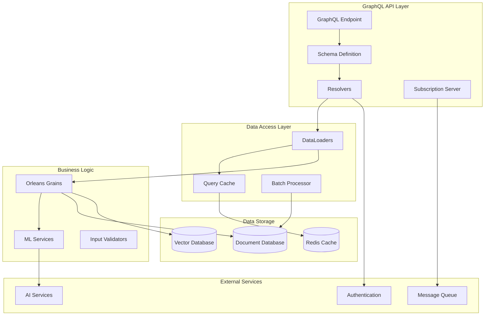

# Enterprise GraphQL API Architecture with HotChocolate

**Description**: Production-ready enterprise GraphQL patterns using HotChocolate for high-performance APIs with advanced security, query optimization, distributed caching, real-time processing, comprehensive monitoring, and enterprise-scale federation patterns.

**HotChocolate** is Microsoft's enterprise-grade GraphQL server for .NET providing type-safe schema development, advanced query optimization, enterprise security integration, distributed caching, comprehensive monitoring, and seamless integration with enterprise .NET ecosystems including Azure, Orleans, and ML.NET.

## Enterprise GraphQL Capabilities

### 🏗️ **Advanced Schema Architecture**

- **Federated Schema Design**: Enterprise-scale schema federation with gateway orchestration
- **Type-Safe Development**: Code-first and schema-first approaches with comprehensive validation
- **Schema Evolution**: Backward-compatible schema versioning with deprecation strategies
- **Domain-Driven Design**: Business domain-aligned schema organization with clear boundaries

### 🚀 **High-Performance Query Processing**

- **Intelligent Query Optimization**: Query complexity analysis, depth limiting, and automatic optimization
- **Advanced Pagination**: Cursor-based, relay-compliant pagination with performance monitoring
- **Distributed Caching**: Multi-layer caching strategies with Redis integration and cache invalidation
- **Query Batching**: DataLoader patterns with batch processing and N+1 query elimination

### 🔒 **Enterprise Security & Authorization**

- **Fine-Grained Authorization**: Field-level permissions with role-based and attribute-based access control
- **Enterprise Authentication**: Azure AD, OAuth 2.0, and JWT integration with token validation
- **Query Security**: Rate limiting, query whitelisting, and introspection control for production
- **Audit & Compliance**: Comprehensive query logging and security event monitoring

### 📊 **Production Monitoring & Analytics**

- **Query Performance Monitoring**: Real-time performance metrics with Application Insights integration
- **Usage Analytics**: Field usage analysis, query pattern tracking, and optimization recommendations  
- **Error Tracking**: Advanced error handling with structured logging and alerting
- **SLA Monitoring**: Response time tracking and availability monitoring with automated alerts

## Enterprise GraphQL Pattern Index

### 🏗️ **Schema Architecture & Design**

- [Schema Design](schema-design.md) - Enterprise schema patterns with federation and domain modeling
- [Query Patterns](query-patterns.md) - Advanced querying with performance optimization and security
- [Mutation Patterns](mutation-patterns.md) - Transaction-safe operations with comprehensive validation
- [Subscription Patterns](subscription-patterns.md) - Real-time processing with scalable WebSocket management

### 🚀 **Performance & Optimization**

- [Performance Optimization](performance-optimization.md) - Query optimization, caching, and monitoring strategies
- [DataLoader Patterns](dataloader-patterns.md) - Efficient batch processing with distributed caching
- [Database Integration](database-integration.md) - Advanced ORM integration with query optimization
- [Realtime Processing](realtime-processing.md) - High-throughput real-time processing with backpressure handling

### 🔒 **Security & Enterprise Integration**

- [Authorization](authorization.md) - Enterprise-grade security with fine-grained permissions
- [Error Handling](error-handling.md) - Production error management with monitoring integration
- [Orleans Integration](orleans-integration.md) - Distributed actor model integration with GraphQL federation
- [ML.NET Integration](mlnet-integration.md) - AI/ML service integration with real-time inference APIs

## Architecture Overview



## Document Schema Design

### Core Document Types

```csharp
namespace DocumentProcessor.GraphQL.Types;

using HotChocolate;
using HotChocolate.Types;
using HotChocolate.Types.Pagination;

[ObjectType]
public class Document
{
    [ID] public string Id { get; set; } = string.Empty;
    
    public string Title { get; set; } = string.Empty;
    
    public string Content { get; set; } = string.Empty;
    
    public DocumentMetadata Metadata { get; set; } = new();
    
    public ProcessingStatus Status { get; set; }
    
    public DateTime CreatedAt { get; set; }
    
    public DateTime UpdatedAt { get; set; }
    
    // Navigation properties with DataLoaders
    [UsePaging]
    public async Task<Connection<ProcessingResult>> GetProcessingResultsAsync(
        [Service] IProcessingResultsByDocumentDataLoader dataLoader,
        CancellationToken cancellationToken) =>
        await dataLoader.LoadAsync(Id, cancellationToken);
    
    public async Task<User> GetAuthorAsync(
        [Service] IUsersByIdDataLoader dataLoader,
        CancellationToken cancellationToken) =>
        await dataLoader.LoadAsync(Metadata.AuthorId, cancellationToken);
    
    public async Task<IEnumerable<DocumentTag>> GetTagsAsync(
        [Service] ITagsByDocumentDataLoader dataLoader,
        CancellationToken cancellationToken) =>
        await dataLoader.LoadAsync(Id, cancellationToken);
}

[ObjectType]
public class DocumentMetadata
{
    public string AuthorId { get; set; } = string.Empty;
    
    public string Source { get; set; } = string.Empty;
    
    public string ContentType { get; set; } = string.Empty;
    
    public long SizeBytes { get; set; }
    
    public string Language { get; set; } = string.Empty;
    
    public Dictionary<string, string> CustomProperties { get; set; } = new();
}

[ObjectType]
public class ProcessingResult
{
    [ID] public string Id { get; set; } = string.Empty;
    
    public string DocumentId { get; set; } = string.Empty;
    
    public ProcessingType Type { get; set; }
    
    public ProcessingStatus Status { get; set; }
    
    public DateTime StartedAt { get; set; }
    
    public DateTime? CompletedAt { get; set; }
    
    public TimeSpan? Duration => CompletedAt - StartedAt;
    
    // Polymorphic results based on processing type
    public IProcessingOutput? Output { get; set; }
    
    public string? ErrorMessage { get; set; }
    
    public float? Confidence { get; set; }
    
    public Dictionary<string, object> Metrics { get; set; } = new();
}

[UnionType]
public abstract class IProcessingOutput
{
    public abstract ProcessingType Type { get; }
}

[ObjectType]
public class ClassificationResult : IProcessingOutput
{
    public override ProcessingType Type => ProcessingType.Classification;
    
    public string PredictedCategory { get; set; } = string.Empty;
    
    public float Confidence { get; set; }
    
    public Dictionary<string, float> CategoryScores { get; set; } = new();
}

[ObjectType]
public class SentimentResult : IProcessingOutput
{
    public override ProcessingType Type => ProcessingType.Sentiment;
    
    public SentimentClass Sentiment { get; set; }
    
    public float Score { get; set; }
    
    public float Confidence { get; set; }
    
    public Dictionary<string, float> EmotionScores { get; set; } = new();
}

[ObjectType]
public class TopicResult : IProcessingOutput
{
    public override ProcessingType Type => ProcessingType.TopicModeling;
    
    public Dictionary<int, float> TopicDistribution { get; set; } = new();
    
    public int DominantTopic { get; set; }
    
    public float DominantTopicScore { get; set; }
    
    public List<TopicKeyword> Keywords { get; set; } = new();
}

[ObjectType]
public class SummarizationResult : IProcessingOutput
{
    public override ProcessingType Type => ProcessingType.Summarization;
    
    public Dictionary<string, string> Summaries { get; set; } = new();
    
    public int OriginalLength { get; set; }
    
    public Dictionary<string, int> SummaryLengths { get; set; } = new();
    
    public float CompressionRatio => SummaryLengths.Values.Sum() / (float)OriginalLength;
}

public enum ProcessingType
{
    Classification,
    Sentiment,
    TopicModeling,
    Summarization,
    EntityExtraction,
    KeywordExtraction
}

public enum ProcessingStatus
{
    Pending,
    InProgress,
    Completed,
    Failed,
    Cancelled
}

public enum SentimentClass
{
    VeryNegative,
    Negative,
    Neutral,
    Positive,
    VeryPositive
}

[ObjectType]
public class TopicKeyword
{
    public string Word { get; set; } = string.Empty;
    
    public float Weight { get; set; }
    
    public int Frequency { get; set; }
}
```

### Advanced Query Types

```csharp
namespace DocumentProcessor.GraphQL.Queries;

using HotChocolate;
using HotChocolate.Data;
using HotChocolate.Types;
using HotChocolate.Types.Pagination;

[QueryType]
public class DocumentQueries
{
    // Basic document retrieval
    public async Task<Document?> GetDocumentAsync(
        [ID] string id,
        [Service] IDocumentService documentService,
        CancellationToken cancellationToken) =>
        await documentService.GetByIdAsync(id, cancellationToken);

    // Advanced filtering and pagination
    [UsePaging(IncludeTotalCount = true)]
    [UseProjection]
    [UseFiltering]
    [UseSorting]
    public IQueryable<Document> GetDocuments([Service] IDocumentRepository repository) =>
        repository.GetQueryable();

    // Full-text search
    [UsePaging]
    public async Task<Connection<Document>> SearchDocumentsAsync(
        string searchTerm,
        SearchOptions? options,
        [Service] IDocumentSearchService searchService,
        CancellationToken cancellationToken)
    {
        options ??= new SearchOptions();
        
        var results = await searchService.SearchAsync(searchTerm, options, cancellationToken);
        
        return new Connection<Document>(
            results.Documents,
            info => new ConnectionPageInfo(
                hasNextPage: results.HasNextPage,
                hasPreviousPage: results.HasPreviousPage,
                startCursor: results.StartCursor,
                endCursor: results.EndCursor),
            totalCount: results.TotalCount);
    }

    // Semantic search using vector embeddings
    [UsePaging]
    public async Task<Connection<DocumentSimilarity>> FindSimilarDocumentsAsync(
        [ID] string documentId,
        float similarityThreshold = 0.7f,
        int maxResults = 50,
        [Service] IVectorSearchService vectorSearch,
        CancellationToken cancellationToken)
    {
        var results = await vectorSearch.FindSimilarAsync(
            documentId, similarityThreshold, maxResults, cancellationToken);
        
        return results.ToConnection();
    }

    // Aggregated statistics
    public async Task<DocumentStatistics> GetDocumentStatisticsAsync(
        DocumentStatisticsFilter? filter,
        [Service] IDocumentAnalyticsService analytics,
        CancellationToken cancellationToken)
    {
        filter ??= new DocumentStatisticsFilter();
        return await analytics.GetStatisticsAsync(filter, cancellationToken);
    }

    // Topic analysis across document collections
    public async Task<TopicAnalysis> AnalyzeTopicsAsync(
        TopicAnalysisInput input,
        [Service] ITopicAnalysisService topicService,
        CancellationToken cancellationToken) =>
        await topicService.AnalyzeAsync(input, cancellationToken);
}

[ObjectType]
public class DocumentSimilarity
{
    public Document Document { get; set; } = new();
    
    public float SimilarityScore { get; set; }
    
    public List<string> MatchingKeywords { get; set; } = new();
    
    public string SimilarityReason { get; set; } = string.Empty;
}

[ObjectType]
public class DocumentStatistics
{
    public int TotalDocuments { get; set; }
    
    public Dictionary<ProcessingStatus, int> StatusDistribution { get; set; } = new();
    
    public Dictionary<string, int> CategoryDistribution { get; set; } = new();
    
    public Dictionary<SentimentClass, int> SentimentDistribution { get; set; } = new();
    
    public TimeSpan AverageProcessingTime { get; set; }
    
    public DateTime LastUpdated { get; set; }
}

[InputType]
public class DocumentStatisticsFilter
{
    public DateTime? FromDate { get; set; }
    
    public DateTime? ToDate { get; set; }
    
    public List<string>? Categories { get; set; }
    
    public List<ProcessingStatus>? Statuses { get; set; }
    
    public string? AuthorId { get; set; }
}

[ObjectType]
public class TopicAnalysis
{
    public Dictionary<int, TopicInfo> Topics { get; set; } = new();
    
    public List<DocumentTopicAssignment> DocumentAssignments { get; set; } = new();
    
    public double OverallCoherence { get; set; }
    
    public int TotalDocuments { get; set; }
    
    public DateTime AnalyzedAt { get; set; }
}

[ObjectType]
public class TopicInfo
{
    public int Id { get; set; }
    
    public string Label { get; set; } = string.Empty;
    
    public List<TopicKeyword> Keywords { get; set; } = new();
    
    public double Coherence { get; set; }
    
    public int DocumentCount { get; set; }
}
```

### Mutation Operations

```csharp
namespace DocumentProcessor.GraphQL.Mutations;

using HotChocolate;
using HotChocolate.Authorization;
using HotChocolate.Types;

[MutationType]
public class DocumentMutations
{
    // Document creation
    [Authorize(Policy = "CanCreateDocuments")]
    public async Task<DocumentPayload> CreateDocumentAsync(
        CreateDocumentInput input,
        [Service] IDocumentService documentService,
        [Service] IClusterClient orleans,
        CancellationToken cancellationToken)
    {
        try
        {
            // Create document
            var document = await documentService.CreateAsync(input, cancellationToken);
            
            // Trigger processing
            var documentGrain = orleans.GetGrain<IDocumentProcessorGrain>(document.Id);
            _ = Task.Run(async () => 
            {
                await documentGrain.ProcessDocumentAsync(new DocumentProcessingRequest(
                    document.Id,
                    document.Content,
                    input.Metadata?.ToDictionary() ?? new(),
                    input.ProcessingOptions ?? new()));
            }, cancellationToken);
            
            return new DocumentPayload(document);
        }
        catch (Exception ex)
        {
            return new DocumentPayload(new UserError(ex.Message));
        }
    }

    // Batch document processing
    [Authorize(Policy = "CanProcessDocuments")]
    public async Task<BatchProcessingPayload> ProcessDocumentBatchAsync(
        ProcessDocumentBatchInput input,
        [Service] IClusterClient orleans,
        CancellationToken cancellationToken)
    {
        try
        {
            var coordinatorGrain = orleans.GetGrain<IMLCoordinatorGrain>(0);
            var result = await coordinatorGrain.ProcessDocumentBatchAsync(input.DocumentIds);
            
            return new BatchProcessingPayload(result);
        }
        catch (Exception ex)
        {
            return new BatchProcessingPayload(new UserError(ex.Message));
        }
    }

    // Document update
    [Authorize(Policy = "CanEditDocuments")]
    public async Task<DocumentPayload> UpdateDocumentAsync(
        UpdateDocumentInput input,
        [Service] IDocumentService documentService,
        CancellationToken cancellationToken)
    {
        try
        {
            var document = await documentService.UpdateAsync(input, cancellationToken);
            return new DocumentPayload(document);
        }
        catch (Exception ex)
        {
            return new DocumentPayload(new UserError(ex.Message));
        }
    }

    // Reprocess with new options
    [Authorize(Policy = "CanProcessDocuments")]
    public async Task<ProcessingResultPayload> ReprocessDocumentAsync(
        ReprocessDocumentInput input,
        [Service] IClusterClient orleans,
        CancellationToken cancellationToken)
    {
        try
        {
            var documentGrain = orleans.GetGrain<IDocumentProcessorGrain>(input.DocumentId);
            await documentGrain.ReprocessWithOptionsAsync(input.ProcessingOptions);
            
            var result = await documentGrain.GetProcessingResultAsync();
            return new ProcessingResultPayload(result);
        }
        catch (Exception ex)
        {
            return new ProcessingResultPayload(new UserError(ex.Message));
        }
    }
}

// Input types
[InputType]
public class CreateDocumentInput
{
    public string Title { get; set; } = string.Empty;
    
    public string Content { get; set; } = string.Empty;
    
    public DocumentMetadataInput? Metadata { get; set; }
    
    public ProcessingOptionsInput? ProcessingOptions { get; set; }
}

[InputType]
public class DocumentMetadataInput
{
    public string? AuthorId { get; set; }
    
    public string? Source { get; set; }
    
    public string? ContentType { get; set; }
    
    public string? Language { get; set; }
    
    public Dictionary<string, string>? CustomProperties { get; set; }
    
    public Dictionary<string, string> ToDictionary()
    {
        var result = new Dictionary<string, string>();
        
        if (AuthorId != null) result["AuthorId"] = AuthorId;
        if (Source != null) result["Source"] = Source;
        if (ContentType != null) result["ContentType"] = ContentType;
        if (Language != null) result["Language"] = Language;
        
        if (CustomProperties != null)
        {
            foreach (var kvp in CustomProperties)
            {
                result[kvp.Key] = kvp.Value;
            }
        }
        
        return result;
    }
}

[InputType]
public class ProcessingOptionsInput
{
    public List<string>? SummaryTypes { get; set; }
    
    public List<string>? Categories { get; set; }
    
    public int? TopicCount { get; set; }
    
    public bool? IncludeSentiment { get; set; } = true;
    
    public bool? IncludeEntities { get; set; } = true;
    
    public bool? IncludeKeywords { get; set; } = true;
}

// Payload types
[ObjectType]
public class DocumentPayload : Payload
{
    public Document? Document { get; }
    
    public DocumentPayload(Document document)
    {
        Document = document;
    }
    
    public DocumentPayload(UserError error) : base(error) { }
}

[ObjectType]
public class BatchProcessingPayload : Payload
{
    public BatchProcessingResult? Result { get; }
    
    public BatchProcessingPayload(BatchProcessingResult result)
    {
        Result = result;
    }
    
    public BatchProcessingPayload(UserError error) : base(error) { }
}

[ObjectType]
public class ProcessingResultPayload : Payload
{
    public ProcessingResult? Result { get; }
    
    public ProcessingResultPayload(ProcessingResult? result)
    {
        Result = result;
    }
    
    public ProcessingResultPayload(UserError error) : base(error) { }
}

// Base payload class
[ObjectType]
public abstract class Payload
{
    public List<UserError> Errors { get; } = new();
    
    protected Payload() { }
    
    protected Payload(UserError error)
    {
        Errors.Add(error);
    }
}

[ObjectType]
public class UserError
{
    public string Message { get; }
    
    public string Code { get; }
    
    public UserError(string message, string code = "UNKNOWN_ERROR")
    {
        Message = message;
        Code = code;
    }
}
```

### Real-time Subscriptions

```csharp
namespace DocumentProcessor.GraphQL.Subscriptions;

using HotChocolate;
using HotChocolate.Authorization;
using HotChocolate.Subscriptions;
using HotChocolate.Types;

[SubscriptionType]
public class DocumentSubscriptions
{
    // Document processing status updates
    [Authorize]
    [Subscribe]
    public async IAsyncEnumerable<ProcessingStatusUpdate> OnProcessingStatusChanged(
        [ID] string documentId,
        [Service] ITopicEventReceiver receiver,
        CancellationToken cancellationToken)
    {
        await foreach (var update in receiver.SubscribeAsync<ProcessingStatusUpdate>(
            $"processing-status:{documentId}", cancellationToken))
        {
            yield return update;
        }
    }

    // Real-time processing results
    [Authorize]
    [Subscribe]
    public async IAsyncEnumerable<ProcessingResult> OnProcessingCompleted(
        [ID] string documentId,
        [Service] ITopicEventReceiver receiver,
        CancellationToken cancellationToken)
    {
        await foreach (var result in receiver.SubscribeAsync<ProcessingResult>(
            $"processing-completed:{documentId}", cancellationToken))
        {
            yield return result;
        }
    }

    // Batch processing progress
    [Authorize(Policy = "CanProcessDocuments")]
    [Subscribe]
    public async IAsyncEnumerable<BatchProgressUpdate> OnBatchProgress(
        [ID] string batchId,
        [Service] ITopicEventReceiver receiver,
        CancellationToken cancellationToken)
    {
        await foreach (var progress in receiver.SubscribeAsync<BatchProgressUpdate>(
            $"batch-progress:{batchId}", cancellationToken))
        {
            yield return progress;
        }
    }

    // System-wide processing statistics
    [Authorize(Policy = "CanViewStatistics")]
    [Subscribe]
    public async IAsyncEnumerable<SystemStatistics> OnSystemStatisticsChanged(
        [Service] ITopicEventReceiver receiver,
        CancellationToken cancellationToken)
    {
        await foreach (var stats in receiver.SubscribeAsync<SystemStatistics>(
            "system-statistics", cancellationToken))
        {
            yield return stats;
        }
    }

    // Topic model updates
    [Authorize]
    [Subscribe]
    public async IAsyncEnumerable<TopicModelUpdate> OnTopicModelUpdated(
        [Service] ITopicEventReceiver receiver,
        CancellationToken cancellationToken)
    {
        await foreach (var update in receiver.SubscribeAsync<TopicModelUpdate>(
            "topic-model-updated", cancellationToken))
        {
            yield return update;
        }
    }
}

[ObjectType]
public class ProcessingStatusUpdate
{
    public string DocumentId { get; set; } = string.Empty;
    
    public ProcessingStatus OldStatus { get; set; }
    
    public ProcessingStatus NewStatus { get; set; }
    
    public ProcessingType ProcessingType { get; set; }
    
    public float? Progress { get; set; }
    
    public DateTime Timestamp { get; set; }
    
    public string? Message { get; set; }
}

[ObjectType]
public class BatchProgressUpdate
{
    public string BatchId { get; set; } = string.Empty;
    
    public int TotalItems { get; set; }
    
    public int CompletedItems { get; set; }
    
    public int FailedItems { get; set; }
    
    public float ProgressPercentage => TotalItems > 0 ? (float)CompletedItems / TotalItems * 100 : 0;
    
    public TimeSpan EstimatedTimeRemaining { get; set; }
    
    public DateTime Timestamp { get; set; }
}

[ObjectType]
public class SystemStatistics
{
    public int ActiveProcessingJobs { get; set; }
    
    public int QueuedDocuments { get; set; }
    
    public int CompletedToday { get; set; }
    
    public TimeSpan AverageProcessingTime { get; set; }
    
    public Dictionary<ProcessingType, int> ProcessingTypeDistribution { get; set; } = new();
    
    public float SystemLoad { get; set; }
    
    public DateTime Timestamp { get; set; }
}

[ObjectType]
public class TopicModelUpdate
{
    public string ModelId { get; set; } = string.Empty;
    
    public int TopicCount { get; set; }
    
    public double Coherence { get; set; }
    
    public List<TopicInfo> UpdatedTopics { get; set; } = new();
    
    public DateTime UpdatedAt { get; set; }
}
```

## Service Configuration

### HotChocolate Setup with Orleans Integration

```csharp
namespace DocumentProcessor.GraphQL;

using HotChocolate;
using HotChocolate.Data;
using HotChocolate.AspNetCore;
using HotChocolate.Subscriptions;

public static class ServiceCollectionExtensions
{
    public static IServiceCollection AddGraphQLServices(
        this IServiceCollection services, 
        IConfiguration configuration)
    {
        services
            .AddGraphQLServer()
            .AddQueryType<DocumentQueries>()
            .AddMutationType<DocumentMutations>()
            .AddSubscriptionType<DocumentSubscriptions>()
            .AddType<Document>()
            .AddType<ProcessingResult>()
            .AddUnionType<IProcessingOutput>()
            .AddProjections()
            .AddFiltering()
            .AddSorting()
            .AddInMemorySubscriptions()
            .AddDataLoader<IDocumentsByIdDataLoader, DocumentsByIdDataLoader>()
            .AddDataLoader<IProcessingResultsByDocumentDataLoader, ProcessingResultsByDocumentDataLoader>()
            .AddDataLoader<IUsersByIdDataLoader, UsersByIdDataLoader>()
            .AddAuthorization()
            .AddApolloTracing()
            .AddQueryCachingPolicy()
            .ModifyRequestOptions(opt => opt.IncludeExceptionDetails = 
                configuration.GetValue<bool>("GraphQL:IncludeExceptionDetails"));

        // Add DataLoader services
        services.AddScoped<IDocumentsByIdDataLoader, DocumentsByIdDataLoader>();
        services.AddScoped<IProcessingResultsByDocumentDataLoader, ProcessingResultsByDocumentDataLoader>();
        services.AddScoped<IUsersByIdDataLoader, UsersByIdDataLoader>();

        return services;
    }
}
```

## Best Practices

### Schema Design

- **Type Safety** - Use strongly-typed C# classes for all GraphQL types
- **Nullable Handling** - Properly model optional vs required fields
- **Union Types** - Use unions for polymorphic result types
- **Input Validation** - Validate all inputs at the GraphQL layer

### Performance Optimization

- **DataLoaders** - Use DataLoaders to solve N+1 query problems
- **Query Complexity** - Implement query depth and complexity analysis
- **Caching** - Cache expensive operations and query results
- **Pagination** - Always use pagination for large result sets

### Security

- **Authorization** - Implement field-level authorization where needed
- **Input Sanitization** - Sanitize all user inputs
- **Rate Limiting** - Protect against query bombing attacks
- **Query Whitelisting** - Use persisted queries in production

## Related Patterns

- [Orleans Integration](orleans-integration.md) - GraphQL with Orleans grains
- [ML.NET Integration](mlnet-integration.md) - Exposing ML results through GraphQL
- [Real-time Processing](realtime-processing.md) - Live updates and subscriptions
- [Database Integration](database-integration.md) - Efficient data access patterns

---

**Key Benefits**: Type-safe APIs, advanced querying capabilities, real-time subscriptions, efficient data loading, comprehensive filtering

**When to Use**: Building document processing APIs, exposing ML results, creating interactive dashboards, real-time data applications

**Performance**: DataLoader optimization, query caching, efficient pagination, subscription management