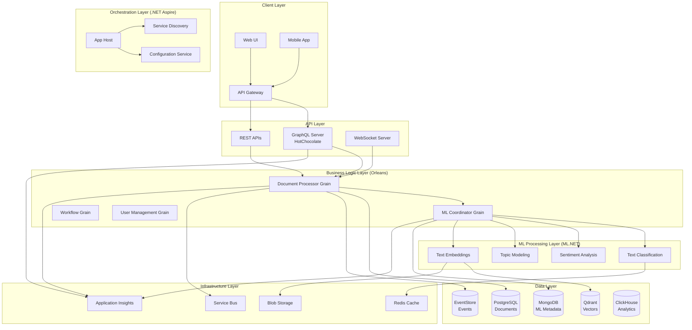

# Integration Architecture Guide

**Description**: Comprehensive integration architecture patterns connecting .NET Aspire, Orleans, ML.NET, GraphQL, and databases for complete document processing pipeline architecture. This guide provides end-to-end workflow patterns, deployment strategies, and best practices for building scalable document processing systems.

**Integration architecture** forms the backbone of modern document processing systems, orchestrating multiple services, databases, and ML pipelines into cohesive, scalable solutions. This guide demonstrates how Microsoft technologies work together to create robust, production-ready systems.

## Architecture Principles

- **Service Orchestration** - Coordinate distributed services with .NET Aspire
- **Event-Driven Design** - Use Orleans actors and message patterns for loose coupling
- **Polyglot Persistence** - Leverage multiple databases for optimal data storage
- **ML Pipeline Integration** - Seamlessly integrate ML.NET with business workflows
- **API-First Design** - Expose functionality through well-designed GraphQL APIs
- **Observability** - Comprehensive monitoring and tracing across all components

## Index

### Core Integration Patterns

- [End-to-End Workflow](end-to-end-workflow.md) - Complete document processing pipeline
- [Service Communication](service-communication.md) - Inter-service messaging and RPC patterns
- [Data Flow Architecture](data-flow.md) - Data movement and transformation patterns
- [Error Handling & Resilience](error-handling.md) - Fault tolerance and recovery strategies

### Deployment Patterns

- [Container Orchestration](container-orchestration.md) - Docker and Kubernetes deployment
- [Scaling Strategies](scaling-strategies.md) - Horizontal and vertical scaling patterns
- [Environment Management](environment-management.md) - Dev, staging, and production configurations
- [CI/CD Pipelines](cicd-pipelines.md) - Automated build and deployment

### Observability Patterns

- [Distributed Tracing](distributed-tracing.md) - End-to-end request tracking
- [Metrics Collection](metrics-collection.md) - Performance and business metrics
- [Logging Strategy](logging-strategy.md) - Structured logging and correlation
- [Health Monitoring](health-monitoring.md) - Service health and alerting

### Security & Governance

- [Authentication Flow](authentication-flow.md) - User and service authentication
- [Authorization Patterns](authorization-patterns.md) - Role-based access control
- [Data Governance](data-governance.md) - Data quality and compliance
- [Audit & Compliance](audit-compliance.md) - Regulatory compliance patterns

## System Architecture Overview



## End-to-End Document Processing Workflow

### Document Ingestion Pipeline

```csharp
namespace DocumentProcessor.Workflows;

using Microsoft.Orleans;
using DocumentProcessor.Contracts;
using DocumentProcessor.Events;

public interface IDocumentIngestionWorkflow : IGrainWithStringKey
{
    Task<DocumentProcessingResult> ProcessDocumentAsync(DocumentIngestionRequest request);
    Task<BatchProcessingResult> ProcessDocumentBatchAsync(BatchIngestionRequest request);
    Task<WorkflowStatus> GetWorkflowStatusAsync();
    Task CancelWorkflowAsync();
}

[StatePersistence(StatePersistence.Persisted)]
public class DocumentIngestionWorkflow : Grain<DocumentWorkflowState>, IDocumentIngestionWorkflow
{
    private readonly IDocumentService _documentService;
    private readonly IMLCoordinatorGrain _mlCoordinator;
    private readonly IEventRepository _eventRepository;
    private readonly ILogger<DocumentIngestionWorkflow> _logger;

    public DocumentIngestionWorkflow(
        IDocumentService documentService,
        ILogger<DocumentIngestionWorkflow> logger)
    {
        _documentService = documentService;
        _logger = logger;
    }

    public override async Task OnActivateAsync(CancellationToken cancellationToken)
    {
        // Initialize ML coordinator grain
        _mlCoordinator = GrainFactory.GetGrain<IMLCoordinatorGrain>(0);
        
        // Set up periodic health checks
        RegisterTimer(CheckWorkflowHealth, null, TimeSpan.FromMinutes(1), TimeSpan.FromMinutes(5));
        
        await base.OnActivateAsync(cancellationToken);
    }

    public async Task<DocumentProcessingResult> ProcessDocumentAsync(DocumentIngestionRequest request)
    {
        var workflowId = Guid.NewGuid().ToString();
        State.CurrentWorkflow = new WorkflowExecution(workflowId, DateTime.UtcNow);
        
        try
        {
            _logger.LogInformation("Starting document processing workflow {WorkflowId} for document {DocumentId}", 
                workflowId, request.DocumentId);

            // Step 1: Validate and store document
            var document = await ValidateAndStoreDocumentAsync(request);
            await PublishEventAsync(new DocumentCreated(
                this.GetPrimaryKeyString(),
                DateTime.UtcNow,
                request.UserId,
                new Dictionary<string, object>(),
                document.Id,
                document.Title,
                document.ContentHash,
                document.Metadata));

            // Step 2: Generate content embeddings
            var embeddings = await GenerateEmbeddingsAsync(document);
            await PublishEventAsync(new EmbeddingsGenerated(
                this.GetPrimaryKeyString(),
                DateTime.UtcNow,
                request.UserId,
                new Dictionary<string, object>(),
                document.Id,
                embeddings));

            // Step 3: Coordinate ML processing
            var mlResults = await _mlCoordinator.ProcessDocumentAsync(new MLProcessingRequest(
                document.Id,
                document.Content,
                request.ProcessingOptions));

            // Step 4: Update search indices
            await UpdateSearchIndicesAsync(document, embeddings, mlResults);

            // Step 5: Trigger post-processing workflows
            await TriggerPostProcessingAsync(document, mlResults);

            State.CurrentWorkflow.Status = WorkflowStatus.Completed;
            State.CurrentWorkflow.CompletedAt = DateTime.UtcNow;
            await WriteStateAsync();

            return new DocumentProcessingResult(
                document.Id,
                WorkflowStatus.Completed,
                mlResults,
                State.CurrentWorkflow.Duration);
        }
        catch (Exception ex)
        {
            _logger.LogError(ex, "Document processing workflow {WorkflowId} failed", workflowId);
            
            State.CurrentWorkflow.Status = WorkflowStatus.Failed;
            State.CurrentWorkflow.ErrorMessage = ex.Message;
            await WriteStateAsync();

            await PublishEventAsync(new WorkflowFailed(
                this.GetPrimaryKeyString(),
                DateTime.UtcNow,
                request.UserId,
                new Dictionary<string, object>(),
                workflowId,
                ex.Message));

            throw;
        }
    }

    public async Task<BatchProcessingResult> ProcessDocumentBatchAsync(BatchIngestionRequest request)
    {
        var batchId = Guid.NewGuid().ToString();
        var batchState = new BatchProcessingState(batchId, request.DocumentIds.Count);
        State.BatchProcessing = batchState;

        _logger.LogInformation("Starting batch processing {BatchId} for {DocumentCount} documents", 
            batchId, request.DocumentIds.Count);

        var tasks = request.DocumentIds.Select(async documentId =>
        {
            try
            {
                var individualRequest = new DocumentIngestionRequest(
                    documentId,
                    request.UserId,
                    request.ProcessingOptions);

                var result = await ProcessDocumentAsync(individualRequest);
                
                Interlocked.Increment(ref batchState.CompletedCount);
                await UpdateBatchProgressAsync(batchState);
                
                return result;
            }
            catch (Exception ex)
            {
                _logger.LogError(ex, "Failed to process document {DocumentId} in batch {BatchId}", 
                    documentId, batchId);
                
                Interlocked.Increment(ref batchState.FailedCount);
                await UpdateBatchProgressAsync(batchState);
                
                return new DocumentProcessingResult(documentId, WorkflowStatus.Failed, null, TimeSpan.Zero);
            }
        });

        var results = await Task.WhenAll(tasks);
        
        batchState.Status = WorkflowStatus.Completed;
        batchState.CompletedAt = DateTime.UtcNow;
        await WriteStateAsync();

        return new BatchProcessingResult(
            batchId,
            results.ToList(),
            batchState.CompletedCount,
            batchState.FailedCount,
            batchState.Duration);
    }

    private async Task<Document> ValidateAndStoreDocumentAsync(DocumentIngestionRequest request)
    {
        // Content validation
        if (string.IsNullOrWhiteSpace(request.Content))
        {
            throw new ArgumentException("Document content cannot be empty");
        }

        if (request.Content.Length > 10_000_000) // 10MB limit
        {
            throw new ArgumentException("Document content exceeds maximum size limit");
        }

        // Duplicate detection
        var contentHash = ComputeContentHash(request.Content);
        var existingDocument = await _documentService.FindByContentHashAsync(contentHash);
        if (existingDocument != null)
        {
            _logger.LogInformation("Found duplicate document {ExistingId} for content hash {Hash}", 
                existingDocument.Id, contentHash);
            return existingDocument;
        }

        // Store new document
        var document = new Document
        {
            Id = request.DocumentId ?? Guid.NewGuid().ToString(),
            Title = ExtractTitle(request.Content),
            Content = request.Content,
            ContentHash = contentHash,
            Metadata = request.Metadata ?? new DocumentMetadata(),
            ProcessingStatus = ProcessingStatus.InProgress,
            CreatedAt = DateTime.UtcNow
        };

        return await _documentService.CreateAsync(document);
    }

    private async Task<TextEmbedding> GenerateEmbeddingsAsync(Document document)
    {
        var embeddingService = GrainFactory.GetGrain<ITextEmbeddingGrain>(0);
        return await embeddingService.GenerateEmbeddingAsync(document.Content);
    }

    private async Task UpdateSearchIndicesAsync(
        Document document, 
        TextEmbedding embeddings, 
        MLProcessingResults mlResults)
    {
        // Update vector database
        var vectorService = GrainFactory.GetGrain<IVectorStorageGrain>(0);
        await vectorService.StoreDocumentEmbeddingAsync(document.Id, embeddings.Vector, 
            new VectorMetadata(document));

        // Update full-text search
        var searchService = GrainFactory.GetGrain<ISearchIndexGrain>(0);
        await searchService.IndexDocumentAsync(document, mlResults);
    }

    private async Task TriggerPostProcessingAsync(Document document, MLProcessingResults mlResults)
    {
        // Trigger similarity analysis
        var similarityGrain = GrainFactory.GetGrain<ISimilarityAnalysisGrain>(document.Id);
        _ = Task.Run(async () => await similarityGrain.AnalyzeSimilarityAsync(document));

        // Update topic models if needed
        if (mlResults.TopicResults != null)
        {
            var topicModelGrain = GrainFactory.GetGrain<ITopicModelGrain>(0);
            _ = Task.Run(async () => await topicModelGrain.UpdateWithNewDocumentAsync(document.Id, mlResults.TopicResults));
        }

        // Trigger recommendation updates
        var recommendationGrain = GrainFactory.GetGrain<IRecommendationGrain>(0);
        _ = Task.Run(async () => await recommendationGrain.UpdateRecommendationsAsync(document));
    }

    private string ComputeContentHash(string content)
    {
        using var sha256 = System.Security.Cryptography.SHA256.Create();
        var hashBytes = sha256.ComputeHash(System.Text.Encoding.UTF8.GetBytes(content));
        return Convert.ToHexString(hashBytes);
    }

    private string ExtractTitle(string content)
    {
        // Simple title extraction - first line or first 100 characters
        var lines = content.Split('\n', StringSplitOptions.RemoveEmptyEntries);
        if (lines.Length > 0 && lines[0].Length <= 200)
        {
            return lines[0].Trim();
        }
        
        return content.Length <= 100 ? content : content[..97] + "...";
    }

    private async Task PublishEventAsync<T>(T domainEvent) where T : DomainEvent
    {
        await _eventRepository.AppendEventAsync(domainEvent);
        
        // Publish to message bus for real-time updates
        var messageBus = GrainFactory.GetGrain<IMessageBusGrain>(0);
        await messageBus.PublishAsync(typeof(T).Name, domainEvent);
    }

    private async Task UpdateBatchProgressAsync(BatchProcessingState batchState)
    {
        var progress = new BatchProgressUpdate(
            batchState.BatchId,
            batchState.TotalCount,
            batchState.CompletedCount,
            batchState.FailedCount,
            DateTime.UtcNow);

        var messageBus = GrainFactory.GetGrain<IMessageBusGrain>(0);
        await messageBus.PublishAsync("BatchProgress", progress);
    }

    private async Task CheckWorkflowHealth(object _)
    {
        if (State.CurrentWorkflow != null && 
            State.CurrentWorkflow.Status == WorkflowStatus.InProgress &&
            DateTime.UtcNow - State.CurrentWorkflow.StartedAt > TimeSpan.FromMinutes(30))
        {
            _logger.LogWarning("Workflow {WorkflowId} has been running for over 30 minutes", 
                State.CurrentWorkflow.WorkflowId);
                
            // Consider workflow timeout logic here
        }
    }
}

// Supporting types
public class DocumentWorkflowState
{
    public WorkflowExecution? CurrentWorkflow { get; set; }
    public BatchProcessingState? BatchProcessing { get; set; }
    public List<string> ProcessingHistory { get; set; } = new();
}

public class WorkflowExecution
{
    public string WorkflowId { get; }
    public DateTime StartedAt { get; }
    public DateTime? CompletedAt { get; set; }
    public WorkflowStatus Status { get; set; } = WorkflowStatus.InProgress;
    public string? ErrorMessage { get; set; }
    
    public TimeSpan Duration => (CompletedAt ?? DateTime.UtcNow) - StartedAt;

    public WorkflowExecution(string workflowId, DateTime startedAt)
    {
        WorkflowId = workflowId;
        StartedAt = startedAt;
    }
}

public class BatchProcessingState
{
    public string BatchId { get; }
    public int TotalCount { get; }
    public int CompletedCount { get; set; }
    public int FailedCount { get; set; }
    public DateTime StartedAt { get; }
    public DateTime? CompletedAt { get; set; }
    public WorkflowStatus Status { get; set; } = WorkflowStatus.InProgress;
    
    public TimeSpan Duration => (CompletedAt ?? DateTime.UtcNow) - StartedAt;

    public BatchProcessingState(string batchId, int totalCount)
    {
        BatchId = batchId;
        TotalCount = totalCount;
        StartedAt = DateTime.UtcNow;
    }
}

public enum WorkflowStatus
{
    Pending,
    InProgress,
    Completed,
    Failed,
    Cancelled
}
```

## Service Communication Patterns

### Inter-Service Messaging with Service Bus

```csharp
namespace DocumentProcessor.Infrastructure.Messaging;

using Azure.Messaging.ServiceBus;
using System.Text.Json;

public interface IMessageBusService
{
    Task PublishAsync<T>(string topic, T message, CancellationToken cancellationToken = default);
    Task SubscribeAsync<T>(string topic, Func<T, Task> handler, CancellationToken cancellationToken = default);
    Task PublishBatchAsync<T>(string topic, IEnumerable<T> messages, CancellationToken cancellationToken = default);
}

public class ServiceBusMessageService : IMessageBusService, IAsyncDisposable
{
    private readonly ServiceBusClient _client;
    private readonly Dictionary<string, ServiceBusSender> _senders;
    private readonly Dictionary<string, ServiceBusProcessor> _processors;
    private readonly ILogger<ServiceBusMessageService> _logger;
    private readonly JsonSerializerOptions _jsonOptions;

    public ServiceBusMessageService(
        ServiceBusClient client,
        ILogger<ServiceBusMessageService> logger)
    {
        _client = client;
        _logger = logger;
        _senders = new Dictionary<string, ServiceBusSender>();
        _processors = new Dictionary<string, ServiceBusProcessor>();
        _jsonOptions = new JsonSerializerOptions
        {
            PropertyNamingPolicy = JsonNamingPolicy.CamelCase
        };
    }

    public async Task PublishAsync<T>(string topic, T message, CancellationToken cancellationToken = default)
    {
        try
        {
            var sender = GetOrCreateSender(topic);
            var messageBody = JsonSerializer.Serialize(message, _jsonOptions);
            
            var serviceBusMessage = new ServiceBusMessage(messageBody)
            {
                Subject = typeof(T).Name,
                ContentType = "application/json",
                MessageId = Guid.NewGuid().ToString(),
                TimeToLive = TimeSpan.FromHours(24)
            };

            // Add correlation properties
            serviceBusMessage.ApplicationProperties["MessageType"] = typeof(T).AssemblyQualifiedName;
            serviceBusMessage.ApplicationProperties["Timestamp"] = DateTimeOffset.UtcNow;
            serviceBusMessage.ApplicationProperties["Source"] = Environment.MachineName;

            await sender.SendMessageAsync(serviceBusMessage, cancellationToken);
            
            _logger.LogDebug("Published message {MessageType} to topic {Topic}", 
                typeof(T).Name, topic);
        }
        catch (Exception ex)
        {
            _logger.LogError(ex, "Failed to publish message {MessageType} to topic {Topic}", 
                typeof(T).Name, topic);
            throw;
        }
    }

    public async Task PublishBatchAsync<T>(string topic, IEnumerable<T> messages, CancellationToken cancellationToken = default)
    {
        try
        {
            var sender = GetOrCreateSender(topic);
            var messageBatch = await sender.CreateMessageBatchAsync(cancellationToken);

            foreach (var message in messages)
            {
                var messageBody = JsonSerializer.Serialize(message, _jsonOptions);
                var serviceBusMessage = new ServiceBusMessage(messageBody)
                {
                    Subject = typeof(T).Name,
                    ContentType = "application/json",
                    MessageId = Guid.NewGuid().ToString()
                };

                if (!messageBatch.TryAddMessage(serviceBusMessage))
                {
                    // Send current batch and create new one
                    await sender.SendMessagesAsync(messageBatch, cancellationToken);
                    messageBatch = await sender.CreateMessageBatchAsync(cancellationToken);
                    
                    if (!messageBatch.TryAddMessage(serviceBusMessage))
                    {
                        throw new InvalidOperationException("Message too large for batch");
                    }
                }
            }

            if (messageBatch.Count > 0)
            {
                await sender.SendMessagesAsync(messageBatch, cancellationToken);
            }

            _logger.LogDebug("Published batch of {Count} messages to topic {Topic}", 
                messageBatch.Count, topic);
        }
        catch (Exception ex)
        {
            _logger.LogError(ex, "Failed to publish message batch to topic {Topic}", topic);
            throw;
        }
    }

    public async Task SubscribeAsync<T>(string topic, Func<T, Task> handler, CancellationToken cancellationToken = default)
    {
        try
        {
            var processor = GetOrCreateProcessor(topic);
            
            processor.ProcessMessageAsync += async args =>
            {
                try
                {
                    var messageType = args.Message.ApplicationProperties["MessageType"]?.ToString();
                    if (messageType == typeof(T).AssemblyQualifiedName)
                    {
                        var messageBody = args.Message.Body.ToString();
                        var message = JsonSerializer.Deserialize<T>(messageBody, _jsonOptions);
                        
                        if (message != null)
                        {
                            await handler(message);
                        }
                    }

                    await args.CompleteMessageAsync(args.Message, cancellationToken);
                    
                    _logger.LogDebug("Processed message {MessageId} from topic {Topic}", 
                        args.Message.MessageId, topic);
                }
                catch (Exception ex)
                {
                    _logger.LogError(ex, "Failed to process message {MessageId} from topic {Topic}", 
                        args.Message.MessageId, topic);
                    
                    // Dead letter the message after max retry attempts
                    await args.DeadLetterMessageAsync(args.Message, 
                        "ProcessingFailed", ex.Message, cancellationToken);
                }
            };

            processor.ProcessErrorAsync += args =>
            {
                _logger.LogError(args.Exception, "Error processing message from topic {Topic}: {ErrorSource}", 
                    topic, args.ErrorSource);
                return Task.CompletedTask;
            };

            await processor.StartProcessingAsync(cancellationToken);
            
            _logger.LogInformation("Started processing messages from topic {Topic}", topic);
        }
        catch (Exception ex)
        {
            _logger.LogError(ex, "Failed to start message processing for topic {Topic}", topic);
            throw;
        }
    }

    private ServiceBusSender GetOrCreateSender(string topic)
    {
        if (!_senders.TryGetValue(topic, out var sender))
        {
            sender = _client.CreateSender(topic);
            _senders[topic] = sender;
        }
        return sender;
    }

    private ServiceBusProcessor GetOrCreateProcessor(string topic)
    {
        if (!_processors.TryGetValue(topic, out var processor))
        {
            var options = new ServiceBusProcessorOptions
            {
                MaxConcurrentCalls = 10,
                AutoCompleteMessages = false,
                MaxAutoLockRenewalDuration = TimeSpan.FromMinutes(5)
            };
            
            processor = _client.CreateProcessor(topic, options);
            _processors[topic] = processor;
        }
        return processor;
    }

    public async ValueTask DisposeAsync()
    {
        foreach (var processor in _processors.Values)
        {
            await processor.StopProcessingAsync();
            await processor.DisposeAsync();
        }

        foreach (var sender in _senders.Values)
        {
            await sender.DisposeAsync();
        }

        await _client.DisposeAsync();
        
        _processors.Clear();
        _senders.Clear();
    }
}
```

## .NET Aspire App Host Configuration

### Complete Application Host Setup

```csharp
namespace DocumentProcessor.AppHost;

using Aspire.Hosting;
using Microsoft.Extensions.Configuration;
using Microsoft.Extensions.DependencyInjection;
using Microsoft.Extensions.Hosting;

public class Program
{
    public static void Main(string[] args)
    {
        var builder = DistributedApplication.CreateBuilder(args);

        // Add configuration sources
        builder.Configuration.AddJsonFile("appsettings.json", optional: false);
        builder.Configuration.AddJsonFile($"appsettings.{builder.Environment.EnvironmentName}.json", optional: true);
        builder.Configuration.AddEnvironmentVariables();

        // Infrastructure Services
        var redis = builder.AddRedis("cache")
            .WithRedisCommander();

        var serviceBus = builder.AddAzureServiceBus("messaging")
            .ConfigureInfrastructure(infrastructure =>
            {
                infrastructure.AddTopic("document-events");
                infrastructure.AddTopic("ml-results");
                infrastructure.AddTopic("workflow-status");
                infrastructure.AddSubscription("document-events", "processing-handler");
            });

        // Databases
        var postgres = builder.AddPostgres("postgres")
            .WithPgAdmin()
            .AddDatabase("documents");

        var mongodb = builder.AddMongoDB("mongodb")
            .AddDatabase("ml-metadata");

        var eventstore = builder.AddContainer("eventstore", "eventstore/eventstore:latest")
            .WithHttpEndpoint(port: 2113, targetPort: 2113)
            .WithEndpoint(port: 1113, targetPort: 1113)
            .WithEnvironment("EVENTSTORE_CLUSTER_SIZE", "1")
            .WithEnvironment("EVENTSTORE_RUN_PROJECTIONS", "All")
            .WithEnvironment("EVENTSTORE_START_STANDARD_PROJECTIONS", "true")
            .WithEnvironment("EVENTSTORE_INSECURE", "true");

        var qdrant = builder.AddContainer("qdrant", "qdrant/qdrant:latest")
            .WithHttpEndpoint(port: 6333, targetPort: 6333)
            .WithEndpoint(port: 6334, targetPort: 6334)
            .WithBindMount("./data/qdrant", "/qdrant/storage");

        var clickhouse = builder.AddContainer("clickhouse", "clickhouse/clickhouse-server:latest")
            .WithHttpEndpoint(port: 8123, targetPort: 8123)
            .WithEndpoint(port: 9000, targetPort: 9000)
            .WithBindMount("./data/clickhouse", "/var/lib/clickhouse");

        // ML.NET Services
        var mlServices = builder.AddProject<Projects.DocumentProcessor_ML_Services>("ml-services")
            .WithReference(redis)
            .WithReference(mongodb)
            .WithReference(serviceBus)
            .WithEnvironment("ML_MODEL_PATH", "/app/models")
            .WithBindMount("./models", "/app/models");

        // Orleans Cluster
        var orleans = builder.AddProject<Projects.DocumentProcessor_Orleans_Host>("orleans-host")
            .WithReference(postgres)
            .WithReference(mongodb)
            .WithReference(redis)
            .WithReference(serviceBus)
            .WithReference(eventstore)
            .WithReference(qdrant)
            .WithReference(mlServices)
            .WithReplicas(3); // Multiple Orleans silos for HA

        // GraphQL API
        var graphqlApi = builder.AddProject<Projects.DocumentProcessor_GraphQL_API>("graphql-api")
            .WithReference(orleans)
            .WithReference(postgres)
            .WithReference(mongodb)
            .WithReference(redis)
            .WithReference(serviceBus)
            .WithHttpsEndpoint(env: "GRAPHQL_HTTPS_PORT")
            .WithEnvironment("GRAPHQL_PLAYGROUND_ENABLED", "true");

        // Web Frontend
        var webApp = builder.AddProject<Projects.DocumentProcessor_Web>("web-app")
            .WithReference(graphqlApi)
            .WithHttpsEndpoint(env: "WEB_HTTPS_PORT");

        // Background Services
        var backgroundServices = builder.AddProject<Projects.DocumentProcessor_BackgroundServices>("background-services")
            .WithReference(orleans)
            .WithReference(serviceBus)
            .WithReference(clickhouse)
            .WithEnvironment("ANALYTICS_BATCH_SIZE", "1000")
            .WithEnvironment("HEALTH_CHECK_INTERVAL", "00:05:00");

        // Monitoring and Observability
        if (builder.Environment.IsDevelopment())
        {
            // Add Jaeger for distributed tracing in development
            var jaeger = builder.AddContainer("jaeger", "jaegertracing/all-in-one:latest")
                .WithHttpEndpoint(port: 16686, targetPort: 16686)
                .WithEndpoint(port: 14268, targetPort: 14268)
                .WithEnvironment("COLLECTOR_OTLP_ENABLED", "true");

            // Add Prometheus for metrics collection
            var prometheus = builder.AddContainer("prometheus", "prom/prometheus:latest")
                .WithHttpEndpoint(port: 9090, targetPort: 9090)
                .WithBindMount("./monitoring/prometheus.yml", "/etc/prometheus/prometheus.yml");

            // Add Grafana for visualization
            var grafana = builder.AddContainer("grafana", "grafana/grafana:latest")
                .WithHttpEndpoint(port: 3000, targetPort: 3000)
                .WithEnvironment("GF_SECURITY_ADMIN_PASSWORD", "admin")
                .WithBindMount("./monitoring/grafana/dashboards", "/var/lib/grafana/dashboards");
        }

        var app = builder.Build();

        // Configure health checks
        app.Services.Configure<HealthCheckOptions>(options =>
        {
            options.ResponseWriter = async (context, report) =>
            {
                context.Response.ContentType = "application/json";
                var result = JsonSerializer.Serialize(new
                {
                    status = report.Status.ToString(),
                    checks = report.Entries.Select(e => new
                    {
                        name = e.Key,
                        status = e.Value.Status.ToString(),
                        description = e.Value.Description,
                        duration = e.Value.Duration
                    })
                });
                await context.Response.WriteAsync(result);
            };
        });

        app.Run();
    }
}
```

## Container Orchestration with Kubernetes

### Kubernetes Deployment Manifests

```yaml
# namespace.yaml
apiVersion: v1
kind: Namespace
metadata:
  name: document-processor
  labels:
    app.kubernetes.io/name: document-processor
    app.kubernetes.io/version: "1.0.0"

---
# configmap.yaml
apiVersion: v1
kind: ConfigMap
metadata:
  name: document-processor-config
  namespace: document-processor
data:
  appsettings.json: |
    {
      "Orleans": {
        "ClusterId": "document-processor",
        "ServiceId": "document-processor-service",
        "AdvertisedIP": "$(POD_IP)",
        "SiloPort": 11111,
        "GatewayPort": 30000
      },
      "GraphQL": {
        "Path": "/graphql",
        "PlaygroundEnabled": true,
        "IntrospectionEnabled": true
      },
      "MLModels": {
        "ModelPath": "/app/models",
        "MaxConcurrentPredictions": 10,
        "EnableGpuAcceleration": false
      }
    }

---
# postgres-deployment.yaml
apiVersion: apps/v1
kind: Deployment
metadata:
  name: postgres
  namespace: document-processor
spec:
  replicas: 1
  selector:
    matchLabels:
      app: postgres
  template:
    metadata:
      labels:
        app: postgres
    spec:
      containers:
      - name: postgres
        image: postgres:15-alpine
        env:
        - name: POSTGRES_DB
          value: "documents"
        - name: POSTGRES_USER
          value: "postgres"
        - name: POSTGRES_PASSWORD
          valueFrom:
            secretKeyRef:
              name: postgres-secret
              key: password
        ports:
        - containerPort: 5432
        volumeMounts:
        - name: postgres-storage
          mountPath: /var/lib/postgresql/data
      volumes:
      - name: postgres-storage
        persistentVolumeClaim:
          claimName: postgres-pvc

---
# orleans-deployment.yaml
apiVersion: apps/v1
kind: Deployment
metadata:
  name: orleans-host
  namespace: document-processor
spec:
  replicas: 3
  selector:
    matchLabels:
      app: orleans-host
  template:
    metadata:
      labels:
        app: orleans-host
    spec:
      serviceAccountName: orleans-service-account
      containers:
      - name: orleans-host
        image: document-processor/orleans-host:latest
        env:
        - name: POD_IP
          valueFrom:
            fieldRef:
              fieldPath: status.podIP
        - name: ORLEANS_CLUSTER_ID
          value: "document-processor"
        - name: ORLEANS_SERVICE_ID
          value: "document-processor-service"
        - name: CONNECTIONSTRINGS__POSTGRES
          valueFrom:
            secretKeyRef:
              name: connection-strings
              key: postgres
        - name: CONNECTIONSTRINGS__MONGODB
          valueFrom:
            secretKeyRef:
              name: connection-strings
              key: mongodb
        ports:
        - name: silo
          containerPort: 11111
        - name: gateway
          containerPort: 30000
        - name: health
          containerPort: 8080
        livenessProbe:
          httpGet:
            path: /health
            port: health
          initialDelaySeconds: 60
          periodSeconds: 30
        readinessProbe:
          httpGet:
            path: /health/ready
            port: health
          initialDelaySeconds: 30
          periodSeconds: 10
        resources:
          requests:
            memory: "512Mi"
            cpu: "250m"
          limits:
            memory: "2Gi"
            cpu: "1000m"
        volumeMounts:
        - name: config
          mountPath: /app/config
        - name: ml-models
          mountPath: /app/models
      volumes:
      - name: config
        configMap:
          name: document-processor-config
      - name: ml-models
        persistentVolumeClaim:
          claimName: ml-models-pvc

---
# graphql-deployment.yaml
apiVersion: apps/v1
kind: Deployment
metadata:
  name: graphql-api
  namespace: document-processor
spec:
  replicas: 2
  selector:
    matchLabels:
      app: graphql-api
  template:
    metadata:
      labels:
        app: graphql-api
    spec:
      containers:
      - name: graphql-api
        image: document-processor/graphql-api:latest
        env:
        - name: ASPNETCORE_ENVIRONMENT
          value: "Production"
        - name: ASPNETCORE_URLS
          value: "http://*:8080"
        - name: ORLEANS_GATEWAY_ENDPOINTS
          value: "orleans-host:30000"
        - name: CONNECTIONSTRINGS__POSTGRES
          valueFrom:
            secretKeyRef:
              name: connection-strings
              key: postgres
        ports:
        - name: http
          containerPort: 8080
        livenessProbe:
          httpGet:
            path: /health
            port: http
          initialDelaySeconds: 30
          periodSeconds: 30
        readinessProbe:
          httpGet:
            path: /health/ready
            port: http
          initialDelaySeconds: 15
          periodSeconds: 10
        resources:
          requests:
            memory: "256Mi"
            cpu: "100m"
          limits:
            memory: "1Gi"
            cpu: "500m"

---
# services.yaml
apiVersion: v1
kind: Service
metadata:
  name: postgres
  namespace: document-processor
spec:
  selector:
    app: postgres
  ports:
  - port: 5432
    targetPort: 5432
  type: ClusterIP

---
apiVersion: v1
kind: Service
metadata:
  name: orleans-host
  namespace: document-processor
spec:
  selector:
    app: orleans-host
  ports:
  - name: silo
    port: 11111
    targetPort: 11111
  - name: gateway
    port: 30000
    targetPort: 30000
  type: ClusterIP

---
apiVersion: v1
kind: Service
metadata:
  name: graphql-api
  namespace: document-processor
spec:
  selector:
    app: graphql-api
  ports:
  - port: 80
    targetPort: 8080
  type: ClusterIP

---
# ingress.yaml
apiVersion: networking.k8s.io/v1
kind: Ingress
metadata:
  name: document-processor-ingress
  namespace: document-processor
  annotations:
    kubernetes.io/ingress.class: "nginx"
    cert-manager.io/cluster-issuer: "letsencrypt-prod"
    nginx.ingress.kubernetes.io/rate-limit: "100"
    nginx.ingress.kubernetes.io/rate-limit-window: "1m"
spec:
  tls:
  - hosts:
    - api.documentprocessor.com
    secretName: documentprocessor-tls
  rules:
  - host: api.documentprocessor.com
    http:
      paths:
      - path: /graphql
        pathType: Prefix
        backend:
          service:
            name: graphql-api
            port:
              number: 80
      - path: /health
        pathType: Prefix
        backend:
          service:
            name: graphql-api
            port:
              number: 80

---
# hpa.yaml
apiVersion: autoscaling/v2
kind: HorizontalPodAutoscaler
metadata:
  name: orleans-host-hpa
  namespace: document-processor
spec:
  scaleTargetRef:
    apiVersion: apps/v1
    kind: Deployment
    name: orleans-host
  minReplicas: 3
  maxReplicas: 10
  metrics:
  - type: Resource
    resource:
      name: cpu
      target:
        type: Utilization
        averageUtilization: 70
  - type: Resource
    resource:
      name: memory
      target:
        type: Utilization
        averageUtilization: 80
  behavior:
    scaleUp:
      stabilizationWindowSeconds: 300
      policies:
      - type: Percent
        value: 50
        periodSeconds: 60
    scaleDown:
      stabilizationWindowSeconds: 300
      policies:
      - type: Percent
        value: 25
        periodSeconds: 120
```

## Monitoring and Observability

### Distributed Tracing Configuration

```csharp
namespace DocumentProcessor.Infrastructure.Tracing;

using System.Diagnostics;
using OpenTelemetry;
using OpenTelemetry.Trace;
using OpenTelemetry.Metrics;
using OpenTelemetry.Resources;

public static class TelemetryExtensions
{
    private static readonly ActivitySource ActivitySource = new("DocumentProcessor");

    public static IServiceCollection AddTelemetry(
        this IServiceCollection services,
        IConfiguration configuration)
    {
        var telemetryConfig = configuration.GetSection("Telemetry").Get<TelemetryConfiguration>() ?? new();

        services.AddOpenTelemetry()
            .WithTracing(builder =>
            {
                builder
                    .SetResourceBuilder(ResourceBuilder.CreateDefault()
                        .AddService("DocumentProcessor", "1.0.0")
                        .AddAttributes(new Dictionary<string, object>
                        {
                            ["deployment.environment"] = Environment.GetEnvironmentVariable("ASPNETCORE_ENVIRONMENT") ?? "Development",
                            ["service.instance.id"] = Environment.MachineName,
                            ["service.version"] = Assembly.GetExecutingAssembly().GetName().Version?.ToString() ?? "Unknown"
                        }))
                    .AddSource("DocumentProcessor")
                    .AddSource("Microsoft.Orleans")
                    .AddAspNetCoreInstrumentation(options =>
                    {
                        options.RecordException = true;
                        options.EnrichWithHttpRequest = EnrichHttpRequest;
                        options.EnrichWithHttpResponse = EnrichHttpResponse;
                    })
                    .AddHttpClientInstrumentation(options =>
                    {
                        options.RecordException = true;
                        options.EnrichWithHttpRequestMessage = EnrichHttpClientRequest;
                        options.EnrichWithHttpResponseMessage = EnrichHttpClientResponse;
                    })
                    .AddEntityFrameworkCoreInstrumentation(options =>
                    {
                        options.SetDbStatementForText = true;
                        options.SetDbStatementForStoredProcedure = true;
                        options.EnrichWithIDbCommand = EnrichDatabaseCommand;
                    });

                if (telemetryConfig.UseJaeger)
                {
                    builder.AddJaegerExporter(options =>
                    {
                        options.AgentHost = telemetryConfig.JaegerHost;
                        options.AgentPort = telemetryConfig.JaegerPort;
                    });
                }

                if (telemetryConfig.UseOtlp)
                {
                    builder.AddOtlpExporter(options =>
                    {
                        options.Endpoint = new Uri(telemetryConfig.OtlpEndpoint);
                    });
                }
            })
            .WithMetrics(builder =>
            {
                builder
                    .SetResourceBuilder(ResourceBuilder.CreateDefault()
                        .AddService("DocumentProcessor", "1.0.0"))
                    .AddMeter("DocumentProcessor")
                    .AddAspNetCoreInstrumentation()
                    .AddHttpClientInstrumentation()
                    .AddRuntimeInstrumentation();

                if (telemetryConfig.UsePrometheus)
                {
                    builder.AddPrometheusExporter();
                }

                if (telemetryConfig.UseOtlp)
                {
                    builder.AddOtlpExporter(options =>
                    {
                        options.Endpoint = new Uri(telemetryConfig.OtlpEndpoint);
                    });
                }
            });

        services.AddSingleton<IDocumentProcessorMetrics, DocumentProcessorMetrics>();
        services.AddSingleton(ActivitySource);

        return services;
    }

    private static void EnrichHttpRequest(Activity activity, HttpRequest request)
    {
        activity.SetTag("http.request.user_agent", request.Headers.UserAgent);
        activity.SetTag("http.request.client_ip", request.HttpContext.Connection.RemoteIpAddress?.ToString());
        
        if (request.Headers.TryGetValue("X-Correlation-ID", out var correlationId))
        {
            activity.SetTag("correlation.id", correlationId.ToString());
        }
    }

    private static void EnrichHttpResponse(Activity activity, HttpResponse response)
    {
        activity.SetTag("http.response.content_length", response.ContentLength);
    }

    private static void EnrichHttpClientRequest(Activity activity, HttpRequestMessage request)
    {
        activity.SetTag("http.client.method", request.Method.Method);
        activity.SetTag("http.client.url", request.RequestUri?.ToString());
    }

    private static void EnrichHttpClientResponse(Activity activity, HttpResponseMessage response)
    {
        activity.SetTag("http.client.status_code", (int)response.StatusCode);
    }

    private static void EnrichDatabaseCommand(Activity activity, IDbCommand command)
    {
        activity.SetTag("db.operation", ExtractOperationType(command.CommandText));
        activity.SetTag("db.table", ExtractTableName(command.CommandText));
    }

    private static string ExtractOperationType(string commandText)
    {
        var firstWord = commandText?.Split(' ', StringSplitOptions.RemoveEmptyEntries).FirstOrDefault()?.ToUpper();
        return firstWord switch
        {
            "SELECT" => "SELECT",
            "INSERT" => "INSERT",
            "UPDATE" => "UPDATE",
            "DELETE" => "DELETE",
            _ => "UNKNOWN"
        };
    }

    private static string ExtractTableName(string commandText)
    {
        // Simple regex to extract table name - could be more sophisticated
        var match = System.Text.RegularExpressions.Regex.Match(
            commandText, 
            @"(?:FROM|INTO|UPDATE)\s+([a-zA-Z_][a-zA-Z0-9_]*)", 
            System.Text.RegularExpressions.RegexOptions.IgnoreCase);
        
        return match.Success ? match.Groups[1].Value : "unknown";
    }

    public static Activity? StartDocumentProcessingActivity(string documentId, string operationType)
    {
        var activity = ActivitySource.StartActivity($"document.{operationType}")
            ?.SetTag("document.id", documentId)
            ?.SetTag("document.operation", operationType)
            ?.SetTag("service.name", "DocumentProcessor");

        return activity;
    }

    public static Activity? StartMLProcessingActivity(string documentId, string modelType, string modelVersion)
    {
        var activity = ActivitySource.StartActivity($"ml.{modelType}")
            ?.SetTag("document.id", documentId)
            ?.SetTag("ml.model.type", modelType)
            ?.SetTag("ml.model.version", modelVersion)
            ?.SetTag("service.name", "DocumentProcessor.ML");

        return activity;
    }
}

public class TelemetryConfiguration
{
    public bool UseJaeger { get; set; } = true;
    public string JaegerHost { get; set; } = "localhost";
    public int JaegerPort { get; set; } = 14268;
    
    public bool UseOtlp { get; set; } = false;
    public string OtlpEndpoint { get; set; } = "http://localhost:4317";
    
    public bool UsePrometheus { get; set; } = true;
}

// Custom metrics
public interface IDocumentProcessorMetrics
{
    void IncrementDocumentsProcessed(string documentType, string status);
    void RecordProcessingDuration(string operationType, double durationMs);
    void RecordMLModelInference(string modelType, double inferenceTimeMs, float confidence);
    void IncrementApiRequests(string endpoint, string method, int statusCode);
}

public class DocumentProcessorMetrics : IDocumentProcessorMetrics
{
    private readonly Counter<int> _documentsProcessedCounter;
    private readonly Histogram<double> _processingDurationHistogram;
    private readonly Histogram<double> _mlInferenceHistogram;
    private readonly Counter<int> _apiRequestsCounter;

    public DocumentProcessorMetrics(IMeterFactory meterFactory)
    {
        var meter = meterFactory.Create("DocumentProcessor");
        
        _documentsProcessedCounter = meter.CreateCounter<int>(
            "documents_processed_total",
            description: "Total number of documents processed");
            
        _processingDurationHistogram = meter.CreateHistogram<double>(
            "processing_duration_ms",
            description: "Duration of document processing operations");
            
        _mlInferenceHistogram = meter.CreateHistogram<double>(
            "ml_inference_duration_ms", 
            description: "Duration of ML model inference operations");
            
        _apiRequestsCounter = meter.CreateCounter<int>(
            "api_requests_total",
            description: "Total number of API requests");
    }

    public void IncrementDocumentsProcessed(string documentType, string status)
    {
        _documentsProcessedCounter.Add(1, new KeyValuePair<string, object?>("document_type", documentType),
                                         new KeyValuePair<string, object?>("status", status));
    }

    public void RecordProcessingDuration(string operationType, double durationMs)
    {
        _processingDurationHistogram.Record(durationMs, new KeyValuePair<string, object?>("operation", operationType));
    }

    public void RecordMLModelInference(string modelType, double inferenceTimeMs, float confidence)
    {
        _mlInferenceHistogram.Record(inferenceTimeMs, 
            new KeyValuePair<string, object?>("model_type", modelType),
            new KeyValuePair<string, object?>("confidence_bucket", GetConfidenceBucket(confidence)));
    }

    public void IncrementApiRequests(string endpoint, string method, int statusCode)
    {
        _apiRequestsCounter.Add(1,
            new KeyValuePair<string, object?>("endpoint", endpoint),
            new KeyValuePair<string, object?>("method", method),
            new KeyValuePair<string, object?>("status_code", statusCode));
    }

    private static string GetConfidenceBucket(float confidence)
    {
        return confidence switch
        {
            >= 0.9f => "high",
            >= 0.7f => "medium",
            >= 0.5f => "low",
            _ => "very_low"
        };
    }
}
```

## Best Practices

### Integration Architecture

- **Service Boundaries** - Design clear service boundaries based on business capabilities
- **Event-Driven Communication** - Use events for loose coupling between services
- **Circuit Breaker Pattern** - Implement circuit breakers for external service calls
- **Bulkhead Pattern** - Isolate critical resources to prevent cascading failures

### Performance Optimization

- **Caching Strategy** - Implement multi-level caching (in-memory, distributed, CDN)
- **Async Processing** - Use asynchronous patterns for I/O-intensive operations
- **Batch Processing** - Batch operations for better throughput
- **Connection Pooling** - Configure appropriate connection pools for databases

### Scalability

- **Horizontal Scaling** - Design stateless services for horizontal scaling
- **Load Balancing** - Distribute load across multiple service instances
- **Auto-scaling** - Implement auto-scaling based on metrics
- **Data Partitioning** - Partition data for better distribution

### Reliability

- **Health Checks** - Implement comprehensive health checks
- **Retry Policies** - Use exponential backoff for transient failures
- **Timeout Configuration** - Configure appropriate timeouts for all operations
- **Graceful Degradation** - Degrade functionality gracefully under load

### Security

- **Defense in Depth** - Implement multiple layers of security
- **Least Privilege** - Grant minimum necessary permissions
- **Input Validation** - Validate all inputs at service boundaries
- **Secrets Management** - Use proper secrets management solutions

### Observability

- **Distributed Tracing** - Trace requests across service boundaries
- **Structured Logging** - Use structured logging with correlation IDs
- **Metrics Collection** - Collect business and technical metrics
- **Alerting** - Set up proactive alerting for critical issues

## Related Patterns

### Core Workflow Patterns

- [End-to-End Workflow](end-to-end-workflow.md) - Complete document processing pipeline
- [Service Communication](service-communication.md) - Inter-service messaging patterns
- [Container Orchestration](container-orchestration.md) - Kubernetes deployment strategies
- [Distributed Tracing](distributed-tracing.md) - Cross-service observability

### C# Integration Patterns

- [Actor Model](../csharp/actor-model.md) - Orleans grain-based distributed computing
- [Saga Patterns](../csharp/saga-patterns.md) - Distributed transaction orchestration
- [Event Sourcing](../csharp/event-sourcing.md) - Event-driven state management
- [Message Queue](../csharp/message-queue.md) - Asynchronous messaging patterns
- [Pub/Sub](../csharp/pub-sub.md) - Publisher-subscriber messaging
- [Circuit Breaker](../csharp/circuit-breaker.md) - Resilience and fault tolerance
- [Retry Pattern](../csharp/retry-pattern.md) - Transient failure handling
- [Polly Patterns](../csharp/polly-patterns.md) - Advanced resilience policies
- [Producer Consumer](../csharp/producer-consumer.md) - Data pipeline patterns
- [Task Combinators](../csharp/task-combinators.md) - Async workflow composition

### Security & Authentication

- [Azure Managed Identity](../csharp/azure-managed-identity.md) - Secure service authentication
- [JWT Authentication](../csharp/jwt-authentication.md) - Token-based authentication
- [OAuth Integration](../csharp/oauth-integration.md) - OAuth 2.0 and OpenID Connect
- [Role Based Authorization](../csharp/role-based-authorization.md) - RBAC implementation
- [Web Security](../csharp/web-security.md) - Web application security patterns
- [Password Security](../csharp/password-security.md) - Secure credential handling

### Caching & Performance

- [Cache Aside](../csharp/cache-aside.md) - Cache-aside pattern implementation
- [Cache Invalidation](../csharp/cache-invalidation.md) - Cache coherency strategies
- [Distributed Cache](../csharp/distributed-cache.md) - Multi-tier caching
- [Memory Pools](../csharp/memory-pools.md) - Memory optimization patterns
- [Memoization](../csharp/memoization.md) - Function result caching
- [Span Operations](../csharp/span-operations.md) - High-performance memory operations
- [Micro Optimizations](../csharp/micro-optimizations.md) - Low-level performance tuning
- [Vectorization](../csharp/vectorization.md) - SIMD and parallel processing

### Data & Query Patterns

- [LINQ Extensions](../csharp/linq-extensions.md) - Custom query operations
- [Functional LINQ](../csharp/functional-linq.md) - Functional programming with LINQ
- [Performance LINQ](../csharp/performance-linq.md) - Optimized query patterns
- [Query Optimization](../csharp/query-optimization.md) - Database query optimization
- [Async Enumerable](../csharp/async-enumerable.md) - Asynchronous data streaming
- [Async Lazy Loading](../csharp/async-lazy-loading.md) - Deferred loading patterns

### Concurrency & Threading

- [Concurrent Collections](../csharp/concurrent-collections.md) - Thread-safe collections
- [Cancellation Patterns](../csharp/cancellation-patterns.md) - Operation cancellation
- [Reader Writer Locks](../csharp/reader-writer-locks.md) - Concurrent access control
- [String Truncate](../csharp/string-truncate.md) - Safe string operations

### Observability & Monitoring

- [Logging Patterns](../csharp/logging-patterns.md) - Structured logging and correlation
- [Exception Handling](../csharp/exception-handling.md) - Comprehensive error management

### Design Patterns for Integration

- [Chain of Responsibility](../design-patterns/chain-of-responsibility.md) - Request processing pipelines
- [Command](../design-patterns/command.md) - Action encapsulation and queuing
- [Mediator](../design-patterns/mediator.md) - Component decoupling
- [Observer](../design-patterns/observer.md) - Event notification patterns
- [Strategy](../design-patterns/strategy.md) - Algorithm selection
- [Template Method](../design-patterns/template-method.md) - Workflow templates
- [Decorator](../design-patterns/decorator.md) - Feature composition
- [Facade](../design-patterns/facade.md) - Service abstraction
- [Adapter](../design-patterns/adapter.md) - Interface compatibility
- [Proxy](../design-patterns/proxy.md) - Service proxying and caching

### ML & Analytics Integration

- [PostgreSQL Examples](../../../src/Notebooks.MLDatabaseExamples/postgresql-examples.ipynb) - ML experiment tracking with pgvector
- [ChromaDB Examples](../../../src/Notebooks.MLDatabaseExamples/chroma-examples.ipynb) - Vector similarity search
- [DuckDB Analytics](../../../src/Notebooks.MLDatabaseExamples/duckdb-analytics.ipynb) - Fast analytical processing

## Integration Architecture Decision Matrix

| Pattern | Use Case | Complexity | Performance | Scalability |
|---------|----------|------------|-------------|-------------|
| Actor Model (Orleans) | Distributed state management | High | Excellent | Horizontal |
| Event Sourcing | Audit trails, temporal queries | High | Good | Excellent |
| Saga Patterns | Distributed transactions | Medium | Good | Good |
| Circuit Breaker | External service resilience | Low | Excellent | N/A |
| Message Queue | Async processing | Medium | Good | Excellent |
| Cache Patterns | Read performance | Low | Excellent | Good |
| CQRS | Read/write separation | High | Excellent | Excellent |

## Technology Stack Integration

### .NET Aspire Integration

```csharp
// Service orchestration and configuration
var builder = DistributedApplication.CreateBuilder(args);

// Add Orleans cluster
builder.AddOrleans("orleans-cluster")
    .WithClustering()
    .WithGrainStorage("Default", "Orleans:Storage");

// Add databases with connection pooling
var postgres = builder.AddPostgreSQL("postgresql")
    .WithPgVector()
    .AddDatabase("documents");

var mongodb = builder.AddMongoDB("mongodb")
    .AddDatabase("ml-metadata");

var qdrant = builder.AddContainer("qdrant", "qdrant/qdrant")
    .WithEndpoint(6333, 6333)
    .AddDatabase("vectors");

// Add GraphQL API with HotChocolate
builder.AddProject<GraphQL.API>("graphql-api")
    .WithReference(postgres)
    .WithReference(mongodb)
    .WithReference(qdrant);

// Add ML.NET processing services
builder.AddProject<ML.ProcessingService>("ml-service")
    .WithReference(mongodb)
    .WithReference(qdrant);
```

### Orleans Actor Integration

```csharp
// Document processing grain with comprehensive workflow
[StatePersistence(StatePersistence.Persisted)]
public class DocumentProcessorGrain : Grain<DocumentState>, IDocumentProcessor
{
    private readonly IMLCoordinatorGrain mlCoordinator;
    private readonly IEventStore eventStore;
    private readonly IDistributedCache cache;
    
    public async Task<ProcessingResult> ProcessDocumentAsync(DocumentRequest request)
    {
        // Implement saga pattern for distributed processing
        var sagaId = await StartProcessingSaga(request);
        
        try
        {
            // Step 1: Content validation and storage
            await ValidateAndStore(request);
            
            // Step 2: ML processing coordination
            var mlResults = await mlCoordinator.ProcessAsync(request.DocumentId);
            
            // Step 3: Index updates with circuit breaker
            await UpdateSearchIndices.WithCircuitBreaker(mlResults);
            
            // Step 4: Event publication
            await PublishProcessingComplete(request.DocumentId, mlResults);
            
            return ProcessingResult.Success(mlResults);
        }
        catch (Exception ex)
        {
            await CompensateProcessingSaga(sagaId);
            throw;
        }
    }
}
```

### GraphQL Integration with HotChocolate

```csharp
// Unified API surface with real-time subscriptions
public class DocumentQueries
{
    public async Task<Document[]> GetDocumentsAsync(
        [Service] IDocumentRepository repository,
        DocumentFilter? filter = null)
    {
        return await repository.GetDocumentsAsync(filter);
    }
    
    [UseOffsetPaging]
    [UseFiltering]
    [UseSorting]
    public IQueryable<Document> GetDocumentsPaged(
        [Service] ApplicationDbContext context)
    {
        return context.Documents.AsQueryable();
    }
}

public class DocumentMutations
{
    public async Task<ProcessingResult> ProcessDocumentAsync(
        ProcessDocumentInput input,
        [Service] IGrainFactory grainFactory)
    {
        var processor = grainFactory.GetGrain<IDocumentProcessor>(input.DocumentId);
        return await processor.ProcessDocumentAsync(input.ToRequest());
    }
}

public class DocumentSubscriptions
{
    [Subscribe]
    [Topic("document-processing")]
    public ProcessingUpdate OnDocumentProcessing(
        [EventMessage] ProcessingUpdate update) => update;
}
```

### ML.NET Integration Pipeline

```csharp
// ML pipeline with caching and performance optimization
public class MLCoordinatorGrain : Grain<MLState>, IMLCoordinatorGrain
{
    private readonly IMLModelCache modelCache;
    private readonly IVectorDatabase vectorDb;
    
    public async Task<MLResults> ProcessAsync(string documentId)
    {
        var document = await GetDocument(documentId);
        
        // Parallel ML processing with task combinators
        var tasks = new[]
        {
            ClassifyContent(document),
            ExtractEntities(document), 
            GenerateEmbeddings(document),
            AnalyzeSentiment(document)
        };
        
        var results = await Task.WhenAll(tasks);
        
        // Store vectors with metadata
        await vectorDb.StoreVectorsAsync(documentId, results.Embeddings, 
            new { Classification = results.Classification, Entities = results.Entities });
            
        return new MLResults(results);
    }
}
```

---

**Key Benefits**: Comprehensive integration, scalable architecture, robust error handling, full observability, production-ready deployment

**When to Use**: Large-scale document processing systems, multi-service architectures, cloud-native applications, enterprise integration

**Performance**: Optimized service communication, efficient resource utilization, scalable deployment, comprehensive monitoring
