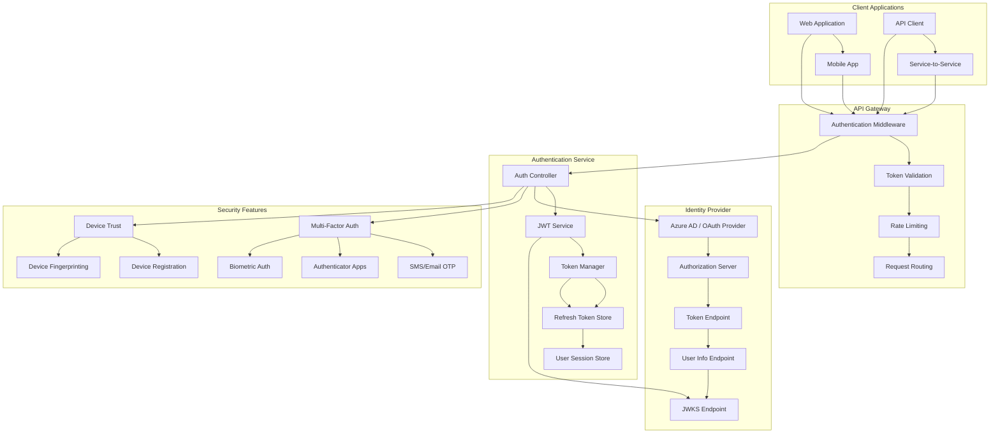

# Authentication Flow Patterns

**Description**: Comprehensive authentication patterns including OAuth 2.0 flows, JWT handling, token refresh mechanisms, multi-factor authentication, and identity provider integration for secure document processing systems.

**Security Pattern**: Critical security infrastructure that provides identity verification, secure token management, and multi-layered authentication for distributed applications.

## Authentication Architecture Overview

Modern authentication systems require sophisticated patterns to handle multiple identity providers, token lifecycle management, and security requirements across distributed microservices.



## 1. OAuth 2.0 Flow Implementation

### Authorization Code Flow with PKCE

```csharp
// src/Authentication/OAuth/OAuthFlowManager.cs
using Microsoft.AspNetCore.Authentication;
using Microsoft.AspNetCore.Authentication.OAuth;
using System.Security.Cryptography;
using System.Text;

namespace DocumentProcessing.Authentication.OAuth;

public interface IOAuthFlowManager
{
    Task<AuthorizationRequest> StartAuthorizationFlowAsync(AuthorizationFlowRequest request);
    Task<TokenResponse> ExchangeCodeForTokensAsync(string code, string codeVerifier, string state);
    Task<TokenResponse> RefreshTokenAsync(string refreshToken);
    Task<bool> RevokeTokenAsync(string token, TokenType tokenType);
}

public class OAuthFlowManager(
    IHttpClientFactory httpClientFactory,
    IConfiguration configuration,
    ILogger<OAuthFlowManager> logger,
    IMemoryCache cache) : IOAuthFlowManager
{
    private readonly OAuthConfiguration oauthConfig = 
        configuration.GetSection("OAuth").Get<OAuthConfiguration>() ?? new();
    
    public async Task<AuthorizationRequest> StartAuthorizationFlowAsync(AuthorizationFlowRequest request)
    {
        // Generate PKCE parameters
        var codeVerifier = GenerateCodeVerifier();
        var codeChallenge = GenerateCodeChallenge(codeVerifier);
        var state = GenerateSecureState();
        
        // Store PKCE and state parameters temporarily
        var authSession = new AuthenticationSession
        {
            State = state,
            CodeVerifier = codeVerifier,
            RedirectUri = request.RedirectUri,
            Scopes = request.Scopes,
            ClientId = request.ClientId ?? oauthConfig.ClientId,
            CreatedAt = DateTimeOffset.UtcNow,
            ExpiresAt = DateTimeOffset.UtcNow.AddMinutes(10) // Short expiration for security
        };
        
        // Cache the session
        var cacheKey = $"auth_session_{state}";
        cache.Set(cacheKey, authSession, TimeSpan.FromMinutes(10));
        
        // Build authorization URL
        var authUrl = BuildAuthorizationUrl(new AuthorizationUrlRequest
        {
            ClientId = authSession.ClientId,
            RedirectUri = authSession.RedirectUri,
            Scopes = authSession.Scopes,
            State = state,
            CodeChallenge = codeChallenge,
            ResponseType = "code",
            ResponseMode = request.ResponseMode ?? "query"
        });
        
        logger.LogInformation("Started OAuth authorization flow for client {ClientId} with state {State}", 
            authSession.ClientId, state);
        
        return new AuthorizationRequest
        {
            AuthorizationUrl = authUrl,
            State = state,
            CodeVerifier = codeVerifier, // Return for client-side storage if needed
            ExpiresAt = authSession.ExpiresAt
        };
    }
    
    public async Task<TokenResponse> ExchangeCodeForTokensAsync(string code, string codeVerifier, string state)
    {
        // Retrieve and validate session
        var cacheKey = $"auth_session_{state}";
        if (!cache.TryGetValue(cacheKey, out AuthenticationSession? session) || session == null)
        {
            throw new AuthenticationException("Invalid or expired authentication session");
        }
        
        // Validate code verifier
        if (session.CodeVerifier != codeVerifier)
        {
            throw new AuthenticationException("Invalid code verifier");
        }
        
        // Remove session from cache to prevent replay attacks
        cache.Remove(cacheKey);
        
        using var httpClient = httpClientFactory.CreateClient("oauth");
        
        var tokenRequest = new FormUrlEncodedContent(new[]
        {
            new KeyValuePair<string, string>("grant_type", "authorization_code"),
            new KeyValuePair<string, string>("client_id", session.ClientId),
            new KeyValuePair<string, string>("client_secret", oauthConfig.ClientSecret),
            new KeyValuePair<string, string>("code", code),
            new KeyValuePair<string, string>("redirect_uri", session.RedirectUri),
            new KeyValuePair<string, string>("code_verifier", codeVerifier)
        });
        
        var response = await httpClient.PostAsync(oauthConfig.TokenEndpoint, tokenRequest);
        
        if (!response.IsSuccessStatusCode)
        {
            var errorContent = await response.Content.ReadAsStringAsync();
            logger.LogError("Token exchange failed with status {StatusCode}: {Error}", 
                response.StatusCode, errorContent);
            throw new AuthenticationException($"Token exchange failed: {response.StatusCode}");
        }
        
        var tokenContent = await response.Content.ReadAsStringAsync();
        var tokenData = JsonSerializer.Deserialize<OAuthTokenResponse>(tokenContent) ?? 
            throw new AuthenticationException("Invalid token response format");
        
        var tokenResponse = new TokenResponse
        {
            AccessToken = tokenData.AccessToken,
            RefreshToken = tokenData.RefreshToken,
            TokenType = tokenData.TokenType,
            ExpiresIn = tokenData.ExpiresIn,
            ExpiresAt = DateTimeOffset.UtcNow.AddSeconds(tokenData.ExpiresIn),
            Scope = tokenData.Scope,
            IdToken = tokenData.IdToken
        };
        
        logger.LogInformation("Successfully exchanged authorization code for tokens for client {ClientId}", 
            session.ClientId);
        
        return tokenResponse;
    }
    
    public async Task<TokenResponse> RefreshTokenAsync(string refreshToken)
    {
        using var httpClient = httpClientFactory.CreateClient("oauth");
        
        var refreshRequest = new FormUrlEncodedContent(new[]
        {
            new KeyValuePair<string, string>("grant_type", "refresh_token"),
            new KeyValuePair<string, string>("client_id", oauthConfig.ClientId),
            new KeyValuePair<string, string>("client_secret", oauthConfig.ClientSecret),
            new KeyValuePair<string, string>("refresh_token", refreshToken)
        });
        
        var response = await httpClient.PostAsync(oauthConfig.TokenEndpoint, refreshRequest);
        
        if (!response.IsSuccessStatusCode)
        {
            var errorContent = await response.Content.ReadAsStringAsync();
            logger.LogError("Token refresh failed with status {StatusCode}: {Error}", 
                response.StatusCode, errorContent);
            throw new AuthenticationException($"Token refresh failed: {response.StatusCode}");
        }
        
        var tokenContent = await response.Content.ReadAsStringAsync();
        var tokenData = JsonSerializer.Deserialize<OAuthTokenResponse>(tokenContent) ?? 
            throw new AuthenticationException("Invalid refresh token response format");
        
        return new TokenResponse
        {
            AccessToken = tokenData.AccessToken,
            RefreshToken = tokenData.RefreshToken ?? refreshToken, // Some providers don't return new refresh token
            TokenType = tokenData.TokenType,
            ExpiresIn = tokenData.ExpiresIn,
            ExpiresAt = DateTimeOffset.UtcNow.AddSeconds(tokenData.ExpiresIn),
            Scope = tokenData.Scope,
            IdToken = tokenData.IdToken
        };
    }
    
    public async Task<bool> RevokeTokenAsync(string token, TokenType tokenType)
    {
        try
        {
            using var httpClient = httpClientFactory.CreateClient("oauth");
            
            var revokeRequest = new FormUrlEncodedContent(new[]
            {
                new KeyValuePair<string, string>("token", token),
                new KeyValuePair<string, string>("token_type_hint", tokenType.ToString().ToLower()),
                new KeyValuePair<string, string>("client_id", oauthConfig.ClientId),
                new KeyValuePair<string, string>("client_secret", oauthConfig.ClientSecret)
            });
            
            var response = await httpClient.PostAsync(oauthConfig.RevocationEndpoint, revokeRequest);
            
            if (response.IsSuccessStatusCode || response.StatusCode == HttpStatusCode.BadRequest)
            {
                // Many providers return 200 for success or 400 for already revoked
                logger.LogInformation("Token revocation completed for token type {TokenType}", tokenType);
                return true;
            }
            
            logger.LogWarning("Token revocation failed with status {StatusCode}", response.StatusCode);
            return false;
        }
        catch (Exception ex)
        {
            logger.LogError(ex, "Error during token revocation for token type {TokenType}", tokenType);
            return false;
        }
    }
    
    private static string GenerateCodeVerifier()
    {
        // Generate 128 bytes of random data and base64url encode
        using var rng = RandomNumberGenerator.Create();
        var bytes = new byte[96]; // 96 bytes = 128 base64url characters
        rng.GetBytes(bytes);
        return Convert.ToBase64String(bytes)
            .Replace("+", "-")
            .Replace("/", "_")
            .Replace("=", "");
    }
    
    private static string GenerateCodeChallenge(string codeVerifier)
    {
        // SHA256 hash of code verifier and base64url encode
        using var sha256 = SHA256.Create();
        var challengeBytes = sha256.ComputeHash(Encoding.UTF8.GetBytes(codeVerifier));
        return Convert.ToBase64String(challengeBytes)
            .Replace("+", "-")
            .Replace("/", "_")
            .Replace("=", "");
    }
    
    private static string GenerateSecureState()
    {
        using var rng = RandomNumberGenerator.Create();
        var bytes = new byte[32];
        rng.GetBytes(bytes);
        return Convert.ToBase64String(bytes)
            .Replace("+", "-")
            .Replace("/", "_")
            .Replace("=", "");
    }
    
    private string BuildAuthorizationUrl(AuthorizationUrlRequest request)
    {
        var parameters = new Dictionary<string, string>
        {
            ["response_type"] = request.ResponseType,
            ["client_id"] = request.ClientId,
            ["redirect_uri"] = request.RedirectUri,
            ["scope"] = string.Join(" ", request.Scopes),
            ["state"] = request.State,
            ["code_challenge"] = request.CodeChallenge,
            ["code_challenge_method"] = "S256"
        };
        
        if (!string.IsNullOrEmpty(request.ResponseMode))
        {
            parameters["response_mode"] = request.ResponseMode;
        }
        
        var queryString = string.Join("&", parameters.Select(kvp => 
            $"{Uri.EscapeDataString(kvp.Key)}={Uri.EscapeDataString(kvp.Value)}"));
        
        return $"{oauthConfig.AuthorizationEndpoint}?{queryString}";
    }
}
```

### OAuth Configuration and Models

```csharp
// src/Authentication/OAuth/OAuthModels.cs
namespace DocumentProcessing.Authentication.OAuth;

public class OAuthConfiguration
{
    public string ClientId { get; set; } = "";
    public string ClientSecret { get; set; } = "";
    public string AuthorizationEndpoint { get; set; } = "";
    public string TokenEndpoint { get; set; } = "";
    public string RevocationEndpoint { get; set; } = "";
    public string UserInfoEndpoint { get; set; } = "";
    public string JwksUri { get; set; } = "";
    public string[] DefaultScopes { get; set; } = Array.Empty<string>();
    public int TokenLifetimeMinutes { get; set; } = 60;
    public int RefreshTokenLifetimeDays { get; set; } = 30;
}

public class AuthorizationFlowRequest
{
    public string RedirectUri { get; set; } = "";
    public string[] Scopes { get; set; } = Array.Empty<string>();
    public string? ClientId { get; set; }
    public string? ResponseMode { get; set; }
}

public class AuthorizationRequest
{
    public string AuthorizationUrl { get; set; } = "";
    public string State { get; set; } = "";
    public string CodeVerifier { get; set; } = "";
    public DateTimeOffset ExpiresAt { get; set; }
}

public class AuthorizationUrlRequest
{
    public string ClientId { get; set; } = "";
    public string RedirectUri { get; set; } = "";
    public string[] Scopes { get; set; } = Array.Empty<string>();
    public string State { get; set; } = "";
    public string CodeChallenge { get; set; } = "";
    public string ResponseType { get; set; } = "code";
    public string? ResponseMode { get; set; }
}

public class AuthenticationSession
{
    public string State { get; set; } = "";
    public string CodeVerifier { get; set; } = "";
    public string RedirectUri { get; set; } = "";
    public string[] Scopes { get; set; } = Array.Empty<string>();
    public string ClientId { get; set; } = "";
    public DateTimeOffset CreatedAt { get; set; }
    public DateTimeOffset ExpiresAt { get; set; }
}

public class TokenResponse
{
    public string AccessToken { get; set; } = "";
    public string? RefreshToken { get; set; }
    public string TokenType { get; set; } = "Bearer";
    public int ExpiresIn { get; set; }
    public DateTimeOffset ExpiresAt { get; set; }
    public string? Scope { get; set; }
    public string? IdToken { get; set; }
}

public class OAuthTokenResponse
{
    [JsonPropertyName("access_token")]
    public string AccessToken { get; set; } = "";
    
    [JsonPropertyName("refresh_token")]
    public string? RefreshToken { get; set; }
    
    [JsonPropertyName("token_type")]
    public string TokenType { get; set; } = "Bearer";
    
    [JsonPropertyName("expires_in")]
    public int ExpiresIn { get; set; }
    
    [JsonPropertyName("scope")]
    public string? Scope { get; set; }
    
    [JsonPropertyName("id_token")]
    public string? IdToken { get; set; }
}

public enum TokenType
{
    AccessToken,
    RefreshToken
}

public class AuthenticationException(string message) : Exception(message);
```

## 2. JWT Token Management

### JWT Service Implementation

```csharp
// src/Authentication/JWT/JwtService.cs
using Microsoft.IdentityModel.Tokens;
using System.IdentityModel.Tokens.Jwt;
using System.Security.Claims;
using System.Security.Cryptography;

namespace DocumentProcessing.Authentication.JWT;

public interface IJwtService
{
    Task<string> GenerateTokenAsync(ClaimsPrincipal user, TokenType tokenType = TokenType.AccessToken);
    Task<ClaimsPrincipal> ValidateTokenAsync(string token);
    Task<bool> IsTokenValidAsync(string token);
    Task<TokenValidationResult> ValidateTokenWithDetailsAsync(string token);
    ClaimsPrincipal? DecodeTokenWithoutValidation(string token);
    Task<JsonWebKeySet> GetJsonWebKeySetAsync();
}

public class JwtService(
    IConfiguration configuration,
    ILogger<JwtService> logger,
    IKeyManager keyManager) : IJwtService
{
    private readonly JwtConfiguration jwtConfig = 
        configuration.GetSection("JWT").Get<JwtConfiguration>() ?? new();
    
    public async Task<string> GenerateTokenAsync(ClaimsPrincipal user, TokenType tokenType = TokenType.AccessToken)
    {
        var signingKey = await keyManager.GetCurrentSigningKeyAsync();
        var signingCredentials = new SigningCredentials(signingKey, SecurityAlgorithms.RsaSha256);
        
        var claims = new List<Claim>(user.Claims)
        {
            new(JwtRegisteredClaimNames.Jti, Guid.NewGuid().ToString()),
            new(JwtRegisteredClaimNames.Iat, DateTimeOffset.UtcNow.ToUnixTimeSeconds().ToString(), ClaimValueTypes.Integer64),
            new("token_type", tokenType.ToString().ToLower())
        };
        
        var expiry = tokenType == TokenType.AccessToken 
            ? TimeSpan.FromMinutes(jwtConfig.AccessTokenLifetimeMinutes)
            : TimeSpan.FromDays(jwtConfig.RefreshTokenLifetimeDays);
        
        var tokenDescriptor = new SecurityTokenDescriptor
        {
            Subject = new ClaimsIdentity(claims),
            Expires = DateTime.UtcNow.Add(expiry),
            Issuer = jwtConfig.Issuer,
            Audience = jwtConfig.Audience,
            SigningCredentials = signingCredentials,
            TokenType = "JWT"
        };
        
        var tokenHandler = new JwtSecurityTokenHandler();
        var token = tokenHandler.CreateToken(tokenDescriptor);
        var tokenString = tokenHandler.WriteToken(token);
        
        logger.LogDebug("Generated {TokenType} token for user {UserId} with expiry {Expiry}", 
            tokenType, user.FindFirst(ClaimTypes.NameIdentifier)?.Value, tokenDescriptor.Expires);
        
        return tokenString;
    }
    
    public async Task<ClaimsPrincipal> ValidateTokenAsync(string token)
    {
        var validationResult = await ValidateTokenWithDetailsAsync(token);
        
        if (!validationResult.IsValid)
        {
            throw new SecurityTokenValidationException(validationResult.Exception?.Message ?? "Token validation failed");
        }
        
        return validationResult.ClaimsIdentity!.AuthenticationType == null 
            ? new ClaimsPrincipal(validationResult.ClaimsIdentity) 
            : new ClaimsPrincipal(validationResult.ClaimsIdentity);
    }
    
    public async Task<bool> IsTokenValidAsync(string token)
    {
        try
        {
            var result = await ValidateTokenWithDetailsAsync(token);
            return result.IsValid;
        }
        catch
        {
            return false;
        }
    }
    
    public async Task<TokenValidationResult> ValidateTokenWithDetailsAsync(string token)
    {
        try
        {
            var validationKeys = await keyManager.GetValidationKeysAsync();
            var validationParameters = new TokenValidationParameters
            {
                ValidateIssuer = true,
                ValidateAudience = true,
                ValidateLifetime = true,
                ValidateIssuerSigningKey = true,
                ValidIssuer = jwtConfig.Issuer,
                ValidAudience = jwtConfig.Audience,
                IssuerSigningKeys = validationKeys,
                ClockSkew = TimeSpan.FromMinutes(jwtConfig.ClockSkewMinutes),
                RequireExpirationTime = true,
                RequireSignedTokens = true
            };
            
            var tokenHandler = new JwtSecurityTokenHandler();
            var result = await tokenHandler.ValidateTokenAsync(token, validationParameters);
            
            return result;
        }
        catch (Exception ex)
        {
            logger.LogWarning(ex, "Token validation failed for token: {TokenPrefix}...", token[..Math.Min(20, token.Length)]);
            return new TokenValidationResult
            {
                IsValid = false,
                Exception = ex
            };
        }
    }
    
    public ClaimsPrincipal? DecodeTokenWithoutValidation(string token)
    {
        try
        {
            var tokenHandler = new JwtSecurityTokenHandler();
            var jsonToken = tokenHandler.ReadJwtToken(token);
            
            var claims = jsonToken.Claims.ToList();
            var identity = new ClaimsIdentity(claims, "jwt");
            
            return new ClaimsPrincipal(identity);
        }
        catch (Exception ex)
        {
            logger.LogWarning(ex, "Failed to decode token without validation");
            return null;
        }
    }
    
    public async Task<JsonWebKeySet> GetJsonWebKeySetAsync()
    {
        var publicKeys = await keyManager.GetPublicKeysAsync();
        var jwks = new JsonWebKeySet();
        
        foreach (var key in publicKeys)
        {
            if (key is RsaSecurityKey rsaKey)
            {
                var jwk = JsonWebKeyConverter.ConvertFromRSASecurityKey(rsaKey);
                jwk.Use = "sig";
                jwk.Alg = SecurityAlgorithms.RsaSha256;
                jwks.Keys.Add(jwk);
            }
        }
        
        return jwks;
    }
}

public interface IKeyManager
{
    Task<SecurityKey> GetCurrentSigningKeyAsync();
    Task<IEnumerable<SecurityKey>> GetValidationKeysAsync();
    Task<IEnumerable<SecurityKey>> GetPublicKeysAsync();
    Task RotateKeysAsync();
}

public class KeyManager(
    IConfiguration configuration,
    ILogger<KeyManager> logger,
    IMemoryCache cache) : IKeyManager
{
    private readonly KeyManagementOptions keyOptions = 
        configuration.GetSection("KeyManagement").Get<KeyManagementOptions>() ?? new();
    
    public async Task<SecurityKey> GetCurrentSigningKeyAsync()
    {
        const string cacheKey = "current_signing_key";
        
        if (cache.TryGetValue(cacheKey, out SecurityKey? cachedKey) && cachedKey != null)
        {
            return cachedKey;
        }
        
        var key = await GenerateOrLoadSigningKeyAsync();
        cache.Set(cacheKey, key, TimeSpan.FromHours(1));
        
        return key;
    }
    
    public async Task<IEnumerable<SecurityKey>> GetValidationKeysAsync()
    {
        // In production, this would load from key store (Azure Key Vault, etc.)
        // For now, return current signing key + any cached validation keys
        var currentKey = await GetCurrentSigningKeyAsync();
        var validationKeys = new List<SecurityKey> { currentKey };
        
        // Add any additional validation keys for key rotation
        if (cache.TryGetValue("validation_keys", out List<SecurityKey>? cachedKeys) && cachedKeys != null)
        {
            validationKeys.AddRange(cachedKeys.Where(k => k != currentKey));
        }
        
        return validationKeys;
    }
    
    public async Task<IEnumerable<SecurityKey>> GetPublicKeysAsync()
    {
        var validationKeys = await GetValidationKeysAsync();
        return validationKeys.Where(k => k is RsaSecurityKey);
    }
    
    public async Task RotateKeysAsync()
    {
        logger.LogInformation("Starting key rotation process");
        
        try
        {
            // Generate new signing key
            var newKey = GenerateRsaKey();
            
            // Move current signing key to validation keys
            if (cache.TryGetValue("current_signing_key", out SecurityKey? currentKey) && currentKey != null)
            {
                var validationKeys = cache.Get<List<SecurityKey>>("validation_keys") ?? new List<SecurityKey>();
                validationKeys.Add(currentKey);
                
                // Keep only recent keys (e.g., last 3 keys)
                if (validationKeys.Count > keyOptions.MaxValidationKeys)
                {
                    validationKeys = validationKeys.TakeLast(keyOptions.MaxValidationKeys).ToList();
                }
                
                cache.Set("validation_keys", validationKeys, TimeSpan.FromDays(keyOptions.KeyRetentionDays));
            }
            
            // Set new signing key
            cache.Set("current_signing_key", newKey, TimeSpan.FromHours(1));
            
            logger.LogInformation("Key rotation completed successfully");
        }
        catch (Exception ex)
        {
            logger.LogError(ex, "Key rotation failed");
            throw;
        }
    }
    
    private async Task<SecurityKey> GenerateOrLoadSigningKeyAsync()
    {
        // In production, load from secure storage (Azure Key Vault, etc.)
        // For demo purposes, generate a new RSA key
        return await Task.FromResult(GenerateRsaKey());
    }
    
    private static RsaSecurityKey GenerateRsaKey()
    {
        using var rsa = RSA.Create(2048);
        return new RsaSecurityKey(rsa.ExportParameters(includePrivateParameters: true))
        {
            KeyId = Guid.NewGuid().ToString()
        };
    }
}
```

## 3. Multi-Factor Authentication

### MFA Service Implementation

```csharp
// src/Authentication/MFA/MultiFactorAuthService.cs
namespace DocumentProcessing.Authentication.MFA;

public interface IMultiFactorAuthService
{
    Task<MfaChallengeResponse> InitiateChallengeAsync(string userId, MfaMethod method);
    Task<MfaVerificationResult> VerifyChallengeAsync(string challengeId, string code, string? deviceFingerprint = null);
    Task<List<MfaMethod>> GetAvailableMethodsAsync(string userId);
    Task<bool> RegisterMethodAsync(string userId, MfaMethodRegistration registration);
    Task<bool> RemoveMethodAsync(string userId, string methodId);
    Task<bool> IsMfaRequiredAsync(string userId, AuthenticationContext context);
}

public class MultiFactorAuthService(
    IUserMfaRepository mfaRepository,
    ISmsService smsService,
    IEmailService emailService,
    ITotpService totpService,
    IDeviceTrustService deviceTrustService,
    ILogger<MultiFactorAuthService> logger,
    IMemoryCache cache) : IMultiFactorAuthService
{
    private readonly MfaConfiguration mfaConfig = new(); // Load from configuration
    
    public async Task<MfaChallengeResponse> InitiateChallengeAsync(string userId, MfaMethod method)
    {
        var challengeId = Guid.NewGuid().ToString();
        var code = GenerateVerificationCode(method.Type);
        var expiresAt = DateTimeOffset.UtcNow.AddMinutes(mfaConfig.ChallengeExpirationMinutes);
        
        // Store challenge
        var challenge = new MfaChallenge
        {
            Id = challengeId,
            UserId = userId,
            Method = method,
            Code = code,
            CreatedAt = DateTimeOffset.UtcNow,
            ExpiresAt = expiresAt,
            AttemptCount = 0,
            IsUsed = false
        };
        
        cache.Set($"mfa_challenge_{challengeId}", challenge, TimeSpan.FromMinutes(mfaConfig.ChallengeExpirationMinutes));
        
        // Send challenge based on method type
        await SendChallengeAsync(method, code, userId);
        
        logger.LogInformation("MFA challenge initiated for user {UserId} using method {MethodType}", 
            userId, method.Type);
        
        return new MfaChallengeResponse
        {
            ChallengeId = challengeId,
            MethodType = method.Type,
            MaskedDestination = MaskDestination(method),
            ExpiresAt = expiresAt,
            RequiresUserInput = RequiresUserInput(method.Type)
        };
    }
    
    public async Task<MfaVerificationResult> VerifyChallengeAsync(string challengeId, string code, string? deviceFingerprint = null)
    {
        var cacheKey = $"mfa_challenge_{challengeId}";
        if (!cache.TryGetValue(cacheKey, out MfaChallenge? challenge) || challenge == null)
        {
            return new MfaVerificationResult
            {
                IsValid = false,
                ErrorMessage = "Challenge not found or expired"
            };
        }
        
        // Check if challenge is still valid
        if (challenge.ExpiresAt <= DateTimeOffset.UtcNow)
        {
            cache.Remove(cacheKey);
            return new MfaVerificationResult
            {
                IsValid = false,
                ErrorMessage = "Challenge has expired"
            };
        }
        
        // Check attempt limits
        if (challenge.AttemptCount >= mfaConfig.MaxAttempts)
        {
            cache.Remove(cacheKey);
            await LogSecurityEventAsync(challenge.UserId, "MFA_MAX_ATTEMPTS_EXCEEDED", challengeId);
            return new MfaVerificationResult
            {
                IsValid = false,
                ErrorMessage = "Maximum verification attempts exceeded"
            };
        }
        
        // Check if already used
        if (challenge.IsUsed)
        {
            return new MfaVerificationResult
            {
                IsValid = false,
                ErrorMessage = "Challenge has already been used"
            };
        }
        
        // Increment attempt count
        challenge.AttemptCount++;
        cache.Set(cacheKey, challenge, TimeSpan.FromMinutes(mfaConfig.ChallengeExpirationMinutes));
        
        // Verify code based on method type
        var isValid = await VerifyCodeAsync(challenge.Method, code, challenge.Code);
        
        if (isValid)
        {
            // Mark as used
            challenge.IsUsed = true;
            cache.Set(cacheKey, challenge, TimeSpan.FromMinutes(1)); // Keep briefly for audit
            
            // Update device trust if fingerprint provided
            var trustScore = 0.0;
            if (!string.IsNullOrEmpty(deviceFingerprint))
            {
                trustScore = await deviceTrustService.UpdateDeviceTrustAsync(challenge.UserId, deviceFingerprint);
            }
            
            await LogSecurityEventAsync(challenge.UserId, "MFA_VERIFICATION_SUCCESS", challengeId);
            
            logger.LogInformation("MFA verification successful for user {UserId} using method {MethodType}", 
                challenge.UserId, challenge.Method.Type);
            
            return new MfaVerificationResult
            {
                IsValid = true,
                UserId = challenge.UserId,
                MethodType = challenge.Method.Type,
                DeviceTrustScore = trustScore,
                VerifiedAt = DateTimeOffset.UtcNow
            };
        }
        else
        {
            await LogSecurityEventAsync(challenge.UserId, "MFA_VERIFICATION_FAILED", challengeId);
            
            logger.LogWarning("MFA verification failed for user {UserId} using method {MethodType}. Attempt {Attempt}/{MaxAttempts}", 
                challenge.UserId, challenge.Method.Type, challenge.AttemptCount, mfaConfig.MaxAttempts);
            
            return new MfaVerificationResult
            {
                IsValid = false,
                ErrorMessage = "Invalid verification code",
                RemainingAttempts = mfaConfig.MaxAttempts - challenge.AttemptCount
            };
        }
    }
    
    public async Task<List<MfaMethod>> GetAvailableMethodsAsync(string userId)
    {
        return await mfaRepository.GetUserMfaMethodsAsync(userId);
    }
    
    public async Task<bool> RegisterMethodAsync(string userId, MfaMethodRegistration registration)
    {
        try
        {
            // Validate registration data
            if (!await ValidateRegistrationAsync(registration))
            {
                return false;
            }
            
            var method = new MfaMethod
            {
                Id = Guid.NewGuid().ToString(),
                UserId = userId,
                Type = registration.Type,
                Destination = registration.Destination,
                DisplayName = registration.DisplayName,
                IsActive = true,
                RegisteredAt = DateTimeOffset.UtcNow,
                LastUsed = null,
                BackupCodes = registration.Type == MfaMethodType.BackupCodes ? 
                    GenerateBackupCodes() : null
            };
            
            // For TOTP, generate and return secret
            if (registration.Type == MfaMethodType.Totp)
            {
                method.TotpSecret = totpService.GenerateSecret();
                method.QrCodeUri = totpService.GetQrCodeUri(userId, method.TotpSecret);
            }
            
            await mfaRepository.CreateMfaMethodAsync(method);
            
            logger.LogInformation("MFA method {MethodType} registered for user {UserId}", 
                registration.Type, userId);
            
            return true;
        }
        catch (Exception ex)
        {
            logger.LogError(ex, "Failed to register MFA method {MethodType} for user {UserId}", 
                registration.Type, userId);
            return false;
        }
    }
    
    public async Task<bool> RemoveMethodAsync(string userId, string methodId)
    {
        try
        {
            var success = await mfaRepository.RemoveMfaMethodAsync(userId, methodId);
            
            if (success)
            {
                logger.LogInformation("MFA method {MethodId} removed for user {UserId}", methodId, userId);
            }
            
            return success;
        }
        catch (Exception ex)
        {
            logger.LogError(ex, "Failed to remove MFA method {MethodId} for user {UserId}", methodId, userId);
            return false;
        }
    }
    
    public async Task<bool> IsMfaRequiredAsync(string userId, AuthenticationContext context)
    {
        // Check if user has MFA methods configured
        var methods = await GetAvailableMethodsAsync(userId);
        if (!methods.Any())
        {
            return false; // No MFA configured
        }
        
        // Check device trust
        if (!string.IsNullOrEmpty(context.DeviceFingerprint))
        {
            var trustScore = await deviceTrustService.GetDeviceTrustScoreAsync(userId, context.DeviceFingerprint);
            if (trustScore >= mfaConfig.TrustedDeviceThreshold)
            {
                return false; // Trusted device
            }
        }
        
        // Check risk factors
        var riskScore = await CalculateRiskScoreAsync(userId, context);
        return riskScore >= mfaConfig.MfaRequiredRiskThreshold;
    }
    
    private async Task SendChallengeAsync(MfaMethod method, string code, string userId)
    {
        switch (method.Type)
        {
            case MfaMethodType.Sms:
                await smsService.SendVerificationCodeAsync(method.Destination, code);
                break;
                
            case MfaMethodType.Email:
                await emailService.SendVerificationCodeAsync(method.Destination, code, userId);
                break;
                
            case MfaMethodType.Totp:
                // TOTP doesn't require sending - user generates code from authenticator app
                break;
                
            case MfaMethodType.BackupCodes:
                // Backup codes don't require sending
                break;
                
            default:
                throw new NotSupportedException($"MFA method type {method.Type} is not supported");
        }
    }
    
    private async Task<bool> VerifyCodeAsync(MfaMethod method, string providedCode, string expectedCode)
    {
        switch (method.Type)
        {
            case MfaMethodType.Sms:
            case MfaMethodType.Email:
                return string.Equals(providedCode.Trim(), expectedCode, StringComparison.OrdinalIgnoreCase);
                
            case MfaMethodType.Totp:
                if (string.IsNullOrEmpty(method.TotpSecret))
                {
                    return false;
                }
                return await totpService.ValidateCodeAsync(method.TotpSecret, providedCode);
                
            case MfaMethodType.BackupCodes:
                if (method.BackupCodes == null)
                {
                    return false;
                }
                var isValid = method.BackupCodes.Contains(providedCode);
                if (isValid)
                {
                    // Remove used backup code
                    method.BackupCodes = method.BackupCodes.Where(c => c != providedCode).ToArray();
                    await mfaRepository.UpdateMfaMethodAsync(method);
                }
                return isValid;
                
            default:
                return false;
        }
    }
    
    private static string GenerateVerificationCode(MfaMethodType type)
    {
        return type switch
        {
            MfaMethodType.Sms or MfaMethodType.Email => new Random().Next(100000, 999999).ToString(),
            _ => ""
        };
    }
    
    private static string MaskDestination(MfaMethod method)
    {
        if (string.IsNullOrEmpty(method.Destination))
            return "";
        
        return method.Type switch
        {
            MfaMethodType.Email => MaskEmail(method.Destination),
            MfaMethodType.Sms => MaskPhoneNumber(method.Destination),
            _ => method.DisplayName ?? method.Type.ToString()
        };
    }
    
    private static string MaskEmail(string email)
    {
        var parts = email.Split('@');
        if (parts.Length != 2) return email;
        
        var username = parts[0];
        var domain = parts[1];
        
        if (username.Length <= 2) return email;
        
        var masked = username[0] + new string('*', username.Length - 2) + username[^1];
        return $"{masked}@{domain}";
    }
    
    private static string MaskPhoneNumber(string phone)
    {
        if (phone.Length <= 4) return phone;
        
        return phone[..2] + new string('*', phone.Length - 4) + phone[^2..];
    }
    
    private static bool RequiresUserInput(MfaMethodType type)
    {
        return type is MfaMethodType.Totp or MfaMethodType.BackupCodes;
    }
    
    private async Task<bool> ValidateRegistrationAsync(MfaMethodRegistration registration)
    {
        // Add validation logic based on method type
        return await Task.FromResult(true);
    }
    
    private static string[] GenerateBackupCodes()
    {
        var codes = new string[10];
        var random = new Random();
        
        for (int i = 0; i < codes.Length; i++)
        {
            codes[i] = random.Next(10000000, 99999999).ToString();
        }
        
        return codes;
    }
    
    private async Task<double> CalculateRiskScoreAsync(string userId, AuthenticationContext context)
    {
        // Implement risk calculation based on:
        // - Location (unusual location)
        // - Time (unusual time)
        // - Device (new device)
        // - Behavior patterns
        return await Task.FromResult(0.5); // Placeholder
    }
    
    private async Task LogSecurityEventAsync(string userId, string eventType, string details)
    {
        // Log security events for audit and monitoring
        logger.LogInformation("Security event {EventType} for user {UserId}: {Details}", 
            eventType, userId, details);
        
        await Task.CompletedTask;
    }
}
```

## 4. Authentication Middleware and Integration

### JWT Authentication Middleware

```csharp
// src/Middleware/JwtAuthenticationMiddleware.cs
namespace DocumentProcessing.Middleware;

public class JwtAuthenticationMiddleware(
    RequestDelegate next,
    IJwtService jwtService,
    ILogger<JwtAuthenticationMiddleware> logger)
{
    private const string BearerPrefix = "Bearer ";
    
    public async Task InvokeAsync(HttpContext context)
    {
        try
        {
            var token = ExtractTokenFromRequest(context.Request);
            
            if (!string.IsNullOrEmpty(token))
            {
                var principal = await jwtService.ValidateTokenAsync(token);
                context.User = principal;
                
                // Add token to context for potential refresh
                context.Items["access_token"] = token;
            }
        }
        catch (SecurityTokenExpiredException ex)
        {
            logger.LogWarning("Expired token received: {Message}", ex.Message);
            context.Items["token_expired"] = true;
        }
        catch (SecurityTokenValidationException ex)
        {
            logger.LogWarning("Invalid token received: {Message}", ex.Message);
            context.Items["token_invalid"] = true;
        }
        catch (Exception ex)
        {
            logger.LogError(ex, "Error during token validation");
        }
        
        await next(context);
    }
    
    private static string? ExtractTokenFromRequest(HttpRequest request)
    {
        // Check Authorization header
        if (request.Headers.TryGetValue("Authorization", out var authHeader))
        {
            var authValue = authHeader.FirstOrDefault();
            if (!string.IsNullOrEmpty(authValue) && authValue.StartsWith(BearerPrefix))
            {
                return authValue[BearerPrefix.Length..];
            }
        }
        
        // Check query parameter (for WebSocket connections, etc.)
        if (request.Query.TryGetValue("access_token", out var tokenQuery))
        {
            return tokenQuery.FirstOrDefault();
        }
        
        // Check cookie (if configured)
        if (request.Cookies.TryGetValue("access_token", out var tokenCookie))
        {
            return tokenCookie;
        }
        
        return null;
    }
}

// Extension method for easy registration
public static class JwtAuthenticationMiddlewareExtensions
{
    public static IApplicationBuilder UseJwtAuthentication(this IApplicationBuilder builder)
    {
        return builder.UseMiddleware<JwtAuthenticationMiddleware>();
    }
}
```

### Authentication Controller

```csharp
// src/Controllers/AuthController.cs
namespace DocumentProcessing.Controllers;

[ApiController]
[Route("api/auth")]
public class AuthController(
    IOAuthFlowManager oauthManager,
    IJwtService jwtService,
    IMultiFactorAuthService mfaService,
    IUserService userService,
    ILogger<AuthController> logger) : ControllerBase
{
    [HttpPost("authorize")]
    public async Task<IActionResult> StartAuthorization([FromBody] AuthorizationRequest request)
    {
        try
        {
            var flowRequest = new AuthorizationFlowRequest
            {
                RedirectUri = request.RedirectUri,
                Scopes = request.Scopes ?? new[] { "read", "write" },
                ClientId = request.ClientId
            };
            
            var authRequest = await oauthManager.StartAuthorizationFlowAsync(flowRequest);
            
            return Ok(new
            {
                authorization_url = authRequest.AuthorizationUrl,
                state = authRequest.State,
                expires_at = authRequest.ExpiresAt
            });
        }
        catch (Exception ex)
        {
            logger.LogError(ex, "Failed to start authorization flow");
            return BadRequest(new { error = "authorization_failed", error_description = ex.Message });
        }
    }
    
    [HttpPost("token")]
    public async Task<IActionResult> ExchangeToken([FromBody] TokenRequest request)
    {
        try
        {
            var tokenResponse = await oauthManager.ExchangeCodeForTokensAsync(
                request.Code, request.CodeVerifier, request.State);
            
            // Create user claims from token
            var userClaims = await ExtractUserClaimsAsync(tokenResponse);
            var user = new ClaimsPrincipal(userClaims);
            
            // Check if MFA is required
            var authContext = new AuthenticationContext
            {
                IpAddress = HttpContext.Connection.RemoteIpAddress?.ToString(),
                UserAgent = Request.Headers["User-Agent"].FirstOrDefault(),
                DeviceFingerprint = request.DeviceFingerprint
            };
            
            var userId = userClaims.FindFirst(ClaimTypes.NameIdentifier)?.Value;
            if (string.IsNullOrEmpty(userId))
            {
                return BadRequest(new { error = "invalid_user", error_description = "User ID not found in token" });
            }
            
            var requiresMfa = await mfaService.IsMfaRequiredAsync(userId, authContext);
            
            if (requiresMfa)
            {
                // Return partial token and MFA challenge
                var partialToken = await jwtService.GenerateTokenAsync(user, TokenType.RefreshToken);
                var mfaMethods = await mfaService.GetAvailableMethodsAsync(userId);
                
                return Ok(new
                {
                    requires_mfa = true,
                    partial_token = partialToken,
                    available_methods = mfaMethods.Select(m => new
                    {
                        id = m.Id,
                        type = m.Type.ToString().ToLower(),
                        display_name = m.DisplayName,
                        masked_destination = m.Type == MfaMethodType.Sms || m.Type == MfaMethodType.Email ? 
                            MaskDestination(m.Destination) : null
                    })
                });
            }
            
            // Generate final tokens
            var accessToken = await jwtService.GenerateTokenAsync(user, TokenType.AccessToken);
            var refreshToken = await jwtService.GenerateTokenAsync(user, TokenType.RefreshToken);
            
            return Ok(new
            {
                access_token = accessToken,
                refresh_token = refreshToken,
                token_type = "Bearer",
                expires_in = 3600 // 1 hour
            });
        }
        catch (Exception ex)
        {
            logger.LogError(ex, "Failed to exchange authorization code for tokens");
            return BadRequest(new { error = "token_exchange_failed", error_description = ex.Message });
        }
    }
    
    [HttpPost("mfa/challenge")]
    public async Task<IActionResult> InitiateMfaChallenge([FromBody] MfaChallengeRequest request)
    {
        try
        {
            // Validate partial token
            var principal = await jwtService.ValidateTokenAsync(request.PartialToken);
            var userId = principal.FindFirst(ClaimTypes.NameIdentifier)?.Value;
            
            if (string.IsNullOrEmpty(userId))
            {
                return BadRequest(new { error = "invalid_token", error_description = "Invalid partial token" });
            }
            
            // Get MFA method
            var methods = await mfaService.GetAvailableMethodsAsync(userId);
            var method = methods.FirstOrDefault(m => m.Id == request.MethodId);
            
            if (method == null)
            {
                return BadRequest(new { error = "method_not_found", error_description = "MFA method not found" });
            }
            
            var challenge = await mfaService.InitiateChallengeAsync(userId, method);
            
            return Ok(new
            {
                challenge_id = challenge.ChallengeId,
                method_type = challenge.MethodType.ToString().ToLower(),
                masked_destination = challenge.MaskedDestination,
                expires_at = challenge.ExpiresAt,
                requires_input = challenge.RequiresUserInput
            });
        }
        catch (Exception ex)
        {
            logger.LogError(ex, "Failed to initiate MFA challenge");
            return BadRequest(new { error = "mfa_challenge_failed", error_description = ex.Message });
        }
    }
    
    [HttpPost("mfa/verify")]
    public async Task<IActionResult> VerifyMfaChallenge([FromBody] MfaVerificationRequest request)
    {
        try
        {
            var result = await mfaService.VerifyChallengeAsync(
                request.ChallengeId, request.Code, request.DeviceFingerprint);
            
            if (!result.IsValid)
            {
                return BadRequest(new 
                { 
                    error = "verification_failed", 
                    error_description = result.ErrorMessage,
                    remaining_attempts = result.RemainingAttempts
                });
            }
            
            // Get user and generate final tokens
            var user = await userService.GetUserByIdAsync(result.UserId!);
            if (user == null)
            {
                return BadRequest(new { error = "user_not_found" });
            }
            
            var userClaims = CreateUserClaims(user);
            var principal = new ClaimsPrincipal(userClaims);
            
            var accessToken = await jwtService.GenerateTokenAsync(principal, TokenType.AccessToken);
            var refreshToken = await jwtService.GenerateTokenAsync(principal, TokenType.RefreshToken);
            
            return Ok(new
            {
                access_token = accessToken,
                refresh_token = refreshToken,
                token_type = "Bearer",
                expires_in = 3600,
                device_trust_score = result.DeviceTrustScore
            });
        }
        catch (Exception ex)
        {
            logger.LogError(ex, "Failed to verify MFA challenge");
            return BadRequest(new { error = "mfa_verification_failed", error_description = ex.Message });
        }
    }
    
    [HttpPost("refresh")]
    public async Task<IActionResult> RefreshToken([FromBody] RefreshTokenRequest request)
    {
        try
        {
            var tokenResponse = await oauthManager.RefreshTokenAsync(request.RefreshToken);
            
            return Ok(new
            {
                access_token = tokenResponse.AccessToken,
                refresh_token = tokenResponse.RefreshToken,
                token_type = tokenResponse.TokenType,
                expires_in = tokenResponse.ExpiresIn
            });
        }
        catch (Exception ex)
        {
            logger.LogError(ex, "Failed to refresh token");
            return BadRequest(new { error = "refresh_failed", error_description = ex.Message });
        }
    }
    
    [HttpPost("logout")]
    [Authorize]
    public async Task<IActionResult> Logout([FromBody] LogoutRequest request)
    {
        try
        {
            // Revoke tokens
            if (!string.IsNullOrEmpty(request.AccessToken))
            {
                await oauthManager.RevokeTokenAsync(request.AccessToken, TokenType.AccessToken);
            }
            
            if (!string.IsNullOrEmpty(request.RefreshToken))
            {
                await oauthManager.RevokeTokenAsync(request.RefreshToken, TokenType.RefreshToken);
            }
            
            return Ok(new { message = "Logged out successfully" });
        }
        catch (Exception ex)
        {
            logger.LogError(ex, "Failed to logout user");
            return BadRequest(new { error = "logout_failed", error_description = ex.Message });
        }
    }
    
    private static async Task<ClaimsIdentity> ExtractUserClaimsAsync(TokenResponse tokenResponse)
    {
        // Extract claims from ID token or call user info endpoint
        // This is a simplified implementation
        return await Task.FromResult(new ClaimsIdentity(new[]
        {
            new Claim(ClaimTypes.NameIdentifier, "user123"),
            new Claim(ClaimTypes.Name, "Test User"),
            new Claim(ClaimTypes.Email, "test@example.com")
        }, "jwt"));
    }
    
    private static ClaimsIdentity CreateUserClaims(object user)
    {
        // Create claims from user object
        return new ClaimsIdentity(new[]
        {
            new Claim(ClaimTypes.NameIdentifier, "user123"),
            new Claim(ClaimTypes.Name, "Test User"),
            new Claim(ClaimTypes.Email, "test@example.com")
        }, "jwt");
    }
    
    private static string MaskDestination(string destination)
    {
        if (destination.Contains('@'))
        {
            var parts = destination.Split('@');
            return $"{parts[0][0]}***@{parts[1]}";
        }
        
        return destination.Length > 4 ? $"***{destination[^4..]}" : "***";
    }
}
```

## 5. Configuration and Security

### Authentication Configuration

```json
{
  "OAuth": {
    "ClientId": "your-client-id",
    "ClientSecret": "your-client-secret",
    "AuthorizationEndpoint": "https://login.microsoftonline.com/tenant/oauth2/v2.0/authorize",
    "TokenEndpoint": "https://login.microsoftonline.com/tenant/oauth2/v2.0/token",
    "RevocationEndpoint": "https://login.microsoftonline.com/tenant/oauth2/v2.0/logout",
    "UserInfoEndpoint": "https://graph.microsoft.com/v1.0/me",
    "JwksUri": "https://login.microsoftonline.com/tenant/discovery/v2.0/keys",
    "DefaultScopes": ["openid", "profile", "email"],
    "TokenLifetimeMinutes": 60,
    "RefreshTokenLifetimeDays": 30
  },
  "JWT": {
    "Issuer": "DocumentProcessing",
    "Audience": "DocumentProcessingApi",
    "AccessTokenLifetimeMinutes": 60,
    "RefreshTokenLifetimeDays": 30,
    "ClockSkewMinutes": 5
  },
  "MFA": {
    "ChallengeExpirationMinutes": 5,
    "MaxAttempts": 3,
    "TrustedDeviceThreshold": 0.8,
    "MfaRequiredRiskThreshold": 0.6
  },
  "KeyManagement": {
    "KeyRotationIntervalDays": 30,
    "MaxValidationKeys": 3,
    "KeyRetentionDays": 90
  }
}
```

## Authentication Best Practices

| Practice | Implementation | Benefit |
|----------|---------------|---------|
| **PKCE for OAuth** | Use PKCE in authorization code flow | Prevents code interception attacks |
| **Token Rotation** | Regular access token refresh | Limits exposure of compromised tokens |
| **MFA Implementation** | Multiple authentication factors | Enhanced security for sensitive operations |
| **Device Trust** | Track and score device behavior | Adaptive authentication based on risk |
| **Secure Token Storage** | HttpOnly cookies or secure storage | Prevents XSS token theft |
| **Rate Limiting** | Limit authentication attempts | Prevents brute force attacks |

---

**Key Benefits**: Secure authentication flows, token lifecycle management, multi-factor authentication, adaptive security, OAuth 2.0 compliance

**When to Use**: All applications requiring authentication, API security, user identity management, compliance requirements

**Performance**: Optimized token validation, efficient MFA flows, scalable authentication architecture