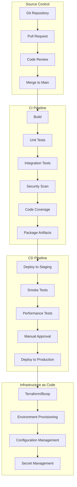

# CI/CD Pipelines and Automation

**Description**: Comprehensive CI/CD automation patterns covering continuous integration, deployment pipelines, testing strategies, infrastructure as code, security scanning, and release management for .NET applications.

**Integration Pattern**: End-to-end automation from code commit through production deployment with comprehensive quality gates and monitoring.

## CI/CD Architecture Overview

Modern software delivery requires sophisticated automation pipelines that ensure code quality, security, and reliable deployments across multiple environments.



## 1. GitHub Actions CI/CD Pipeline

### Complete CI/CD Workflow

```yaml
# .github/workflows/ci-cd.yml
name: CI/CD Pipeline

on:
  push:
    branches: [ main, develop ]
    paths-ignore:
      - '**.md'
      - '.gitignore'
  pullrequest:
    branches: [ main ]
    paths-ignore:
      - '**.md'
      - '.gitignore'
  release:
    types: [ published ]

env:
  DOTNETVERSION: '9.0.x'
  DOCKERREGISTRY: 'ghcr.io'
  IMAGENAME: 'documentprocessing/api'
  AZURERESOURCEGROUP: 'rg-documentprocessing'
  AZUREWEBAPPNAME: 'app-documentprocessing'

jobs:
  # Build and Test Job
  build-and-test:
    runs-on: ubuntu-latest
    
    services:
      postgres:
        image: postgres:16
        env:
          POSTGRESPASSWORD: postgres
          POSTGRESDB: testdb
        options: >-
          --health-cmd pgIsready
          --health-interval 10s
          --health-timeout 5s
          --health-retries 5
        ports:
          - 5432:5432
          
      redis:
        image: redis:7-alpine
        options: >-
          --health-cmd "redis-cli ping"
          --health-interval 10s
          --health-timeout 3s
          --health-retries 5
        ports:
          - 6379:6379

    steps:
    - name: Checkout code
      uses: actions/checkout@v4
      with:
        fetch-depth: 0  # Fetch full history for GitVersion

    - name: Setup .NET
      uses: actions/setup-dotnet@v4
      with:
        dotnet-version: ${{ env.DOTNET_VERSION }}

    - name: Cache NuGet packages
      uses: actions/cache@v4
      with:
        path: ~/.nuget/packages
        key: ${{ runner.os }}-nuget-${{ hashFiles('**/*.csproj', '**/Directory.Packages.props') }}
        restore-keys: |
          ${{ runner.os }}-nuget-

    - name: Restore dependencies
      run: dotnet restore

    - name: Build solution
      run: dotnet build --no-restore --configuration Release --verbosity normal /p:TreatWarningsAsErrors=true

    # Code Quality and Security
    - name: Run CodeQL Analysis
      uses: github/codeql-action/init@v3
      with:
        languages: csharp
        
    - name: Perform CodeQL Analysis
      uses: github/codeql-action/analyze@v3

    - name: Run Security Scan
      run: |
        dotnet list package --vulnerable --include-transitive 2>&1 | tee security-scan.txt
        if grep -q "has the following vulnerable packages" security-scan.txt; then
          echo "Vulnerable packages found!"
          exit 1
        fi

    # Testing
    - name: Run Unit Tests
      run: |
        dotnet test --no-build --configuration Release \
          --logger trx --results-directory TestResults \
          --collect:"XPlat Code Coverage" \
          --filter Category!=Integration
          
    - name: Run Integration Tests
      run: |
        dotnet test --no-build --configuration Release \
          --logger trx --results-directory TestResults \
          --collect:"XPlat Code Coverage" \
          --filter Category=Integration
      env:
        ConnectionStringsDefaultConnection: "Server=localhost;Port=5432;Database=testdb;User Id=postgres;Password=postgres;"
        ConnectionStringsRedis: "localhost:6379"

    # Code Coverage
    - name: Generate Code Coverage Report
      uses: danielpalme/ReportGenerator-GitHub-Action@5.2.4
      with:
        reports: 'TestResults/**/*.xml'
        targetdir: 'CoverageReport'
        reporttypes: 'HtmlInline;Cobertura;JsonSummary'
        
    - name: Upload Coverage to Codecov
      uses: codecov/codecov-action@v4
      with:
        file: CoverageReport/Cobertura.xml
        failOnError: true
        
    - name: Check Code Coverage
      shell: pwsh
      run: |
        $coverage = Get-Content CoverageReport/Summary.json | ConvertFrom-Json
        $lineCoverage = $coverage.summary.linecoverage
        Write-Host "Line Coverage: $lineCoverage%"
        if ($lineCoverage -lt 80) {
          Write-Error "Code coverage $lineCoverage% is below required 80%"
          exit 1
        }

    # Package Application
    - name: Publish Application
      run: |
        dotnet publish src/WebApi/WebApi.csproj \
          --configuration Release \
          --no-build \
          --output ./publish \
          /p:PublishProfile=DefaultContainer

    - name: Upload Build Artifacts
      uses: actions/upload-artifact@v4
      with:
        name: published-app
        path: ./publish
        retention-days: 30

  # Docker Build and Push
  docker-build:
    runs-on: ubuntu-latest
    needs: build-and-test
    if: github.eventName != 'pullRequest'
    
    outputs:
      image-digest: ${{ steps.build.outputs.digest }}
      image-tag: ${{ steps.meta.outputs.tags }}

    steps:
    - name: Checkout code
      uses: actions/checkout@v4

    - name: Set up Docker Buildx
      uses: docker/setup-buildx-action@v3

    - name: Log in to Container Registry
      uses: docker/login-action@v3
      with:
        registry: ${{ env.DOCKER_REGISTRY }}
        username: ${{ github.actor }}
        password: ${{ secrets.GITHUB_TOKEN }}

    - name: Extract metadata
      id: meta
      uses: docker/metadata-action@v5
      with:
        images: ${{ env.DOCKER_REGISTRY }}/${{ github.repository }}/${{ env.IMAGE_NAME }}
        tags: |
          type=ref,event=branch
          type=ref,event=pr
          type=semver,pattern={{version}}
          type=semver,pattern={{major}}.{{minor}}
          type=sha,prefix={{branch}}-

    - name: Build and push Docker image
      id: build
      uses: docker/build-push-action@v5
      with:
        context: .
        file: src/WebApi/Dockerfile
        push: true
        tags: ${{ steps.meta.outputs.tags }}
        labels: ${{ steps.meta.outputs.labels }}
        cache-from: type=gha
        cache-to: type=gha,mode=max
        build-args: |
          BUILD_CONFIGURATION=Release
          environmentName=Production

  # Security Scanning
  security-scan:
    runs-on: ubuntu-latest
    needs: docker-build
    if: github.eventName != 'pullRequest'

    steps:
    - name: Run Trivy vulnerability scanner
      uses: aquasecurity/trivy-action@master
      with:
        image-ref: ${{ needs.docker-build.outputs.image-tag }}
        format: 'sarif'
        output: 'trivy-results.sarif'

    - name: Upload Trivy scan results
      uses: github/codeql-action/upload-sarif@v3
      if: always()
      with:
        sariffile: 'trivy-results.sarif'

  # Deploy to Staging
  deploy-staging:
    runs-on: ubuntu-latest
    needs: [build-and-test, docker-build, security-scan]
    if: github.ref == 'refs/heads/develop' || github.ref == 'refs/heads/main'
    environment: staging

    steps:
    - name: Checkout code
      uses: actions/checkout@v4

    - name: Azure Login
      uses: azure/login@v2
      with:
        creds: ${{ secrets.AZURE_CREDENTIALS }}

    - name: Deploy Infrastructure
      run: |
        az deployment group create \
          --resource-group ${{ env.AZURE_RESOURCE_GROUP }}-staging \
          --template-file infrastructure/main.bicep \
          --parameters environment=staging \
                      containerImage=${{ needs.docker-build.outputs.image-tag }}

    - name: Deploy Application
      uses: azure/webapps-deploy@v3
      with:
        app-name: ${{ env.AZURE_WEBAPP_NAME }}-staging
        images: ${{ needs.docker-build.outputs.image-tag }}

    - name: Run Smoke Tests
      run: |
        chmod +x ./scripts/smokeTests.sh
        ./scripts/smokeTests.sh https://${{ env.AZURE_WEBAPP_NAME }}-staging.azurewebsites.net

  # Performance Testing
  performance-test:
    runs-on: ubuntu-latest
    needs: deploy-staging
    if: github.ref == 'refs/heads/main'

    steps:
    - name: Checkout code
      uses: actions/checkout@v4

    - name: Run Performance Tests
      run: |
        docker run --rm \
          -v ${{ github.workspace }}/tests/performance:/workspace \
          grafana/k6 run /workspace/load-test.js \
          --env BASE_URL=https://${{ env.AZURE_WEBAPP_NAME }}-staging.azurewebsites.net

    - name: Upload Performance Results
      uses: actions/upload-artifact@v4
      with:
        name: performance-results
        path: performance-results.json

  # Deploy to Production
  deploy-production:
    runs-on: ubuntu-latest
    needs: [deploy-staging, performance-test]
    if: github.eventName == 'release'
    environment: 
      name: production
      url: https://${{ env.AZURE_WEBAPP_NAME }}.azurewebsites.net

    steps:
    - name: Checkout code
      uses: actions/checkout@v4

    - name: Azure Login
      uses: azure/login@v2
      with:
        creds: ${{ secrets.AZURE_CREDENTIALS }}

    - name: Deploy Infrastructure
      run: |
        az deployment group create \
          --resource-group ${{ env.AZURE_RESOURCE_GROUP }} \
          --template-file infrastructure/main.bicep \
          --parameters environment=production \
                      containerImage=${{ needs.docker-build.outputs.image-tag }}

    - name: Blue-Green Deployment
      run: |
        # Deploy to staging slot
        az webapp deployment slot create \
          --name ${{ env.AZURE_WEBAPP_NAME }} \
          --resource-group ${{ env.AZURE_RESOURCE_GROUP }} \
          --slot staging

        az webapp config container set \
          --name ${{ env.AZURE_WEBAPP_NAME }} \
          --resource-group ${{ env.AZURE_RESOURCE_GROUP }} \
          --slot staging \
          --docker-custom-image-name ${{ needs.docker-build.outputs.image-tag }}

        # Wait for deployment to complete
        sleep 60

        # Smoke test staging slot
        curl -f https://${{ env.AZURE_WEBAPP_NAME }}-staging.azurewebsites.net/health

        # Swap slots (blue-green deployment)
        az webapp deployment slot swap \
          --name ${{ env.AZURE_WEBAPP_NAME }} \
          --resource-group ${{ env.AZURE_RESOURCE_GROUP }} \
          --slot staging \
          --target-slot production

    - name: Post-Deployment Verification
      run: |
        # Verify production deployment
        ./scripts/verify-deployment.sh https://${{ env.AZURE_WEBAPP_NAME }}.azurewebsites.net
        
        # Run synthetic transactions
        ./scripts/synthetic-tests.sh https://${{ env.AZURE_WEBAPP_NAME }}.azurewebsites.net

  # Cleanup
  cleanup:
    runs-on: ubuntu-latest
    needs: [deploy-production]
    if: always()

    steps:
    - name: Clean up old images
      run: |
        # Keep only last 10 images
        gh api repos/${{ github.repository }}/packages/container/${{ env.IMAGE_NAME }}/versions \
          --jq '.[] | select(.metadata.container.tags | length == 0) | .id' \
          | tail -n +11 \
          | xargs -I {} gh api -X DELETE repos/${{ github.repository }}/packages/container/${{ env.IMAGE_NAME }}/versions/{}
      env:
        GHTOKEN: ${{ secrets.GITHUB_TOKEN }}
```

## 2. Azure DevOps Pipeline

### Multi-Stage YAML Pipeline

```yaml
# azure-pipelines.yml
trigger:
  branches:
    include:
    - main
    - develop
  paths:
    exclude:
    - '**/*.md'
    - '.gitignore'

pr:
  branches:
    include:
    - main
  paths:
    exclude:
    - '**/*.md'
    - '.gitignore'

variables:
  buildConfiguration: 'Release'
  dotnetVersion: '9.0.x'
  vmImageName: 'ubuntu-latest'
  dockerRegistryServiceConnection: 'ACR-ServiceConnection'
  imageRepository: 'documentprocessing/api'
  containerRegistry: 'documentprocessing.azurecr.io'
  dockerfilePath: '$(Build.SourcesDirectory)/src/WebApi/Dockerfile'
  tag: '$(Build.BuildId)'

stages:
- stage: Build
  displayName: 'Build and Test'
  jobs:
  - job: BuildAndTest
    displayName: 'Build and Test Job'
    pool:
      vmImage: $(vmImageName)
    
    services:
      postgres:
        image: postgres:16
        env:
          POSTGRESPASSWORD: postgres
          POSTGRESDB: testdb
        ports:
          5432:5432
        options: --health-cmd pgIsready --health-interval 10s --health-timeout 5s --health-retries 5
      
      redis:
        image: redis:7-alpine
        ports:
          6379:6379
        options: --health-cmd "redis-cli ping" --health-interval 10s --health-timeout 3s --health-retries 5

    steps:
    - task: UseDotNet@2
      displayName: 'Use .NET $(dotnetVersion)'
      inputs:
        packageType: 'sdk'
        version: $(dotnetVersion)

    - task: Cache@2
      displayName: 'Cache NuGet packages'
      inputs:
        key: 'nuget | "$(Agent.OS)" | **/*.csproj | **/Directory.Packages.props'
        restoreKeys: |
          nuget | "$(Agent.OS)"
        path: '$(UserProfile)\.nuget\packages'

    - task: DotNetCoreCLI@2
      displayName: 'Restore NuGet packages'
      inputs:
        command: 'restore'
        projects: '**/*.csproj'

    - task: DotNetCoreCLI@2
      displayName: 'Build solution'
      inputs:
        command: 'build'
        projects: '**/*.csproj'
        arguments: '--configuration $(buildConfiguration) --no-restore /p:TreatWarningsAsErrors=true'

    # Security Scanning
    - task: CredScan@3
      displayName: 'Credential Scan'
      inputs:
        toolMajorVersion: 'V2'

    - task: ComponentGovernanceComponentDetection@0
      displayName: 'Component Detection'

    # Testing
    - task: DotNetCoreCLI@2
      displayName: 'Run Unit Tests'
      inputs:
        command: 'test'
        projects: '**/*Tests.csproj'
        arguments: '--configuration $(buildConfiguration) --no-build --collect:"XPlat Code Coverage" --filter Category!=Integration --logger trx --results-directory $(Agent.TempDirectory)/TestResults'
      env:
        ASPNETCOREENVIRONMENT: 'Testing'

    - task: DotNetCoreCLI@2
      displayName: 'Run Integration Tests'
      inputs:
        command: 'test'
        projects: '**/*IntegrationTests.csproj'
        arguments: '--configuration $(buildConfiguration) --no-build --collect:"XPlat Code Coverage" --filter Category=Integration --logger trx --results-directory $(Agent.TempDirectory)/TestResults'
      env:
        ASPNETCOREENVIRONMENT: 'Testing'
        ConnectionStringsDefaultConnection: 'Server=localhost;Port=5432;Database=testdb;User Id=postgres;Password=postgres;'
        ConnectionStringsRedis: 'localhost:6379'

    # Code Coverage
    - task: PublishCodeCoverageResults@2
      displayName: 'Publish Code Coverage'
      inputs:
        summaryFileLocation: '$(Agent.TempDirectory)/TestResults/**/*.xml'
        codecoverageTool: 'Cobertura'

    # Quality Gates
    - task: BuildQualityChecks@9
      displayName: 'Check Build Quality'
      inputs:
        checkWarnings: true
        warningFailOption: 'build'
        checkCoverage: true
        coverageFailOption: 'build'
        coverageType: 'lines'
        coverageThreshold: '80'

    # Publish Application
    - task: DotNetCoreCLI@2
      displayName: 'Publish Application'
      inputs:
        command: 'publish'
        publishWebProjects: false
        projects: 'src/WebApi/WebApi.csproj'
        arguments: '--configuration $(buildConfiguration) --output $(Build.ArtifactStagingDirectory)/app'
        zipAfterPublish: false

    # Docker Build
    - task: Docker@2
      displayName: 'Build and Push Docker Image'
      inputs:
        containerRegistry: $(dockerRegistryServiceConnection)
        repository: $(imageRepository)
        command: 'buildAndPush'
        Dockerfile: $(dockerfilePath)
        tags: |
          $(tag)
          latest
        buildContext: '$(Build.SourcesDirectory)'

    # Publish Artifacts
    - publish: $(Build.ArtifactStagingDirectory)
      artifact: 'drop'
      displayName: 'Publish Build Artifacts'

- stage: SecurityScan
  displayName: 'Security Scanning'
  dependsOn: Build
  jobs:
  - job: SecurityScan
    displayName: 'Security Scan Job'
    pool:
      vmImage: $(vmImageName)
    
    steps:
    - task: AzureContainerScan@0
      displayName: 'Scan Container Image'
      inputs:
        azureSubscription: 'Azure-ServiceConnection'
        acrName: 'documentprocessing'
        repository: $(imageRepository)
        tag: $(tag)

- stage: DeployStaging
  displayName: 'Deploy to Staging'
  dependsOn: SecurityScan
  condition: and(succeeded(), eq(variables['Build.SourceBranch'], 'refs/heads/develop'))
  jobs:
  - deployment: DeployStaging
    displayName: 'Deploy to Staging Environment'
    pool:
      vmImage: $(vmImageName)
    environment: 'staging'
    strategy:
      runOnce:
        deploy:
          steps:
          - task: AzureCLI@2
            displayName: 'Deploy Infrastructure'
            inputs:
              azureSubscription: 'Azure-ServiceConnection'
              scriptType: 'bash'
              scriptLocation: 'inlineScript'
              inlineScript: |
                az deployment group create \
                  --resource-group rg-documentprocessing-staging \
                  --template-file $(Pipeline.Workspace)/drop/infrastructure/main.bicep \
                  --parameters environment=staging containerImage=$(containerRegistry)/$(imageRepository):$(tag)

          - task: AzureWebAppContainer@1
            displayName: 'Deploy to Azure Web App'
            inputs:
              azureSubscription: 'Azure-ServiceConnection'
              appName: 'app-documentprocessing-staging'
              imageName: '$(containerRegistry)/$(imageRepository):$(tag)'

          - task: PowerShell@2
            displayName: 'Run Smoke Tests'
            inputs:
              targetType: 'filePath'
              filePath: '$(Pipeline.Workspace)/drop/scripts/SmokeTests.ps1'
              arguments: '-BaseUrl "https://app-documentprocessing-staging.azurewebsites.net"'

- stage: PerformanceTest
  displayName: 'Performance Testing'
  dependsOn: DeployStaging
  condition: and(succeeded(), eq(variables['Build.SourceBranch'], 'refs/heads/main'))
  jobs:
  - job: PerformanceTest
    displayName: 'Performance Test Job'
    pool:
      vmImage: $(vmImageName)
    
    steps:
    - task: k6-load-test@0
      displayName: 'Run Performance Tests'
      inputs:
        filename: '$(Build.SourcesDirectory)/tests/performance/load-test.js'
        args: '--env BASE_URL=https://app-documentprocessing-staging.azurewebsites.net'

    - task: PublishTestResults@2
      displayName: 'Publish Performance Test Results'
      inputs:
        testResultsFormat: 'JUnit'
        testResultsFiles: 'performance-results.xml'
        mergeTestResults: true

- stage: DeployProduction
  displayName: 'Deploy to Production'
  dependsOn: PerformanceTest
  condition: and(succeeded(), eq(variables['Build.SourceBranch'], 'refs/heads/main'))
  jobs:
  - deployment: DeployProduction
    displayName: 'Deploy to Production Environment'
    pool:
      vmImage: $(vmImageName)
    environment: 'production'
    strategy:
      runOnce:
        deploy:
          steps:
          - task: AzureCLI@2
            displayName: 'Blue-Green Deployment'
            inputs:
              azureSubscription: 'Azure-ServiceConnection'
              scriptType: 'bash'
              scriptLocation: 'inlineScript'
              inlineScript: |
                # Deploy to staging slot
                az webapp deployment slot create \
                  --name app-documentprocessing \
                  --resource-group rg-documentprocessing \
                  --slot staging

                az webapp config container set \
                  --name app-documentprocessing \
                  --resource-group rg-documentprocessing \
                  --slot staging \
                  --docker-custom-image-name $(containerRegistry)/$(imageRepository):$(tag)

                # Wait and verify
                sleep 60
                curl -f https://app-documentprocessing-staging.azurewebsites.net/health

                # Swap slots
                az webapp deployment slot swap \
                  --name app-documentprocessing \
                  --resource-group rg-documentprocessing \
                  --slot staging \
                  --target-slot production

          - task: PowerShell@2
            displayName: 'Post-Deployment Verification'
            inputs:
              targetType: 'filePath'
              filePath: '$(Pipeline.Workspace)/drop/scripts/VerifyDeployment.ps1'
              arguments: '-BaseUrl "https://app-documentprocessing.azurewebsites.net"'
```

## 3. Infrastructure as Code

### Bicep Infrastructure Templates

```bicep
// infrastructure/main.bicep
@description('Environment name (e.g., dev, staging, prod)')
param environment string = 'staging'

@description('Location for all resources')
param location string = resourceGroup().location

@description('Container image to deploy')
param containerImage string

@description('Application name')
param applicationName string = 'documentprocessing'

// Variables
var appServicePlanName = 'asp-${applicationName}-${environment}'
var webAppName = 'app-${applicationName}-${environment}'
var keyVaultName = 'kv-${applicationName}-${environment}'
var storageAccountName = 'st${applicationName}${environment}'
var appInsightsName = 'ai-${applicationName}-${environment}'
var logAnalyticsName = 'log-${applicationName}-${environment}'

// Log Analytics Workspace
resource logAnalytics 'Microsoft.OperationalInsights/workspaces@2023-09-01' = {
  name: logAnalyticsName
  location: location
  properties: {
    sku: {
      name: 'PerGB2018'
    }
    retentionInDays: environment == 'prod' ? 90 : 30
    features: {
      searchVersion: 1
      legacy: 0
    }
  }
}

// Application Insights
resource appInsights 'Microsoft.Insights/components@2020-02-02' = {
  name: appInsightsName
  location: location
  kind: 'web'
  properties: {
    ApplicationType: 'web'
    WorkspaceResourceId: logAnalytics.id
    IngestionMode: 'LogAnalytics'
  }
}

// Key Vault
resource keyVault 'Microsoft.KeyVault/vaults@2023-07-01' = {
  name: keyVaultName
  location: location
  properties: {
    sku: {
      family: 'A'
      name: 'standard'
    }
    tenantId: subscription().tenantId
    accessPolicies: []
    enableRbacAuthorization: true
    enableSoftDelete: true
    softDeleteRetentionInDays: 7
    networkAcls: {
      defaultAction: 'Allow'
      bypass: 'AzureServices'
    }
  }
}

// Storage Account
resource storageAccount 'Microsoft.Storage/storageAccounts@2023-05-01' = {
  name: storageAccountName
  location: location
  sku: {
    name: environment == 'prod' ? 'Standard_GRS' : 'Standard_LRS'
  }
  kind: 'StorageV2'
  properties: {
    defaultToOAuthAuthentication: false
    allowCrossTenantReplication: false
    minimumTlsVersion: 'TLS1_2'
    allowBlobPublicAccess: false
    allowSharedKeyAccess: true
    networkAcls: {
      bypass: 'AzureServices'
      defaultAction: 'Allow'
    }
    supportsHttpsTrafficOnly: true
    encryption: {
      services: {
        file: {
          keyType: 'Account'
          enabled: true
        }
        blob: {
          keyType: 'Account'
          enabled: true
        }
      }
      keySource: 'Microsoft.Storage'
    }
    accessTier: 'Hot'
  }
}

// App Service Plan
resource appServicePlan 'Microsoft.Web/serverfarms@2023-12-01' = {
  name: appServicePlanName
  location: location
  sku: {
    name: environment == 'prod' ? 'P1V3' : 'B1'
    tier: environment == 'prod' ? 'PremiumV3' : 'Basic'
  }
  kind: 'linux'
  properties: {
    reserved: true
  }
}

// Web App
resource webApp 'Microsoft.Web/sites@2023-12-01' = {
  name: webAppName
  location: location
  identity: {
    type: 'SystemAssigned'
  }
  properties: {
    serverFarmId: appServicePlan.id
    httpsOnly: true
    siteConfig: {
      linuxFxVersion: 'DOCKER|${containerImage}'
      alwaysOn: environment == 'prod'
      ftpsState: 'Disabled'
      minTlsVersion: '1.2'
      http20Enabled: true
      appSettings: [
        {
          name: 'WEBSITES_ENABLE_APP_SERVICE_STORAGE'
          value: 'false'
        }
        {
          name: 'DOCKER_REGISTRY_SERVER_URL'
          value: 'https://index.docker.io/v1'
        }
        {
          name: 'ASPNETCORE_ENVIRONMENT'
          value: environment == 'prod' ? 'Production' : 'Staging'
        }
        {
          name: 'APPLICATIONINSIGHTS_CONNECTION_STRING'
          value: appInsights.properties.ConnectionString
        }
        {
          name: 'KeyVault__VaultUri'
          value: keyVault.properties.vaultUri
        }
      ]
    }
  }
}

// Web App Staging Slot (Production only)
resource webAppStagingSlot 'Microsoft.Web/sites/slots@2023-12-01' = if (environment == 'prod') {
  parent: webApp
  name: 'staging'
  location: location
  identity: {
    type: 'SystemAssigned'
  }
  properties: {
    serverFarmId: appServicePlan.id
    httpsOnly: true
    siteConfig: {
      linuxFxVersion: 'DOCKER|${containerImage}'
      alwaysOn: true
      ftpsState: 'Disabled'
      minTlsVersion: '1.2'
      http20Enabled: true
      appSettings: webApp.properties.siteConfig.appSettings
    }
  }
}

// Key Vault Access Policy for Web App
resource keyVaultAccessPolicy 'Microsoft.KeyVault/vaults/accessPolicies@2023-07-01' = {
  parent: keyVault
  name: 'add'
  properties: {
    accessPolicies: [
      {
        tenantId: subscription().tenantId
        objectId: webApp.identity.principalId
        permissions: {
          secrets: [
            'get'
            'list'
          ]
        }
      }
    ]
  }
}

// Outputs
output webAppName string = webApp.name
output webAppUrl string = 'https://${webApp.properties.defaultHostName}'
output keyVaultName string = keyVault.name
output storageAccountName string = storageAccount.name
output appInsightsName string = appInsights.name
```

### Terraform Alternative

```hcl
# infrastructure/main.tf
terraform {
  required_providers {
    azurerm = {
      source  = "hashicorp/azurerm"
      version = "~>3.0"
    }
  }
  
  backend "azurerm" {
    resource_group_name  = "rg-terraform-state"
    storage_account_name = "sttfstate"
    container_name      = "tfstate"
    key                 = "documentprocessing.terraform.tfstate"
  }
}

provider "azurerm" {
  features {
    key_vault {
      purge_soft_delete_on_destroy = true
    }
  }
}

# Variables
variable "environment" {
  description = "Environment name"
  type        = string
  default     = "staging"
}

variable "location" {
  description = "Azure region"
  type        = string
  default     = "East US"
}

variable "container_image" {
  description = "Container image to deploy"
  type        = string
}

# Local values
locals {
  application_name = "documentprocessing"
  common_tags = {
    Environment = var.environment
    Application = local.application_name
    ManagedBy   = "Terraform"
  }
}

# Resource Group
resource "azurerm_resource_group" "main" {
  name     = "rg-${local.application_name}-${var.environment}"
  location = var.location
  tags     = local.common_tags
}

# Log Analytics Workspace
resource "azurerm_log_analytics_workspace" "main" {
  name                = "log-${local.application_name}-${var.environment}"
  location            = azurerm_resource_group.main.location
  resource_group_name = azurerm_resource_group.main.name
  sku                 = "PerGB2018"
  retention_in_days   = var.environment == "prod" ? 90 : 30
  tags                = local.common_tags
}

# Application Insights
resource "azurerm_application_insights" "main" {
  name                = "ai-${local.application_name}-${var.environment}"
  location            = azurerm_resource_group.main.location
  resource_group_name = azurerm_resource_group.main.name
  workspace_id        = azurerm_log_analytics_workspace.main.id
  application_type    = "web"
  tags                = local.common_tags
}

# Key Vault
data "azurerm_client_config" "current" {}

resource "azurerm_key_vault" "main" {
  name                = "kv-${local.application_name}-${var.environment}"
  location            = azurerm_resource_group.main.location
  resource_group_name = azurerm_resource_group.main.name
  tenant_id          = data.azurerm_client_config.current.tenant_id
  sku_name           = "standard"
  
  enable_rbac_authorization = true
  soft_delete_retention_days = 7
  purge_protection_enabled   = false
  
  tags = local.common_tags
}

# App Service Plan
resource "azurerm_service_plan" "main" {
  name                = "asp-${local.application_name}-${var.environment}"
  resource_group_name = azurerm_resource_group.main.name
  location            = azurerm_resource_group.main.location
  
  os_type  = "Linux"
  sku_name = var.environment == "prod" ? "P1v3" : "B1"
  
  tags = local.common_tags
}

# Linux Web App
resource "azurerm_linux_web_app" "main" {
  name                = "app-${local.application_name}-${var.environment}"
  resource_group_name = azurerm_resource_group.main.name
  location            = azurerm_service_plan.main.location
  service_plan_id     = azurerm_service_plan.main.id
  
  https_only = true
  
  identity {
    type = "SystemAssigned"
  }
  
  site_config {
    always_on = var.environment == "prod"
    
    application_stack {
      dockerIMAGE_NAME   = var.container_image
      DOCKER_REGISTRY_url = "https://index.docker.io/v1"
    }
  }
  
  app_settings = {
    WEBSITES_ENABLE_APP_SERVICE_STORAGE = "false"
    ASPNETCORE_ENVIRONMENT             = var.environment == "prod" ? "Production" : "Staging"
    APPLICATIONINSIGHTS_CONNECTION_STRING = azurerm_application_insights.main.connection_string
    KeyVault__VaultUri                 = azurerm_key_vault.main.vault_uri
  }
  
  tags = local.common_tags
}

# Key Vault Access Policy
resource "azurerm_key_vault_access_policy" "webapp" {
  key_vault_id = azurerm_key_vault.main.id
  tenant_id    = data.azurerm_client_config.current.tenant_id
  object_id    = azurerm_linux_web_app.main.identity[0].principal_id
  
  secret_permissions = [
    "Get",
    "List"
  ]
}

# Outputs
output "webapp_name" {
  value = azurerm_linux_web_app.main.name
}

output "webapp_url" {
  value = "https://${azurerm_linux_web_app.main.default_hostname}"
}

output "key_vault_name" {
  value = azurerm_key_vault.main.name
}
```

## 4. Testing Strategies Integration

### Automated Testing Pipeline

```csharp
// tests/IntegrationTests/ApiIntegrationTests.cs
namespace DocumentProcessing.IntegrationTests;

[Collection("Integration Tests")]
public class ApiIntegrationTests(IntegrationTestFixture fixture) : IClassFixture<IntegrationTestFixture>
{
    private readonly HttpClient httpClient = fixture.HttpClient;
    
    [Fact]
    [Trait("Category", "Integration")]
    public async Task HealthCheck_ReturnsHealthy()
    {
        // Act
        var response = await httpClient.GetAsync("/health");
        
        // Assert
        response.StatusCode.Should().Be(HttpStatusCode.OK);
        
        var content = await response.Content.ReadAsStringAsync();
        var healthResult = JsonSerializer.Deserialize<HealthCheckResponse>(content);
        
        healthResult.Status.Should().Be("Healthy");
    }
    
    [Fact]
    [Trait("Category", "Integration")]
    public async Task ProcessDocument_ValidDocument_ReturnsSuccess()
    {
        // Arrange
        var document = new DocumentUploadRequest
        {
            FileName = "test.pdf",
            Content = Convert.ToBase64String(TestData.SamplePdfBytes),
            ProcessingOptions = new ProcessingOptions
            {
                ExtractText = true,
                GenerateEmbeddings = true
            }
        };
        
        // Act
        var response = await httpClient.PostAsJsonAsync("/api/documents", document);
        
        // Assert
        response.StatusCode.Should().Be(HttpStatusCode.Created);
        
        var result = await response.Content.ReadFromJsonAsync<DocumentProcessingResult>();
        result.Should().NotBeNull();
        result!.DocumentId.Should().NotBeEmpty();
        result.Status.Should().Be("Processing");
    }
    
    [Theory]
    [Trait("Category", "Integration")]
    [InlineData("")]
    [InlineData(null)]
    [InlineData("invalid-base64")]
    public async Task ProcessDocument_InvalidContent_ReturnsBadRequest(string? content)
    {
        // Arrange
        var document = new DocumentUploadRequest
        {
            FileName = "test.pdf",
            Content = content,
            ProcessingOptions = new ProcessingOptions()
        };
        
        // Act
        var response = await httpClient.PostAsJsonAsync("/api/documents", document);
        
        // Assert
        response.StatusCode.Should().Be(HttpStatusCode.BadRequest);
    }
}

public class IntegrationTestFixture : IAsyncLifetime
{
    private WebApplicationFactory<Program>? factory;
    
    public HttpClient HttpClient { get; private set; } = default!;
    
    public async Task InitializeAsync()
    {
        factory = new WebApplicationFactory<Program>()
            .WithWebHostBuilder(builder =>
            {
                builder.UseEnvironment("Testing");
                builder.ConfigureTestServices(services =>
                {
                    // Replace database with in-memory version
                    services.RemoveAll(typeof(DbContextOptions<ApplicationDbContext>));
                    services.AddDbContext<ApplicationDbContext>(options =>
                        options.UseInMemoryDatabase("IntegrationTestDb"));
                    
                    // Replace external services with mocks
                    services.RemoveAll(typeof(IDocumentProcessor));
                    services.AddSingleton<IDocumentProcessor, MockDocumentProcessor>();
                });
            });
        
        HttpClient = factory.CreateClient();
        
        // Seed test data
        await SeedTestData();
    }
    
    private async Task SeedTestData()
    {
        using var scope = factory!.Services.CreateScope();
        var context = scope.ServiceProvider.GetRequiredService<ApplicationDbContext>();
        
        await context.Database.EnsureCreatedAsync();
        
        // Add test data
        context.Documents.AddRange(TestData.GetSampleDocuments());
        await context.SaveChangesAsync();
    }
    
    public async Task DisposeAsync()
    {
        HttpClient.Dispose();
        if (factory != null)
        {
            await factory.DisposeAsync();
        }
    }
}
```

### Performance Test Scripts

```javascript
// tests/performance/load-test.js - K6 Performance Tests
import http from 'k6/http';
import { check, sleep } from 'k6';
import { Rate, Trend } from 'k6/metrics';

// Define custom metrics
export const errorRate = new Rate('errors');
export const responseTime = new Trend('response_time');

// Test configuration
export const options = {
  stages: [
    { duration: '2m', target: 10 },   // Ramp up
    { duration: '5m', target: 50 },   // Stay at 50 users
    { duration: '2m', target: 100 },  // Ramp to 100 users
    { duration: '5m', target: 100 },  // Stay at 100 users
    { duration: '2m', target: 0 },    // Ramp down
  ],
  thresholds: {
    httpreqduration: ['p(95)<500'],  // 95% of requests should be below 500ms
    httpreqfailed: ['rate<0.05'],    // Error rate should be less than 5%
    errors: ['rate<0.05'],
  },
};

const BASE_URL = __ENV.BASE_URL || 'http://localhost:5000';

// Test scenarios
export default function () {
  const scenarios = [
    () => testHealthCheck(),
    () => testDocumentUpload(),
    () => testDocumentList(),
    () => testDocumentSearch(),
  ];
  
  // Randomly select a scenario
  const scenario = scenarios[Math.floor(Math.random() * scenarios.length)];
  scenario();
  
  sleep(1);
}

function testHealthCheck() {
  const response = http.get(`${BASE_URL}/health`);
  
  const success = check(response, {
    'health check status is 200': (r) => r.status === 200,
    'health check response time < 200ms': (r) => r.timings.duration < 200,
  });
  
  errorRate.add(!success);
  responseTime.add(response.timings.duration);
}

function testDocumentUpload() {
  const payload = {
    fileName: 'test-document.pdf',
    content: 'VGVzdCBkb2N1bWVudCBjb250ZW50', // Base64 encoded "Test document content"
    processingOptions: {
      extractText: true,
      generateEmbeddings: false
    }
  };
  
  const params = {
    headers: {
      'Content-Type': 'application/json',
    },
  };
  
  const response = http.post(`${BASE_URL}/api/documents`, JSON.stringify(payload), params);
  
  const success = check(response, {
    'document upload status is 201': (r) => r.status === 201,
    'document upload response time < 2s': (r) => r.timings.duration < 2000,
    'response has document id': (r) => {
      try {
        const body = JSON.parse(r.body);
        return body.documentId && body.documentId.length > 0;
      } catch {
        return false;
      }
    },
  });
  
  errorRate.add(!success);
  responseTime.add(response.timings.duration);
}

function testDocumentList() {
  const response = http.get(`${BASE_URL}/api/documents?page=1&size=10`);
  
  const success = check(response, {
    'document list status is 200': (r) => r.status === 200,
    'document list response time < 500ms': (r) => r.timings.duration < 500,
    'response has documents array': (r) => {
      try {
        const body = JSON.parse(r.body);
        return Array.isArray(body.documents);
      } catch {
        return false;
      }
    },
  });
  
  errorRate.add(!success);
  responseTime.add(response.timings.duration);
}

function testDocumentSearch() {
  const searchTerms = ['test', 'document', 'content', 'sample'];
  const query = searchTerms[Math.floor(Math.random() * searchTerms.length)];
  
  const response = http.get(`${BASE_URL}/api/documents/search?q=${query}&limit=5`);
  
  const success = check(response, {
    'document search status is 200': (r) => r.status === 200,
    'document search response time < 1s': (r) => r.timings.duration < 1000,
  });
  
  errorRate.add(!success);
  responseTime.add(response.timings.duration);
}
```

## CI/CD Pipeline Selection Guide

| Platform | Best For | Complexity | Cost | Integration |
|----------|----------|------------|------|-------------|
| GitHub Actions | Open source, GitHub-hosted | Medium | Free tier available | Excellent with GitHub |
| Azure DevOps | Enterprise, Microsoft stack | High | Pay-per-user | Native Azure integration |
| Jenkins | Self-hosted, customization | Very High | Infrastructure costs | Universal |
| GitLab CI/CD | GitLab ecosystem | Medium | Freemium model | GitLab native |
| AWS CodePipeline | AWS-centric workloads | Medium | Pay-per-pipeline | AWS native |

---

**Key Benefits**: Automated quality gates, consistent deployments, rapid feedback loops, infrastructure as code, comprehensive testing, security integration

**When to Use**: All software projects, especially those requiring high reliability, security compliance, multi-environment deployments, and team collaboration

**Performance**: Faster time-to-market, reduced deployment errors, improved code quality, automated rollbacks, consistent environments
