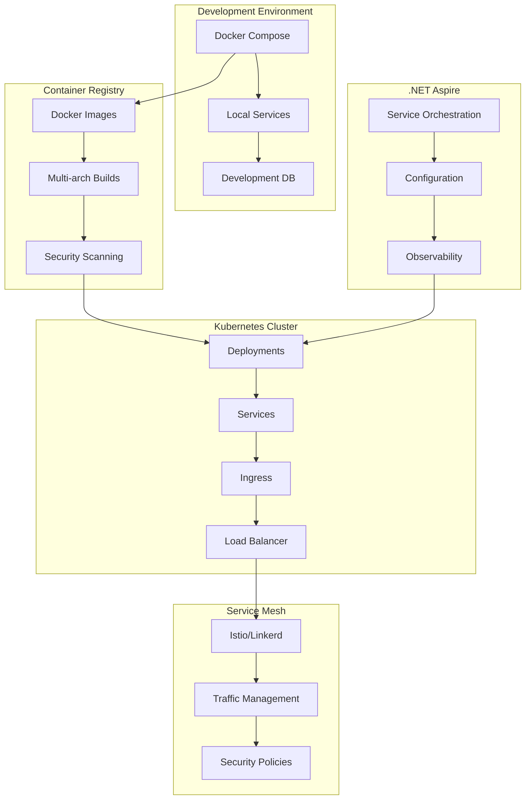

# Container Orchestration Patterns

**Description**: Comprehensive containerization and orchestration patterns demonstrating Docker containerization, Kubernetes deployment, service mesh integration, and .NET Aspire orchestration for distributed applications.

**Integration Pattern**: End-to-end container orchestration covering application packaging, service discovery, scaling, networking, and observability in containerized environments.

## Container Orchestration Architecture Overview

Modern distributed applications require sophisticated container orchestration that handles deployment, scaling, networking, and service management across multiple environments.



## 1. Docker Containerization

### Multi-stage Dockerfile for .NET Applications

```dockerfile
# Multi-stage Dockerfile for optimized .NET application containers
FROM mcr.microsoft.com/dotnet/aspnet:9.0 AS base
WORKDIR /app
EXPOSE 8080
EXPOSE 8081

# Create non-root user for security
RUN groupadd -r appuser && useradd -r -g appuser appuser
USER appuser

FROM mcr.microsoft.com/dotnet/sdk:9.0 AS build
ARG BUILD_CONFIGURATION=Release
WORKDIR /src

# Copy project files and restore dependencies
COPY ["src/WebApi/WebApi.csproj", "src/WebApi/"]
COPY ["src/Application/Application.csproj", "src/Application/"]
COPY ["src/Infrastructure/Infrastructure.csproj", "src/Infrastructure/"]
COPY ["src/Domain/Domain.csproj", "src/Domain/"]
COPY ["Directory.Packages.props", "./"]
COPY ["Directory.Build.props", "./"]

RUN dotnet restore "src/WebApi/WebApi.csproj"

# Copy source code and build
COPY . .
WORKDIR "/src/src/WebApi"
RUN dotnet build "WebApi.csproj" -c $BUILD_CONFIGURATION -o /app/build

FROM build AS publish
ARG BUILD_CONFIGURATION=Release
RUN dotnet publish "WebApi.csproj" -c $BUILD_CONFIGURATION -o /app/publish /p:UseAppHost=false

# Runtime stage
FROM base AS final
WORKDIR /app
COPY --from=publish /app/publish .

# Health check
HEALTHCHECK --interval=30s --timeout=3s --start-period=5s --retries=3 \
    CMD curl -f http://localhost:8080/health || exit 1

# Security: Run as non-root user
USER appuser

ENTRYPOINT ["dotnet", "WebApi.dll"]
```

### Docker Compose for Local Development

```yaml
# docker-compose.yml - Local development environment
version: '3.8'

services:
  webapi:
    build:
      context: .
      dockerfile: src/WebApi/Dockerfile
      target: base
    ports:
      - "5000:8080"
      - "5001:8081"
    environment:
      - ASPNETCORE_ENVIRONMENT=Development
      - ASPNETCORE_URLS=https://+:8081;http://+:8080
      - ConnectionStrings__DefaultConnection=Server=postgres;Database=DocumentProcessing;Username=dev;Password=dev123;
      - ConnectionStrings__Redis=redis:6379
      - VectorDatabase__Endpoint=http://chroma:8000
    volumes:
      - ./src:/app/src:cached
      - ./logs:/app/logs
    depends_on:
      postgres:
        condition: service_healthy
      redis:
        condition: service_healthy
      chroma:
        condition: service_started
    networks:
      - app-network
    healthcheck:
      test: ["CMD", "curl", "-f", "http://localhost:8080/health"]
      interval: 30s
      timeout: 10s
      retries: 3
      start_period: 40s

  postgres:
    image: pgvector/pgvector:pg16
    environment:
      - POSTGRES_DB=DocumentProcessing
      - POSTGRES_USER=dev
      - POSTGRES_PASSWORD=dev123
    ports:
      - "5432:5432"
    volumes:
      - postgres_data:/var/lib/postgresql/data
      - ./database/init:/docker-entrypoint-initdb.d
    networks:
      - app-network
    healthcheck:
      test: ["CMD-SHELL", "pg_isready -U dev -d DocumentProcessing"]
      interval: 10s
      timeout: 5s
      retries: 5

  redis:
    image: redis:7-alpine
    ports:
      - "6379:6379"
    volumes:
      - redis_data:/data
    networks:
      - app-network
    healthcheck:
      test: ["CMD", "redis-cli", "ping"]
      interval: 10s
      timeout: 3s
      retries: 3

  chroma:
    image: chromadb/chroma:latest
    ports:
      - "8000:8000"
    environment:
      - CHROMA_SERVER_HOST=0.0.0.0
      - CHROMA_SERVER_HTTP_PORT=8000
    volumes:
      - chroma_data:/chroma/chroma
    networks:
      - app-network

  prometheus:
    image: prom/prometheus:latest
    ports:
      - "9090:9090"
    volumes:
      - ./monitoring/prometheus.yml:/etc/prometheus/prometheus.yml
      - prometheus_data:/prometheus
    command:
      - '--config.file=/etc/prometheus/prometheus.yml'
      - '--storage.tsdb.path=/prometheus'
      - '--web.console.libraries=/etc/prometheus/console_libraries'
      - '--web.console.templates=/etc/prometheus/consoles'
    networks:
      - app-network

  grafana:
    image: grafana/grafana:latest
    ports:
      - "3000:3000"
    environment:
      - GF_SECURITY_ADMIN_PASSWORD=admin123
    volumes:
      - grafana_data:/var/lib/grafana
      - ./monitoring/grafana/dashboards:/etc/grafana/provisioning/dashboards
      - ./monitoring/grafana/datasources:/etc/grafana/provisioning/datasources
    networks:
      - app-network

volumes:
  postgres_data:
  redis_data:
  chroma_data:
  prometheus_data:
  grafana_data:

networks:
  app-network:
    driver: bridge
```

## 2. Kubernetes Deployment Manifests

### Application Deployment with ConfigMaps and Secrets

```yaml
# k8s/namespace.yaml
apiVersion: v1
kind: Namespace
metadata:
  name: document-processing
  labels:
    name: document-processing
    istio-injection: enabled

---
# k8s/configmap.yaml
apiVersion: v1
kind: ConfigMap
metadata:
  name: webapi-config
  namespace: document-processing
data:
  appsettings.json: |
    {
      "Logging": {
        "LogLevel": {
          "Default": "Information",
          "Microsoft.AspNetCore": "Warning"
        }
      },
      "OpenTelemetry": {
        "ServiceName": "DocumentProcessingAPI",
        "ServiceVersion": "1.0.0",
        "Endpoint": "http://jaeger-collector:14268/api/traces"
      },
      "HealthChecks": {
        "UI": {
          "HealthChecksPath": "/health",
          "ApiPath": "/health/api"
        }
      }
    }

---
# k8s/secret.yaml
apiVersion: v1
kind: Secret
metadata:
  name: webapi-secrets
  namespace: document-processing
type: Opaque
data:
  # Base64 encoded connection strings
  postgres-connection: U2VydmVyPXBvc3RncmVzcWwtc2VydmljZTtEYXRhYmFzZT1Eb2N1bWVudFByb2Nlc3Npbmc7VXNlcklkPWRldjtQYXNzd29yZD1kZXYxMjM=
  redis-connection: cmVkaXMtc2VydmljZTo2Mzc5
  jwt-secret: eW91ci1zdXBlci1zZWNyZXQta2V5LWZvci1qd3QtdG9rZW5z

---
# k8s/deployment.yaml
apiVersion: apps/v1
kind: Deployment
metadata:
  name: webapi-deployment
  namespace: document-processing
  labels:
    app: webapi
    version: v1
spec:
  replicas: 3
  strategy:
    type: RollingUpdate
    rollingUpdate:
      maxUnavailable: 1
      maxSurge: 1
  selector:
    matchLabels:
      app: webapi
      version: v1
  template:
    metadata:
      labels:
        app: webapi
        version: v1
      annotations:
        prometheus.io/scrape: "true"
        prometheus.io/port: "8080"
        prometheus.io/path: "/metrics"
    spec:
      serviceAccountName: webapi-service-account
      securityContext:
        runAsNonRoot: true
        runAsUser: 1000
        fsGroup: 2000
      containers:
      - name: webapi
        image: visionarycoder/document-processing-api:latest
        ports:
        - containerPort: 8080
          name: http
        - containerPort: 8081
          name: https
        env:
        - name: ASPNETCORE_ENVIRONMENT
          value: "Production"
        - name: ASPNETCORE_URLS
          value: "https://+:8081;http://+:8080"
        - name: ConnectionStrings__DefaultConnection
          valueFrom:
            secretKeyRef:
              name: webapi-secrets
              key: postgres-connection
        - name: ConnectionStrings__Redis
          valueFrom:
            secretKeyRef:
              name: webapi-secrets
              key: redis-connection
        - name: JWT__SecretKey
          valueFrom:
            secretKeyRef:
              name: webapi-secrets
              key: jwt-secret
        volumeMounts:
        - name: config-volume
          mountPath: /app/appsettings.json
          subPath: appsettings.json
        - name: temp-volume
          mountPath: /tmp
        resources:
          requests:
            memory: "256Mi"
            cpu: "250m"
          limits:
            memory: "512Mi"
            cpu: "500m"
        livenessProbe:
          httpGet:
            path: /health/live
            port: 8080
          initialDelaySeconds: 30
          periodSeconds: 10
          timeoutSeconds: 5
          failureThreshold: 3
        readinessProbe:
          httpGet:
            path: /health/ready
            port: 8080
          initialDelaySeconds: 5
          periodSeconds: 5
          timeoutSeconds: 3
          failureThreshold: 3
        startupProbe:
          httpGet:
            path: /health/startup
            port: 8080
          initialDelaySeconds: 10
          periodSeconds: 10
          timeoutSeconds: 5
          failureThreshold: 30
      volumes:
      - name: config-volume
        configMap:
          name: webapi-config
      - name: temp-volume
        emptyDir: {}
      imagePullSecrets:
      - name: registry-secret

---
# k8s/service.yaml
apiVersion: v1
kind: Service
metadata:
  name: webapi-service
  namespace: document-processing
  labels:
    app: webapi
spec:
  type: ClusterIP
  ports:
  - port: 80
    targetPort: 8080
    protocol: TCP
    name: http
  - port: 443
    targetPort: 8081
    protocol: TCP
    name: https
  selector:
    app: webapi

---
# k8s/hpa.yaml
apiVersion: autoscaling/v2
kind: HorizontalPodAutoscaler
metadata:
  name: webapi-hpa
  namespace: document-processing
spec:
  scaleTargetRef:
    apiVersion: apps/v1
    kind: Deployment
    name: webapi-deployment
  minReplicas: 3
  maxReplicas: 10
  metrics:
  - type: Resource
    resource:
      name: cpu
      target:
        type: Utilization
        averageUtilization: 70
  - type: Resource
    resource:
      name: memory
      target:
        type: Utilization
        averageUtilization: 80
  behavior:
    scaleDown:
      stabilizationWindowSeconds: 300
      policies:
      - type: Percent
        value: 10
        periodSeconds: 60
    scaleUp:
      stabilizationWindowSeconds: 60
      policies:
      - type: Percent
        value: 50
        periodSeconds: 60
      - type: Pods
        value: 2
        periodSeconds: 60

---
# k8s/ingress.yaml
apiVersion: networking.k8s.io/v1
kind: Ingress
metadata:
  name: webapi-ingress
  namespace: document-processing
  annotations:
    kubernetes.io/ingress.class: nginx
    nginx.ingress.kubernetes.io/ssl-redirect: "true"
    nginx.ingress.kubernetes.io/use-regex: "true"
    nginx.ingress.kubernetes.io/rewrite-target: /$1
    cert-manager.io/cluster-issuer: letsencrypt-prod
    nginx.ingress.kubernetes.io/rate-limit: "100"
    nginx.ingress.kubernetes.io/rate-limit-window: "1m"
spec:
  tls:
  - hosts:
    - api.documentprocessing.com
    secretName: webapi-tls
  rules:
  - host: api.documentprocessing.com
    http:
      paths:
      - path: /(.*)
        pathType: Prefix
        backend:
          service:
            name: webapi-service
            port:
              number: 80
```

## 3. .NET Aspire Orchestration

### Aspire App Host Configuration

```csharp
// AppHost/Program.cs - .NET Aspire orchestration
namespace DocumentProcessing.AppHost;

var builder = DistributedApplication.CreateBuilder(args);

// Infrastructure dependencies
var postgres = builder.AddPostgres("postgres")
    .WithImage("pgvector/pgvector", "pg16")
    .WithEnvironment("POSTGRES_DB", "DocumentProcessing")
    .AddDatabase("documentdb");

var redis = builder.AddRedis("redis")
    .WithImage("redis", "7-alpine")
    .WithPersistence();

var chroma = builder.AddContainer("chroma", "chromadb/chroma")
    .WithHttpEndpoint(port: 8000, targetPort: 8000, name: "http")
    .WithEnvironment("CHROMA_SERVER_HOST", "0.0.0.0")
    .WithEnvironment("CHROMA_SERVER_HTTP_PORT", "8000")
    .WithVolume("chroma-data", "/chroma/chroma");

// Observability stack
var prometheus = builder.AddContainer("prometheus", "prom/prometheus")
    .WithHttpEndpoint(port: 9090, targetPort: 9090, name: "http")
    .WithVolume("./monitoring/prometheus.yml", "/etc/prometheus/prometheus.yml")
    .WithArgs("--config.file=/etc/prometheus/prometheus.yml",
              "--storage.tsdb.path=/prometheus",
              "--web.console.libraries=/etc/prometheus/console_libraries",
              "--web.console.templates=/etc/prometheus/consoles");

var grafana = builder.AddContainer("grafana", "grafana/grafana")
    .WithHttpEndpoint(port: 3000, targetPort: 3000, name: "http")
    .WithEnvironment("GF_SECURITY_ADMIN_PASSWORD", "admin123")
    .WithVolume("grafana-data", "/var/lib/grafana")
    .WithVolume("./monitoring/grafana/dashboards", "/etc/grafana/provisioning/dashboards")
    .WithVolume("./monitoring/grafana/datasources", "/etc/grafana/provisioning/datasources");

var jaeger = builder.AddContainer("jaeger", "jaegertracing/all-in-one")
    .WithHttpEndpoint(port: 16686, targetPort: 16686, name: "ui")
    .WithEndpoint(port: 14268, targetPort: 14268, name: "collector")
    .WithEnvironment("COLLECTOR_OTLP_ENABLED", "true");

// Application services
var mlService = builder.AddProject<Projects.MLProcessingService>("ml-service")
    .WithReference(postgres)
    .WithReference(redis)
    .WithReference(chroma)
    .WithEnvironment("OpenTelemetry__Endpoint", jaeger.GetEndpoint("collector"));

var webApi = builder.AddProject<Projects.WebApi>("webapi")
    .WithReference(postgres)
    .WithReference(redis)
    .WithReference(chroma)
    .WithReference(mlService)
    .WithEnvironment("OpenTelemetry__Endpoint", jaeger.GetEndpoint("collector"))
    .WithExternalHttpEndpoints();

// Worker services
var documentProcessor = builder.AddProject<Projects.DocumentProcessor>("document-processor")
    .WithReference(postgres)
    .WithReference(redis)
    .WithReference(chroma)
    .WithReference(mlService)
    .WithEnvironment("OpenTelemetry__Endpoint", jaeger.GetEndpoint("collector"));

var workflowOrchestrator = builder.AddProject<Projects.WorkflowOrchestrator>("workflow-orchestrator")
    .WithReference(postgres)
    .WithReference(redis)
    .WithReference(mlService)
    .WithEnvironment("OpenTelemetry__Endpoint", jaeger.GetEndpoint("collector"));

// Build and run
var app = builder.Build();

// Configure service discovery
app.Services.ConfigureHttpClientDefaults(http =>
{
    http.AddStandardResilienceHandler();
    http.AddServiceDiscovery();
});

await app.RunAsync();
```

### Aspire Service Configuration

```csharp
// Infrastructure/AspireServiceExtensions.cs
namespace DocumentProcessing.Infrastructure;

public static class AspireServiceExtensions
{
    public static IHostApplicationBuilder AddServiceDefaults(this IHostApplicationBuilder builder)
    {
        builder.ConfigureOpenTelemetry();
        builder.AddDefaultHealthChecks();
        builder.Services.AddServiceDiscovery();
        builder.Services.ConfigureHttpClientDefaults(http =>
        {
            http.AddStandardResilienceHandler();
            http.AddServiceDiscovery();
        });

        return builder;
    }

    public static IHostApplicationBuilder ConfigureOpenTelemetry(this IHostApplicationBuilder builder)
    {
        builder.Logging.AddOpenTelemetry(logging =>
        {
            logging.IncludeFormattedMessage = true;
            logging.IncludeScopes = true;
        });

        builder.Services.AddOpenTelemetry()
            .WithMetrics(metrics =>
            {
                metrics.AddAspNetCoreInstrumentation()
                    .AddHttpClientInstrumentation()
                    .AddRuntimeInstrumentation();
            })
            .WithTracing(tracing =>
            {
                tracing.AddAspNetCoreInstrumentation()
                    .AddGrpcClientInstrumentation()
                    .AddHttpClientInstrumentation()
                    .AddEntityFrameworkCoreInstrumentation()
                    .AddRedisInstrumentation();

                if (builder.Environment.IsDevelopment())
                {
                    tracing.SetSampler(new AlwaysOnSampler());
                }
            });

        builder.AddOpenTelemetryExporters();
        return builder;
    }

    private static IHostApplicationBuilder AddOpenTelemetryExporters(this IHostApplicationBuilder builder)
    {
        var useOtlpExporter = !string.IsNullOrWhiteSpace(builder.Configuration["OTEL_EXPORTER_OTLP_ENDPOINT"]);

        if (useOtlpExporter)
        {
            builder.Services.AddOpenTelemetry().UseOtlpExporter();
        }

        // Add Prometheus metrics exporter for Aspire dashboard
        builder.Services.AddOpenTelemetry()
            .WithMetrics(metrics => metrics.AddPrometheusExporter());

        return builder;
    }

    public static IHostApplicationBuilder AddDefaultHealthChecks(this IHostApplicationBuilder builder)
    {
        builder.Services.AddHealthChecks()
            // Basic health check
            .AddCheck("self", () => HealthCheckResult.Healthy(), ["live"]);

        return builder;
    }

    public static WebApplication MapDefaultEndpoints(this WebApplication app)
    {
        // Health checks
        app.MapHealthChecks("/health");
        app.MapHealthChecks("/health/ready", new HealthCheckOptions
        {
            Predicate = check => check.Tags.Contains("ready")
        });
        app.MapHealthChecks("/health/live", new HealthCheckOptions
        {
            Predicate = _ => false
        });

        // Metrics
        app.MapPrometheusScrapingEndpoint();

        return app;
    }
}
```

## 4. Service Mesh Integration

### Istio Configuration

```yaml
# istio/virtual-service.yaml
apiVersion: networking.istio.io/v1beta1
kind: VirtualService
metadata:
  name: webapi-virtual-service
  namespace: document-processing
spec:
  hosts:
  - api.documentprocessing.com
  gateways:
  - webapi-gateway
  http:
  - match:
    - uri:
        prefix: /api/v1/
    route:
    - destination:
        host: webapi-service
        port:
          number: 80
        subset: v1
      weight: 90
    - destination:
        host: webapi-service
        port:
          number: 80
        subset: v2
      weight: 10
    fault:
      delay:
        percentage:
          value: 0.1
        fixedDelay: 5s
    retries:
      attempts: 3
      perTryTimeout: 2s
      retryOn: 5xx,reset,connect-failure,refused-stream
    timeout: 10s

---
# istio/destination-rule.yaml
apiVersion: networking.istio.io/v1beta1
kind: DestinationRule
metadata:
  name: webapi-destination-rule
  namespace: document-processing
spec:
  host: webapi-service
  trafficPolicy:
    connectionPool:
      tcp:
        maxConnections: 100
      http:
        http1MaxPendingRequests: 50
        http2MaxRequests: 100
        maxRequestsPerConnection: 10
        maxRetries: 3
        consecutiveGatewayErrors: 5
        interval: 30s
        baseEjectionTime: 30s
        maxEjectionPercent: 50
    loadBalancer:
      simple: LEAST_CONN
    outlierDetection:
      consecutiveGatewayErrors: 5
      interval: 30s
      baseEjectionTime: 30s
      maxEjectionPercent: 50
      minHealthPercent: 50
  subsets:
  - name: v1
    labels:
      version: v1
  - name: v2
    labels:
      version: v2

---
# istio/gateway.yaml
apiVersion: networking.istio.io/v1beta1
kind: Gateway
metadata:
  name: webapi-gateway
  namespace: document-processing
spec:
  selector:
    istio: ingressgateway
  servers:
  - port:
      number: 80
      name: http
      protocol: HTTP
    hosts:
    - api.documentprocessing.com
    tls:
      httpsRedirect: true
  - port:
      number: 443
      name: https
      protocol: HTTPS
    tls:
      mode: SIMPLE
      credentialName: webapi-tls
    hosts:
    - api.documentprocessing.com

---
# istio/peer-authentication.yaml
apiVersion: security.istio.io/v1beta1
kind: PeerAuthentication
metadata:
  name: default
  namespace: document-processing
spec:
  mtls:
    mode: STRICT

---
# istio/authorization-policy.yaml
apiVersion: security.istio.io/v1beta1
kind: AuthorizationPolicy
metadata:
  name: webapi-authz
  namespace: document-processing
spec:
  selector:
    matchLabels:
      app: webapi
  rules:
  - from:
    - source:
        principals: ["cluster.local/ns/document-processing/sa/webapi-service-account"]
  - to:
    - operation:
        methods: ["GET", "POST", "PUT", "DELETE"]
        paths: ["/api/*"]
  - when:
    - key: source.ip
      values: ["10.0.0.0/8", "172.16.0.0/12", "192.168.0.0/16"]
```

## 5. Container Security and Best Practices

### Security Scanning and Policies

```csharp
// Infrastructure/ContainerSecurityExtensions.cs
namespace DocumentProcessing.Infrastructure;

public static class ContainerSecurityExtensions
{
    public static IServiceCollection AddContainerSecurity(this IServiceCollection services, IConfiguration configuration)
    {
        // Add security headers middleware
        services.AddHsts(options =>
        {
            options.Preload = true;
            options.IncludeSubDomains = true;
            options.MaxAge = TimeSpan.FromDays(365);
        });

        // Add security policies
        services.AddHeaderPropagation(options =>
        {
            options.Headers.Add("X-Correlation-ID");
            options.Headers.Add("X-Request-ID");
        });

        // Container-specific security
        services.Configure<ContainerSecurityOptions>(configuration.GetSection("ContainerSecurity"));

        return services;
    }

    public static WebApplication UseContainerSecurity(this WebApplication app)
    {
        if (!app.Environment.IsDevelopment())
        {
            app.UseHsts();
        }

        app.UseHttpsRedirection();
        app.UseHeaderPropagation();

        // Security headers middleware
        app.Use(async (context, next) =>
        {
            context.Response.Headers.Append("X-Content-Type-Options", "nosniff");
            context.Response.Headers.Append("X-Frame-Options", "DENY");
            context.Response.Headers.Append("X-XSS-Protection", "1; mode=block");
            context.Response.Headers.Append("Referrer-Policy", "strict-origin-when-cross-origin");
            
            await next();
        });

        return app;
    }
}

public class ContainerSecurityOptions
{
    public bool EnableSecurityHeaders { get; set; } = true;
    public bool EnforceHttps { get; set; } = true;
    public TimeSpan HstsMaxAge { get; set; } = TimeSpan.FromDays(365);
}
```

### Resource Monitoring and Optimization

```yaml
# k8s/network-policy.yaml
apiVersion: networking.k8s.io/v1
kind: NetworkPolicy
metadata:
  name: webapi-network-policy
  namespace: document-processing
spec:
  podSelector:
    matchLabels:
      app: webapi
  policyTypes:
  - Ingress
  - Egress
  ingress:
  - from:
    - namespaceSelector:
        matchLabels:
          name: istio-system
    - namespaceSelector:
        matchLabels:
          name: document-processing
    ports:
    - protocol: TCP
      port: 8080
    - protocol: TCP
      port: 8081
  egress:
  - to:
    - namespaceSelector:
        matchLabels:
          name: document-processing
    ports:
    - protocol: TCP
      port: 5432  # PostgreSQL
    - protocol: TCP
      port: 6379  # Redis
    - protocol: TCP
      port: 8000  # ChromaDB
  - to: []
    ports:
    - protocol: TCP
      port: 53   # DNS
    - protocol: UDP
      port: 53   # DNS
    - protocol: TCP
      port: 443  # HTTPS outbound

---
# k8s/pod-disruption-budget.yaml
apiVersion: policy/v1
kind: PodDisruptionBudget
metadata:
  name: webapi-pdb
  namespace: document-processing
spec:
  minAvailable: 2
  selector:
    matchLabels:
      app: webapi

---
# k8s/service-monitor.yaml
apiVersion: monitoring.coreos.com/v1
kind: ServiceMonitor
metadata:
  name: webapi-service-monitor
  namespace: document-processing
spec:
  selector:
    matchLabels:
      app: webapi
  endpoints:
  - port: http
    path: /metrics
    interval: 30s
    scrapeTimeout: 10s
```

## Container Orchestration Pattern Selection Guide

| Pattern | Use Case | Complexity | Scalability | Observability |
|---------|----------|------------|-------------|---------------|
| Docker Compose | Local development, simple deployments | Low | Low | Basic |
| Kubernetes | Production, complex orchestration | High | Very High | Comprehensive |
| .NET Aspire | .NET applications, rapid development | Medium | High | Built-in |
| Service Mesh | Microservices, traffic management | High | Very High | Advanced |
| Serverless Containers | Event-driven, auto-scaling | Medium | Very High | Platform-managed |

---

**Key Benefits**: Scalable container orchestration, comprehensive service management, robust networking, integrated observability, security-first approach

**When to Use**: Microservices architectures, cloud-native applications, distributed systems, high-availability requirements

**Performance**: Optimized resource utilization, auto-scaling capabilities, efficient networking, comprehensive monitoring