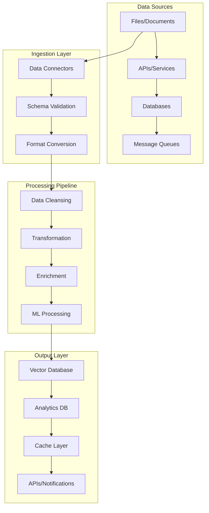

# Data Flow Patterns

**Description**: Comprehensive data transformation and pipeline patterns demonstrating ETL processes, stream processing, data validation, format conversion, and real-time data pipelines for ML workflows.

**Integration Pattern**: End-to-end data flow orchestration covering batch processing, streaming analytics, data quality management, and integration with ML.NET processing pipelines.

## Data Flow Architecture Overview

Modern data-driven applications require sophisticated data flow patterns that handle various data sources, transformations, and destinations while maintaining data quality and performance.



## 1. ETL Pipeline with Orleans Grains

### Data Ingestion Service

```csharp
namespace DataFlow.Ingestion;

using Orleans;
using Microsoft.Extensions.Logging;

[GenerateSerializer]
public record DataIngestionRequest
{
    public string SourceId { get; init; } = "";
    public string DataType { get; init; } = "";
    public Dictionary<string, object> Metadata { get; init; } = new();
    public byte[] Data { get; init; } = Array.Empty<byte>();
}

[GenerateSerializer]
public record DataIngestionResult
{
    public string IngestionId { get; init; } = "";
    public bool Success { get; init; }
    public string[] ValidationErrors { get; init; } = Array.Empty<string>();
    public Dictionary<string, object> ProcessingMetrics { get; init; } = new();
}

public interface IDataIngestionGrain : IGrainWithStringKey
{
    Task<DataIngestionResult> IngestDataAsync(DataIngestionRequest request);
    Task<DataIngestionStatus> GetIngestionStatusAsync();
    Task<DataQualityReport> GetDataQualityReportAsync();
}

public class DataIngestionGrain : Grain, IDataIngestionGrain
{
    private readonly IDataValidator dataValidator;
    private readonly ISchemaRegistry schemaRegistry;
    private readonly IDataTransformer dataTransformer;
    private readonly ILogger<DataIngestionGrain> logger;
    
    private DataIngestionStatus currentStatus = DataIngestionStatus.Idle;
    private List<DataQualityIssue> qualityIssues = new();

    public DataIngestionGrain(
        IDataValidator dataValidator,
        ISchemaRegistry schemaRegistry,
        IDataTransformer dataTransformer,
        ILogger<DataIngestionGrain> logger)
    {
        this.dataValidator = dataValidator;
        this.schemaRegistry = schemaRegistry;
        this.dataTransformer = dataTransformer;
        this.logger = logger;
    }

    public async Task<DataIngestionResult> IngestDataAsync(DataIngestionRequest request)
    {
        var ingestionId = Guid.NewGuid().ToString();
        currentStatus = DataIngestionStatus.Processing;
        
        using var activity = Activity.Current?.Source.StartActivity("IngestData");
        activity?.SetTag("ingestion.id", ingestionId);
        activity?.SetTag("data.type", request.DataType);

        logger.LogInformation("Starting data ingestion {IngestionId} for type {DataType}", 
            ingestionId, request.DataType);

        try
        {
            // Step 1: Schema validation
            var schema = await schemaRegistry.GetSchemaAsync(request.DataType);
            var validationResult = await dataValidator.ValidateAsync(request.Data, schema);
            
            if (!validationResult.IsValid)
            {
                qualityIssues.AddRange(validationResult.Issues);
                logger.LogWarning("Data validation failed for ingestion {IngestionId}: {Errors}", 
                    ingestionId, string.Join(", ", validationResult.Errors));
                
                currentStatus = DataIngestionStatus.Failed;
                return new DataIngestionResult
                {
                    IngestionId = ingestionId,
                    Success = false,
                    ValidationErrors = validationResult.Errors
                };
            }

            // Step 2: Data transformation
            var transformedData = await dataTransformer.TransformAsync(request.Data, request.DataType);
            
            // Step 3: Quality assessment
            var qualityReport = await dataValidator.AssessQualityAsync(transformedData);
            qualityIssues.AddRange(qualityReport.Issues);

            // Step 4: Store processed data
            var storageGrain = GrainFactory.GetGrain<IDataStorageGrain>(ingestionId);
            await storageGrain.StoreDataAsync(new DataStorageRequest
            {
                Data = transformedData,
                Metadata = request.Metadata,
                QualityScore = qualityReport.OverallScore
            });

            // Step 5: Trigger downstream processing
            var processingGrain = GrainFactory.GetGrain<IDataProcessingGrain>(ingestionId);
            var processingTask = processingGrain.StartProcessingAsync(transformedData);

            currentStatus = DataIngestionStatus.Completed;
            
            logger.LogInformation("Data ingestion {IngestionId} completed successfully", ingestionId);

            return new DataIngestionResult
            {
                IngestionId = ingestionId,
                Success = true,
                ProcessingMetrics = new Dictionary<string, object>
                {
                    ["QualityScore"] = qualityReport.OverallScore,
                    ["ProcessingTime"] = DateTime.UtcNow,
                    ["DataSize"] = transformedData.Length
                }
            };
        }
        catch (Exception ex)
        {
            logger.LogError(ex, "Data ingestion {IngestionId} failed", ingestionId);
            currentStatus = DataIngestionStatus.Failed;
            throw;
        }
    }

    public Task<DataIngestionStatus> GetIngestionStatusAsync()
    {
        return Task.FromResult(currentStatus);
    }

    public Task<DataQualityReport> GetDataQualityReportAsync()
    {
        return Task.FromResult(new DataQualityReport
        {
            Issues = qualityIssues.ToArray(),
            TotalIssues = qualityIssues.Count,
            CriticalIssues = qualityIssues.Count(i => i.Severity == DataQualitySeverity.Critical),
            GeneratedAt = DateTime.UtcNow
        });
    }
}
```

### Stream Processing with System.Threading.Channels

```csharp
namespace DataFlow.Streaming;

using System.Threading.Channels;
using System.Text.Json;

public class StreamProcessingPipeline<TInput, TOutput>
{
    private readonly Channel<TInput> inputChannel;
    private readonly Channel<TOutput> outputChannel;
    private readonly ILogger<StreamProcessingPipeline<TInput, TOutput>> logger;
    private readonly CancellationTokenSource cancellationTokenSource = new();
    
    private readonly Func<TInput, ValueTask<TOutput>> transformFunction;
    private readonly StreamProcessingOptions options;

    public StreamProcessingPipeline(
        Func<TInput, ValueTask<TOutput>> transformFunction,
        StreamProcessingOptions? options = null,
        ILogger<StreamProcessingPipeline<TInput, TOutput>>? logger = null)
    {
        this.transformFunction = transformFunction;
        this.options = options ?? new StreamProcessingOptions();
        this.logger = logger ?? NullLogger<StreamProcessingPipeline<TInput, TOutput>>.Instance;

        var channelOptions = new BoundedChannelOptions(this.options.ChannelCapacity)
        {
            FullMode = BoundedChannelFullMode.Wait,
            SingleReader = false,
            SingleWriter = false
        };

        inputChannel = Channel.CreateBounded<TInput>(channelOptions);
        outputChannel = Channel.CreateBounded<TOutput>(channelOptions);
    }

    public ChannelWriter<TInput> InputWriter => inputChannel.Writer;
    public ChannelReader<TOutput> OutputReader => outputChannel.Reader;

    public async Task StartProcessingAsync(CancellationToken cancellationToken = default)
    {
        var combinedToken = CancellationTokenSource
            .CreateLinkedTokenSource(cancellationToken, cancellationTokenSource.Token).Token;

        logger.LogInformation("Starting stream processing pipeline with {ConcurrencyLevel} workers", 
            options.ConcurrencyLevel);

        // Start multiple processing tasks for parallel processing
        var processingTasks = Enumerable.Range(0, options.ConcurrencyLevel)
            .Select(i => ProcessItemsAsync(i, combinedToken))
            .ToArray();

        try
        {
            await Task.WhenAll(processingTasks);
        }
        catch (OperationCanceledException) when (combinedToken.IsCancellationRequested)
        {
            logger.LogInformation("Stream processing pipeline cancelled");
        }
        finally
        {
            outputChannel.Writer.Complete();
        }
    }

    private async Task ProcessItemsAsync(int workerId, CancellationToken cancellationToken)
    {
        logger.LogDebug("Worker {WorkerId} started processing", workerId);

        await foreach (var item in inputChannel.Reader.ReadAllAsync(cancellationToken))
        {
            try
            {
                using var activity = Activity.Current?.Source.StartActivity("ProcessStreamItem");
                activity?.SetTag("worker.id", workerId);
                activity?.SetTag("item.type", typeof(TInput).Name);

                var result = await transformFunction(item);
                await outputChannel.Writer.WriteAsync(result, cancellationToken);

                logger.LogDebug("Worker {WorkerId} processed item successfully", workerId);
            }
            catch (Exception ex)
            {
                logger.LogError(ex, "Worker {WorkerId} failed to process item", workerId);
                
                if (options.StopOnError)
                {
                    throw;
                }
                // Continue processing other items if StopOnError is false
            }
        }

        logger.LogDebug("Worker {WorkerId} completed processing", workerId);
    }

    public async Task StopAsync()
    {
        inputChannel.Writer.Complete();
        cancellationTokenSource.Cancel();
        
        // Wait for all items to be processed
        while (await outputChannel.Reader.WaitToReadAsync())
        {
            await Task.Delay(100);
        }
    }

    public void Dispose()
    {
        cancellationTokenSource?.Dispose();
    }
}

public class StreamProcessingOptions
{
    public int ChannelCapacity { get; init; } = 1000;
    public int ConcurrencyLevel { get; init; } = Environment.ProcessorCount;
    public bool StopOnError { get; init; } = false;
}
```

### Data Transformation Pipeline

```csharp
namespace DataFlow.Transformation;

public interface IDataTransformationPipeline
{
    Task<TransformationResult> ExecuteAsync(TransformationRequest request);
    IAsyncEnumerable<TransformationStep> ExecuteWithProgressAsync(TransformationRequest request);
}

public class DataTransformationPipeline : IDataTransformationPipeline
{
    private readonly IServiceProvider serviceProvider;
    private readonly ILogger<DataTransformationPipeline> logger;
    private readonly ITransformationStepFactory stepFactory;

    public DataTransformationPipeline(
        IServiceProvider serviceProvider,
        ILogger<DataTransformationPipeline> logger,
        ITransformationStepFactory stepFactory)
    {
        this.serviceProvider = serviceProvider;
        this.logger = logger;
        this.stepFactory = stepFactory;
    }

    public async Task<TransformationResult> ExecuteAsync(TransformationRequest request)
    {
        using var activity = Activity.Current?.Source.StartActivity("ExecuteTransformation");
        activity?.SetTag("pipeline.id", request.PipelineId);

        logger.LogInformation("Starting transformation pipeline {PipelineId}", request.PipelineId);

        var context = new TransformationContext
        {
            Data = request.InputData,
            Metadata = request.Metadata,
            PipelineId = request.PipelineId
        };

        try
        {
            foreach (var stepConfig in request.TransformationSteps)
            {
                var step = stepFactory.CreateStep(stepConfig.Type, stepConfig.Configuration);
                context = await step.ExecuteAsync(context);
                
                logger.LogDebug("Completed transformation step {StepType} in pipeline {PipelineId}", 
                    stepConfig.Type, request.PipelineId);
            }

            return new TransformationResult
            {
                Success = true,
                OutputData = context.Data,
                Metadata = context.Metadata,
                ProcessingStatistics = context.Statistics
            };
        }
        catch (Exception ex)
        {
            logger.LogError(ex, "Transformation pipeline {PipelineId} failed", request.PipelineId);
            return new TransformationResult
            {
                Success = false,
                Error = ex.Message,
                ProcessingStatistics = context.Statistics
            };
        }
    }

    public async IAsyncEnumerable<TransformationStep> ExecuteWithProgressAsync(
        TransformationRequest request,
        [EnumeratorCancellation] CancellationToken cancellationToken = default)
    {
        var context = new TransformationContext
        {
            Data = request.InputData,
            Metadata = request.Metadata,
            PipelineId = request.PipelineId
        };

        for (int i = 0; i < request.TransformationSteps.Count; i++)
        {
            var stepConfig = request.TransformationSteps[i];
            var step = stepFactory.CreateStep(stepConfig.Type, stepConfig.Configuration);
            
            var stepResult = new TransformationStep
            {
                StepIndex = i,
                StepType = stepConfig.Type,
                Status = TransformationStepStatus.Running,
                StartedAt = DateTime.UtcNow
            };

            yield return stepResult;

            try
            {
                context = await step.ExecuteAsync(context);
                
                stepResult.Status = TransformationStepStatus.Completed;
                stepResult.CompletedAt = DateTime.UtcNow;
                stepResult.OutputSize = context.Data?.Length ?? 0;
            }
            catch (Exception ex)
            {
                stepResult.Status = TransformationStepStatus.Failed;
                stepResult.Error = ex.Message;
                stepResult.CompletedAt = DateTime.UtcNow;
            }

            yield return stepResult;

            if (stepResult.Status == TransformationStepStatus.Failed)
            {
                break;
            }
        }
    }
}

// Specific transformation steps
public class JsonToObjectTransformationStep : ITransformationStep
{
    private readonly JsonSerializerOptions jsonOptions;
    private readonly ILogger<JsonToObjectTransformationStep> logger;

    public JsonToObjectTransformationStep(
        JsonSerializerOptions jsonOptions,
        ILogger<JsonToObjectTransformationStep> logger)
    {
        this.jsonOptions = jsonOptions;
        this.logger = logger;
    }

    public async Task<TransformationContext> ExecuteAsync(TransformationContext context)
    {
        logger.LogDebug("Executing JSON to object transformation");

        if (context.Data == null)
        {
            throw new ArgumentException("No data to transform");
        }

        var json = Encoding.UTF8.GetString(context.Data);
        var document = JsonDocument.Parse(json);

        // Transform JSON to structured object
        var transformedObject = ExtractStructuredData(document);

        context.Data = JsonSerializer.SerializeToUtf8Bytes(transformedObject, jsonOptions);
        context.Metadata["TransformationType"] = "JsonToObject";
        context.Metadata["TransformedAt"] = DateTime.UtcNow;

        context.Statistics.RecordStep("JsonToObject", context.Data.Length);

        return context;
    }

    private object ExtractStructuredData(JsonDocument document)
    {
        // Implementation depends on specific JSON structure
        return new
        {
            Id = document.RootElement.GetProperty("id").GetString(),
            Title = document.RootElement.GetProperty("title").GetString(),
            Content = document.RootElement.GetProperty("content").GetString(),
            Metadata = ExtractMetadata(document.RootElement)
        };
    }

    private Dictionary<string, object> ExtractMetadata(JsonElement element)
    {
        var metadata = new Dictionary<string, object>();
        
        if (element.TryGetProperty("metadata", out var metadataElement))
        {
            foreach (var property in metadataElement.EnumerateObject())
            {
                metadata[property.Name] = property.Value.ValueKind switch
                {
                    JsonValueKind.String => property.Value.GetString()!,
                    JsonValueKind.Number => property.Value.GetDouble(),
                    JsonValueKind.True => true,
                    JsonValueKind.False => false,
                    _ => property.Value.ToString()
                };
            }
        }

        return metadata;
    }
}

public class MLFeatureExtractionStep : ITransformationStep
{
    private readonly MLContext mlContext;
    private readonly IModel featureExtractionModel;
    private readonly ILogger<MLFeatureExtractionStep> logger;

    public MLFeatureExtractionStep(
        MLContext mlContext,
        IModel featureExtractionModel,
        ILogger<MLFeatureExtractionStep> logger)
    {
        this.mlContext = mlContext;
        this.featureExtractionModel = featureExtractionModel;
        this.logger = logger;
    }

    public async Task<TransformationContext> ExecuteAsync(TransformationContext context)
    {
        logger.LogDebug("Executing ML feature extraction");

        // Deserialize input data
        var input = JsonSerializer.Deserialize<DocumentData>(context.Data!);
        
        // Create ML.NET data view
        var data = mlContext.Data.LoadFromEnumerable(new[] { input });
        
        // Apply feature extraction
        var transformedData = featureExtractionModel.Transform(data);
        
        // Extract features
        var features = mlContext.Data.CreateEnumerable<DocumentFeatures>(transformedData, false).First();
        
        // Serialize back to bytes
        context.Data = JsonSerializer.SerializeToUtf8Bytes(features);
        context.Metadata["FeatureExtractionModel"] = featureExtractionModel.GetType().Name;
        context.Metadata["ExtractedAt"] = DateTime.UtcNow;

        context.Statistics.RecordStep("MLFeatureExtraction", context.Data.Length);

        return context;
    }
}
```

## 2. Real-time Data Streaming

### Event-Driven Data Pipeline

```csharp
namespace DataFlow.Realtime;

using System.Reactive.Linq;
using System.Reactive.Subjects;

public class RealTimeDataProcessor
{
    private readonly Subject<DataEvent> dataStream = new();
    private readonly ILogger<RealTimeDataProcessor> logger;
    private readonly IServiceProvider serviceProvider;

    public RealTimeDataProcessor(ILogger<RealTimeDataProcessor> logger, IServiceProvider serviceProvider)
    {
        this.logger = logger;
        this.serviceProvider = serviceProvider;
        SetupProcessingPipeline();
    }

    public IObservable<DataEvent> DataStream => dataStream.AsObservable();

    public void PublishData(DataEvent dataEvent)
    {
        logger.LogDebug("Publishing data event {EventId} of type {EventType}", 
            dataEvent.EventId, dataEvent.EventType);
        dataStream.OnNext(dataEvent);
    }

    private void SetupProcessingPipeline()
    {
        // Buffer events and process in batches
        DataStream
            .Buffer(TimeSpan.FromSeconds(5), 100) // Buffer for 5 seconds or 100 items
            .Where(batch => batch.Any())
            .Subscribe(async batch =>
            {
                using var scope = serviceProvider.CreateScope();
                var batchProcessor = scope.ServiceProvider.GetRequiredService<IBatchProcessor>();
                
                logger.LogInformation("Processing batch of {Count} events", batch.Count);
                await batchProcessor.ProcessBatchAsync(batch);
            });

        // Real-time processing for critical events
        DataStream
            .Where(e => e.Priority == EventPriority.Critical)
            .Subscribe(async criticalEvent =>
            {
                using var scope = serviceProvider.CreateScope();
                var realTimeProcessor = scope.ServiceProvider.GetRequiredService<IRealTimeProcessor>();
                
                logger.LogWarning("Processing critical event {EventId}", criticalEvent.EventId);
                await realTimeProcessor.ProcessCriticalEventAsync(criticalEvent);
            });

        // Windowed analytics
        DataStream
            .Window(TimeSpan.FromMinutes(1))
            .SelectMany(window => window.Count())
            .Subscribe(count =>
            {
                logger.LogInformation("Processed {Count} events in the last minute", count);
            });
    }
}

public interface IBatchProcessor
{
    Task ProcessBatchAsync(IList<DataEvent> events);
}

public class DocumentBatchProcessor : IBatchProcessor
{
    private readonly IDocumentProcessor documentProcessor;
    private readonly IVectorDatabase vectorDatabase;
    private readonly ILogger<DocumentBatchProcessor> logger;

    public DocumentBatchProcessor(
        IDocumentProcessor documentProcessor,
        IVectorDatabase vectorDatabase,
        ILogger<DocumentBatchProcessor> logger)
    {
        this.documentProcessor = documentProcessor;
        this.vectorDatabase = vectorDatabase;
        this.logger = logger;
    }

    public async Task ProcessBatchAsync(IList<DataEvent> events)
    {
        var documentEvents = events
            .Where(e => e.EventType == "DocumentProcessed")
            .ToList();

        if (!documentEvents.Any()) return;

        logger.LogInformation("Processing batch of {Count} document events", documentEvents.Count);

        // Process documents in parallel
        var processingTasks = documentEvents.Select(async @event =>
        {
            try
            {
                var document = JsonSerializer.Deserialize<ProcessedDocument>(@event.Data);
                await vectorDatabase.StoreDocumentVectorAsync(document!.Id, document.Vector);
                
                logger.LogDebug("Stored vector for document {DocumentId}", document.Id);
            }
            catch (Exception ex)
            {
                logger.LogError(ex, "Failed to process document event {EventId}", @event.EventId);
            }
        });

        await Task.WhenAll(processingTasks);
        logger.LogInformation("Completed batch processing of {Count} documents", documentEvents.Count);
    }
}
```

### Data Quality Monitoring

```csharp
namespace DataFlow.Quality;

public class DataQualityMonitor
{
    private readonly IMetrics metrics;
    private readonly ILogger<DataQualityMonitor> logger;
    private readonly DataQualityThresholds thresholds;

    public DataQualityMonitor(
        IMetrics metrics,
        ILogger<DataQualityMonitor> logger,
        IOptions<DataQualityThresholds> thresholds)
    {
        this.metrics = metrics;
        this.logger = logger;
        this.thresholds = thresholds.Value;
    }

    public async Task<DataQualityReport> AssessDataQualityAsync(
        IEnumerable<DataRecord> records,
        CancellationToken cancellationToken = default)
    {
        var report = new DataQualityReport
        {
            AssessmentId = Guid.NewGuid().ToString(),
            StartTime = DateTime.UtcNow
        };

        var recordList = records.ToList();
        report.TotalRecords = recordList.Count;

        // Completeness check
        var completenessScore = CalculateCompletenessScore(recordList);
        report.CompletenessScore = completenessScore;

        // Validity check
        var validityScore = await CalculateValidityScoreAsync(recordList, cancellationToken);
        report.ValidityScore = validityScore;

        // Consistency check
        var consistencyScore = CalculateConsistencyScore(recordList);
        report.ConsistencyScore = consistencyScore;

        // Overall quality score
        report.OverallQualityScore = (completenessScore + validityScore + consistencyScore) / 3;

        // Check thresholds and generate alerts
        await CheckQualityThresholdsAsync(report);

        report.EndTime = DateTime.UtcNow;
        report.AssessmentDuration = report.EndTime - report.StartTime;

        // Record metrics
        RecordQualityMetrics(report);

        return report;
    }

    private double CalculateCompletenessScore(IList<DataRecord> records)
    {
        if (!records.Any()) return 0;

        var totalFields = 0;
        var completeFields = 0;

        foreach (var record in records)
        {
            var requiredFields = GetRequiredFields(record.RecordType);
            totalFields += requiredFields.Count;
            
            foreach (var field in requiredFields)
            {
                if (HasValidValue(record, field))
                {
                    completeFields++;
                }
            }
        }

        return totalFields > 0 ? (double)completeFields / totalFields : 0;
    }

    private async Task<double> CalculateValidityScoreAsync(
        IList<DataRecord> records, 
        CancellationToken cancellationToken)
    {
        if (!records.Any()) return 0;

        var validationTasks = records.Select(async record =>
        {
            var validationResult = await ValidateRecordAsync(record, cancellationToken);
            return validationResult.IsValid ? 1 : 0;
        });

        var results = await Task.WhenAll(validationTasks);
        return (double)results.Sum() / results.Length;
    }

    private double CalculateConsistencyScore(IList<DataRecord> records)
    {
        // Check for duplicate records
        var uniqueRecords = records.Distinct(new DataRecordEqualityComparer()).Count();
        var duplicateScore = (double)uniqueRecords / records.Count;

        // Check format consistency
        var formatConsistencyScore = CheckFormatConsistency(records);

        return (duplicateScore + formatConsistencyScore) / 2;
    }

    private async Task CheckQualityThresholdsAsync(DataQualityReport report)
    {
        var alerts = new List<DataQualityAlert>();

        if (report.OverallQualityScore < thresholds.MinimumQualityScore)
        {
            alerts.Add(new DataQualityAlert
            {
                Severity = AlertSeverity.Critical,
                Message = $"Overall quality score {report.OverallQualityScore:P2} below threshold {thresholds.MinimumQualityScore:P2}",
                MetricName = "OverallQuality"
            });
        }

        if (report.CompletenessScore < thresholds.MinimumCompletenessScore)
        {
            alerts.Add(new DataQualityAlert
            {
                Severity = AlertSeverity.Warning,
                Message = $"Completeness score {report.CompletenessScore:P2} below threshold {thresholds.MinimumCompletenessScore:P2}",
                MetricName = "Completeness"
            });
        }

        report.Alerts = alerts.ToArray();

        // Send alerts if any
        if (alerts.Any())
        {
            logger.LogWarning("Data quality issues detected: {AlertCount} alerts generated", alerts.Count);
            // Send notifications to monitoring systems
        }
    }

    private void RecordQualityMetrics(DataQualityReport report)
    {
        metrics.Counter("data_quality_assessments_total").WithTag("status", "completed").Increment();
        metrics.Gauge("data_quality_score_overall").Set(report.OverallQualityScore);
        metrics.Gauge("data_quality_score_completeness").Set(report.CompletenessScore);
        metrics.Gauge("data_quality_score_validity").Set(report.ValidityScore);
        metrics.Gauge("data_quality_score_consistency").Set(report.ConsistencyScore);
        metrics.Histogram("data_quality_assessment_duration").Record(report.AssessmentDuration.TotalMilliseconds);
    }
}
```

## Data Flow Pattern Selection Guide

| Pattern | Use Case | Throughput | Latency | Complexity |
|---------|----------|------------|---------|------------|
| ETL Pipeline | Batch processing, data warehousing | High | High | Medium |
| Stream Processing | Real-time analytics, event processing | Very High | Low | High |
| Micro-batching | Near real-time, resource optimization | High | Medium | Medium |
| Event-driven | Reactive systems, loose coupling | Medium | Low | Low |
| Data Lake | Raw data storage, exploratory analysis | Very High | High | Medium |

---

**Key Benefits**: Scalable data processing, real-time capabilities, comprehensive quality monitoring, flexible transformation pipelines

**When to Use**: Data-intensive applications, ML pipelines, analytics platforms, IoT systems

**Performance**: Optimized for high throughput, parallel processing, efficient resource utilization
