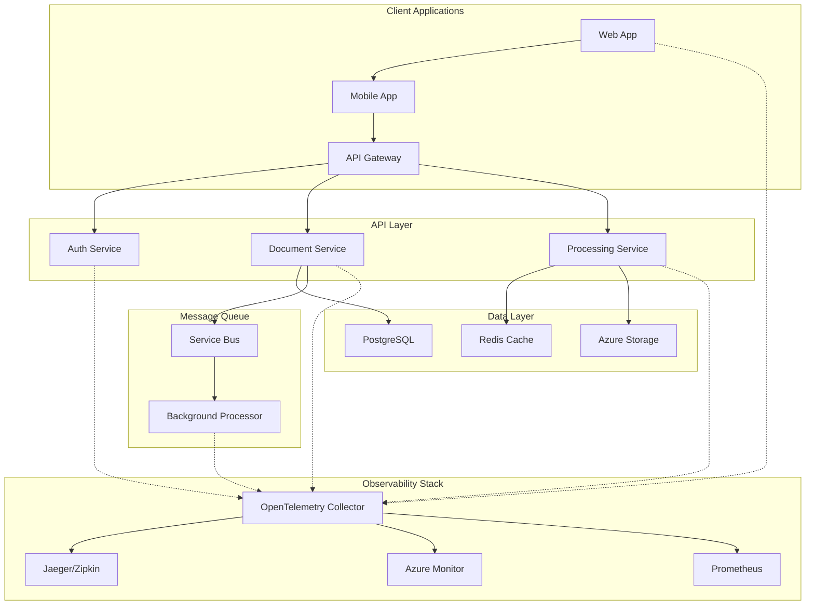

# Distributed Tracing and Observability

**Description**: Comprehensive distributed tracing patterns using OpenTelemetry for end-to-end observability across microservices, including trace correlation, performance monitoring, and debugging capabilities.

**Integration Pattern**: Cross-cutting observability infrastructure that provides visibility into distributed system behavior with automated trace collection and correlation.

## Distributed Tracing Architecture

Modern distributed systems require sophisticated observability to understand request flows, identify bottlenecks, and diagnose issues across multiple services.



## 1. OpenTelemetry Configuration

### Core Tracing Setup

```csharp
// src/Shared/Observability/TracingConfiguration.cs
using System.Diagnostics;
using System.Reflection;
using OpenTelemetry;
using OpenTelemetry.Exporter;
using OpenTelemetry.Resources;
using OpenTelemetry.Trace;

namespace DocumentProcessing.Shared.Observability;

public static class TracingConfiguration
{
    public static readonly ActivitySource ActivitySource = new(ServiceConstants.ServiceName);
    
    public static void AddDistributedTracing(this IServiceCollection services, IConfiguration configuration)
    {
        var tracingOptions = configuration.GetSection("Tracing").Get<TracingOptions>() ?? new TracingOptions();
        
        services.Configure<TracingOptions>(configuration.GetSection("Tracing"));
        
        services.AddOpenTelemetry()
            .ConfigureResource(resource => resource
                .AddService(ServiceConstants.ServiceName, ServiceConstants.ServiceVersion)
                .AddAttributes(new Dictionary<string, object>
                {
                    ["deployment.environment"] = Environment.GetEnvironmentVariable("ASPNETCORE_ENVIRONMENT") ?? "Development",
                    ["service.instance.id"] = Environment.MachineName,
                    ["service.namespace"] = ServiceConstants.ServiceNamespace
                }))
            .WithTracing(tracing => tracing
                .AddAspNetCoreInstrumentation(options =>
                {
                    options.RecordException = true;
                    options.EnableGrpcAspNetCoreSupport = true;
                    options.Filter = httpContext => ShouldTraceRequest(httpContext);
                    options.EnrichWithHttpRequest = EnrichWithHttpRequestData;
                    options.EnrichWithHttpResponse = EnrichWithHttpResponseData;
                })
                .AddHttpClientInstrumentation(options =>
                {
                    options.RecordException = true;
                    options.FilterHttpRequestMessage = request => ShouldTraceHttpClient(request);
                    options.EnrichWithHttpRequestMessage = EnrichHttpClientRequest;
                    options.EnrichWithHttpResponseMessage = EnrichHttpClientResponse;
                })
                .AddEntityFrameworkCoreInstrumentation(options =>
                {
                    options.SetDbStatementForText = true;
                    options.SetDbStatementForStoredProcedure = true;
                    options.EnrichWithIDbCommand = EnrichDatabaseCommand;
                })
                .AddRedisInstrumentation(connectionMultiplexer =>
                {
                    connectionMultiplexer.IncludeDetailedDiagnostics = true;
                })
                .AddSource(ActivitySource.Name)
                .AddSource("DocumentProcessing.*")
                .SetSampler(CreateSampler(tracingOptions))
                .ConfigureExporters(tracingOptions));
    }
    
    private static void ConfigureExporters(this TracerProviderBuilder tracing, TracingOptions options)
    {
        if (options.EnableConsoleExporter)
        {
            tracing.AddConsoleExporter();
        }
        
        if (options.EnableJaegerExporter && !string.IsNullOrEmpty(options.JaegerEndpoint))
        {
            tracing.AddJaegerExporter(jaeger =>
            {
                jaeger.Endpoint = new Uri(options.JaegerEndpoint);
                jaeger.Protocol = JaegerExportProtocol.HttpBinaryThrift;
            });
        }
        
        if (options.EnableOtlpExporter && !string.IsNullOrEmpty(options.OtlpEndpoint))
        {
            tracing.AddOtlpExporter(otlp =>
            {
                otlp.Endpoint = new Uri(options.OtlpEndpoint);
                otlp.Protocol = OtlpExportProtocol.Grpc;
                otlp.Headers = options.OtlpHeaders;
            });
        }
        
        if (options.EnableAzureMonitorExporter && !string.IsNullOrEmpty(options.ApplicationInsightsConnectionString))
        {
            tracing.AddAzureMonitorTraceExporter(azure =>
            {
                azure.ConnectionString = options.ApplicationInsightsConnectionString;
            });
        }
    }
    
    private static Sampler CreateSampler(TracingOptions options)
    {
        return options.SamplingStrategy?.ToLowerInvariant() switch
        {
            "always_on" => new AlwaysOnSampler(),
            "always_off" => new AlwaysOffSampler(),
            "trace_id_ratio" => new TraceIdRatioBasedSampler(options.SamplingRatio),
            "parent_based" => new ParentBasedSampler(new TraceIdRatioBasedSampler(options.SamplingRatio)),
            _ => new ParentBasedSampler(new TraceIdRatioBasedSampler(0.1)) // Default 10% sampling
        };
    }
    
    private static bool ShouldTraceRequest(HttpContext httpContext)
    {
        var path = httpContext.Request.Path.Value?.ToLowerInvariant();
        
        // Skip health checks and metrics endpoints
        return path is not ("/health" or "/metrics" or "/favicon.ico");
    }
    
    private static bool ShouldTraceHttpClient(HttpRequestMessage request)
    {
        var uri = request.RequestUri?.ToString().ToLowerInvariant();
        
        // Skip internal monitoring calls
        return !uri?.Contains("/health") == true && !uri?.Contains("/metrics") == true;
    }
    
    private static void EnrichWithHttpRequestData(Activity activity, HttpRequest request)
    {
        activity.SetTag("http.user_agent", request.Headers.UserAgent.ToString());
        activity.SetTag("http.client_ip", GetClientIpAddress(request));
        
        if (request.Headers.TryGetValue("X-Correlation-Id", out var correlationId))
        {
            activity.SetTag("correlation.id", correlationId.ToString());
        }
        
        // Add custom business context
        if (request.Headers.TryGetValue("X-Tenant-Id", out var tenantId))
        {
            activity.SetTag("tenant.id", tenantId.ToString());
        }
    }
    
    private static void EnrichWithHttpResponseData(Activity activity, HttpResponse response)
    {
        if (response.Headers.TryGetValue("X-Request-Id", out var requestId))
        {
            activity.SetTag("request.id", requestId.ToString());
        }
    }
    
    private static void EnrichHttpClientRequest(Activity activity, HttpRequestMessage request)
    {
        activity.SetTag("http.client.method", request.Method.ToString());
        activity.SetTag("http.client.url", request.RequestUri?.ToString());
    }
    
    private static void EnrichHttpClientResponse(Activity activity, HttpResponseMessage response)
    {
        activity.SetTag("http.client.status_code", (int)response.StatusCode);
        activity.SetTag("http.client.response_size", response.Content.Headers.ContentLength);
    }
    
    private static void EnrichDatabaseCommand(Activity activity, IDbCommand command)
    {
        activity.SetTag("db.operation", GetDatabaseOperation(command.CommandText));
        activity.SetTag("db.row_count", GetAffectedRowCount(command));
    }
    
    private static string GetClientIpAddress(HttpRequest request)
    {
        return request.Headers["X-Forwarded-For"].FirstOrDefault() ??
               request.Headers["X-Real-IP"].FirstOrDefault() ??
               request.HttpContext.Connection.RemoteIpAddress?.ToString() ??
               "unknown";
    }
    
    private static string GetDatabaseOperation(string commandText)
    {
        var text = commandText.TrimStart().ToUpperInvariant();
        return text switch
        {
            var t when t.StartsWith("SELECT") => "SELECT",
            var t when t.StartsWith("INSERT") => "INSERT",
            var t when t.StartsWith("UPDATE") => "UPDATE",
            var t when t.StartsWith("DELETE") => "DELETE",
            var t when t.StartsWith("CREATE") => "CREATE",
            var t when t.StartsWith("ALTER") => "ALTER",
            var t when t.StartsWith("DROP") => "DROP",
            _ => "OTHER"
        };
    }
    
    private static int GetAffectedRowCount(IDbCommand command)
    {
        // This would need to be implemented based on the specific database provider
        return -1;
    }
}

public class TracingOptions
{
    public bool EnableConsoleExporter { get; set; } = false;
    public bool EnableJaegerExporter { get; set; } = false;
    public bool EnableOtlpExporter { get; set; } = false;
    public bool EnableAzureMonitorExporter { get; set; } = true;
    
    public string? JaegerEndpoint { get; set; }
    public string? OtlpEndpoint { get; set; }
    public string? ApplicationInsightsConnectionString { get; set; }
    public string? OtlpHeaders { get; set; }
    
    public string SamplingStrategy { get; set; } = "parent_based";
    public double SamplingRatio { get; set; } = 0.1;
}

public static class ServiceConstants
{
    public const string ServiceName = "DocumentProcessing.API";
    public const string ServiceVersion = "1.0.0";
    public const string ServiceNamespace = "DocumentProcessing";
}
```

## 2. Custom Activity Sources and Spans

### Business Logic Tracing

```csharp
// src/Services/DocumentProcessingService.cs
using System.Diagnostics;
using DocumentProcessing.Shared.Observability;

namespace DocumentProcessing.Services;

public class DocumentProcessingService(
    ILogger<DocumentProcessingService> logger,
    IDocumentRepository repository,
    ITextExtractor textExtractor,
    IEmbeddingGenerator embeddingGenerator) : IDocumentProcessingService
{
    public async Task<ProcessingResult> ProcessDocumentAsync(ProcessDocumentRequest request, CancellationToken cancellationToken = default)
    {
        using var activity = TracingConfiguration.ActivitySource.StartActivity("DocumentProcessingService.ProcessDocument");
        
        // Add business context to the span
        activity?.SetTag("document.id", request.DocumentId.ToString());
        activity?.SetTag("document.type", request.DocumentType);
        activity?.SetTag("document.size_bytes", request.ContentSize);
        activity?.SetTag("processing.options", string.Join(",", request.ProcessingOptions));
        
        var stopwatch = Stopwatch.StartTimestamp();
        
        try
        {
            logger.LogInformation("Starting document processing for {DocumentId}", request.DocumentId);
            
            var result = new ProcessingResult
            {
                DocumentId = request.DocumentId,
                StartedAt = DateTimeOffset.UtcNow
            };
            
            // Step 1: Validate document
            await ValidateDocumentAsync(request, cancellationToken);
            activity?.AddEvent(new ActivityEvent("Document validated"));
            
            // Step 2: Extract text if requested
            if (request.ProcessingOptions.Contains("extract_text"))
            {
                result.ExtractedText = await ExtractTextAsync(request, cancellationToken);
                activity?.SetTag("text.length", result.ExtractedText?.Length ?? 0);
                activity?.AddEvent(new ActivityEvent("Text extraction completed"));
            }
            
            // Step 3: Generate embeddings if requested
            if (request.ProcessingOptions.Contains("generate_embeddings") && !string.IsNullOrEmpty(result.ExtractedText))
            {
                result.Embeddings = await GenerateEmbeddingsAsync(result.ExtractedText, cancellationToken);
                activity?.SetTag("embeddings.count", result.Embeddings?.Length ?? 0);
                activity?.AddEvent(new ActivityEvent("Embedding generation completed"));
            }
            
            // Step 4: Save results
            await SaveProcessingResultAsync(result, cancellationToken);
            activity?.AddEvent(new ActivityEvent("Results saved to database"));
            
            result.CompletedAt = DateTimeOffset.UtcNow;
            result.Status = ProcessingStatus.Completed;
            
            // Add performance metrics
            var elapsedMilliseconds = Stopwatch.GetElapsedTime(stopwatch).TotalMilliseconds;
            activity?.SetTag("processing.duration_ms", elapsedMilliseconds);
            activity?.SetTag("processing.status", "success");
            
            logger.LogInformation("Document processing completed for {DocumentId} in {Duration}ms", 
                request.DocumentId, elapsedMilliseconds);
            
            return result;
        }
        catch (Exception ex)
        {
            var elapsedMilliseconds = Stopwatch.GetElapsedTime(stopwatch).TotalMilliseconds;
            
            // Record exception in span
            activity?.SetStatus(ActivityStatusCode.Error, ex.Message);
            activity?.SetTag("processing.status", "error");
            activity?.SetTag("processing.duration_ms", elapsedMilliseconds);
            activity?.SetTag("error.type", ex.GetType().Name);
            activity?.SetTag("error.message", ex.Message);
            
            // Add exception event
            activity?.AddEvent(new ActivityEvent("Exception occurred", DateTimeOffset.UtcNow, new ActivityTagsCollection
            {
                ["exception.type"] = ex.GetType().FullName,
                ["exception.message"] = ex.Message,
                ["exception.stacktrace"] = ex.StackTrace
            }));
            
            logger.LogError(ex, "Document processing failed for {DocumentId} after {Duration}ms", 
                request.DocumentId, elapsedMilliseconds);
            
            throw;
        }
    }
    
    private async Task ValidateDocumentAsync(ProcessDocumentRequest request, CancellationToken cancellationToken)
    {
        using var activity = TracingConfiguration.ActivitySource.StartActivity("DocumentProcessingService.ValidateDocument");
        activity?.SetTag("document.id", request.DocumentId.ToString());
        
        // Validation logic
        await Task.Delay(10, cancellationToken); // Simulate validation
        
        if (request.ContentSize > 50_000_000) // 50MB limit
        {
            activity?.SetStatus(ActivityStatusCode.Error, "Document too large");
            throw new ArgumentException("Document exceeds maximum size limit");
        }
        
        activity?.SetTag("validation.result", "passed");
    }
    
    private async Task<string> ExtractTextAsync(ProcessDocumentRequest request, CancellationToken cancellationToken)
    {
        using var activity = TracingConfiguration.ActivitySource.StartActivity("DocumentProcessingService.ExtractText");
        activity?.SetTag("document.id", request.DocumentId.ToString());
        activity?.SetTag("document.type", request.DocumentType);
        
        var extractedText = await textExtractor.ExtractTextAsync(request.Content, request.DocumentType, cancellationToken);
        
        activity?.SetTag("text.length", extractedText.Length);
        activity?.SetTag("text.word_count", extractedText.Split(' ', StringSplitOptions.RemoveEmptyEntries).Length);
        
        return extractedText;
    }
    
    private async Task<float[]> GenerateEmbeddingsAsync(string text, CancellationToken cancellationToken)
    {
        using var activity = TracingConfiguration.ActivitySource.StartActivity("DocumentProcessingService.GenerateEmbeddings");
        activity?.SetTag("text.length", text.Length);
        
        var embeddings = await embeddingGenerator.GenerateAsync(text, cancellationToken);
        
        activity?.SetTag("embeddings.dimension", embeddings.Length);
        activity?.SetTag("embeddings.model", embeddingGenerator.ModelName);
        
        return embeddings;
    }
    
    private async Task SaveProcessingResultAsync(ProcessingResult result, CancellationToken cancellationToken)
    {
        using var activity = TracingConfiguration.ActivitySource.StartActivity("DocumentProcessingService.SaveResults");
        activity?.SetTag("document.id", result.DocumentId.ToString());
        
        await repository.SaveProcessingResultAsync(result, cancellationToken);
        
        activity?.SetTag("database.operation", "insert");
        activity?.AddEvent(new ActivityEvent("Processing result saved"));
    }
}
```

## 3. Correlation ID Management

### Request Correlation Middleware

```csharp
// src/Middleware/CorrelationMiddleware.cs
using System.Diagnostics;

namespace DocumentProcessing.Middleware;

public class CorrelationMiddleware(RequestDelegate next, ILogger<CorrelationMiddleware> logger)
{
    private const string CorrelationIdHeaderName = "X-Correlation-Id";
    private const string RequestIdHeaderName = "X-Request-Id";
    
    public async Task InvokeAsync(HttpContext context)
    {
        // Extract or generate correlation ID
        var correlationId = GetOrCreateCorrelationId(context);
        var requestId = Guid.NewGuid().ToString();
        
        // Set in response headers
        context.Response.Headers.TryAdd(CorrelationIdHeaderName, correlationId);
        context.Response.Headers.TryAdd(RequestIdHeaderName, requestId);
        
        // Add to current activity
        var activity = Activity.Current;
        if (activity != null)
        {
            activity.SetTag("correlation.id", correlationId);
            activity.SetTag("request.id", requestId);
        }
        
        // Add to HttpContext for downstream access
        context.Items["CorrelationId"] = correlationId;
        context.Items["RequestId"] = requestId;
        
        // Add to logging scope
        using (logger.BeginScope(new Dictionary<string, object>
        {
            ["CorrelationId"] = correlationId,
            ["RequestId"] = requestId
        }))
        {
            await next(context);
        }
    }
    
    private static string GetOrCreateCorrelationId(HttpContext context)
    {
        // Check incoming headers
        if (context.Request.Headers.TryGetValue(CorrelationIdHeaderName, out var correlationId) &&
            !string.IsNullOrEmpty(correlationId))
        {
            return correlationId.ToString();
        }
        
        // Check if there's a parent trace
        var activity = Activity.Current;
        if (activity?.TraceId != default)
        {
            return activity.TraceId.ToString();
        }
        
        // Generate new correlation ID
        return Guid.NewGuid().ToString();
    }
}

// Extension method for easy registration
public static class CorrelationMiddlewareExtensions
{
    public static IApplicationBuilder UseCorrelationId(this IApplicationBuilder builder)
    {
        return builder.UseMiddleware<CorrelationMiddleware>();
    }
}
```

### HTTP Client Correlation

```csharp
// src/Infrastructure/Http/CorrelatedHttpClient.cs
using System.Diagnostics;

namespace DocumentProcessing.Infrastructure.Http;

public class CorrelatedHttpClient(HttpClient httpClient, IHttpContextAccessor httpContextAccessor)
{
    public async Task<HttpResponseMessage> GetAsync(string requestUri, CancellationToken cancellationToken = default)
    {
        return await SendWithCorrelationAsync(HttpMethod.Get, requestUri, null, cancellationToken);
    }
    
    public async Task<HttpResponseMessage> PostAsync<T>(string requestUri, T content, CancellationToken cancellationToken = default)
    {
        var jsonContent = JsonContent.Create(content);
        return await SendWithCorrelationAsync(HttpMethod.Post, requestUri, jsonContent, cancellationToken);
    }
    
    private async Task<HttpResponseMessage> SendWithCorrelationAsync(
        HttpMethod method, 
        string requestUri, 
        HttpContent? content, 
        CancellationToken cancellationToken)
    {
        using var activity = TracingConfiguration.ActivitySource.StartActivity($"HttpClient.{method}");
        activity?.SetTag("http.method", method.ToString());
        activity?.SetTag("http.url", requestUri);
        
        var request = new HttpRequestMessage(method, requestUri)
        {
            Content = content
        };
        
        // Add correlation headers
        AddCorrelationHeaders(request);
        
        // Add tracing headers
        AddTracingHeaders(request, activity);
        
        try
        {
            var response = await httpClient.SendAsync(request, cancellationToken);
            
            activity?.SetTag("http.status_code", (int)response.StatusCode);
            activity?.SetTag("http.response_size", response.Content.Headers.ContentLength);
            
            if (!response.IsSuccessStatusCode)
            {
                activity?.SetStatus(ActivityStatusCode.Error, $"HTTP {response.StatusCode}");
            }
            
            return response;
        }
        catch (Exception ex)
        {
            activity?.SetStatus(ActivityStatusCode.Error, ex.Message);
            activity?.SetTag("error.type", ex.GetType().Name);
            throw;
        }
    }
    
    private void AddCorrelationHeaders(HttpRequestMessage request)
    {
        var httpContext = httpContextAccessor.HttpContext;
        if (httpContext == null) return;
        
        // Forward correlation ID
        if (httpContext.Items.TryGetValue("CorrelationId", out var correlationId))
        {
            request.Headers.Add("X-Correlation-Id", correlationId.ToString());
        }
        
        // Add request ID
        if (httpContext.Items.TryGetValue("RequestId", out var requestId))
        {
            request.Headers.Add("X-Parent-Request-Id", requestId.ToString());
        }
    }
    
    private static void AddTracingHeaders(HttpRequestMessage request, Activity? activity)
    {
        if (activity == null) return;
        
        // Add W3C trace context headers
        request.Headers.Add("traceparent", activity.Id);
        
        if (!string.IsNullOrEmpty(activity.TraceStateString))
        {
            request.Headers.Add("tracestate", activity.TraceStateString);
        }
    }
}
```

## 4. Performance Monitoring Integration

### Custom Metrics with Tracing

```csharp
// src/Shared/Observability/PerformanceTrackingService.cs
using System.Diagnostics;
using System.Diagnostics.Metrics;

namespace DocumentProcessing.Shared.Observability;

public class PerformanceTrackingService : IDisposable
{
    private readonly Meter meter;
    private readonly Counter<long> requestCounter;
    private readonly Histogram<double> requestDuration;
    private readonly Counter<long> errorCounter;
    private readonly Gauge<int> activeRequestGauge;
    
    private int activeRequests = 0;
    
    public PerformanceTrackingService()
    {
        meter = new Meter(ServiceConstants.ServiceName, ServiceConstants.ServiceVersion);
        
        requestCounter = meter.CreateCounter<long>(
            "http_requests_total",
            "requests",
            "Total number of HTTP requests");
        
        requestDuration = meter.CreateHistogram<double>(
            "http_request_duration_seconds",
            "seconds",
            "HTTP request duration");
        
        errorCounter = meter.CreateCounter<long>(
            "http_errors_total",
            "errors",
            "Total number of HTTP errors");
        
        activeRequestGauge = meter.CreateGauge<int>(
            "http_requests_active",
            "requests",
            "Current number of active HTTP requests");
    }
    
    public IDisposable TrackRequest(string method, string endpoint)
    {
        var activity = Activity.Current;
        var startTime = Stopwatch.GetTimestamp();
        
        Interlocked.Increment(ref activeRequests);
        activeRequestGauge.Record(activeRequests);
        
        var tags = new TagList
        {
            ["method"] = method,
            ["endpoint"] = endpoint
        };
        
        if (activity != null)
        {
            tags.Add("trace_id", activity.TraceId.ToString());
            tags.Add("span_id", activity.SpanId.ToString());
        }
        
        requestCounter.Add(1, tags);
        
        return new RequestTracker(this, tags, startTime);
    }
    
    private void CompleteRequest(TagList tags, long startTimestamp, bool isError = false)
    {
        var duration = Stopwatch.GetElapsedTime(startTimestamp).TotalSeconds;
        
        requestDuration.Record(duration, tags);
        
        if (isError)
        {
            errorCounter.Add(1, tags);
        }
        
        Interlocked.Decrement(ref activeRequests);
        activeRequestGauge.Record(activeRequests);
    }
    
    public void Dispose()
    {
        meter.Dispose();
    }
    
    private class RequestTracker(
        PerformanceTrackingService service, 
        TagList tags, 
        long startTimestamp) : IDisposable
    {
        private bool disposed = false;
        
        public void MarkAsError()
        {
            tags.Add("error", "true");
        }
        
        public void Dispose()
        {
            if (!disposed)
            {
                var isError = tags.Any(t => t.Key == "error" && t.Value?.ToString() == "true");
                service.CompleteRequest(tags, startTimestamp, isError);
                disposed = true;
            }
        }
    }
}

// Usage in controllers
[ApiController]
[Route("api/[controller]")]
public class DocumentsController(
    IDocumentProcessingService documentService,
    PerformanceTrackingService performanceTracking) : ControllerBase
{
    [HttpPost]
    public async Task<IActionResult> ProcessDocument([FromBody] ProcessDocumentRequest request)
    {
        using var performanceTracker = performanceTracking.TrackRequest("POST", "/api/documents");
        using var activity = TracingConfiguration.ActivitySource.StartActivity("DocumentsController.ProcessDocument");
        
        try
        {
            activity?.SetTag("document.type", request.DocumentType);
            activity?.SetTag("document.size", request.ContentSize);
            
            var result = await documentService.ProcessDocumentAsync(request);
            
            activity?.SetTag("processing.status", "success");
            return CreatedAtAction(nameof(GetDocument), new { id = result.DocumentId }, result);
        }
        catch (Exception ex)
        {
            performanceTracker.MarkAsError();
            activity?.SetStatus(ActivityStatusCode.Error, ex.Message);
            
            return ex switch
            {
                ArgumentException => BadRequest(ex.Message),
                InvalidOperationException => Conflict(ex.Message),
                _ => StatusCode(500, "An error occurred while processing the document")
            };
        }
    }
}
```

## 5. Trace Sampling Strategies

### Intelligent Sampling Configuration

```csharp
// src/Shared/Observability/IntelligentSampler.cs
using OpenTelemetry.Trace;

namespace DocumentProcessing.Shared.Observability;

public class IntelligentSampler : Sampler
{
    private readonly Dictionary<string, double> operationSamplingRates;
    private readonly double defaultSamplingRate;
    private readonly TraceIdRatioBasedSampler defaultSampler;
    
    public IntelligentSampler(IConfiguration configuration)
    {
        defaultSamplingRate = configuration.GetValue<double>("Tracing:DefaultSamplingRate", 0.1);
        defaultSampler = new TraceIdRatioBasedSampler(defaultSamplingRate);
        
        operationSamplingRates = configuration
            .GetSection("Tracing:OperationSamplingRates")
            .Get<Dictionary<string, double>>() ?? new Dictionary<string, double>();
    }
    
    public override SamplingResult ShouldSample(in SamplingParameters samplingParameters)
    {
        var operationName = samplingParameters.Name;
        var attributes = samplingParameters.Tags;
        
        // Always sample error traces
        if (IsErrorTrace(attributes))
        {
            return new SamplingResult(SamplingDecision.RecordAndSample);
        }
        
        // Always sample slow operations
        if (IsSlowOperation(attributes))
        {
            return new SamplingResult(SamplingDecision.RecordAndSample);
        }
        
        // Check if we have specific sampling rate for this operation
        if (operationSamplingRates.TryGetValue(operationName, out var samplingRate))
        {
            var sampler = new TraceIdRatioBasedSampler(samplingRate);
            return sampler.ShouldSample(samplingParameters);
        }
        
        // Health check endpoints - lower sampling
        if (IsHealthCheckOperation(operationName, attributes))
        {
            var healthCheckSampler = new TraceIdRatioBasedSampler(0.01); // 1%
            return healthCheckSampler.ShouldSample(samplingParameters);
        }
        
        // High-value operations - higher sampling
        if (IsHighValueOperation(operationName, attributes))
        {
            var highValueSampler = new TraceIdRatioBasedSampler(0.5); // 50%
            return highValueSampler.ShouldSample(samplingParameters);
        }
        
        // Default sampling
        return defaultSampler.ShouldSample(samplingParameters);
    }
    
    private static bool IsErrorTrace(IEnumerable<KeyValuePair<string, object?>>? attributes)
    {
        if (attributes == null) return false;
        
        return attributes.Any(attr => 
            attr.Key == "error" && attr.Value?.ToString()?.ToLower() == "true" ||
            attr.Key == "http.status_code" && int.TryParse(attr.Value?.ToString(), out var status) && status >= 400);
    }
    
    private static bool IsSlowOperation(IEnumerable<KeyValuePair<string, object?>>? attributes)
    {
        if (attributes == null) return false;
        
        return attributes.Any(attr => 
            attr.Key == "slow_operation" && attr.Value?.ToString()?.ToLower() == "true");
    }
    
    private static bool IsHealthCheckOperation(string operationName, IEnumerable<KeyValuePair<string, object?>>? attributes)
    {
        return operationName.Contains("health", StringComparison.OrdinalIgnoreCase) ||
               attributes?.Any(attr => attr.Key == "http.route" && 
                   attr.Value?.ToString()?.Contains("/health") == true) == true;
    }
    
    private static bool IsHighValueOperation(string operationName, IEnumerable<KeyValuePair<string, object?>>? attributes)
    {
        var highValueOperations = new[] { "ProcessDocument", "GenerateEmbeddings", "ExtractText" };
        
        return highValueOperations.Any(op => operationName.Contains(op, StringComparison.OrdinalIgnoreCase));
    }
}
```

## 6. Trace Analysis and Debugging

### Trace Query Service

```csharp
// src/Services/TraceAnalysisService.cs
using OpenTelemetry.Trace;

namespace DocumentProcessing.Services;

public interface ITraceAnalysisService
{
    Task<TraceAnalysisResult> AnalyzeTraceAsync(string traceId);
    Task<IEnumerable<SlowOperationResult>> FindSlowOperationsAsync(TimeSpan threshold, int limit = 100);
    Task<IEnumerable<ErrorTraceResult>> FindErrorTracesAsync(DateTime startTime, DateTime endTime);
}

public class TraceAnalysisService(ILogger<TraceAnalysisService> logger) : ITraceAnalysisService
{
    public async Task<TraceAnalysisResult> AnalyzeTraceAsync(string traceId)
    {
        // This would typically query your trace storage (Jaeger, Azure Monitor, etc.)
        // For demo purposes, we'll simulate the analysis
        
        logger.LogInformation("Analyzing trace {TraceId}", traceId);
        
        await Task.Delay(100); // Simulate API call
        
        return new TraceAnalysisResult
        {
            TraceId = traceId,
            TotalDuration = TimeSpan.FromMilliseconds(1250),
            SpanCount = 15,
            ErrorCount = 0,
            BottleneckOperations = new[]
            {
                new BottleneckOperation
                {
                    OperationName = "GenerateEmbeddings",
                    Duration = TimeSpan.FromMilliseconds(800),
                    PercentageOfTotal = 64.0
                },
                new BottleneckOperation
                {
                    OperationName = "DatabaseQuery",
                    Duration = TimeSpan.FromMilliseconds(300),
                    PercentageOfTotal = 24.0
                }
            }
        };
    }
    
    public async Task<IEnumerable<SlowOperationResult>> FindSlowOperationsAsync(TimeSpan threshold, int limit = 100)
    {
        logger.LogInformation("Finding operations slower than {Threshold}", threshold);
        
        await Task.Delay(200); // Simulate query
        
        return new[]
        {
            new SlowOperationResult
            {
                OperationName = "ProcessDocument",
                AverageDuration = TimeSpan.FromSeconds(5.2),
                MaxDuration = TimeSpan.FromSeconds(12.1),
                OccurrenceCount = 45
            },
            new SlowOperationResult
            {
                OperationName = "GenerateEmbeddings",
                AverageDuration = TimeSpan.FromSeconds(2.8),
                MaxDuration = TimeSpan.FromSeconds(8.5),
                OccurrenceCount = 120
            }
        };
    }
    
    public async Task<IEnumerable<ErrorTraceResult>> FindErrorTracesAsync(DateTime startTime, DateTime endTime)
    {
        logger.LogInformation("Finding error traces between {StartTime} and {EndTime}", startTime, endTime);
        
        await Task.Delay(150); // Simulate query
        
        return new[]
        {
            new ErrorTraceResult
            {
                TraceId = "4d2a1b8c3e5f6789",
                Timestamp = DateTime.UtcNow.AddMinutes(-30),
                ErrorType = "ArgumentException",
                ErrorMessage = "Document size exceeds limit",
                AffectedOperation = "ValidateDocument"
            }
        };
    }
}

public record TraceAnalysisResult
{
    public required string TraceId { get; init; }
    public required TimeSpan TotalDuration { get; init; }
    public required int SpanCount { get; init; }
    public required int ErrorCount { get; init; }
    public required IEnumerable<BottleneckOperation> BottleneckOperations { get; init; }
}

public record BottleneckOperation
{
    public required string OperationName { get; init; }
    public required TimeSpan Duration { get; init; }
    public required double PercentageOfTotal { get; init; }
}

public record SlowOperationResult
{
    public required string OperationName { get; init; }
    public required TimeSpan AverageDuration { get; init; }
    public required TimeSpan MaxDuration { get; init; }
    public required int OccurrenceCount { get; init; }
}

public record ErrorTraceResult
{
    public required string TraceId { get; init; }
    public required DateTime Timestamp { get; init; }
    public required string ErrorType { get; init; }
    public required string ErrorMessage { get; init; }
    public required string AffectedOperation { get; init; }
}
```

## Configuration Examples

### appsettings.json

```json
{
  "Tracing": {
    "EnableConsoleExporter": false,
    "EnableJaegerExporter": true,
    "EnableOtlpExporter": false,
    "EnableAzureMonitorExporter": true,
    "JaegerEndpoint": "http://jaeger:14268/api/traces",
    "OtlpEndpoint": "http://otel-collector:4317",
    "ApplicationInsightsConnectionString": "InstrumentationKey=your-key-here",
    "SamplingStrategy": "intelligent",
    "SamplingRatio": 0.1,
    "OperationSamplingRates": {
      "ProcessDocument": 0.5,
      "GenerateEmbeddings": 0.3,
      "HealthCheck": 0.01
    }
  }
}
```

## Deployment Considerations

| Aspect | Recommendation | Implementation |
|--------|---------------|----------------|
| **Sampling Strategy** | Intelligent sampling based on operation type | Custom sampler with configurable rates |
| **Export Destinations** | Multiple exporters for redundancy | Jaeger + Azure Monitor + OTLP |
| **Performance Impact** | < 5% overhead with proper sampling | Monitor CPU/memory usage |
| **Storage Retention** | 30 days for traces, 90 days for aggregated metrics | Configure in trace storage |
| **Security** | Sanitize sensitive data from traces | Custom processors for PII removal |

---

**Key Benefits**: End-to-end visibility, performance optimization, faster debugging, proactive monitoring, distributed system understanding

**When to Use**: All distributed applications, microservices architectures, performance-critical systems, complex workflows

**Performance**: Minimal overhead with intelligent sampling, comprehensive observability without significant resource impact