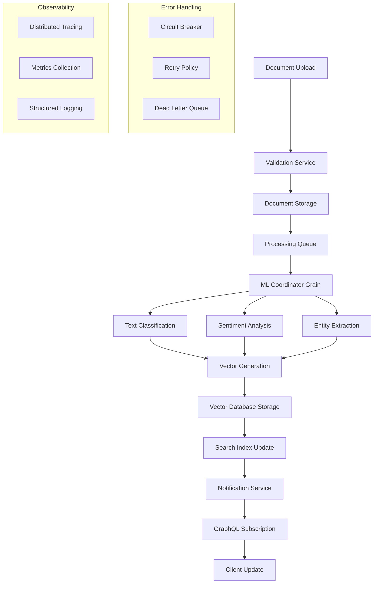

# End-to-End Workflow Integration

**Description**: Complete document processing pipeline demonstrating integration between .NET Aspire, Orleans, ML.NET, GraphQL, and multiple databases. This pattern shows how to orchestrate complex workflows across distributed services with proper error handling, observability, and scalability.

**Integration Pattern**: End-to-end workflow orchestration with service coordination, event-driven processing, and comprehensive monitoring.

## Workflow Overview

The end-to-end document processing workflow demonstrates enterprise-grade integration patterns connecting multiple Microsoft technologies in a cohesive, scalable system.



## Implementation Architecture

### 1. Document Ingestion Pipeline

```csharp
namespace DocumentProcessor.Workflows;

using Microsoft.Extensions.Orleans;
using DocumentProcessor.Events;
using DocumentProcessor.Services;

public interface IDocumentWorkflowGrain : IGrainWithStringKey
{
    Task<WorkflowResult> ProcessDocumentAsync(DocumentIngestionRequest request);
    Task<WorkflowStatus> GetWorkflowStatusAsync();
    Task<WorkflowResult> RetryFailedStepsAsync();
    Task CancelWorkflowAsync();
}

[StatePersistence(StatePersistence.Persisted)]
public class DocumentWorkflowGrain : Grain<DocumentWorkflowState>, IDocumentWorkflowGrain
{
    private readonly IDocumentStorageService documentStorage;
    private readonly IMLCoordinatorGrain mlCoordinator;
    private readonly IVectorDatabaseService vectorDb;
    private readonly IEventPublisher eventPublisher;
    private readonly ILogger<DocumentWorkflowGrain> logger;
    private readonly IDistributedTracing tracing;

    public DocumentWorkflowGrain(
        IDocumentStorageService documentStorage,
        IVectorDatabaseService vectorDb,
        IEventPublisher eventPublisher,
        ILogger<DocumentWorkflowGrain> logger,
        IDistributedTracing tracing)
    {
        this.documentStorage = documentStorage;
        this.vectorDb = vectorDb;
        this.eventPublisher = eventPublisher;
        this.logger = logger;
        this.tracing = tracing;
    }

    public override async Task OnActivateAsync(CancellationToken cancellationToken)
    {
        // Initialize ML coordinator grain reference
        mlCoordinator = GrainFactory.GetGrain<IMLCoordinatorGrain>(0);
        
        // Register periodic health checks and cleanup
        RegisterTimer(PerformHealthCheck, null, TimeSpan.FromMinutes(1), TimeSpan.FromMinutes(5));
        RegisterTimer(CleanupExpiredWorkflows, null, TimeSpan.FromHours(1), TimeSpan.FromHours(6));
        
        await base.OnActivateAsync(cancellationToken);
    }

    public async Task<WorkflowResult> ProcessDocumentAsync(DocumentIngestionRequest request)
    {
        using var activity = tracing.StartActivity("ProcessDocument");
        activity?.SetTag("document.id", request.DocumentId);
        activity?.SetTag("document.type", request.ContentType);
        
        var workflowId = $"workflow_{request.DocumentId}_{Guid.NewGuid():N}";
        State.WorkflowId = workflowId;
        State.Status = WorkflowStatus.Running;
        State.StartedAt = DateTime.UtcNow;
        State.Steps = new List<WorkflowStep>();
        
        logger.LogInformation("Starting document workflow {WorkflowId} for document {DocumentId}",
            workflowId, request.DocumentId);

        try
        {
            // Step 1: Document Validation and Storage
            var validationResult = await ExecuteWorkflowStep("DocumentValidation", async () =>
            {
                activity?.AddEvent(new ActivityEvent("ValidatingDocument"));
                return await ValidateAndStoreDocument(request);
            });

            if (!validationResult.IsSuccess)
            {
                return await FailWorkflow("Document validation failed", validationResult.Error);
            }

            // Step 2: ML Processing Coordination
            var mlResult = await ExecuteWorkflowStep("MLProcessing", async () =>
            {
                activity?.AddEvent(new ActivityEvent("StartingMLProcessing"));
                
                var mlRequest = new MLProcessingRequest
                {
                    DocumentId = request.DocumentId,
                    Content = validationResult.Data.Content,
                    ContentType = request.ContentType,
                    ProcessingOptions = request.MLOptions ?? new MLProcessingOptions()
                };
                
                return await mlCoordinator.ProcessDocumentAsync(mlRequest);
            });

            if (!mlResult.IsSuccess)
            {
                return await FailWorkflow("ML processing failed", mlResult.Error);
            }

            // Step 3: Vector Storage and Indexing
            var indexingResult = await ExecuteWorkflowStep("VectorIndexing", async () =>
            {
                activity?.AddEvent(new ActivityEvent("StoringVectors"));
                
                return await StoreVectorsAndUpdateIndex(
                    request.DocumentId,
                    mlResult.Data,
                    validationResult.Data.Metadata);
            });

            if (!indexingResult.IsSuccess)
            {
                return await FailWorkflow("Vector indexing failed", indexingResult.Error);
            }

            // Step 4: Event Publication and Notifications
            await ExecuteWorkflowStep("EventPublication", async () =>
            {
                activity?.AddEvent(new ActivityEvent("PublishingEvents"));
                
                await PublishWorkflowEvents(workflowId, request.DocumentId, mlResult.Data);
                return StepResult.Success("Events published successfully");
            });

            // Complete workflow
            State.Status = WorkflowStatus.Completed;
            State.CompletedAt = DateTime.UtcNow;
            await WriteStateAsync();

            logger.LogInformation("Document workflow {WorkflowId} completed successfully in {Duration}ms",
                workflowId, (DateTime.UtcNow - State.StartedAt).TotalMilliseconds);

            return WorkflowResult.Success(new WorkflowData
            {
                DocumentId = request.DocumentId,
                MLResults = mlResult.Data,
                ProcessingDuration = DateTime.UtcNow - State.StartedAt,
                StepsCompleted = State.Steps.Count
            });
        }
        catch (Exception ex)
        {
            logger.LogError(ex, "Workflow {WorkflowId} failed with exception", workflowId);
            return await FailWorkflow("Workflow execution failed", ex);
        }
    }

    private async Task<StepResult<DocumentValidationResult>> ValidateAndStoreDocument(
        DocumentIngestionRequest request)
    {
        // Implement document validation logic
        var validation = new DocumentValidator();
        var validationResult = await validation.ValidateAsync(request);
        
        if (!validationResult.IsValid)
        {
            return StepResult<DocumentValidationResult>.Failure(
                $"Document validation failed: {string.Join(", ", validationResult.Errors)}");
        }

        // Store document with metadata
        var document = new Document
        {
            Id = request.DocumentId,
            Title = request.Title,
            Content = request.Content,
            ContentType = request.ContentType,
            Metadata = request.Metadata,
            UploadedBy = request.UserId,
            UploadedAt = DateTime.UtcNow
        };

        await documentStorage.StoreDocumentAsync(document);
        
        return StepResult<DocumentValidationResult>.Success(new DocumentValidationResult
        {
            Document = document,
            ValidationScore = validationResult.Score,
            ExtractedMetadata = validationResult.ExtractedMetadata
        });
    }

    private async Task<StepResult<VectorIndexingResult>> StoreVectorsAndUpdateIndex(
        string documentId,
        MLProcessingResults mlResults,
        Dictionary<string, object> metadata)
    {
        // Store document vectors with comprehensive metadata
        var vectorData = new VectorStorageRequest
        {
            DocumentId = documentId,
            Embeddings = mlResults.Embeddings,
            Metadata = new Dictionary<string, object>(metadata)
            {
                ["classification"] = mlResults.Classification,
                ["sentiment"] = mlResults.Sentiment,
                ["entities"] = mlResults.Entities,
                ["keywords"] = mlResults.Keywords,
                ["processing_timestamp"] = DateTime.UtcNow,
                ["workflow_id"] = State.WorkflowId
            }
        };

        await vectorDb.StoreVectorAsync(vectorData);

        // Update search indices
        var indexUpdates = new List<Task>
        {
            UpdateTextSearchIndex(documentId, mlResults),
            UpdateSemanticSearchIndex(documentId, mlResults.Embeddings),
            UpdateClassificationIndex(documentId, mlResults.Classification)
        };

        await Task.WhenAll(indexUpdates);

        return StepResult<VectorIndexingResult>.Success(new VectorIndexingResult
        {
            VectorCount = mlResults.Embeddings.Length,
            IndicesUpdated = indexUpdates.Count,
            ProcessingTime = DateTime.UtcNow
        });
    }

    private async Task<StepResult<T>> ExecuteWorkflowStep<T>(string stepName, Func<Task<StepResult<T>>> stepFunc)
    {
        var step = new WorkflowStep
        {
            Name = stepName,
            StartedAt = DateTime.UtcNow,
            Status = StepStatus.Running
        };

        State.Steps.Add(step);
        await WriteStateAsync();

        try
        {
            var result = await stepFunc();
            
            step.Status = result.IsSuccess ? StepStatus.Completed : StepStatus.Failed;
            step.CompletedAt = DateTime.UtcNow;
            step.Duration = step.CompletedAt.Value - step.StartedAt;
            step.Error = result.IsSuccess ? null : result.Error?.Message;

            await WriteStateAsync();
            return result;
        }
        catch (Exception ex)
        {
            step.Status = StepStatus.Failed;
            step.CompletedAt = DateTime.UtcNow;
            step.Duration = step.CompletedAt.Value - step.StartedAt;
            step.Error = ex.Message;

            await WriteStateAsync();
            throw;
        }
    }

    private async Task PublishWorkflowEvents(string workflowId, string documentId, MLProcessingResults mlResults)
    {
        var events = new[]
        {
            new DocumentProcessedEvent
            {
                DocumentId = documentId,
                WorkflowId = workflowId,
                ProcessedAt = DateTime.UtcNow,
                Classification = mlResults.Classification,
                Sentiment = mlResults.Sentiment,
                ProcessingDuration = DateTime.UtcNow - State.StartedAt
            },
            new VectorsStoredEvent
            {
                DocumentId = documentId,
                VectorCount = mlResults.Embeddings.Length,
                StoredAt = DateTime.UtcNow
            },
            new SearchIndexUpdatedEvent
            {
                DocumentId = documentId,
                UpdatedAt = DateTime.UtcNow,
                IndexTypes = new[] { "text", "semantic", "classification" }
            }
        };

        var publishTasks = events.Select(evt => eventPublisher.PublishAsync(evt));
        await Task.WhenAll(publishTasks);
    }
}

// Supporting classes and interfaces
public class DocumentWorkflowState
{
    public string WorkflowId { get; set; } = "";
    public WorkflowStatus Status { get; set; } = WorkflowStatus.NotStarted;
    public DateTime StartedAt { get; set; }
    public DateTime? CompletedAt { get; set; }
    public List<WorkflowStep> Steps { get; set; } = new();
    public Dictionary<string, object> Context { get; set; } = new();
}

public class WorkflowStep
{
    public string Name { get; set; } = "";
    public StepStatus Status { get; set; }
    public DateTime StartedAt { get; set; }
    public DateTime? CompletedAt { get; set; }
    public TimeSpan? Duration { get; set; }
    public string? Error { get; set; }
}

public enum WorkflowStatus
{
    NotStarted,
    Running,
    Completed,
    Failed,
    Cancelled
}

public enum StepStatus
{
    Pending,
    Running,
    Completed,
    Failed,
    Skipped
}
```

### 2. GraphQL Integration Layer

```csharp
namespace DocumentProcessor.GraphQL;

using HotChocolate;
using HotChocolate.Subscriptions;

public class DocumentQueries
{
    public async Task<Document?> GetDocumentAsync(
        string documentId,
        [Service] IDocumentRepository repository)
    {
        return await repository.GetByIdAsync(documentId);
    }

    public async Task<WorkflowStatus?> GetWorkflowStatusAsync(
        string workflowId,
        [Service] IGrainFactory grainFactory)
    {
        var workflowGrain = grainFactory.GetGrain<IDocumentWorkflowGrain>(workflowId);
        return await workflowGrain.GetWorkflowStatusAsync();
    }

    [UseOffsetPaging]
    [UseFiltering]
    [UseSorting]
    public IQueryable<Document> GetDocuments(
        [Service] ApplicationDbContext context)
    {
        return context.Documents.AsQueryable();
    }

    public async Task<IEnumerable<Document>> SearchSimilarDocumentsAsync(
        string query,
        int limit = 10,
        [Service] IVectorSearchService vectorSearch)
    {
        return await vectorSearch.FindSimilarAsync(query, limit);
    }
}

public class DocumentMutations
{
    public async Task<WorkflowResult> ProcessDocumentAsync(
        ProcessDocumentInput input,
        [Service] IGrainFactory grainFactory,
        [Service] ITopicEventSender eventSender)
    {
        var workflowGrain = grainFactory.GetGrain<IDocumentWorkflowGrain>(input.DocumentId);
        var result = await workflowGrain.ProcessDocumentAsync(input.ToRequest());

        // Send real-time update to subscribers
        await eventSender.SendAsync("DocumentProcessing", new DocumentProcessingUpdate
        {
            DocumentId = input.DocumentId,
            Status = result.IsSuccess ? "Completed" : "Failed",
            UpdatedAt = DateTime.UtcNow
        });

        return result;
    }

    public async Task<WorkflowResult> RetryWorkflowAsync(
        string workflowId,
        [Service] IGrainFactory grainFactory)
    {
        var workflowGrain = grainFactory.GetGrain<IDocumentWorkflowGrain>(workflowId);
        return await workflowGrain.RetryFailedStepsAsync();
    }
}

public class DocumentSubscriptions
{
    [Subscribe]
    [Topic("DocumentProcessing")]
    public DocumentProcessingUpdate OnDocumentProcessing(
        [EventMessage] DocumentProcessingUpdate update) => update;

    [Subscribe]
    [Topic("WorkflowStatus")]
    public WorkflowStatusUpdate OnWorkflowStatusChange(
        [EventMessage] WorkflowStatusUpdate update) => update;
}
```

### 3. Observability Integration

```csharp
namespace DocumentProcessor.Observability;

using System.Diagnostics;
using Microsoft.Extensions.Logging;

public class WorkflowObservabilityService
{
    private readonly ILogger<WorkflowObservabilityService> logger;
    private readonly ActivitySource activitySource;
    private readonly IMetricsCollector metrics;

    public WorkflowObservabilityService(
        ILogger<WorkflowObservabilityService> logger,
        ActivitySource activitySource,
        IMetricsCollector metrics)
    {
        this.logger = logger;
        this.activitySource = activitySource;
        this.metrics = metrics;
    }

    public IDisposable TrackWorkflow(string workflowId, string documentId)
    {
        var activity = activitySource.StartActivity("DocumentWorkflow");
        activity?.SetTag("workflow.id", workflowId);
        activity?.SetTag("document.id", documentId);
        activity?.SetTag("workflow.type", "document_processing");

        logger.LogInformation("Workflow tracking started for {WorkflowId}", workflowId);
        
        metrics.IncrementCounter("workflows.started", new Dictionary<string, string>
        {
            ["workflow_type"] = "document_processing"
        });

        return new WorkflowTracker(activity, metrics, logger, workflowId);
    }
}

public class WorkflowTracker : IDisposable
{
    private readonly Activity? activity;
    private readonly IMetricsCollector metrics;
    private readonly ILogger logger;
    private readonly string workflowId;
    private readonly DateTime startTime = DateTime.UtcNow;

    public WorkflowTracker(Activity? activity, IMetricsCollector metrics, ILogger logger, string workflowId)
    {
        this.activity = activity;
        this.metrics = metrics;
        this.logger = logger;
        this.workflowId = workflowId;
    }

    public void Dispose()
    {
        var duration = DateTime.UtcNow - startTime;
        
        metrics.RecordValue("workflow.duration", duration.TotalMilliseconds, new Dictionary<string, string>
        {
            ["workflow_type"] = "document_processing"
        });

        logger.LogInformation("Workflow {WorkflowId} completed in {Duration}ms", 
            workflowId, duration.TotalMilliseconds);

        activity?.Dispose();
    }
}
```

## Integration Benefits

### Scalability
- **Horizontal scaling** through Orleans grain distribution
- **Async processing** with message queues and event-driven architecture
- **Resource optimization** with connection pooling and caching
- **Load balancing** across multiple service instances

### Reliability
- **Circuit breaker patterns** for external service resilience
- **Retry policies** with exponential backoff
- **Dead letter queues** for failed message handling
- **Graceful degradation** under high load

### Observability
- **Distributed tracing** across service boundaries
- **Structured logging** with correlation IDs
- **Real-time metrics** collection and alerting
- **Health monitoring** and auto-recovery

### Maintainability
- **Modular architecture** with clear service boundaries
- **Event-driven design** for loose coupling
- **API-first approach** with GraphQL integration
- **Comprehensive testing** with integration test patterns

---

**Key Benefits**: Complete workflow orchestration, comprehensive error handling, real-time observability, scalable architecture

**When to Use**: Complex document processing systems, multi-service architectures, event-driven applications, enterprise integration scenarios

**Performance**: Optimized async processing, efficient resource utilization, distributed caching, horizontal scaling capabilities