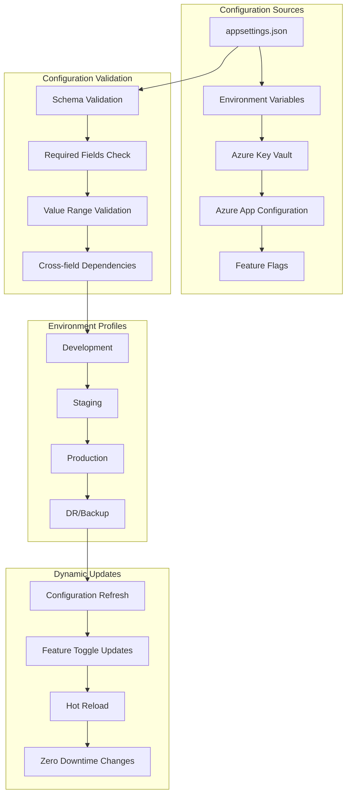

# Environment Management and Configuration

**Description**: Comprehensive environment management patterns covering configuration management, secrets handling, environment-specific deployments, feature flags, and configuration validation across different deployment environments.

**Integration Pattern**: End-to-end configuration strategy from development through production with secure secrets management and dynamic feature control.

## Environment Management Architecture Overview

Modern applications require sophisticated configuration management that handles multiple environments, secure secrets, feature toggles, and dynamic configuration updates.



## 1. Configuration Hierarchy and Management

### Structured Configuration System

```csharp
// Infrastructure/Configuration/ConfigurationManager.cs
namespace DocumentProcessing.Infrastructure.Configuration;

public class ConfigurationManager(IConfiguration configuration, IOptionsMonitor<EnvironmentOptions> environmentOptions)
{
    public T GetConfiguration<T>(string sectionName) where T : class, new()
    {
        var section = configuration.GetSection(sectionName);
        var config = new T();
        section.Bind(config);
        
        ValidateConfiguration(config, sectionName);
        return config;
    }
    
    public T GetRequiredConfiguration<T>(string sectionName) where T : class, new()
    {
        var config = GetConfiguration<T>(sectionName);
        
        if (config == null)
        {
            throw new ConfigurationException($"Required configuration section '{sectionName}' is missing");
        }
        
        return config;
    }
    
    public async Task<T> GetSecureConfiguration<T>(string sectionName) where T : class, new()
    {
        var config = GetConfiguration<T>(sectionName);
        
        // Decrypt sensitive properties
        await DecryptSensitiveProperties(config);
        
        return config;
    }
    
    private void ValidateConfiguration<T>(T config, string sectionName)
    {
        var validator = new ConfigurationValidator<T>();
        var validationResult = validator.Validate(config);
        
        if (!validationResult.IsValid)
        {
            var errors = string.Join(", ", validationResult.Errors.Select(e => e.ErrorMessage));
            throw new ConfigurationException($"Configuration validation failed for section '{sectionName}': {errors}");
        }
    }
    
    private async Task DecryptSensitiveProperties<T>(T config)
    {
        var properties = typeof(T).GetProperties()
            .Where(p => p.GetCustomAttribute<SensitiveAttribute>() != null);
        
        foreach (var property in properties)
        {
            if (property.GetValue(config) is string encryptedValue && !string.IsNullOrEmpty(encryptedValue))
            {
                var decryptedValue = await DecryptValue(encryptedValue);
                property.SetValue(config, decryptedValue);
            }
        }
    }
    
    private async Task<string> DecryptValue(string encryptedValue)
    {
        // Implementation would depend on your encryption strategy
        // This could use Azure Key Vault, AWS KMS, or local encryption
        return await Task.FromResult(encryptedValue); // Placeholder
    }
}

[AttributeUsage(AttributeTargets.Property)]
public class SensitiveAttribute : Attribute { }

public class ConfigurationException(string message) : Exception(message) { }
```

### Environment-Specific Configuration Files

```json
// appsettings.json - Base configuration
{
  "Logging": {
    "LogLevel": {
      "Default": "Information",
      "Microsoft.AspNetCore": "Warning",
      "System.Net.Http.HttpClient": "Warning"
    }
  },
  "Database": {
    "Provider": "PostgreSQL",
    "ConnectionTimeout": 30,
    "CommandTimeout": 30,
    "MaxRetryCount": 3,
    "EnableSensitiveDataLogging": false
  },
  "Cache": {
    "DefaultExpiration": "00:15:00",
    "SlidingExpiration": "00:05:00",
    "AbsoluteExpirationRelativeToNow": "01:00:00"
  },
  "OpenTelemetry": {
    "ServiceName": "DocumentProcessingAPI",
    "ServiceVersion": "1.0.0",
    "EnableTracing": true,
    "EnableMetrics": true,
    "EnableLogging": true
  },
  "FeatureManagement": {
    "UseAdvancedDocumentProcessing": false,
    "EnableRealTimeNotifications": true,
    "UseMLRecommendations": false,
    "EnableBatchProcessing": true
  }
}
```

```json
// appsettings.Development.json
{
  "Logging": {
    "LogLevel": {
      "Default": "Debug",
      "DocumentProcessing": "Debug"
    }
  },
  "Database": {
    "ConnectionString": "Server=localhost;Database=DocumentProcessing_Dev;Username=dev;Password=dev123;",
    "EnableSensitiveDataLogging": true,
    "EnableDetailedErrors": true
  },
  "Cache": {
    "ConnectionString": "localhost:6379",
    "InstanceName": "DocumentProcessing_Dev"
  },
  "OpenTelemetry": {
    "Endpoint": "http://localhost:4318",
    "Headers": {},
    "EnableConsoleExporter": true
  },
  "FeatureManagement": {
    "UseAdvancedDocumentProcessing": true,
    "UseMLRecommendations": true
  },
  "DeveloperSettings": {
    "EnableSwagger": true,
    "EnableSeedData": true,
    "SkipAuthentication": true,
    "MockExternalServices": true
  }
}
```

```json
// appsettings.Production.json
{
  "Logging": {
    "LogLevel": {
      "Default": "Warning",
      "DocumentProcessing": "Information"
    }
  },
  "Database": {
    "ConnectionString": "#{Database.ConnectionString}#",
    "MaxPoolSize": 100,
    "MinPoolSize": 5,
    "ConnectionLifetime": 300
  },
  "Cache": {
    "ConnectionString": "#{Redis.ConnectionString}#",
    "InstanceName": "DocumentProcessing_Prod"
  },
  "OpenTelemetry": {
    "Endpoint": "#{OpenTelemetry.Endpoint}#",
    "Headers": {
      "Authorization": "#{OpenTelemetry.ApiKey}#"
    },
    "EnableConsoleExporter": false
  },
  "Security": {
    "RequireHttps": true,
    "EnableCors": false,
    "AllowedOrigins": [],
    "JwtSecretKey": "#{Security.JwtSecretKey}#"
  },
  "FeatureManagement": {
    "UseAdvancedDocumentProcessing": true,
    "UseMLRecommendations": true,
    "EnableBatchProcessing": true
  }
}
```

## 2. Azure Key Vault Integration

### Secure Secrets Management

```csharp
// Infrastructure/Configuration/SecureConfigurationExtensions.cs
namespace DocumentProcessing.Infrastructure.Configuration;

public static class SecureConfigurationExtensions
{
    public static IHostApplicationBuilder AddSecureConfiguration(this IHostApplicationBuilder builder)
    {
        var environment = builder.Environment.EnvironmentName;
        var keyVaultName = builder.Configuration["KeyVault:VaultName"];
        
        if (!string.IsNullOrEmpty(keyVaultName))
        {
            builder.Configuration.AddAzureKeyVault(
                new Uri($"https://{keyVaultName}.vault.azure.net/"),
                new DefaultAzureCredential(),
                new KeyVaultSecretManager());
        }
        
        // Add Azure App Configuration
        var appConfigConnectionString = builder.Configuration.GetConnectionString("AppConfig");
        if (!string.IsNullOrEmpty(appConfigConnectionString))
        {
            builder.Configuration.AddAzureAppConfiguration(options =>
            {
                options.Connect(appConfigConnectionString)
                    .Select(KeyFilter.Any, environment)
                    .UseFeatureFlags(featureOptions =>
                    {
                        featureOptions.Select(KeyFilter.Any, environment);
                        featureOptions.CacheExpirationInterval = TimeSpan.FromMinutes(1);
                    })
                    .ConfigureRefresh(refreshOptions =>
                    {
                        refreshOptions.Register("Settings:Sentinel", refreshAll: true)
                            .SetCacheExpiration(TimeSpan.FromMinutes(1));
                    });
            });
        }
        
        return builder;
    }
}

public class KeyVaultSecretManager : KeyVaultSecretManager
{
    public override string GetKey(KeyVaultSecret secret)
    {
        // Transform Key Vault secret names to configuration keys
        // e.g., "Database--ConnectionString" -> "Database:ConnectionString"
        return secret.Name.Replace("--", ConfigurationPath.KeyDelimiter);
    }
    
    public override bool Load(SecretProperties secret)
    {
        // Only load secrets that match our naming convention
        return secret.Name.StartsWith("DocumentProcessing-");
    }
}
```

### Configuration Options with Validation

```csharp
// Infrastructure/Configuration/ConfigurationOptions.cs
namespace DocumentProcessing.Infrastructure.Configuration;

public class DatabaseOptions
{
    public const string SectionName = "Database";
    
    [Required]
    public string ConnectionString { get; set; } = string.Empty;
    
    [Required]
    public string Provider { get; set; } = "PostgreSQL";
    
    [Range(5, 300)]
    public int ConnectionTimeout { get; set; } = 30;
    
    [Range(5, 300)]
    public int CommandTimeout { get; set; } = 30;
    
    [Range(1, 10)]
    public int MaxRetryCount { get; set; } = 3;
    
    [Range(1, 1000)]
    public int MaxPoolSize { get; set; } = 100;
    
    [Range(1, 50)]
    public int MinPoolSize { get; set; } = 5;
    
    public bool EnableSensitiveDataLogging { get; set; } = false;
    public bool EnableDetailedErrors { get; set; } = false;
}

public class CacheOptions
{
    public const string SectionName = "Cache";
    
    [Required]
    public string ConnectionString { get; set; } = string.Empty;
    
    [Required]
    public string InstanceName { get; set; } = string.Empty;
    
    public TimeSpan DefaultExpiration { get; set; } = TimeSpan.FromMinutes(15);
    public TimeSpan SlidingExpiration { get; set; } = TimeSpan.FromMinutes(5);
    public TimeSpan AbsoluteExpirationRelativeToNow { get; set; } = TimeSpan.FromHours(1);
    
    [Range(1, 10)]
    public int Database { get; set; } = 0;
}

public class SecurityOptions
{
    public const string SectionName = "Security";
    
    [Required, Sensitive]
    public string JwtSecretKey { get; set; } = string.Empty;
    
    [Required]
    public string JwtIssuer { get; set; } = string.Empty;
    
    [Required]
    public string JwtAudience { get; set; } = string.Empty;
    
    [Range(5, 1440)]
    public int JwtExpirationMinutes { get; set; } = 60;
    
    public bool RequireHttps { get; set; } = true;
    public bool EnableCors { get; set; } = false;
    public string[] AllowedOrigins { get; set; } = [];
    
    [Sensitive]
    public string EncryptionKey { get; set; } = string.Empty;
}

public class OpenTelemetryOptions
{
    public const string SectionName = "OpenTelemetry";
    
    [Required]
    public string ServiceName { get; set; } = string.Empty;
    
    [Required]
    public string ServiceVersion { get; set; } = "1.0.0";
    
    public string Endpoint { get; set; } = string.Empty;
    public Dictionary<string, string> Headers { get; set; } = new();
    
    public bool EnableTracing { get; set; } = true;
    public bool EnableMetrics { get; set; } = true;
    public bool EnableLogging { get; set; } = true;
    public bool EnableConsoleExporter { get; set; } = false;
}

public class EnvironmentOptions
{
    public const string SectionName = "Environment";
    
    [Required]
    public string Name { get; set; } = "Development";
    
    public bool IsDevelopment => Name.Equals("Development", StringComparison.OrdinalIgnoreCase);
    public bool IsStaging => Name.Equals("Staging", StringComparison.OrdinalIgnoreCase);
    public bool IsProduction => Name.Equals("Production", StringComparison.OrdinalIgnoreCase);
    
    public string Region { get; set; } = "East US";
    public string DataCenter { get; set; } = "Primary";
    
    public Dictionary<string, string> Tags { get; set; } = new();
}
```

## 3. Feature Flag Management

### Feature Flag Implementation

```csharp
// Infrastructure/FeatureManagement/FeatureFlagService.cs
namespace DocumentProcessing.Infrastructure.FeatureManagement;

public class FeatureFlagService(
    IFeatureManager featureManager,
    IConfiguration configuration,
    ILogger<FeatureFlagService> logger) : IFeatureFlagService
{
    public async Task<bool> IsEnabledAsync(string featureName, object? context = null)
    {
        try
        {
            var isEnabled = await featureManager.IsEnabledAsync(featureName, context);
            logger.LogDebug("Feature flag '{FeatureName}' is {Status}", featureName, isEnabled ? "enabled" : "disabled");
            return isEnabled;
        }
        catch (Exception ex)
        {
            logger.LogError(ex, "Error checking feature flag '{FeatureName}'", featureName);
            return GetDefaultValue(featureName);
        }
    }
    
    public async Task<T> GetVariantAsync<T>(string featureName, T defaultValue, object? context = null)
    {
        try
        {
            var variant = await featureManager.GetVariantAsync(featureName, context);
            if (variant != null && variant.Configuration != null)
            {
                return variant.Configuration.Get<T>() ?? defaultValue;
            }
        }
        catch (Exception ex)
        {
            logger.LogError(ex, "Error getting feature variant '{FeatureName}'", featureName);
        }
        
        return defaultValue;
    }
    
    public async Task<IEnumerable<FeatureFlagStatus>> GetAllFeatureStatusAsync(object? context = null)
    {
        var featureNames = GetAllFeatureNames();
        var tasks = featureNames.Select(async name => new FeatureFlagStatus
        {
            Name = name,
            IsEnabled = await IsEnabledAsync(name, context),
            LastChecked = DateTime.UtcNow
        });
        
        return await Task.WhenAll(tasks);
    }
    
    private bool GetDefaultValue(string featureName)
    {
        var defaultValue = configuration[$"FeatureManagement:{featureName}:DefaultValue"];
        return bool.TryParse(defaultValue, out var value) && value;
    }
    
    private IEnumerable<string> GetAllFeatureNames()
    {
        var featureSection = configuration.GetSection("FeatureManagement");
        return featureSection.GetChildren().Select(child => child.Key);
    }
}

public interface IFeatureFlagService
{
    Task<bool> IsEnabledAsync(string featureName, object? context = null);
    Task<T> GetVariantAsync<T>(string featureName, T defaultValue, object? context = null);
    Task<IEnumerable<FeatureFlagStatus>> GetAllFeatureStatusAsync(object? context = null);
}

public record FeatureFlagStatus
{
    public string Name { get; init; } = string.Empty;
    public bool IsEnabled { get; init; }
    public DateTime LastChecked { get; init; }
}
```

### Advanced Feature Flag Filters

```csharp
// Infrastructure/FeatureManagement/CustomFeatureFilters.cs
namespace DocumentProcessing.Infrastructure.FeatureManagement;

[FilterAlias("UserRole")]
public class UserRoleFeatureFilter : IFeatureFilter
{
    public Task<bool> EvaluateAsync(FeatureFilterEvaluationContext context)
    {
        var requiredRoles = context.Parameters.Get<string[]>("Roles") ?? [];
        
        if (context.FeatureFilterContext is not IServiceProvider serviceProvider)
        {
            return Task.FromResult(false);
        }
        
        var httpContext = serviceProvider.GetService<IHttpContextAccessor>()?.HttpContext;
        if (httpContext?.User == null)
        {
            return Task.FromResult(false);
        }
        
        var userRoles = httpContext.User.FindAll(ClaimTypes.Role).Select(c => c.Value);
        var hasRequiredRole = requiredRoles.Any(role => userRoles.Contains(role));
        
        return Task.FromResult(hasRequiredRole);
    }
}

[FilterAlias("Environment")]
public class EnvironmentFeatureFilter : IFeatureFilter
{
    private readonly IWebHostEnvironment environment;
    
    public EnvironmentFeatureFilter(IWebHostEnvironment environment)
    {
        this.environment = environment;
    }
    
    public Task<bool> EvaluateAsync(FeatureFilterEvaluationContext context)
    {
        var allowedEnvironments = context.Parameters.Get<string[]>("Environments") ?? [];
        var currentEnvironment = environment.EnvironmentName;
        
        var isAllowed = allowedEnvironments.Contains(currentEnvironment, StringComparer.OrdinalIgnoreCase);
        return Task.FromResult(isAllowed);
    }
}

[FilterAlias("TimeWindow")]
public class TimeWindowFeatureFilter : IFeatureFilter
{
    public Task<bool> EvaluateAsync(FeatureFilterEvaluationContext context)
    {
        var startTime = context.Parameters.Get<TimeSpan>("StartTime");
        var endTime = context.Parameters.Get<TimeSpan>("EndTime");
        var currentTime = DateTime.UtcNow.TimeOfDay;
        
        var isInWindow = startTime <= endTime 
            ? currentTime >= startTime && currentTime <= endTime
            : currentTime >= startTime || currentTime <= endTime; // Handles overnight windows
        
        return Task.FromResult(isInWindow);
    }
}

[FilterAlias("Gradual")]
public class GradualRolloutFeatureFilter : IFeatureFilter
{
    public Task<bool> EvaluateAsync(FeatureFilterEvaluationContext context)
    {
        var percentage = context.Parameters.Get<double>("Percentage");
        var seed = context.Parameters.Get<string>("Seed") ?? context.FeatureName;
        
        // Use user ID or session ID for consistent experience
        var serviceProvider = context.FeatureFilterContext as IServiceProvider;
        var httpContext = serviceProvider?.GetService<IHttpContextAccessor>()?.HttpContext;
        
        var userId = httpContext?.User?.FindFirst(ClaimTypes.NameIdentifier)?.Value 
            ?? httpContext?.Session?.Id 
            ?? httpContext?.Connection?.Id 
            ?? "anonymous";
        
        var hash = HashCode.Combine(seed, userId);
        var normalizedHash = Math.Abs(hash % 100);
        
        return Task.FromResult(normalizedHash < percentage);
    }
}
```

### Feature Flag Configuration

```json
// Feature flag configuration in appsettings.json
{
  "FeatureManagement": {
    "UseAdvancedDocumentProcessing": {
      "EnabledFor": [
        {
          "Name": "Environment",
          "Parameters": {
            "Environments": ["Staging", "Production"]
          }
        }
      ]
    },
    "UseMLRecommendations": {
      "EnabledFor": [
        {
          "Name": "Gradual",
          "Parameters": {
            "Percentage": 25,
            "Seed": "MLRecommendations"
          }
        }
      ]
    },
    "EnableRealTimeNotifications": {
      "EnabledFor": [
        {
          "Name": "UserRole",
          "Parameters": {
            "Roles": ["Premium", "Enterprise"]
          }
        }
      ]
    },
    "MaintenanceMode": {
      "EnabledFor": [
        {
          "Name": "TimeWindow",
          "Parameters": {
            "StartTime": "02:00:00",
            "EndTime": "04:00:00"
          }
        }
      ]
    }
  }
}
```

## 4. Configuration Validation and Monitoring

### Runtime Configuration Validation

```csharp
// Infrastructure/Configuration/ConfigurationValidator.cs
namespace DocumentProcessing.Infrastructure.Configuration;

public class ConfigurationValidator<T> where T : class
{
    public ValidationResult Validate(T configuration)
    {
        var validationContext = new ValidationContext(configuration);
        var results = new List<ValidationResult>();
        
        var isValid = Validator.TryValidateObject(configuration, validationContext, results, true);
        
        // Additional custom validation
        ValidateCustomRules(configuration, results);
        
        return new ValidationResult
        {
            IsValid = isValid && !results.Any(),
            Errors = results.Select(r => new ValidationError 
            { 
                PropertyName = string.Join(",", r.MemberNames), 
                ErrorMessage = r.ErrorMessage ?? "Unknown error" 
            }).ToList()
        };
    }
    
    private void ValidateCustomRules(T configuration, List<ValidationResult> results)
    {
        switch (configuration)
        {
            case DatabaseOptions dbOptions:
                ValidateDatabaseOptions(dbOptions, results);
                break;
            case SecurityOptions secOptions:
                ValidateSecurityOptions(secOptions, results);
                break;
            case CacheOptions cacheOptions:
                ValidateCacheOptions(cacheOptions, results);
                break;
        }
    }
    
    private void ValidateDatabaseOptions(DatabaseOptions options, List<ValidationResult> results)
    {
        if (string.IsNullOrWhiteSpace(options.ConnectionString))
        {
            results.Add(new ValidationResult("Database connection string is required"));
        }
        
        if (options.MaxPoolSize <= options.MinPoolSize)
        {
            results.Add(new ValidationResult("MaxPoolSize must be greater than MinPoolSize"));
        }
        
        if (options.ConnectionTimeout >= options.CommandTimeout)
        {
            results.Add(new ValidationResult("CommandTimeout should be greater than ConnectionTimeout"));
        }
    }
    
    private void ValidateSecurityOptions(SecurityOptions options, List<ValidationResult> results)
    {
        if (string.IsNullOrWhiteSpace(options.JwtSecretKey) || options.JwtSecretKey.Length < 32)
        {
            results.Add(new ValidationResult("JWT secret key must be at least 32 characters long"));
        }
        
        if (!Uri.TryCreate(options.JwtIssuer, UriKind.Absolute, out _))
        {
            results.Add(new ValidationResult("JWT issuer must be a valid URI"));
        }
    }
    
    private void ValidateCacheOptions(CacheOptions options, List<ValidationResult> results)
    {
        if (options.DefaultExpiration <= TimeSpan.Zero)
        {
            results.Add(new ValidationResult("Default expiration must be positive"));
        }
        
        if (options.SlidingExpiration >= options.DefaultExpiration)
        {
            results.Add(new ValidationResult("Sliding expiration should be less than default expiration"));
        }
    }
}

public class ValidationResult
{
    public bool IsValid { get; set; }
    public List<ValidationError> Errors { get; set; } = [];
}

public class ValidationError
{
    public string PropertyName { get; set; } = string.Empty;
    public string ErrorMessage { get; set; } = string.Empty;
}
```

### Configuration Monitoring Service

```csharp
// Infrastructure/Configuration/ConfigurationMonitoringService.cs
namespace DocumentProcessing.Infrastructure.Configuration;

public class ConfigurationMonitoringService(
    IOptionsMonitor<DatabaseOptions> databaseOptions,
    IOptionsMonitor<CacheOptions> cacheOptions,
    IOptionsMonitor<SecurityOptions> securityOptions,
    ILogger<ConfigurationMonitoringService> logger) : IHostedService
{
    private readonly List<IDisposable> changeTokens = [];
    
    public Task StartAsync(CancellationToken cancellationToken)
    {
        // Monitor configuration changes
        changeTokens.Add(databaseOptions.OnChange(OnDatabaseOptionsChanged));
        changeTokens.Add(cacheOptions.OnChange(OnCacheOptionsChanged));
        changeTokens.Add(securityOptions.OnChange(OnSecurityOptionsChanged));
        
        logger.LogInformation("Configuration monitoring service started");
        return Task.CompletedTask;
    }
    
    private void OnDatabaseOptionsChanged(DatabaseOptions options, string? name)
    {
        logger.LogInformation("Database configuration changed");
        
        var validator = new ConfigurationValidator<DatabaseOptions>();
        var result = validator.Validate(options);
        
        if (!result.IsValid)
        {
            logger.LogError("Invalid database configuration: {Errors}", 
                string.Join(", ", result.Errors.Select(e => e.ErrorMessage)));
        }
        else
        {
            logger.LogInformation("Database configuration validated successfully");
        }
    }
    
    private void OnCacheOptionsChanged(CacheOptions options, string? name)
    {
        logger.LogInformation("Cache configuration changed");
        
        var validator = new ConfigurationValidator<CacheOptions>();
        var result = validator.Validate(options);
        
        if (!result.IsValid)
        {
            logger.LogError("Invalid cache configuration: {Errors}",
                string.Join(", ", result.Errors.Select(e => e.ErrorMessage)));
        }
        else
        {
            logger.LogInformation("Cache configuration validated successfully");
            // Could trigger cache reconnection if needed
        }
    }
    
    private void OnSecurityOptionsChanged(SecurityOptions options, string? name)
    {
        logger.LogWarning("Security configuration changed - this may require application restart");
        
        var validator = new ConfigurationValidator<SecurityOptions>();
        var result = validator.Validate(options);
        
        if (!result.IsValid)
        {
            logger.LogCritical("Invalid security configuration: {Errors}",
                string.Join(", ", result.Errors.Select(e => e.ErrorMessage)));
        }
    }
    
    public Task StopAsync(CancellationToken cancellationToken)
    {
        foreach (var token in changeTokens)
        {
            token.Dispose();
        }
        
        changeTokens.Clear();
        logger.LogInformation("Configuration monitoring service stopped");
        return Task.CompletedTask;
    }
}
```

## 5. Environment-Specific Deployment Configuration

### Docker Environment Configuration

```dockerfile
# Multi-stage Dockerfile with environment-specific configuration
FROM mcr.microsoft.com/dotnet/aspnet:9.0 AS base
WORKDIR /app
EXPOSE 8080
EXPOSE 8081

FROM mcr.microsoft.com/dotnet/sdk:9.0 AS build
ARG BUILD_CONFIGURATION=Release
ARG ENVIRONMENT_NAME=Production
WORKDIR /src

# Copy project files
COPY ["src/WebApi/WebApi.csproj", "src/WebApi/"]
COPY ["src/Application/Application.csproj", "src/Application/"]
COPY ["src/Infrastructure/Infrastructure.csproj", "src/Infrastructure/"]
COPY ["Directory.Packages.props", "./"]

RUN dotnet restore "src/WebApi/WebApi.csproj"

# Copy source and build
COPY . .
WORKDIR "/src/src/WebApi"
RUN dotnet build "WebApi.csproj" -c $BUILD_CONFIGURATION -o /app/build

FROM build AS publish
RUN dotnet publish "WebApi.csproj" -c $BUILD_CONFIGURATION -o /app/publish /p:UseAppHost=false

# Runtime stage
FROM base AS final
WORKDIR /app

# Copy application files
COPY --from=publish /app/publish .

# Copy environment-specific configuration
ARG ENVIRONMENT_NAME=Production
COPY ["config/appsettings.${ENVIRONMENT_NAME}.json", "./appsettings.${ENVIRONMENT_NAME}.json"]

# Set environment
ENV ASPNETCORE_ENVIRONMENT=${ENVIRONMENT_NAME}
ENV DOTNET_ENVIRONMENT=${ENVIRONMENT_NAME}

# Health check
HEALTHCHECK --interval=30s --timeout=3s --start-period=5s --retries=3 \
    CMD curl -f http://localhost:8080/health || exit 1

ENTRYPOINT ["dotnet", "WebApi.dll"]
```

### Kubernetes ConfigMap and Secret Management

```yaml
# k8s/environments/staging/configmap.yaml
apiVersion: v1
kind: ConfigMap
metadata:
  name: webapi-config-staging
  namespace: document-processing-staging
data:
  appsettings.Staging.json: |
    {
      "Logging": {
        "LogLevel": {
          "Default": "Information",
          "DocumentProcessing": "Debug"
        }
      },
      "Database": {
        "MaxPoolSize": 50,
        "EnableSensitiveDataLogging": false
      },
      "Cache": {
        "DefaultExpiration": "00:30:00"
      },
      "FeatureManagement": {
        "UseAdvancedDocumentProcessing": true,
        "UseMLRecommendations": {
          "EnabledFor": [
            {
              "Name": "Gradual",
              "Parameters": {
                "Percentage": 50
              }
            }
          ]
        }
      }
    }

---
# k8s/environments/production/configmap.yaml
apiVersion: v1
kind: ConfigMap
metadata:
  name: webapi-config-production
  namespace: document-processing-production
data:
  appsettings.Production.json: |
    {
      "Logging": {
        "LogLevel": {
          "Default": "Warning",
          "DocumentProcessing": "Information"
        }
      },
      "Database": {
        "MaxPoolSize": 200,
        "EnableSensitiveDataLogging": false,
        "EnableDetailedErrors": false
      },
      "Cache": {
        "DefaultExpiration": "01:00:00"
      },
      "Security": {
        "RequireHttps": true,
        "EnableCors": false
      },
      "FeatureManagement": {
        "UseAdvancedDocumentProcessing": true,
        "UseMLRecommendations": true,
        "EnableRealTimeNotifications": true
      }
    }

---
# k8s/environments/production/sealed-secret.yaml
apiVersion: bitnami.com/v1alpha1
kind: SealedSecret
metadata:
  name: webapi-secrets-production
  namespace: document-processing-production
spec:
  encryptedData:
    database-connection: AgBy3i4OJSWK+PiTySYZZA9rO44cGUaJF/0xls+...]
    redis-connection: AgAKAoiQm+bwUHMYBb6gE4Z2BQ8vQ...]
    jwt-secret-key: AgAi2WZDtDJDC+6ThdCGoDPOy1bR...]
  template:
    metadata:
      name: webapi-secrets-production
      namespace: document-processing-production
    type: Opaque
```

## Configuration Management Best Practices Guide

| Pattern | Use Case | Security | Flexibility | Complexity |
|---------|----------|----------|-------------|------------|
| appsettings.json | Static configuration | Low | Low | Low |
| Environment Variables | Container configuration | Medium | Medium | Low |
| Azure Key Vault | Sensitive secrets | Very High | High | Medium |
| Azure App Configuration | Dynamic configuration | High | Very High | High |
| Feature Flags | Runtime toggles | Medium | Very High | Medium |

---

**Key Benefits**: Secure secrets management, environment isolation, dynamic configuration updates, comprehensive validation, runtime flexibility

**When to Use**: Multi-environment deployments, secure applications, dynamic feature control, configuration-driven behavior

**Performance**: Efficient configuration loading, minimal runtime overhead, optimized secret retrieval, cached feature flags
