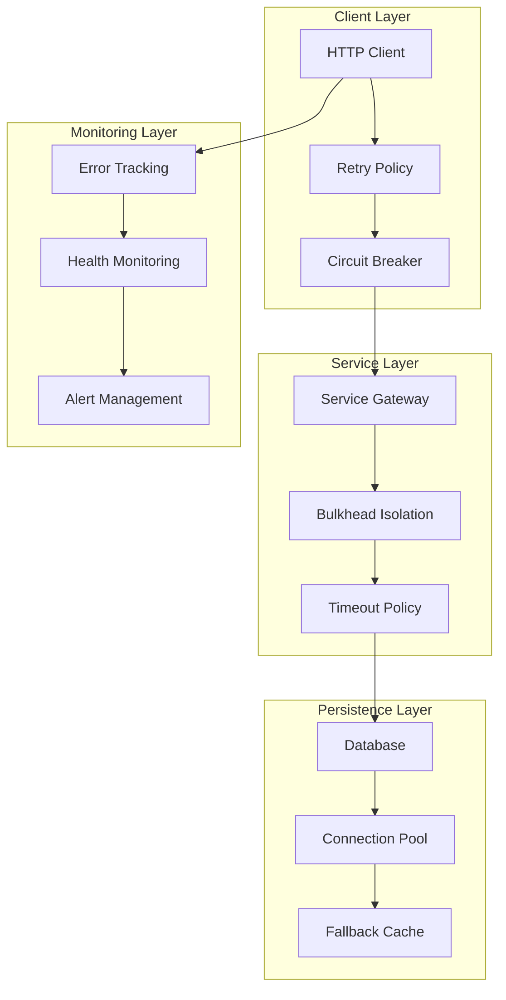

# Error Handling Patterns

**Description**: Comprehensive resilience and error handling patterns demonstrating circuit breakers, retry policies, bulkhead isolation, graceful degradation, and fault tolerance strategies for distributed systems. Follows RESTful design principles and implements proper HTTP status codes with structured error responses.

**Language/Technology**: C# / .NET 8.0 / ASP.NET Core

**Integration Pattern**: End-to-end error handling covering transient fault recovery, cascading failure prevention, system resilience, and comprehensive error monitoring with observability integration using structured logging and correlation IDs.

## Resilience Architecture Overview

Modern distributed systems require sophisticated error handling patterns that prevent cascading failures while maintaining system availability and user experience.



## 1. Circuit Breaker Pattern with Polly

### Advanced Circuit Breaker Implementation

```csharp
namespace ErrorHandling.CircuitBreaker;

using Polly;
using Polly.CircuitBreaker;
using Polly.Extensions.Http;

public class AdvancedCircuitBreakerService(
    ILogger<AdvancedCircuitBreakerService> logger,
    IMetrics metrics,
    IOptions<CircuitBreakerConfiguration> configuration)
{
    private readonly IAsyncPolicy<HttpResponseMessage> circuitBreakerPolicy = CreateCircuitBreakerPolicy(logger, metrics, configuration.Value);
    private readonly ILogger<AdvancedCircuitBreakerService> logger = logger;
    private readonly IMetrics metrics = metrics;
    private readonly CircuitBreakerConfiguration configuration = configuration.Value;

    private static IAsyncPolicy<HttpResponseMessage> CreateCircuitBreakerPolicy(
        ILogger logger, 
        IMetrics metrics, 
        CircuitBreakerConfiguration config)
    {
        return Policy
            .Handle<HttpRequestException>()
            .Or<TaskCanceledException>()
            .OrResult<HttpResponseMessage>(r => !r.IsSuccessStatusCode)
            .AdvancedCircuitBreakerAsync(
                failureThreshold: configuration.FailureThreshold,
                samplingDuration: configuration.SamplingDuration,
                minimumThroughput: configuration.MinimumThroughput,
                durationOfBreak: configuration.DurationOfBreak,
                onBreak: OnCircuitBreakerBreak,
                onReset: OnCircuitBreakerReset,
                onHalfOpen: OnCircuitBreakerHalfOpen);
    }

    public async Task<ApiResult<T>> ExecuteWithCircuitBreakerAsync<T>(
        Func<Task<HttpResponseMessage>> operation,
        string operationName,
        CancellationToken cancellationToken = default)
    {
        using var activity = Activity.Current?.Source.StartActivity("CircuitBreakerOperation");
        activity?.SetTag("operation.name", operationName);

        try
        {
            var response = await circuitBreakerPolicy.ExecuteAsync(async () =>
            {
                logger.LogDebug("Executing operation {OperationName} through circuit breaker", operationName);
                return await operation();
            });

            if (response.IsSuccessStatusCode)
            {
                var content = await response.Content.ReadAsStringAsync(cancellationToken);
                var result = JsonSerializer.Deserialize<T>(content);
                
                metrics.Counter("circuit_breaker_success_total")
                    .WithTag("operation", operationName)
                    .Increment();

                return ApiResult<T>.Success(result!);
            }
            else
            {
                logger.LogWarning("Operation {OperationName} failed with status {StatusCode}", 
                    operationName, response.StatusCode);

                return ApiResult<T>.Failure($"HTTP {response.StatusCode}: {response.ReasonPhrase}");
            }
        }
        catch (CircuitBreakerOpenException ex)
        {
            logger.LogError(ex, "Circuit breaker is open for operation {OperationName}", operationName);
            
            metrics.Counter("circuit_breaker_open_total")
                .WithTag("operation", operationName)
                .Increment();

            return ApiResult<T>.Failure("Service is temporarily unavailable. Please try again later.");
        }
        catch (BrokenCircuitException ex)
        {
            logger.LogError(ex, "Circuit breaker is broken for operation {OperationName}", operationName);
            
            metrics.Counter("circuit_breaker_broken_total")
                .WithTag("operation", operationName)
                .Increment();

            return ApiResult<T>.Failure("Service is experiencing issues. Please try again later.");
        }
        catch (Exception ex)
        {
            logger.LogError(ex, "Unexpected error in operation {OperationName}", operationName);
            
            metrics.Counter("circuit_breaker_error_total")
                .WithTag("operation", operationName)
                .Increment();

            return ApiResult<T>.Failure("An unexpected error occurred. Please try again.");
        }
    }

    private void OnCircuitBreakerBreak(DelegateResult<HttpResponseMessage> result, TimeSpan duration)
    {
        logger.LogWarning("Circuit breaker opened for {Duration}. Last result: {ResultType}",
            duration, result.Exception?.GetType().Name ?? result.Result?.StatusCode.ToString());
        
        metrics.Counter("circuit_breaker_opened_total").Increment();
        metrics.Gauge("circuit_breaker_break_duration_seconds").Set(duration.TotalSeconds);
    }

    private void OnCircuitBreakerReset()
    {
        logger.LogInformation("Circuit breaker reset - service is healthy again");
        metrics.Counter("circuit_breaker_reset_total").Increment();
    }

    private void OnCircuitBreakerHalfOpen()
    {
        logger.LogInformation("Circuit breaker is half-open - testing service health");
        metrics.Counter("circuit_breaker_half_open_total").Increment();
    }
}

public class CircuitBreakerConfiguration
{
    public double FailureThreshold { get; set; } = 0.5; // 50% failure rate
    public TimeSpan SamplingDuration { get; set; } = TimeSpan.FromMinutes(1);
    public int MinimumThroughput { get; set; } = 10;
    public TimeSpan DurationOfBreak { get; set; } = TimeSpan.FromSeconds(30);
}
```

### Retry Policy with Exponential Backoff

```csharp
namespace ErrorHandling.Retry;

public class RetryPolicyService
{
    private readonly ILogger<RetryPolicyService> logger;
    private readonly IMetrics metrics;
    private readonly RetryConfiguration configuration;

    public RetryPolicyService(
        ILogger<RetryPolicyService> logger,
        IMetrics metrics,
        IOptions<RetryConfiguration> configuration)
    {
        this.logger = logger;
        this.metrics = metrics;
        this.configuration = configuration.Value;
    }

    public async Task<TResult> ExecuteWithRetryAsync<TResult>(
        Func<CancellationToken, Task<TResult>> operation,
        string operationName,
        CancellationToken cancellationToken = default,
        RetryOptions? options = null)
    {
        var retryOptions = options ?? RetryOptions.Default;
        var policy = CreateRetryPolicy<TResult>(operationName, retryOptions);

        using var activity = Activity.Current?.Source.StartActivity("RetryOperation");
        activity?.SetTag("operation.name", operationName);
        activity?.SetTag("retry.max_attempts", retryOptions.MaxRetryAttempts);

        return await policy.ExecuteAsync(async (context) =>
        {
            var attempt = context.GetValueOrDefault("attempt", 0);
            context["attempt"] = attempt + 1;

            logger.LogDebug("Executing operation {OperationName}, attempt {Attempt}",
                operationName, attempt + 1);

            return await operation(cancellationToken);
        }, new Dictionary<string, object> { ["operationName"] = operationName });
    }

    private IAsyncPolicy<TResult> CreateRetryPolicy<TResult>(string operationName, RetryOptions options)
    {
        return Policy
            .Handle<Exception>(ex => ShouldRetry(ex, options))
            .WaitAndRetryAsync(
                retryCount: options.MaxRetryAttempts,
                sleepDurationProvider: CalculateDelay,
                onRetry: (result, timespan, retryCount, context) =>
                {
                    var operation = context.GetValueOrDefault("operationName", "Unknown");
                    
                    if (result.Exception != null)
                    {
                        logger.LogWarning("Retry {RetryCount} for operation {OperationName} after {Delay}ms due to: {Exception}",
                            retryCount, operation, timespan.TotalMilliseconds, result.Exception.Message);
                    }

                    metrics.Counter("retry_attempts_total")
                        .WithTag("operation", operation.ToString()!)
                        .WithTag("attempt", retryCount.ToString())
                        .Increment();
                });
    }

    private bool ShouldRetry(Exception exception, RetryOptions options)
    {
        return exception switch
        {
            HttpRequestException => true,
            TaskCanceledException => true,
            SocketException => true,
            TimeoutException => true,
            SqlException sqlEx when sqlEx.IsTransient() => true,
            InvalidOperationException when options.RetryOnInvalidOperation => true,
            _ => false
        };
    }

    private TimeSpan CalculateDelay(int retryAttempt)
    {
        var baseDelay = configuration.BaseDelay;
        var exponentialDelay = TimeSpan.FromMilliseconds(
            baseDelay.TotalMilliseconds * Math.Pow(2, retryAttempt - 1));

        // Add jitter to prevent thundering herd
        var jitter = TimeSpan.FromMilliseconds(
            Random.Shared.NextDouble() * configuration.JitterRange.TotalMilliseconds);

        var totalDelay = exponentialDelay + jitter;
        
        return totalDelay > configuration.MaxDelay ? configuration.MaxDelay : totalDelay;
    }
}

public class RetryOptions
{
    public static readonly RetryOptions Default = new();
    
    public int MaxRetryAttempts { get; set; } = 3;
    public bool RetryOnInvalidOperation { get; set; } = false;
    public TimeSpan MaxRetryDelay { get; set; } = TimeSpan.FromMinutes(1);
}

public class RetryConfiguration
{
    public TimeSpan BaseDelay { get; set; } = TimeSpan.FromSeconds(1);
    public TimeSpan MaxDelay { get; set; } = TimeSpan.FromMinutes(5);
    public TimeSpan JitterRange { get; set; } = TimeSpan.FromMilliseconds(100);
}
```

## 2. Bulkhead Isolation Pattern

### Resource Isolation Service

```csharp
namespace ErrorHandling.Bulkhead;

public class BulkheadIsolationService
{
    private readonly Dictionary<string, SemaphoreSlim> resourceSemaphores;
    private readonly ILogger<BulkheadIsolationService> logger;
    private readonly BulkheadConfiguration configuration;

    public BulkheadIsolationService(
        ILogger<BulkheadIsolationService> logger,
        IOptions<BulkheadConfiguration> configuration)
    {
        this.logger = logger;
        this.configuration = configuration.Value;
        
        resourceSemaphores = configuration.ResourceLimits.ToDictionary(
            kvp => kvp.Key,
            kvp => new SemaphoreSlim(kvp.Value, kvp.Value));
    }

    public async Task<TResult> ExecuteInBulkheadAsync<TResult>(
        string resourceName,
        Func<CancellationToken, Task<TResult>> operation,
        CancellationToken cancellationToken = default,
        TimeSpan? timeout = null)
    {
        if (!resourceSemaphores.TryGetValue(resourceName, out var semaphore))
        {
            throw new ArgumentException($"Resource '{resourceName}' is not configured for bulkhead isolation");
        }

        var effectiveTimeout = timeout ?? configuration.DefaultTimeout;
        using var timeoutCts = new CancellationTokenSource(effectiveTimeout);
        using var combinedCts = CancellationTokenSource
            .CreateLinkedTokenSource(cancellationToken, timeoutCts.Token);

        using var activity = Activity.Current?.Source.StartActivity("BulkheadOperation");
        activity?.SetTag("resource.name", resourceName);
        activity?.SetTag("resource.available", semaphore.CurrentCount);

        logger.LogDebug("Requesting access to resource {ResourceName} (available: {Available})",
            resourceName, semaphore.CurrentCount);

        var acquired = false;
        try
        {
            acquired = await semaphore.WaitAsync(combinedCts.Token);
            
            if (!acquired)
            {
                throw new BulkheadRejectedException($"Could not acquire access to resource '{resourceName}' within timeout");
            }

            logger.LogDebug("Acquired access to resource {ResourceName}", resourceName);

            var result = await operation(combinedCts.Token);
            
            logger.LogDebug("Successfully completed operation on resource {ResourceName}", resourceName);
            return result;
        }
        catch (OperationCanceledException) when (timeoutCts.Token.IsCancellationRequested)
        {
            logger.LogWarning("Operation on resource {ResourceName} timed out after {Timeout}",
                resourceName, effectiveTimeout);
            throw new TimeoutException($"Operation on resource '{resourceName}' timed out");
        }
        catch (OperationCanceledException) when (cancellationToken.IsCancellationRequested)
        {
            logger.LogInformation("Operation on resource {ResourceName} was cancelled", resourceName);
            throw;
        }
        finally
        {
            if (acquired)
            {
                semaphore.Release();
                logger.LogDebug("Released access to resource {ResourceName}", resourceName);
            }
        }
    }

    // Async enumerable version for streaming operations
    public async IAsyncEnumerable<TResult> ExecuteStreamInBulkheadAsync<TResult>(
        string resourceName,
        Func<CancellationToken, IAsyncEnumerable<TResult>> operation,
        [EnumeratorCancellation] CancellationToken cancellationToken = default,
        TimeSpan? timeout = null)
    {
        if (!resourceSemaphores.TryGetValue(resourceName, out var semaphore))
        {
            throw new ArgumentException($"Resource '{resourceName}' is not configured for bulkhead isolation");
        }

        var effectiveTimeout = timeout ?? configuration.DefaultTimeout;
        using var timeoutCts = new CancellationTokenSource(effectiveTimeout);
        using var combinedCts = CancellationTokenSource
            .CreateLinkedTokenSource(cancellationToken, timeoutCts.Token);

        logger.LogDebug("Requesting stream access to resource {ResourceName}", resourceName);

        var acquired = false;
        try
        {
            acquired = await semaphore.WaitAsync(combinedCts.Token);
            
            if (!acquired)
            {
                throw new BulkheadRejectedException($"Could not acquire stream access to resource '{resourceName}' within timeout");
            }

            logger.LogDebug("Acquired stream access to resource {ResourceName}", resourceName);

            await foreach (var item in operation(combinedCts.Token))
            {
                yield return item;
            }
        }
        finally
        {
            if (acquired)
            {
                semaphore.Release();
                logger.LogDebug("Released stream access to resource {ResourceName}", resourceName);
            }
        }
    }

    public ResourceStatus GetResourceStatus(string resourceName)
    {
        if (!resourceSemaphores.TryGetValue(resourceName, out var semaphore))
        {
            return ResourceStatus.NotFound(resourceName);
        }

        var maxCapacity = configuration.ResourceLimits[resourceName];
        var availableCapacity = semaphore.CurrentCount;
        var usedCapacity = maxCapacity - availableCapacity;
        var utilizationPercentage = (double)usedCapacity / maxCapacity * 100;

        return new ResourceStatus
        {
            ResourceName = resourceName,
            MaxCapacity = maxCapacity,
            AvailableCapacity = availableCapacity,
            UsedCapacity = usedCapacity,
            UtilizationPercentage = utilizationPercentage,
            Status = utilizationPercentage switch
            {
                >= 90 => BulkheadStatus.Critical,
                >= 70 => BulkheadStatus.Warning,
                _ => BulkheadStatus.Healthy
            }
        };
    }
}

public class BulkheadConfiguration
{
    public Dictionary<string, int> ResourceLimits { get; set; } = new()
    {
        ["database"] = 20,
        ["external-api"] = 10,
        ["file-system"] = 5,
        ["ml-processing"] = 3
    };
    
    public TimeSpan DefaultTimeout { get; set; } = TimeSpan.FromMinutes(1);
}

public class BulkheadRejectedException : Exception
{
    public BulkheadRejectedException(string message) : base(message) { }
}

public class ResourceStatus
{
    public string ResourceName { get; init; } = "";
    public int MaxCapacity { get; init; }
    public int AvailableCapacity { get; init; }
    public int UsedCapacity { get; init; }
    public double UtilizationPercentage { get; init; }
    public BulkheadStatus Status { get; init; }

    public static ResourceStatus NotFound(string resourceName) => new()
    {
        ResourceName = resourceName,
        Status = BulkheadStatus.NotFound
    };
}

public enum BulkheadStatus
{
    Healthy,
    Warning,
    Critical,
    NotFound
}
```

## 3. Graceful Degradation Patterns

### Feature Toggle Service

```csharp
namespace ErrorHandling.GracefulDegradation;

public interface IFeatureToggleService
{
    Task<bool> IsEnabledAsync(string featureName, string? userId = null);
    Task<T> ExecuteWithFallbackAsync<T>(string featureName, Func<Task<T>> primaryOperation, Func<Task<T>> fallbackOperation, string? userId = null);
}

public class FeatureToggleService : IFeatureToggleService
{
    private readonly IFeatureToggleRepository repository;
    private readonly IMemoryCache cache;
    private readonly ILogger<FeatureToggleService> logger;
    private readonly FeatureToggleConfiguration configuration;

    public FeatureToggleService(
        IFeatureToggleRepository repository,
        IMemoryCache cache,
        ILogger<FeatureToggleService> logger,
        IOptions<FeatureToggleConfiguration> configuration)
    {
        this.repository = repository;
        this.cache = cache;
        this.logger = logger;
        this.configuration = configuration.Value;
    }

    public async Task<bool> IsEnabledAsync(string featureName, string? userId = null)
    {
        var cacheKey = $"featuretoggle:{featureName}:{userId ?? "global"}";
        
        if (cache.TryGetValue(cacheKey, out bool cachedResult))
        {
            logger.LogDebug("Feature toggle {FeatureName} cached result: {Result}", featureName, cachedResult);
            return cachedResult;
        }

        try
        {
            var feature = await repository.GetFeatureToggleAsync(featureName);
            
            if (feature == null)
            {
                logger.LogWarning("Feature toggle {FeatureName} not found, defaulting to disabled", featureName);
                CacheResult(cacheKey, false);
                return false;
            }

            var isEnabled = EvaluateFeatureToggle(feature, userId);
            CacheResult(cacheKey, isEnabled);
            
            logger.LogDebug("Feature toggle {FeatureName} evaluated to: {Result}", featureName, isEnabled);
            return isEnabled;
        }
        catch (Exception ex)
        {
            logger.LogError(ex, "Error evaluating feature toggle {FeatureName}, defaulting to disabled", featureName);
            CacheResult(cacheKey, false);
            return false;
        }
    }

    public async Task<T> ExecuteWithFallbackAsync<T>(
        string featureName,
        Func<Task<T>> primaryOperation,
        Func<Task<T>> fallbackOperation,
        string? userId = null)
    {
        using var activity = Activity.Current?.Source.StartActivity("FeatureToggleExecution");
        activity?.SetTag("feature.name", featureName);
        activity?.SetTag("user.id", userId);

        try
        {
            var isEnabled = await IsEnabledAsync(featureName, userId);
            
            if (isEnabled)
            {
                logger.LogDebug("Executing primary operation for feature {FeatureName}", featureName);
                activity?.SetTag("execution.path", "primary");
                return await primaryOperation();
            }
            else
            {
                logger.LogDebug("Executing fallback operation for feature {FeatureName}", featureName);
                activity?.SetTag("execution.path", "fallback");
                return await fallbackOperation();
            }
        }
        catch (Exception ex) when (configuration.UseFallbackOnPrimaryFailure)
        {
            logger.LogError(ex, "Primary operation failed for feature {FeatureName}, executing fallback", featureName);
            activity?.SetTag("execution.path", "fallback_on_error");
            return await fallbackOperation();
        }
    }

    private bool EvaluateFeatureToggle(FeatureToggle feature, string? userId)
    {
        if (!feature.IsEnabled)
        {
            return false;
        }

        // Global toggle
        if (feature.RolloutPercentage >= 100)
        {
            return true;
        }

        // User-specific toggle
        if (!string.IsNullOrEmpty(userId))
        {
            // Use consistent hashing for user-based rollouts
            var hash = userId.GetHashCode();
            var userPercentage = Math.Abs(hash % 100);
            return userPercentage < feature.RolloutPercentage;
        }

        // Random rollout for anonymous users
        return Random.Shared.NextDouble() * 100 < feature.RolloutPercentage;
    }

    private void CacheResult(string cacheKey, bool result)
    {
        cache.Set(cacheKey, result, configuration.CacheExpiry);
    }
}

public class FeatureToggle
{
    public string Name { get; set; } = "";
    public bool IsEnabled { get; set; }
    public double RolloutPercentage { get; set; } = 100;
    public string[] UserIds { get; set; } = Array.Empty<string>();
    public Dictionary<string, object> Metadata { get; set; } = new();
}

public class FeatureToggleConfiguration
{
    public TimeSpan CacheExpiry { get; set; } = TimeSpan.FromMinutes(5);
    public bool UseFallbackOnPrimaryFailure { get; set; } = true;
}
```

### Degraded Service Pattern

```csharp
namespace ErrorHandling.GracefulDegradation;

public class DegradedServiceManager
{
    private readonly Dictionary<string, ServiceDegradationLevel> serviceLevels = new();
    private readonly ILogger<DegradedServiceManager> logger;
    private readonly IMetrics metrics;

    public DegradedServiceManager(ILogger<DegradedServiceManager> logger, IMetrics metrics)
    {
        this.logger = logger;
        this.metrics = metrics;
    }

    public async Task<TResult> ExecuteWithDegradationAsync<TResult>(
        string serviceName,
        Func<Task<TResult>> fullServiceOperation,
        Func<Task<TResult>> reducedServiceOperation,
        Func<TResult> minimalServiceOperation,
        CancellationToken cancellationToken = default)
    {
        var degradationLevel = GetServiceDegradationLevel(serviceName);
        
        using var activity = Activity.Current?.Source.StartActivity("DegradedServiceExecution");
        activity?.SetTag("service.name", serviceName);
        activity?.SetTag("degradation.level", degradationLevel.ToString());

        try
        {
            return degradationLevel switch
            {
                ServiceDegradationLevel.Full => await ExecuteFullServiceAsync(fullServiceOperation, serviceName, cancellationToken),
                ServiceDegradationLevel.Reduced => await ExecuteReducedServiceAsync(reducedServiceOperation, serviceName, cancellationToken),
                ServiceDegradationLevel.Minimal => ExecuteMinimalService(minimalServiceOperation, serviceName),
                _ => throw new ArgumentOutOfRangeException(nameof(degradationLevel))
            };
        }
        catch (Exception ex)
        {
            logger.LogError(ex, "Service {ServiceName} failed at degradation level {Level}", serviceName, degradationLevel);
            
            // Auto-degrade on failure
            if (degradationLevel != ServiceDegradationLevel.Minimal)
            {
                var newLevel = degradationLevel == ServiceDegradationLevel.Full 
                    ? ServiceDegradationLevel.Reduced 
                    : ServiceDegradationLevel.Minimal;
                    
                SetServiceDegradationLevel(serviceName, newLevel);
                logger.LogWarning("Auto-degrading service {ServiceName} to level {NewLevel}", serviceName, newLevel);
            }
            
            throw;
        }
    }

    private async Task<TResult> ExecuteFullServiceAsync<TResult>(
        Func<Task<TResult>> operation,
        string serviceName,
        CancellationToken cancellationToken)
    {
        logger.LogDebug("Executing full service operation for {ServiceName}", serviceName);
        
        var result = await operation();
        
        metrics.Counter("service_degradation_executions_total")
            .WithTag("service", serviceName)
            .WithTag("level", "full")
            .Increment();
            
        return result;
    }

    private async Task<TResult> ExecuteReducedServiceAsync<TResult>(
        Func<Task<TResult>> operation,
        string serviceName,
        CancellationToken cancellationToken)
    {
        logger.LogInformation("Executing reduced service operation for {ServiceName}", serviceName);
        
        var result = await operation();
        
        metrics.Counter("service_degradation_executions_total")
            .WithTag("service", serviceName)
            .WithTag("level", "reduced")
            .Increment();
            
        return result;
    }

    private TResult ExecuteMinimalService<TResult>(
        Func<TResult> operation,
        string serviceName)
    {
        logger.LogWarning("Executing minimal service operation for {ServiceName}", serviceName);
        
        var result = operation();
        
        metrics.Counter("service_degradation_executions_total")
            .WithTag("service", serviceName)
            .WithTag("level", "minimal")
            .Increment();
            
        return result;
    }

    public ServiceDegradationLevel GetServiceDegradationLevel(string serviceName)
    {
        return serviceLevels.GetValueOrDefault(serviceName, ServiceDegradationLevel.Full);
    }

    public void SetServiceDegradationLevel(string serviceName, ServiceDegradationLevel level)
    {
        serviceLevels[serviceName] = level;
        
        logger.LogInformation("Set degradation level for service {ServiceName} to {Level}", serviceName, level);
        
        metrics.Gauge("service_degradation_level")
            .WithTag("service", serviceName)
            .Set((int)level);
    }

    public Dictionary<string, ServiceDegradationLevel> GetAllServiceLevels()
    {
        return new Dictionary<string, ServiceDegradationLevel>(serviceLevels);
    }
}

public enum ServiceDegradationLevel
{
    Full = 0,
    Reduced = 1,
    Minimal = 2
}
```

## 4. Error Monitoring and Alerting

### Comprehensive Error Tracking

```csharp
namespace ErrorHandling.Monitoring;

public class ErrorTrackingService
{
    private readonly ILogger<ErrorTrackingService> logger;
    private readonly IMetrics metrics;
    private readonly ErrorTrackingConfiguration configuration;
    private readonly ConcurrentDictionary<string, ErrorStatistics> errorStats = new();

    public ErrorTrackingService(
        ILogger<ErrorTrackingService> logger,
        IMetrics metrics,
        IOptions<ErrorTrackingConfiguration> configuration)
    {
        this.logger = logger;
        this.metrics = metrics;
        this.configuration = configuration.Value;
    }

    public void TrackError(Exception exception, string? operationName = null, Dictionary<string, object>? metadata = null)
    {
        var errorKey = $"{exception.GetType().Name}:{operationName ?? "Unknown"}";
        var timestamp = DateTimeOffset.UtcNow;

        // Update error statistics
        errorStats.AddOrUpdate(errorKey, 
            new ErrorStatistics { Count = 1, FirstOccurrence = timestamp, LastOccurrence = timestamp },
            (key, existing) => existing with 
            { 
                Count = existing.Count + 1, 
                LastOccurrence = timestamp 
            });

        // Log structured error
        logger.LogError(exception, "Error tracked: {ErrorType} in operation {OperationName}. Metadata: {Metadata}",
            exception.GetType().Name, operationName, metadata);

        // Record metrics
        RecordErrorMetrics(exception, operationName);

        // Check for error rate thresholds
        CheckErrorRateThresholds(errorKey);
    }

    public async Task<ErrorSummary> GetErrorSummaryAsync(TimeSpan? timeWindow = null)
    {
        var window = timeWindow ?? TimeSpan.FromHours(1);
        var cutoff = DateTimeOffset.UtcNow - window;

        var recentErrors = errorStats
            .Where(kvp => kvp.Value.LastOccurrence >= cutoff)
            .ToDictionary(kvp => kvp.Key, kvp => kvp.Value);

        var totalErrors = recentErrors.Values.Sum(stats => stats.Count);
        var uniqueErrorTypes = recentErrors.Count;
        var mostFrequentError = recentErrors
            .OrderByDescending(kvp => kvp.Value.Count)
            .FirstOrDefault();

        return new ErrorSummary
        {
            TimeWindow = window,
            TotalErrors = totalErrors,
            UniqueErrorTypes = uniqueErrorTypes,
            ErrorRate = CalculateErrorRate(totalErrors, window),
            MostFrequentError = mostFrequentError.Key,
            MostFrequentErrorCount = mostFrequentError.Value?.Count ?? 0,
            ErrorBreakdown = recentErrors.ToDictionary(
                kvp => kvp.Key,
                kvp => new ErrorBreakdown
                {
                    Count = kvp.Value.Count,
                    FirstSeen = kvp.Value.FirstOccurrence,
                    LastSeen = kvp.Value.LastOccurrence,
                    Rate = CalculateErrorRate(kvp.Value.Count, window)
                })
        };
    }

    private void RecordErrorMetrics(Exception exception, string? operationName)
    {
        metrics.Counter("errors_total")
            .WithTag("error_type", exception.GetType().Name)
            .WithTag("operation", operationName ?? "unknown")
            .Increment();

        metrics.Histogram("error_severity")
            .WithTag("error_type", exception.GetType().Name)
            .Record(GetErrorSeverity(exception));
    }

    private void CheckErrorRateThresholds(string errorKey)
    {
        var stats = errorStats[errorKey];
        var recentWindow = TimeSpan.FromMinutes(5);
        var recentErrors = CountRecentErrors(errorKey, recentWindow);
        var errorRate = CalculateErrorRate(recentErrors, recentWindow);

        if (errorRate >= configuration.CriticalErrorRateThreshold)
        {
            logger.LogCritical("Critical error rate detected for {ErrorKey}: {ErrorRate}/min", errorKey, errorRate);
            // Trigger immediate alert
        }
        else if (errorRate >= configuration.WarningErrorRateThreshold)
        {
            logger.LogWarning("High error rate detected for {ErrorKey}: {ErrorRate}/min", errorKey, errorRate);
            // Schedule delayed alert
        }
    }

    private int CountRecentErrors(string errorKey, TimeSpan window)
    {
        // In a real implementation, this would query a time-series database
        // For demonstration, we'll use a simplified approach
        var stats = errorStats.GetValueOrDefault(errorKey);
        return stats?.LastOccurrence >= DateTimeOffset.UtcNow - window ? stats.Count : 0;
    }

    private double CalculateErrorRate(int errorCount, TimeSpan timeWindow)
    {
        return errorCount / timeWindow.TotalMinutes;
    }

    private int GetErrorSeverity(Exception exception)
    {
        return exception switch
        {
            ArgumentException => 1,
            InvalidOperationException => 2,
            NotSupportedException => 2,
            TimeoutException => 3,
            HttpRequestException => 3,
            UnauthorizedAccessException => 4,
            OutOfMemoryException => 5,
            _ => 3
        };
    }
}

public record ErrorStatistics
{
    public int Count { get; init; }
    public DateTimeOffset FirstOccurrence { get; init; }
    public DateTimeOffset LastOccurrence { get; init; }
}

public class ErrorSummary
{
    public TimeSpan TimeWindow { get; init; }
    public int TotalErrors { get; init; }
    public int UniqueErrorTypes { get; init; }
    public double ErrorRate { get; init; }
    public string? MostFrequentError { get; init; }
    public int MostFrequentErrorCount { get; init; }
    public Dictionary<string, ErrorBreakdown> ErrorBreakdown { get; init; } = new();
}

public class ErrorBreakdown
{
    public int Count { get; init; }
    public DateTimeOffset FirstSeen { get; init; }
    public DateTimeOffset LastSeen { get; init; }
    public double Rate { get; init; }
}

public class ErrorTrackingConfiguration
{
    public double WarningErrorRateThreshold { get; set; } = 5.0; // errors per minute
    public double CriticalErrorRateThreshold { get; set; } = 10.0; // errors per minute
}
```

## Error Handling Pattern Selection Guide

| Pattern | Use Case | Complexity | Recovery Time | Resource Usage |
|---------|----------|------------|---------------|----------------|
| Circuit Breaker | External service calls | Medium | Fast | Low |
| Retry with Backoff | Transient failures | Low | Variable | Low |
| Bulkhead Isolation | Resource protection | Medium | N/A | Medium |
| Graceful Degradation | Feature availability | High | Immediate | Low |
| Timeout Policy | Long-running operations | Low | Fast | Low |

---

**Key Benefits**: Prevents cascading failures, improves system resilience, maintains service availability, comprehensive error monitoring

**When to Use**: Distributed systems, microservices, high-availability applications, external integrations

**Performance**: Optimized for fault tolerance, minimal overhead, efficient resource utilization
