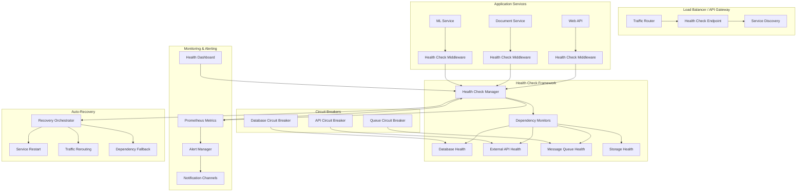

# Health Monitoring and System Resilience

**Description**: Comprehensive health monitoring patterns for distributed systems including readiness/liveness probes, dependency monitoring, circuit breakers, automated recovery strategies, and system resilience patterns.

**Integration Pattern**: Critical infrastructure pattern that ensures system reliability, enables automated recovery, and provides operational visibility into system health across microservices architectures.

## Health Monitoring Architecture

Modern distributed systems require sophisticated health monitoring to ensure reliability, enable automated recovery, and provide operational insights across multiple service dependencies.



## 1. Health Check Framework

### Core Health Check Infrastructure

```csharp
// src/Health/HealthCheckExtensions.cs
using Microsoft.Extensions.Diagnostics.HealthChecks;

namespace DocumentProcessing.Health;

public static class HealthCheckExtensions
{
    public static IServiceCollection AddComprehensiveHealthChecks(this IServiceCollection services, 
        IConfiguration configuration)
    {
        var healthOptions = configuration.GetSection("HealthChecks").Get<HealthCheckOptions>() ?? new();
        services.Configure<HealthCheckOptions>(configuration.GetSection("HealthChecks"));
        
        services.AddHealthChecks()
            .AddDatabaseHealthChecks(configuration)
            .AddExternalServiceHealthChecks(configuration)
            .AddInfrastructureHealthChecks(configuration)
            .AddBusinessLogicHealthChecks();
        
        // Register custom health check services
        services.AddSingleton<ISystemResourceMonitor, SystemResourceMonitor>();
        services.AddSingleton<IDependencyHealthMonitor, DependencyHealthMonitor>();
        services.AddSingleton<ICircuitBreakerHealthMonitor, CircuitBreakerHealthMonitor>();
        services.AddSingleton<IBusinessHealthMonitor, BusinessHealthMonitor>();
        
        // Add health check middleware
        services.AddSingleton<HealthCheckMiddleware>();
        
        return services;
    }
    
    private static IHealthChecksBuilder AddDatabaseHealthChecks(this IHealthChecksBuilder builder, 
        IConfiguration configuration)
    {
        var connectionString = configuration.GetConnectionString("DefaultConnection");
        if (!string.IsNullOrEmpty(connectionString))
        {
            builder.AddSqlServer(connectionString, 
                name: "database",
                tags: new[] { "database", "critical" },
                timeout: TimeSpan.FromSeconds(10));
        }
        
        // Redis cache
        var redisConnection = configuration.GetConnectionString("Redis");
        if (!string.IsNullOrEmpty(redisConnection))
        {
            builder.AddRedis(redisConnection,
                name: "redis-cache",
                tags: new[] { "cache", "non-critical" },
                timeout: TimeSpan.FromSeconds(5));
        }
        
        return builder;
    }
    
    private static IHealthChecksBuilder AddExternalServiceHealthChecks(this IHealthChecksBuilder builder, 
        IConfiguration configuration)
    {
        var externalServices = configuration.GetSection("ExternalServices").Get<ExternalServiceConfig[]>() ?? Array.Empty<ExternalServiceConfig>();
        
        foreach (var service in externalServices)
        {
            builder.AddTypeActivatedCheck<ExternalServiceHealthCheck>(
                name: $"external-{service.Name}",
                args: new object[] { service },
                tags: new[] { "external", service.Criticality },
                timeout: TimeSpan.FromSeconds(service.TimeoutSeconds));
        }
        
        return builder;
    }
    
    private static IHealthChecksBuilder AddInfrastructureHealthChecks(this IHealthChecksBuilder builder, 
        IConfiguration configuration)
    {
        // System resources
        builder.AddTypeActivatedCheck<SystemResourceHealthCheck>("system-resources",
            tags: new[] { "system", "critical" });
        
        // Disk space
        var diskPaths = configuration.GetSection("HealthChecks:DiskPaths").Get<string[]>() ?? new[] { "/" };
        foreach (var path in diskPaths)
        {
            builder.AddDiskStorageHealthCheck(options =>
            {
                options.AddDrive(path, minimumFreeMegabytes: 1024); // 1GB minimum
            }, name: $"disk-{path.Replace("/", "-").Replace("\\", "-")}", 
            tags: new[] { "disk", "critical" });
        }
        
        // Memory usage
        builder.AddPrivateMemoryHealthCheck(maximumMemoryBytes: 2_000_000_000, // 2GB limit
            name: "memory-usage",
            tags: new[] { "memory", "critical" });
        
        return builder;
    }
    
    private static IHealthChecksBuilder AddBusinessLogicHealthChecks(this IHealthChecksBuilder builder)
    {
        builder.AddTypeActivatedCheck<BusinessLogicHealthCheck>("business-logic",
            tags: new[] { "business", "non-critical" });
        
        builder.AddTypeActivatedCheck<MLModelHealthCheck>("ml-models",
            tags: new[] { "ml", "critical" });
        
        return builder;
    }
}

public class HealthCheckOptions
{
    public int CacheExpirationSeconds { get; set; } = 30;
    public bool EnableDetailedResults { get; set; } = true;
    public string[] CriticalTags { get; set; } = { "critical", "database", "ml" };
    public Dictionary<string, TimeSpan> CheckTimeouts { get; set; } = new();
}

public class ExternalServiceConfig
{
    public string Name { get; set; } = "";
    public string Url { get; set; } = "";
    public string Criticality { get; set; } = "non-critical";
    public int TimeoutSeconds { get; set; } = 10;
    public Dictionary<string, string> Headers { get; set; } = new();
}
```

### Advanced Health Check Implementations

```csharp
// src/Health/Checks/SystemResourceHealthCheck.cs
namespace DocumentProcessing.Health.Checks;

public class SystemResourceHealthCheck(ISystemResourceMonitor resourceMonitor) : IHealthCheck
{
    public async Task<HealthCheckResult> CheckHealthAsync(HealthCheckContext context, 
        CancellationToken cancellationToken = default)
    {
        try
        {
            var metrics = await resourceMonitor.GetCurrentMetricsAsync(cancellationToken);
            var issues = new List<string>();
            var data = new Dictionary<string, object>
            {
                ["CpuUsage"] = metrics.CpuUsagePercent,
                ["MemoryUsage"] = metrics.MemoryUsagePercent,
                ["DiskUsage"] = metrics.DiskUsagePercent,
                ["ThreadCount"] = metrics.ThreadCount,
                ["HandleCount"] = metrics.HandleCount
            };
            
            // Check CPU usage
            if (metrics.CpuUsagePercent > 90)
            {
                issues.Add($"High CPU usage: {metrics.CpuUsagePercent:F1}%");
            }
            
            // Check memory usage
            if (metrics.MemoryUsagePercent > 85)
            {
                issues.Add($"High memory usage: {metrics.MemoryUsagePercent:F1}%");
            }
            
            // Check disk usage
            if (metrics.DiskUsagePercent > 90)
            {
                issues.Add($"High disk usage: {metrics.DiskUsagePercent:F1}%");
            }
            
            // Check thread count
            if (metrics.ThreadCount > 1000)
            {
                issues.Add($"High thread count: {metrics.ThreadCount}");
            }
            
            if (issues.Count > 0)
            {
                return HealthCheckResult.Degraded(
                    $"System resource issues detected: {string.Join(", ", issues)}", 
                    data: data);
            }
            
            return HealthCheckResult.Healthy("System resources are within normal limits", data);
        }
        catch (Exception ex)
        {
            return HealthCheckResult.Unhealthy("Failed to check system resources", ex);
        }
    }
}

public interface ISystemResourceMonitor
{
    Task<SystemResourceMetrics> GetCurrentMetricsAsync(CancellationToken cancellationToken = default);
}

public class SystemResourceMonitor : ISystemResourceMonitor
{
    private static readonly PerformanceCounter cpuCounter = new("Processor", "% Processor Time", "_Total");
    private static readonly PerformanceCounter memoryCounter = new("Memory", "Available MBytes");
    
    public async Task<SystemResourceMetrics> GetCurrentMetricsAsync(CancellationToken cancellationToken = default)
    {
        await Task.Delay(100, cancellationToken); // Allow counters to initialize
        
        var process = Process.GetCurrentProcess();
        var totalMemory = GC.GetTotalMemory(false);
        var availableMemory = memoryCounter.NextValue() * 1024 * 1024; // Convert MB to bytes
        var systemMemory = totalMemory + availableMemory;
        
        return new SystemResourceMetrics
        {
            CpuUsagePercent = cpuCounter.NextValue(),
            MemoryUsagePercent = (double)totalMemory / systemMemory * 100,
            DiskUsagePercent = GetDiskUsagePercent("/"),
            ThreadCount = process.Threads.Count,
            HandleCount = process.HandleCount
        };
    }
    
    private static double GetDiskUsagePercent(string drive)
    {
        try
        {
            var driveInfo = new DriveInfo(drive);
            if (driveInfo.IsReady)
            {
                var usedSpace = driveInfo.TotalSize - driveInfo.AvailableFreeSpace;
                return (double)usedSpace / driveInfo.TotalSize * 100;
            }
        }
        catch
        {
            // Ignore errors and return 0
        }
        return 0;
    }
}

public record SystemResourceMetrics
{
    public float CpuUsagePercent { get; init; }
    public double MemoryUsagePercent { get; init; }
    public double DiskUsagePercent { get; init; }
    public int ThreadCount { get; init; }
    public int HandleCount { get; init; }
}
```

### External Service Health Check

```csharp
// src/Health/Checks/ExternalServiceHealthCheck.cs
namespace DocumentProcessing.Health.Checks;

public class ExternalServiceHealthCheck(
    ExternalServiceConfig config,
    IHttpClientFactory httpClientFactory,
    ILogger<ExternalServiceHealthCheck> logger) : IHealthCheck
{
    public async Task<HealthCheckResult> CheckHealthAsync(HealthCheckContext context, 
        CancellationToken cancellationToken = default)
    {
        try
        {
            using var httpClient = httpClientFactory.CreateClient($"health-{config.Name}");
            httpClient.Timeout = TimeSpan.FromSeconds(config.TimeoutSeconds);
            
            // Add custom headers
            foreach (var (key, value) in config.Headers)
            {
                httpClient.DefaultRequestHeaders.Add(key, value);
            }
            
            var stopwatch = Stopwatch.StartNew();
            var response = await httpClient.GetAsync(config.Url, cancellationToken);
            stopwatch.Stop();
            
            var data = new Dictionary<string, object>
            {
                ["Url"] = config.Url,
                ["StatusCode"] = (int)response.StatusCode,
                ["ResponseTime"] = stopwatch.ElapsedMilliseconds,
                ["IsSuccessStatusCode"] = response.IsSuccessStatusCode
            };
            
            if (response.IsSuccessStatusCode)
            {
                if (stopwatch.ElapsedMilliseconds > config.TimeoutSeconds * 500) // 50% of timeout
                {
                    return HealthCheckResult.Degraded(
                        $"External service {config.Name} is slow: {stopwatch.ElapsedMilliseconds}ms",
                        data: data);
                }
                
                return HealthCheckResult.Healthy(
                    $"External service {config.Name} is healthy ({stopwatch.ElapsedMilliseconds}ms)",
                    data);
            }
            else
            {
                return HealthCheckResult.Unhealthy(
                    $"External service {config.Name} returned {response.StatusCode}",
                    data: data);
            }
        }
        catch (TaskCanceledException ex) when (ex.InnerException is TimeoutException || cancellationToken.IsCancellationRequested)
        {
            return HealthCheckResult.Unhealthy(
                $"External service {config.Name} timeout after {config.TimeoutSeconds} seconds",
                ex);
        }
        catch (Exception ex)
        {
            logger.LogError(ex, "Health check failed for external service {ServiceName}", config.Name);
            return HealthCheckResult.Unhealthy(
                $"External service {config.Name} health check failed: {ex.Message}",
                ex);
        }
    }
}
```

## 2. Circuit Breaker Pattern

### Circuit Breaker Health Monitor

```csharp
// src/Health/CircuitBreakerHealthMonitor.cs
namespace DocumentProcessing.Health;

public interface ICircuitBreakerHealthMonitor
{
    Task<CircuitBreakerStatus> GetStatusAsync(string name);
    Task<Dictionary<string, CircuitBreakerStatus>> GetAllStatusesAsync();
    void RegisterCircuitBreaker(string name, ICircuitBreaker circuitBreaker);
}

public class CircuitBreakerHealthMonitor : ICircuitBreakerHealthMonitor
{
    private readonly ConcurrentDictionary<string, ICircuitBreaker> circuitBreakers = new();
    
    public void RegisterCircuitBreaker(string name, ICircuitBreaker circuitBreaker)
    {
        circuitBreakers.AddOrUpdate(name, circuitBreaker, (_, _) => circuitBreaker);
    }
    
    public async Task<CircuitBreakerStatus> GetStatusAsync(string name)
    {
        if (circuitBreakers.TryGetValue(name, out var circuitBreaker))
        {
            return await circuitBreaker.GetStatusAsync();
        }
        
        return new CircuitBreakerStatus
        {
            Name = name,
            State = CircuitBreakerState.Unknown,
            ErrorMessage = "Circuit breaker not found"
        };
    }
    
    public async Task<Dictionary<string, CircuitBreakerStatus>> GetAllStatusesAsync()
    {
        var results = new Dictionary<string, CircuitBreakerStatus>();
        
        foreach (var (name, circuitBreaker) in circuitBreakers)
        {
            try
            {
                results[name] = await circuitBreaker.GetStatusAsync();
            }
            catch (Exception ex)
            {
                results[name] = new CircuitBreakerStatus
                {
                    Name = name,
                    State = CircuitBreakerState.Unknown,
                    ErrorMessage = ex.Message
                };
            }
        }
        
        return results;
    }
}

public interface ICircuitBreaker
{
    Task<CircuitBreakerStatus> GetStatusAsync();
    Task<T> ExecuteAsync<T>(Func<Task<T>> operation);
}

public class CircuitBreaker(
    string name,
    CircuitBreakerOptions options,
    ILogger<CircuitBreaker> logger) : ICircuitBreaker
{
    private readonly SemaphoreSlim semaphore = new(1, 1);
    private CircuitBreakerState state = CircuitBreakerState.Closed;
    private int failureCount = 0;
    private DateTime lastFailureTime = DateTime.MinValue;
    private DateTime lastSuccessTime = DateTime.UtcNow;
    private long totalRequests = 0;
    private long successfulRequests = 0;
    private long failedRequests = 0;
    
    public async Task<CircuitBreakerStatus> GetStatusAsync()
    {
        await semaphore.WaitAsync();
        try
        {
            UpdateStateIfNeeded();
            
            return new CircuitBreakerStatus
            {
                Name = name,
                State = state,
                FailureCount = failureCount,
                TotalRequests = totalRequests,
                SuccessfulRequests = successfulRequests,
                FailedRequests = failedRequests,
                LastFailureTime = lastFailureTime == DateTime.MinValue ? null : lastFailureTime,
                LastSuccessTime = lastSuccessTime == DateTime.MinValue ? null : lastSuccessTime,
                SuccessRate = totalRequests > 0 ? (double)successfulRequests / totalRequests : 1.0,
                NextRetryTime = state == CircuitBreakerState.Open ? 
                    lastFailureTime.Add(options.OpenToHalfOpenTimeout) : null
            };
        }
        finally
        {
            semaphore.Release();
        }
    }
    
    public async Task<T> ExecuteAsync<T>(Func<Task<T>> operation)
    {
        await semaphore.WaitAsync();
        try
        {
            UpdateStateIfNeeded();
            
            if (state == CircuitBreakerState.Open)
            {
                throw new CircuitBreakerOpenException($"Circuit breaker '{name}' is open");
            }
            
            Interlocked.Increment(ref totalRequests);
            
            try
            {
                var result = await operation();
                OnSuccess();
                return result;
            }
            catch (Exception ex)
            {
                OnFailure();
                throw;
            }
        }
        finally
        {
            semaphore.Release();
        }
    }
    
    private void UpdateStateIfNeeded()
    {
        switch (state)
        {
            case CircuitBreakerState.Open when DateTime.UtcNow >= lastFailureTime.Add(options.OpenToHalfOpenTimeout):
                state = CircuitBreakerState.HalfOpen;
                logger.LogInformation("Circuit breaker '{Name}' moved from Open to Half-Open", name);
                break;
        }
    }
    
    private void OnSuccess()
    {
        Interlocked.Increment(ref successfulRequests);
        lastSuccessTime = DateTime.UtcNow;
        
        switch (state)
        {
            case CircuitBreakerState.HalfOpen:
                failureCount = 0;
                state = CircuitBreakerState.Closed;
                logger.LogInformation("Circuit breaker '{Name}' moved from Half-Open to Closed", name);
                break;
            case CircuitBreakerState.Closed when failureCount > 0:
                failureCount = Math.Max(0, failureCount - 1); // Gradual recovery
                break;
        }
    }
    
    private void OnFailure()
    {
        Interlocked.Increment(ref failedRequests);
        lastFailureTime = DateTime.UtcNow;
        failureCount++;
        
        if (failureCount >= options.FailureThreshold)
        {
            state = CircuitBreakerState.Open;
            logger.LogWarning("Circuit breaker '{Name}' moved to Open state after {FailureCount} failures", 
                name, failureCount);
        }
    }
}

public class CircuitBreakerOptions
{
    public int FailureThreshold { get; set; } = 5;
    public TimeSpan OpenToHalfOpenTimeout { get; set; } = TimeSpan.FromMinutes(1);
    public TimeSpan HealthCheckInterval { get; set; } = TimeSpan.FromSeconds(30);
}

public class CircuitBreakerStatus
{
    public string Name { get; set; } = "";
    public CircuitBreakerState State { get; set; }
    public int FailureCount { get; set; }
    public long TotalRequests { get; set; }
    public long SuccessfulRequests { get; set; }
    public long FailedRequests { get; set; }
    public DateTime? LastFailureTime { get; set; }
    public DateTime? LastSuccessTime { get; set; }
    public double SuccessRate { get; set; }
    public DateTime? NextRetryTime { get; set; }
    public string? ErrorMessage { get; set; }
}

public enum CircuitBreakerState
{
    Closed,
    Open,
    HalfOpen,
    Unknown
}

public class CircuitBreakerOpenException(string message) : Exception(message);
```

## 3. Business Logic Health Checks

### ML Model Health Check

```csharp
// src/Health/Checks/MLModelHealthCheck.cs
namespace DocumentProcessing.Health.Checks;

public class MLModelHealthCheck(
    IMLModelManager modelManager,
    ILogger<MLModelHealthCheck> logger) : IHealthCheck
{
    public async Task<HealthCheckResult> CheckHealthAsync(HealthCheckContext context, 
        CancellationToken cancellationToken = default)
    {
        try
        {
            var models = await modelManager.GetLoadedModelsAsync(cancellationToken);
            var issues = new List<string>();
            var data = new Dictionary<string, object>
            {
                ["LoadedModels"] = models.Count,
                ["Models"] = models.ToDictionary(m => m.Name, m => new
                {
                    m.Version,
                    m.LoadTime,
                    m.LastUsed,
                    m.PredictionCount,
                    m.AverageLatency,
                    IsHealthy = m.IsHealthy
                })
            };
            
            // Check if all critical models are loaded
            var criticalModels = new[] { "sentiment-analysis", "text-classification", "document-extraction" };
            foreach (var modelName in criticalModels)
            {
                var model = models.FirstOrDefault(m => m.Name.Equals(modelName, StringComparison.OrdinalIgnoreCase));
                if (model == null)
                {
                    issues.Add($"Critical model '{modelName}' is not loaded");
                }
                else if (!model.IsHealthy)
                {
                    issues.Add($"Critical model '{modelName}' is not healthy");
                }
            }
            
            // Check model performance
            foreach (var model in models)
            {
                if (model.AverageLatency > TimeSpan.FromSeconds(5))
                {
                    issues.Add($"Model '{model.Name}' has high latency: {model.AverageLatency.TotalMilliseconds:F0}ms");
                }
                
                if (model.LastUsed < DateTime.UtcNow.AddHours(-24))
                {
                    issues.Add($"Model '{model.Name}' hasn't been used in over 24 hours");
                }
            }
            
            // Perform lightweight inference test
            try
            {
                var testResult = await modelManager.TestInferenceAsync("test document", cancellationToken);
                data["TestInference"] = new { testResult.Success, testResult.Latency };
                
                if (!testResult.Success)
                {
                    issues.Add("Test inference failed");
                }
            }
            catch (Exception ex)
            {
                issues.Add($"Test inference error: {ex.Message}");
            }
            
            if (issues.Count > 0)
            {
                var severity = issues.Any(i => i.Contains("Critical")) ? HealthStatus.Unhealthy : HealthStatus.Degraded;
                return new HealthCheckResult(severity, 
                    $"ML model issues detected: {string.Join(", ", issues)}", 
                    data: data);
            }
            
            return HealthCheckResult.Healthy($"All {models.Count} ML models are healthy", data);
        }
        catch (Exception ex)
        {
            logger.LogError(ex, "Failed to check ML model health");
            return HealthCheckResult.Unhealthy("Failed to check ML model health", ex);
        }
    }
}

public interface IMLModelManager
{
    Task<List<MLModelInfo>> GetLoadedModelsAsync(CancellationToken cancellationToken = default);
    Task<InferenceTestResult> TestInferenceAsync(string testInput, CancellationToken cancellationToken = default);
}

public record MLModelInfo
{
    public string Name { get; init; } = "";
    public string Version { get; init; } = "";
    public DateTime LoadTime { get; init; }
    public DateTime LastUsed { get; init; }
    public long PredictionCount { get; init; }
    public TimeSpan AverageLatency { get; init; }
    public bool IsHealthy { get; init; }
}

public record InferenceTestResult
{
    public bool Success { get; init; }
    public TimeSpan Latency { get; init; }
    public string? ErrorMessage { get; init; }
}
```

## 4. Health Check API and Monitoring

### Health Check API Controller

```csharp
// src/Controllers/HealthController.cs
namespace DocumentProcessing.Controllers;

[ApiController]
[Route("health")]
public class HealthController(
    HealthCheckService healthCheckService,
    ICircuitBreakerHealthMonitor circuitBreakerMonitor,
    ISystemResourceMonitor resourceMonitor) : ControllerBase
{
    [HttpGet]
    public async Task<IActionResult> Get()
    {
        var report = await healthCheckService.CheckHealthAsync();
        var response = new HealthResponse
        {
            Status = report.Status.ToString(),
            TotalDuration = report.TotalDuration,
            Checks = report.Entries.ToDictionary(
                kvp => kvp.Key,
                kvp => new HealthCheckResponse
                {
                    Status = kvp.Value.Status.ToString(),
                    Description = kvp.Value.Description,
                    Duration = kvp.Value.Duration,
                    Data = kvp.Value.Data,
                    Exception = kvp.Value.Exception?.Message,
                    Tags = kvp.Value.Tags
                })
        };
        
        var statusCode = report.Status == HealthStatus.Healthy ? 200 : 503;
        return StatusCode(statusCode, response);
    }
    
    [HttpGet("detailed")]
    public async Task<IActionResult> GetDetailed()
    {
        var report = await healthCheckService.CheckHealthAsync();
        var circuitBreakers = await circuitBreakerMonitor.GetAllStatusesAsync();
        var resources = await resourceMonitor.GetCurrentMetricsAsync();
        
        var response = new DetailedHealthResponse
        {
            Status = report.Status.ToString(),
            TotalDuration = report.TotalDuration,
            Timestamp = DateTimeOffset.UtcNow,
            Checks = report.Entries.ToDictionary(
                kvp => kvp.Key,
                kvp => new HealthCheckResponse
                {
                    Status = kvp.Value.Status.ToString(),
                    Description = kvp.Value.Description,
                    Duration = kvp.Value.Duration,
                    Data = kvp.Value.Data,
                    Exception = kvp.Value.Exception?.Message,
                    Tags = kvp.Value.Tags
                }),
            CircuitBreakers = circuitBreakers,
            SystemResources = resources
        };
        
        var statusCode = report.Status == HealthStatus.Healthy ? 200 : 503;
        return StatusCode(statusCode, response);
    }
    
    [HttpGet("live")]
    public IActionResult Live()
    {
        // Kubernetes liveness probe - basic application responsiveness
        return Ok(new { status = "alive", timestamp = DateTimeOffset.UtcNow });
    }
    
    [HttpGet("ready")]
    public async Task<IActionResult> Ready()
    {
        // Kubernetes readiness probe - check critical dependencies
        var report = await healthCheckService.CheckHealthAsync(check => 
            check.Tags.Contains("critical"));
        
        var statusCode = report.Status == HealthStatus.Healthy ? 200 : 503;
        return StatusCode(statusCode, new 
        { 
            status = report.Status.ToString().ToLower(),
            timestamp = DateTimeOffset.UtcNow,
            checks = report.Entries.Count
        });
    }
}

public class HealthResponse
{
    public string Status { get; set; } = "";
    public TimeSpan TotalDuration { get; set; }
    public Dictionary<string, HealthCheckResponse> Checks { get; set; } = new();
}

public class DetailedHealthResponse : HealthResponse
{
    public DateTimeOffset Timestamp { get; set; }
    public Dictionary<string, CircuitBreakerStatus> CircuitBreakers { get; set; } = new();
    public SystemResourceMetrics SystemResources { get; set; } = new();
}

public class HealthCheckResponse
{
    public string Status { get; set; } = "";
    public string? Description { get; set; }
    public TimeSpan Duration { get; set; }
    public IReadOnlyDictionary<string, object>? Data { get; set; }
    public string? Exception { get; set; }
    public IEnumerable<string>? Tags { get; set; }
}
```

## 5. Configuration and Deployment

### Health Check Configuration

```json
{
  "HealthChecks": {
    "CacheExpirationSeconds": 30,
    "EnableDetailedResults": true,
    "CriticalTags": ["critical", "database", "ml"],
    "DiskPaths": ["/", "/var/log", "/tmp"],
    "CheckTimeouts": {
      "database": "00:00:10",
      "external-api": "00:00:05",
      "ml-models": "00:00:15"
    }
  },
  "ExternalServices": [
    {
      "Name": "document-api",
      "Url": "https://api.documents.com/health",
      "Criticality": "critical",
      "TimeoutSeconds": 10,
      "Headers": {
        "X-API-Key": "your-api-key"
      }
    },
    {
      "Name": "notification-service",
      "Url": "https://notifications.com/ping",
      "Criticality": "non-critical",
      "TimeoutSeconds": 5
    }
  ],
  "CircuitBreakers": {
    "database": {
      "FailureThreshold": 5,
      "OpenToHalfOpenTimeout": "00:01:00"
    },
    "external-api": {
      "FailureThreshold": 3,
      "OpenToHalfOpenTimeout": "00:00:30"
    }
  }
}
```

### Kubernetes Health Check Configuration

```yaml
# k8s-deployment.yml
apiVersion: apps/v1
kind: Deployment
metadata:
  name: document-processing-api
spec:
  replicas: 3
  selector:
    matchLabels:
      app: document-processing-api
  template:
    metadata:
      labels:
        app: document-processing-api
    spec:
      containers:
      - name: api
        image: document-processing:latest
        ports:
        - containerPort: 80
        env:
        - name: ASPNETCORE_ENVIRONMENT
          value: "Production"
        resources:
          requests:
            memory: "256Mi"
            cpu: "250m"
          limits:
            memory: "512Mi"
            cpu: "500m"
        livenessProbe:
          httpGet:
            path: /health/live
            port: 80
          initialDelaySeconds: 30
          periodSeconds: 10
          timeoutSeconds: 5
          failureThreshold: 3
        readinessProbe:
          httpGet:
            path: /health/ready
            port: 80
          initialDelaySeconds: 15
          periodSeconds: 5
          timeoutSeconds: 3
          failureThreshold: 2
        startupProbe:
          httpGet:
            path: /health/ready
            port: 80
          initialDelaySeconds: 10
          periodSeconds: 10
          timeoutSeconds: 3
          failureThreshold: 10
---
apiVersion: v1
kind: Service
metadata:
  name: document-processing-service
spec:
  selector:
    app: document-processing-api
  ports:
  - protocol: TCP
    port: 80
    targetPort: 80
  type: LoadBalancer
```

### Prometheus Monitoring Integration

```yaml
# prometheus-rules.yml
groups:
- name: document-processing-health
  rules:
  - alert: ServiceUnhealthy
    expr: up{job="document-processing"} == 0
    for: 1m
    labels:
      severity: critical
    annotations:
      summary: "Document Processing service is down"
      description: "Service {{ $labels.instance }} has been down for more than 1 minute"
      
  - alert: HealthCheckFailing
    expr: health_check_status{status!="Healthy"} == 1
    for: 2m
    labels:
      severity: warning
    annotations:
      summary: "Health check failing"
      description: "Health check {{ $labels.name }} on {{ $labels.instance }} has been failing"
      
  - alert: CircuitBreakerOpen
    expr: circuit_breaker_state{state="Open"} == 1
    for: 30s
    labels:
      severity: warning
    annotations:
      summary: "Circuit breaker is open"
      description: "Circuit breaker {{ $labels.name }} on {{ $labels.instance }} is open"
      
  - alert: HighErrorRate
    expr: rate(health_check_failures_total[5m]) > 0.1
    for: 2m
    labels:
      severity: warning
    annotations:
      summary: "High health check error rate"
      description: "Error rate is {{ $value }} per second on {{ $labels.instance }}"
```

## Health Monitoring Best Practices

| Practice | Implementation | Benefit |
|----------|---------------|---------|
| **Layered Health Checks** | Separate liveness, readiness, and startup probes | Proper container orchestration |
| **Dependency Monitoring** | Check external services and databases | Early issue detection |
| **Circuit Breaker Integration** | Monitor circuit breaker states | Prevent cascade failures |
| **Resource Monitoring** | Track CPU, memory, disk usage | Performance optimization |
| **Business Logic Validation** | Test critical application functions | End-to-end health validation |
| **Alerting Integration** | Connect to monitoring systems | Proactive issue resolution |

---

**Key Benefits**: Automated failure detection, improved system reliability, reduced downtime, proactive monitoring, container orchestration support

**When to Use**: All production distributed systems, microservices architectures, cloud-native applications, systems requiring high availability

**Performance**: Minimal overhead with caching, configurable check intervals, intelligent probe configuration