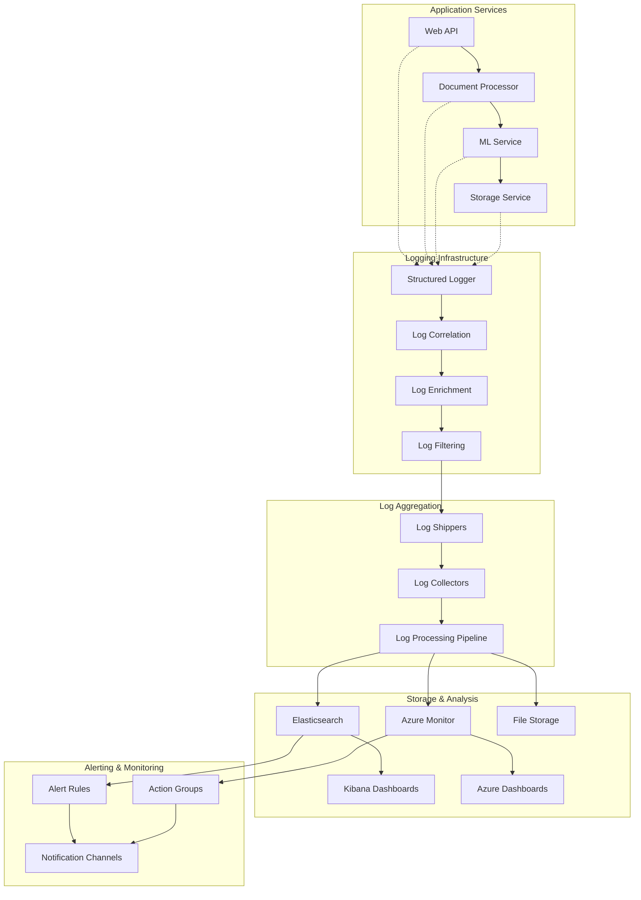

# Logging Strategy and Implementation

**Description**: Comprehensive logging architecture patterns with structured logging, centralized log management, correlation tracking, and performance monitoring for distributed document processing systems.

**Integration Pattern**: Cross-cutting logging infrastructure that provides observability, debugging capabilities, and operational insights across microservices.

## Logging Architecture Overview

Modern distributed systems require sophisticated logging strategies to ensure observability, troubleshooting capabilities, and compliance requirements.



## 1. Structured Logging Implementation

### Core Logging Infrastructure

```csharp
// src/Shared/Logging/LoggingConfiguration.cs
using Serilog;
using Serilog.Enrichers.Span;
using Serilog.Events;
using Serilog.Sinks.Elasticsearch;

namespace DocumentProcessing.Shared.Logging;

public static class LoggingConfiguration
{
    public static void ConfigureLogging(this IServiceCollection services, IConfiguration configuration)
    {
        var loggingOptions = configuration.GetSection("Logging").Get<LoggingOptions>() ?? new LoggingOptions();
        services.Configure<LoggingOptions>(configuration.GetSection("Logging"));
        
        // Configure Serilog
        Log.Logger = new LoggerConfiguration()
            .ConfigureBaseLogging(loggingOptions)
            .ConfigureEnrichment(loggingOptions)
            .ConfigureSinks(loggingOptions, configuration)
            .CreateLogger();
        
        services.AddSingleton(Log.Logger);
        services.AddSingleton<ILoggerFactory>(new SerilogLoggerFactory(Log.Logger));
        
        // Register custom logging services
        services.AddScoped<ICorrelationService, CorrelationService>();
        services.AddScoped<IStructuredLogger, StructuredLogger>();
        services.AddScoped<IPerformanceLogger, PerformanceLogger>();
        services.AddScoped<ISecurityLogger, SecurityLogger>();
        
        // Add logging middleware
        services.AddSingleton<LoggingMiddleware>();
        services.AddSingleton<PerformanceLoggingMiddleware>();
        services.AddSingleton<SecurityLoggingMiddleware>();
    }
    
    private static LoggerConfiguration ConfigureBaseLogging(this LoggerConfiguration config, LoggingOptions options)
    {
        return config
            .MinimumLevel.Is(options.MinimumLevel)
            .MinimumLevel.Override("Microsoft", LogEventLevel.Information)
            .MinimumLevel.Override("Microsoft.Hosting.Lifetime", LogEventLevel.Information)
            .MinimumLevel.Override("System", LogEventLevel.Warning)
            .MinimumLevel.Override("Microsoft.AspNetCore.Authentication", LogEventLevel.Information);
    }
    
    private static LoggerConfiguration ConfigureEnrichment(this LoggerConfiguration config, LoggingOptions options)
    {
        config = config
            .Enrich.FromLogContext()
            .Enrich.WithProperty("Application", options.ApplicationName)
            .Enrich.WithProperty("Environment", options.Environment)
            .Enrich.WithProperty("Version", options.ApplicationVersion)
            .Enrich.WithMachineName()
            .Enrich.WithProcessId()
            .Enrich.WithThreadId();
        
        if (options.EnableSpanEnrichment)
        {
            config = config.Enrich.WithSpan();
        }
        
        return config;
    }
    
    private static LoggerConfiguration ConfigureSinks(this LoggerConfiguration config, 
        LoggingOptions options, IConfiguration configuration)
    {
        // Console logging
        if (options.EnableConsoleLogging)
        {
            config = config.WriteTo.Console(
                outputTemplate: options.ConsoleTemplate,
                restrictedToMinimumLevel: options.ConsoleMinimumLevel);
        }
        
        // File logging
        if (options.EnableFileLogging)
        {
            config = config.WriteTo.File(
                path: options.LogFilePath,
                rollingInterval: RollingInterval.Day,
                retainedFileCountLimit: options.RetainedFileCount,
                outputTemplate: options.FileTemplate,
                restrictedToMinimumLevel: options.FileMinimumLevel);
        }
        
        // Elasticsearch
        if (options.EnableElasticsearchLogging && !string.IsNullOrEmpty(options.ElasticsearchUrl))
        {
            config = config.WriteTo.Elasticsearch(new ElasticsearchSinkOptions(new Uri(options.ElasticsearchUrl))
            {
                IndexFormat = options.ElasticsearchIndexPattern,
                AutoRegisterTemplate = true,
                AutoRegisterTemplateVersion = AutoRegisterTemplateVersion.ESv7,
                MinimumLogEventLevel = options.ElasticsearchMinimumLevel,
                BufferBaseFilename = options.ElasticsearchBufferPath,
                BufferLogShippingInterval = TimeSpan.FromSeconds(options.BufferIntervalSeconds)
            });
        }
        
        // Azure Monitor (Application Insights)
        if (options.EnableApplicationInsights && !string.IsNullOrEmpty(options.ApplicationInsightsConnectionString))
        {
            config = config.WriteTo.ApplicationInsights(
                options.ApplicationInsightsConnectionString,
                TelemetryConverter.Traces);
        }
        
        // Seq logging for development
        if (options.EnableSeqLogging && !string.IsNullOrEmpty(options.SeqUrl))
        {
            config = config.WriteTo.Seq(options.SeqUrl, apiKey: options.SeqApiKey);
        }
        
        return config;
    }
}

public class LoggingOptions
{
    public string ApplicationName { get; set; } = "DocumentProcessing";
    public string Environment { get; set; } = "Development";
    public string ApplicationVersion { get; set; } = "1.0.0";
    
    // Base logging configuration
    public LogEventLevel MinimumLevel { get; set; } = LogEventLevel.Information;
    public bool EnableSpanEnrichment { get; set; } = true;
    
    // Console logging
    public bool EnableConsoleLogging { get; set; } = true;
    public LogEventLevel ConsoleMinimumLevel { get; set; } = LogEventLevel.Information;
    public string ConsoleTemplate { get; set; } = "[{Timestamp:HH:mm:ss} {Level:u3}] [{CorrelationId}] {Message:lj}{NewLine}{Exception}";
    
    // File logging
    public bool EnableFileLogging { get; set; } = true;
    public LogEventLevel FileMinimumLevel { get; set; } = LogEventLevel.Information;
    public string LogFilePath { get; set; } = "logs/app-.txt";
    public string FileTemplate { get; set; } = "{Timestamp:yyyy-MM-dd HH:mm:ss.fff zzz} [{Level:u3}] [{CorrelationId}] [{SourceContext}] {Message:lj}{NewLine}{Exception}";
    public int RetainedFileCount { get; set; } = 31;
    
    // Elasticsearch
    public bool EnableElasticsearchLogging { get; set; } = false;
    public string? ElasticsearchUrl { get; set; }
    public string ElasticsearchIndexPattern { get; set; } = "document-processing-{0:yyyy.MM.dd}";
    public LogEventLevel ElasticsearchMinimumLevel { get; set; } = LogEventLevel.Warning;
    public string ElasticsearchBufferPath { get; set; } = "logs/buffer-{Date}.txt";
    public int BufferIntervalSeconds { get; set; } = 5;
    
    // Application Insights
    public bool EnableApplicationInsights { get; set; } = false;
    public string? ApplicationInsightsConnectionString { get; set; }
    
    // Seq (for development)
    public bool EnableSeqLogging { get; set; } = false;
    public string? SeqUrl { get; set; }
    public string? SeqApiKey { get; set; }
}
```

### Structured Logger Implementation

```csharp
// src/Shared/Logging/StructuredLogger.cs
using Microsoft.Extensions.Logging;
using System.Runtime.CompilerServices;

namespace DocumentProcessing.Shared.Logging;

public interface IStructuredLogger
{
    void LogDocumentProcessingStarted(string documentId, string documentType, string userId);
    void LogDocumentProcessingCompleted(string documentId, TimeSpan processingTime, bool success);
    void LogMLModelInference(string modelName, TimeSpan inferenceTime, float confidence);
    void LogBusinessOperation(string operationName, Dictionary<string, object> properties);
    void LogError(Exception exception, string message, params object[] args);
    void LogWarning(string message, params object[] args);
    void LogInformation(string message, params object[] args);
    void LogDebug(string message, params object[] args);
}

public class StructuredLogger(
    ILogger<StructuredLogger> logger,
    ICorrelationService correlationService) : IStructuredLogger
{
    public void LogDocumentProcessingStarted(string documentId, string documentType, string userId)
    {
        using (logger.BeginScope(new Dictionary<string, object>
        {
            ["DocumentId"] = documentId,
            ["DocumentType"] = documentType,
            ["UserId"] = userId,
            ["CorrelationId"] = correlationService.GetCorrelationId(),
            ["OperationType"] = "DocumentProcessing"
        }))
        {
            logger.LogInformation("Document processing started for document {DocumentId} of type {DocumentType} by user {UserId}",
                documentId, documentType, userId);
        }
    }
    
    public void LogDocumentProcessingCompleted(string documentId, TimeSpan processingTime, bool success)
    {
        using (logger.BeginScope(new Dictionary<string, object>
        {
            ["DocumentId"] = documentId,
            ["ProcessingTimeMs"] = processingTime.TotalMilliseconds,
            ["Success"] = success,
            ["CorrelationId"] = correlationService.GetCorrelationId(),
            ["OperationType"] = "DocumentProcessing"
        }))
        {
            if (success)
            {
                logger.LogInformation("Document processing completed successfully for {DocumentId} in {ProcessingTime}ms",
                    documentId, processingTime.TotalMilliseconds);
            }
            else
            {
                logger.LogError("Document processing failed for {DocumentId} after {ProcessingTime}ms",
                    documentId, processingTime.TotalMilliseconds);
            }
        }
    }
    
    public void LogMLModelInference(string modelName, TimeSpan inferenceTime, float confidence)
    {
        using (logger.BeginScope(new Dictionary<string, object>
        {
            ["ModelName"] = modelName,
            ["InferenceTimeMs"] = inferenceTime.TotalMilliseconds,
            ["Confidence"] = confidence,
            ["CorrelationId"] = correlationService.GetCorrelationId(),
            ["OperationType"] = "MLInference"
        }))
        {
            logger.LogInformation("ML model {ModelName} inference completed in {InferenceTime}ms with confidence {Confidence}",
                modelName, inferenceTime.TotalMilliseconds, confidence);
        }
    }
    
    public void LogBusinessOperation(string operationName, Dictionary<string, object> properties)
    {
        var scopeProperties = new Dictionary<string, object>(properties)
        {
            ["OperationName"] = operationName,
            ["CorrelationId"] = correlationService.GetCorrelationId(),
            ["OperationType"] = "BusinessOperation"
        };
        
        using (logger.BeginScope(scopeProperties))
        {
            logger.LogInformation("Business operation {OperationName} executed with properties {Properties}",
                operationName, properties);
        }
    }
    
    public void LogError(Exception exception, string message, params object[] args)
    {
        using (logger.BeginScope(new Dictionary<string, object>
        {
            ["CorrelationId"] = correlationService.GetCorrelationId(),
            ["ExceptionType"] = exception.GetType().Name,
            ["LogLevel"] = "Error"
        }))
        {
            logger.LogError(exception, message, args);
        }
    }
    
    public void LogWarning(string message, params object[] args)
    {
        using (logger.BeginScope(new Dictionary<string, object>
        {
            ["CorrelationId"] = correlationService.GetCorrelationId(),
            ["LogLevel"] = "Warning"
        }))
        {
            logger.LogWarning(message, args);
        }
    }
    
    public void LogInformation(string message, params object[] args)
    {
        using (logger.BeginScope(new Dictionary<string, object>
        {
            ["CorrelationId"] = correlationService.GetCorrelationId(),
            ["LogLevel"] = "Information"
        }))
        {
            logger.LogInformation(message, args);
        }
    }
    
    public void LogDebug(string message, params object[] args)
    {
        using (logger.BeginScope(new Dictionary<string, object>
        {
            ["CorrelationId"] = correlationService.GetCorrelationId(),
            ["LogLevel"] = "Debug"
        }))
        {
            logger.LogDebug(message, args);
        }
    }
}
```

## 2. Correlation and Context Management

### Correlation Service Implementation

```csharp
// src/Shared/Logging/CorrelationService.cs
namespace DocumentProcessing.Shared.Logging;

public interface ICorrelationService
{
    string GetCorrelationId();
    void SetCorrelationId(string correlationId);
    string GenerateNewCorrelationId();
    void EnrichWithCorrelation(IDictionary<string, object> properties);
}

public class CorrelationService(IHttpContextAccessor httpContextAccessor) : ICorrelationService
{
    private const string CorrelationIdHeader = "X-Correlation-ID";
    private const string CorrelationIdKey = "CorrelationId";
    
    public string GetCorrelationId()
    {
        // Try to get from HTTP context first
        if (httpContextAccessor.HttpContext?.Items.TryGetValue(CorrelationIdKey, out var correlationId) == true)
        {
            return correlationId?.ToString() ?? GenerateNewCorrelationId();
        }
        
        // Try to get from HTTP headers
        if (httpContextAccessor.HttpContext?.Request?.Headers?.TryGetValue(CorrelationIdHeader, out var headerValue) == true)
        {
            var id = headerValue.FirstOrDefault();
            if (!string.IsNullOrEmpty(id))
            {
                SetCorrelationId(id);
                return id;
            }
        }
        
        // Try to get from AsyncLocal (for background operations)
        var asyncLocalId = AsyncLocalCorrelation.CorrelationId;
        if (!string.IsNullOrEmpty(asyncLocalId))
        {
            return asyncLocalId;
        }
        
        // Generate new correlation ID
        var newId = GenerateNewCorrelationId();
        SetCorrelationId(newId);
        return newId;
    }
    
    public void SetCorrelationId(string correlationId)
    {
        // Set in HTTP context
        if (httpContextAccessor.HttpContext != null)
        {
            httpContextAccessor.HttpContext.Items[CorrelationIdKey] = correlationId;
            httpContextAccessor.HttpContext.Response.Headers[CorrelationIdHeader] = correlationId;
        }
        
        // Set in AsyncLocal for background operations
        AsyncLocalCorrelation.CorrelationId = correlationId;
    }
    
    public string GenerateNewCorrelationId()
    {
        return Guid.NewGuid().ToString("N")[..16]; // Short correlation ID
    }
    
    public void EnrichWithCorrelation(IDictionary<string, object> properties)
    {
        properties[CorrelationIdKey] = GetCorrelationId();
        
        if (httpContextAccessor.HttpContext != null)
        {
            properties["RequestPath"] = httpContextAccessor.HttpContext.Request.Path.Value ?? "";
            properties["RequestMethod"] = httpContextAccessor.HttpContext.Request.Method;
            properties["UserAgent"] = httpContextAccessor.HttpContext.Request.Headers["User-Agent"].FirstOrDefault() ?? "";
            properties["RemoteIP"] = httpContextAccessor.HttpContext.Connection.RemoteIpAddress?.ToString() ?? "";
        }
    }
}

// AsyncLocal storage for correlation ID in background operations
public static class AsyncLocalCorrelation
{
    private static readonly AsyncLocal<string?> correlationId = new();
    
    public static string? CorrelationId
    {
        get => correlationId.Value;
        set => correlationId.Value = value;
    }
}
```

## 3. Performance and Security Logging

### Performance Logger

```csharp
// src/Shared/Logging/PerformanceLogger.cs
namespace DocumentProcessing.Shared.Logging;

public interface IPerformanceLogger
{
    IDisposable StartOperation(string operationName, Dictionary<string, object>? properties = null);
    void LogSlowOperation(string operationName, TimeSpan duration, Dictionary<string, object>? properties = null);
    void LogDatabaseOperation(string operation, string table, TimeSpan duration, int? recordCount = null);
    void LogHttpOperation(string method, string url, int statusCode, TimeSpan duration);
}

public class PerformanceLogger(
    ILogger<PerformanceLogger> logger,
    ICorrelationService correlationService) : IPerformanceLogger
{
    public IDisposable StartOperation(string operationName, Dictionary<string, object>? properties = null)
    {
        return new OperationTimer(operationName, this, properties);
    }
    
    public void LogSlowOperation(string operationName, TimeSpan duration, Dictionary<string, object>? properties = null)
    {
        var logProperties = new Dictionary<string, object>
        {
            ["OperationName"] = operationName,
            ["DurationMs"] = duration.TotalMilliseconds,
            ["CorrelationId"] = correlationService.GetCorrelationId(),
            ["PerformanceCategory"] = "SlowOperation"
        };
        
        if (properties != null)
        {
            foreach (var (key, value) in properties)
            {
                logProperties[key] = value;
            }
        }
        
        using (logger.BeginScope(logProperties))
        {
            logger.LogWarning("Slow operation detected: {OperationName} took {DurationMs}ms", 
                operationName, duration.TotalMilliseconds);
        }
    }
    
    public void LogDatabaseOperation(string operation, string table, TimeSpan duration, int? recordCount = null)
    {
        var properties = new Dictionary<string, object>
        {
            ["DatabaseOperation"] = operation,
            ["TableName"] = table,
            ["DurationMs"] = duration.TotalMilliseconds,
            ["CorrelationId"] = correlationService.GetCorrelationId(),
            ["PerformanceCategory"] = "DatabaseOperation"
        };
        
        if (recordCount.HasValue)
        {
            properties["RecordCount"] = recordCount.Value;
        }
        
        using (logger.BeginScope(properties))
        {
            if (recordCount.HasValue)
            {
                logger.LogInformation("Database {Operation} on {TableName} completed in {DurationMs}ms, {RecordCount} records",
                    operation, table, duration.TotalMilliseconds, recordCount.Value);
            }
            else
            {
                logger.LogInformation("Database {Operation} on {TableName} completed in {DurationMs}ms",
                    operation, table, duration.TotalMilliseconds);
            }
        }
    }
    
    public void LogHttpOperation(string method, string url, int statusCode, TimeSpan duration)
    {
        var properties = new Dictionary<string, object>
        {
            ["HttpMethod"] = method,
            ["Url"] = url,
            ["StatusCode"] = statusCode,
            ["DurationMs"] = duration.TotalMilliseconds,
            ["CorrelationId"] = correlationService.GetCorrelationId(),
            ["PerformanceCategory"] = "HttpOperation"
        };
        
        using (logger.BeginScope(properties))
        {
            var logLevel = statusCode >= 400 ? LogLevel.Error : 
                          duration.TotalMilliseconds > 1000 ? LogLevel.Warning : LogLevel.Information;
            
            logger.Log(logLevel, "HTTP {Method} {Url} returned {StatusCode} in {DurationMs}ms",
                method, url, statusCode, duration.TotalMilliseconds);
        }
    }
}

public class OperationTimer : IDisposable
{
    private readonly string operationName;
    private readonly PerformanceLogger performanceLogger;
    private readonly Dictionary<string, object>? properties;
    private readonly long startTimestamp;
    private bool disposed = false;
    
    public OperationTimer(string operationName, PerformanceLogger performanceLogger, Dictionary<string, object>? properties)
    {
        this.operationName = operationName;
        this.performanceLogger = performanceLogger;
        this.properties = properties;
        startTimestamp = Stopwatch.GetTimestamp();
    }
    
    public void Dispose()
    {
        if (!disposed)
        {
            var duration = Stopwatch.GetElapsedTime(startTimestamp);
            
            // Log as slow operation if over threshold
            if (duration.TotalMilliseconds > 1000) // 1 second threshold
            {
                performanceLogger.LogSlowOperation(operationName, duration, properties);
            }
            
            disposed = true;
        }
    }
}
```

### Security Logger

```csharp
// src/Shared/Logging/SecurityLogger.cs
namespace DocumentProcessing.Shared.Logging;

public interface ISecurityLogger
{
    void LogAuthenticationAttempt(string userId, bool success, string? reason = null);
    void LogAuthorizationFailure(string userId, string resource, string action);
    void LogSensitiveDataAccess(string userId, string dataType, string resourceId);
    void LogSecurityViolation(string userId, string violationType, string details);
    void LogDataModification(string userId, string entityType, string entityId, string operation);
}

public class SecurityLogger(
    ILogger<SecurityLogger> logger,
    ICorrelationService correlationService) : ISecurityLogger
{
    public void LogAuthenticationAttempt(string userId, bool success, string? reason = null)
    {
        var properties = new Dictionary<string, object>
        {
            ["UserId"] = userId,
            ["AuthenticationSuccess"] = success,
            ["CorrelationId"] = correlationService.GetCorrelationId(),
            ["SecurityCategory"] = "Authentication"
        };
        
        if (!string.IsNullOrEmpty(reason))
        {
            properties["FailureReason"] = reason;
        }
        
        using (logger.BeginScope(properties))
        {
            if (success)
            {
                logger.LogInformation("Authentication successful for user {UserId}", userId);
            }
            else
            {
                logger.LogWarning("Authentication failed for user {UserId}. Reason: {Reason}", 
                    userId, reason ?? "Unknown");
            }
        }
    }
    
    public void LogAuthorizationFailure(string userId, string resource, string action)
    {
        var properties = new Dictionary<string, object>
        {
            ["UserId"] = userId,
            ["Resource"] = resource,
            ["Action"] = action,
            ["CorrelationId"] = correlationService.GetCorrelationId(),
            ["SecurityCategory"] = "Authorization"
        };
        
        using (logger.BeginScope(properties))
        {
            logger.LogWarning("Authorization failed: User {UserId} attempted {Action} on {Resource}", 
                userId, action, resource);
        }
    }
    
    public void LogSensitiveDataAccess(string userId, string dataType, string resourceId)
    {
        var properties = new Dictionary<string, object>
        {
            ["UserId"] = userId,
            ["DataType"] = dataType,
            ["ResourceId"] = resourceId,
            ["CorrelationId"] = correlationService.GetCorrelationId(),
            ["SecurityCategory"] = "SensitiveDataAccess"
        };
        
        using (logger.BeginScope(properties))
        {
            logger.LogInformation("Sensitive data access: User {UserId} accessed {DataType} resource {ResourceId}", 
                userId, dataType, resourceId);
        }
    }
    
    public void LogSecurityViolation(string userId, string violationType, string details)
    {
        var properties = new Dictionary<string, object>
        {
            ["UserId"] = userId,
            ["ViolationType"] = violationType,
            ["Details"] = details,
            ["CorrelationId"] = correlationService.GetCorrelationId(),
            ["SecurityCategory"] = "SecurityViolation"
        };
        
        using (logger.BeginScope(properties))
        {
            logger.LogError("Security violation detected: User {UserId}, Type: {ViolationType}, Details: {Details}", 
                userId, violationType, details);
        }
    }
    
    public void LogDataModification(string userId, string entityType, string entityId, string operation)
    {
        var properties = new Dictionary<string, object>
        {
            ["UserId"] = userId,
            ["EntityType"] = entityType,
            ["EntityId"] = entityId,
            ["Operation"] = operation,
            ["CorrelationId"] = correlationService.GetCorrelationId(),
            ["SecurityCategory"] = "DataModification"
        };
        
        using (logger.BeginScope(properties))
        {
            logger.LogInformation("Data modification: User {UserId} performed {Operation} on {EntityType} {EntityId}", 
                userId, operation, entityType, entityId);
        }
    }
}
```

## 4. Logging Middleware

### Request Logging Middleware

```csharp
// src/Middleware/LoggingMiddleware.cs
namespace DocumentProcessing.Middleware;

public class LoggingMiddleware(
    RequestDelegate next,
    IStructuredLogger structuredLogger,
    ICorrelationService correlationService,
    IConfiguration configuration)
{
    private readonly string[] sensitiveHeaders = { "Authorization", "Cookie", "X-API-Key" };
    private readonly bool enableRequestBodyLogging = configuration.GetValue<bool>("Logging:EnableRequestBodyLogging");
    
    public async Task InvokeAsync(HttpContext context)
    {
        // Ensure correlation ID is set
        correlationService.GetCorrelationId();
        
        var startTime = Stopwatch.GetTimestamp();
        
        // Log request
        await LogRequestAsync(context);
        
        // Capture response
        var originalResponseBody = context.Response.Body;
        using var responseBodyStream = new MemoryStream();
        context.Response.Body = responseBodyStream;
        
        Exception? exception = null;
        try
        {
            await next(context);
        }
        catch (Exception ex)
        {
            exception = ex;
            throw;
        }
        finally
        {
            var elapsedTime = Stopwatch.GetElapsedTime(startTime);
            
            // Copy response back
            responseBodyStream.Seek(0, SeekOrigin.Begin);
            await responseBodyStream.CopyToAsync(originalResponseBody);
            context.Response.Body = originalResponseBody;
            
            // Log response
            await LogResponseAsync(context, elapsedTime, exception);
        }
    }
    
    private async Task LogRequestAsync(HttpContext context)
    {
        var request = context.Request;
        var properties = new Dictionary<string, object>
        {
            ["RequestMethod"] = request.Method,
            ["RequestPath"] = request.Path.Value ?? "",
            ["QueryString"] = request.QueryString.Value ?? "",
            ["UserAgent"] = request.Headers["User-Agent"].FirstOrDefault() ?? "",
            ["RemoteIP"] = context.Connection.RemoteIpAddress?.ToString() ?? "",
            ["RequestHeaders"] = GetSafeHeaders(request.Headers)
        };
        
        if (enableRequestBodyLogging && ShouldLogRequestBody(request))
        {
            request.EnableBuffering();
            var bodyContent = await ReadRequestBodyAsync(request);
            if (!string.IsNullOrEmpty(bodyContent))
            {
                properties["RequestBody"] = bodyContent;
            }
            request.Body.Seek(0, SeekOrigin.Begin);
        }
        
        structuredLogger.LogBusinessOperation("HttpRequestStarted", properties);
    }
    
    private async Task LogResponseAsync(HttpContext context, TimeSpan elapsedTime, Exception? exception)
    {
        var response = context.Response;
        var properties = new Dictionary<string, object>
        {
            ["StatusCode"] = response.StatusCode,
            ["ElapsedMs"] = elapsedTime.TotalMilliseconds,
            ["ResponseHeaders"] = GetSafeHeaders(response.Headers.Cast<KeyValuePair<string, StringValues>>())
        };
        
        if (exception != null)
        {
            properties["ExceptionType"] = exception.GetType().Name;
            properties["ExceptionMessage"] = exception.Message;
            structuredLogger.LogError(exception, "HTTP request failed after {ElapsedMs}ms", elapsedTime.TotalMilliseconds);
        }
        else
        {
            var logLevel = response.StatusCode >= 400 ? "Warning" : "Information";
            properties["LogLevel"] = logLevel;
            
            if (response.StatusCode >= 400)
            {
                structuredLogger.LogWarning("HTTP request completed with error status {StatusCode} in {ElapsedMs}ms", 
                    response.StatusCode, elapsedTime.TotalMilliseconds);
            }
            else
            {
                structuredLogger.LogInformation("HTTP request completed successfully with status {StatusCode} in {ElapsedMs}ms", 
                    response.StatusCode, elapsedTime.TotalMilliseconds);
            }
        }
        
        structuredLogger.LogBusinessOperation("HttpRequestCompleted", properties);
    }
    
    private Dictionary<string, string> GetSafeHeaders(IEnumerable<KeyValuePair<string, StringValues>> headers)
    {
        return headers
            .Where(h => !sensitiveHeaders.Contains(h.Key, StringComparer.OrdinalIgnoreCase))
            .ToDictionary(h => h.Key, h => h.Value.ToString(), StringComparer.OrdinalIgnoreCase);
    }
    
    private static bool ShouldLogRequestBody(HttpRequest request)
    {
        if (request.ContentLength > 10_000) // Don't log large bodies
            return false;
        
        var contentType = request.ContentType?.ToLower();
        return contentType?.Contains("application/json") == true ||
               contentType?.Contains("application/xml") == true ||
               contentType?.Contains("text/") == true;
    }
    
    private static async Task<string> ReadRequestBodyAsync(HttpRequest request)
    {
        using var reader = new StreamReader(request.Body, Encoding.UTF8, leaveOpen: true);
        return await reader.ReadToEndAsync();
    }
}

// Extension method for easy registration
public static class LoggingMiddlewareExtensions
{
    public static IApplicationBuilder UseStructuredLogging(this IApplicationBuilder builder)
    {
        return builder.UseMiddleware<LoggingMiddleware>();
    }
}
```

## 5. Configuration Examples

### appsettings.json Configuration

```json
{
  "Logging": {
    "ApplicationName": "DocumentProcessing",
    "Environment": "Production",
    "ApplicationVersion": "2.1.0",
    "MinimumLevel": "Information",
    "EnableSpanEnrichment": true,
    
    "EnableConsoleLogging": false,
    "ConsoleMinimumLevel": "Information",
    
    "EnableFileLogging": true,
    "FileMinimumLevel": "Information",
    "LogFilePath": "logs/app-.txt",
    "RetainedFileCount": 31,
    
    "EnableElasticsearchLogging": true,
    "ElasticsearchUrl": "https://elasticsearch.company.com:9200",
    "ElasticsearchIndexPattern": "document-processing-{0:yyyy.MM.dd}",
    "ElasticsearchMinimumLevel": "Information",
    "BufferIntervalSeconds": 5,
    
    "EnableApplicationInsights": true,
    "ApplicationInsightsConnectionString": "InstrumentationKey=your-key-here",
    
    "EnableSeqLogging": false,
    "SeqUrl": "http://localhost:5341",
    
    "EnableRequestBodyLogging": false
  }
}
```

### Docker Compose for ELK Stack

```yaml
# docker-compose.logging.yml
version: '3.8'
services:
  elasticsearch:
    image: docker.elastic.co/elasticsearch/elasticsearch:8.10.0
    container_name: elasticsearch
    environment:
      - discovery.type=single-node
      - "ES_JAVA_OPTS=-Xms512m -Xmx512m"
      - xpack.security.enabled=false
    ports:
      - "9200:9200"
    volumes:
      - elasticsearch_data:/usr/share/elasticsearch/data
    networks:
      - logging
      
  kibana:
    image: docker.elastic.co/kibana/kibana:8.10.0
    container_name: kibana
    environment:
      - ELASTICSEARCH_HOSTS=http://elasticsearch:9200
    ports:
      - "5601:5601"
    depends_on:
      - elasticsearch
    networks:
      - logging
      
  logstash:
    image: docker.elastic.co/logstash/logstash:8.10.0
    container_name: logstash
    ports:
      - "5044:5044"
    volumes:
      - ./logstash/pipeline:/usr/share/logstash/pipeline
      - ./logstash/config:/usr/share/logstash/config
    depends_on:
      - elasticsearch
    networks:
      - logging

volumes:
  elasticsearch_data:

networks:
  logging:
    driver: bridge
```

## Logging Best Practices

| Practice | Implementation | Benefit |
|----------|---------------|---------|
| **Structured Logging** | Use Serilog with consistent property names | Easier querying and analysis |
| **Correlation Tracking** | Include correlation IDs in all logs | End-to-end request tracing |
| **Log Levels** | Use appropriate levels (Error/Warning/Info/Debug) | Filtering and alerting |
| **Sensitive Data** | Never log passwords, tokens, or PII | Security and compliance |
| **Performance Impact** | Async logging and buffering | Minimal application impact |
| **Log Retention** | Configure appropriate retention policies | Storage cost management |

---

**Key Benefits**: Complete observability, efficient troubleshooting, security auditing, performance monitoring, compliance support

**When to Use**: All production applications, distributed systems, security-sensitive applications, compliance requirements

**Performance**: Minimal overhead with async logging, configurable buffering, efficient serialization