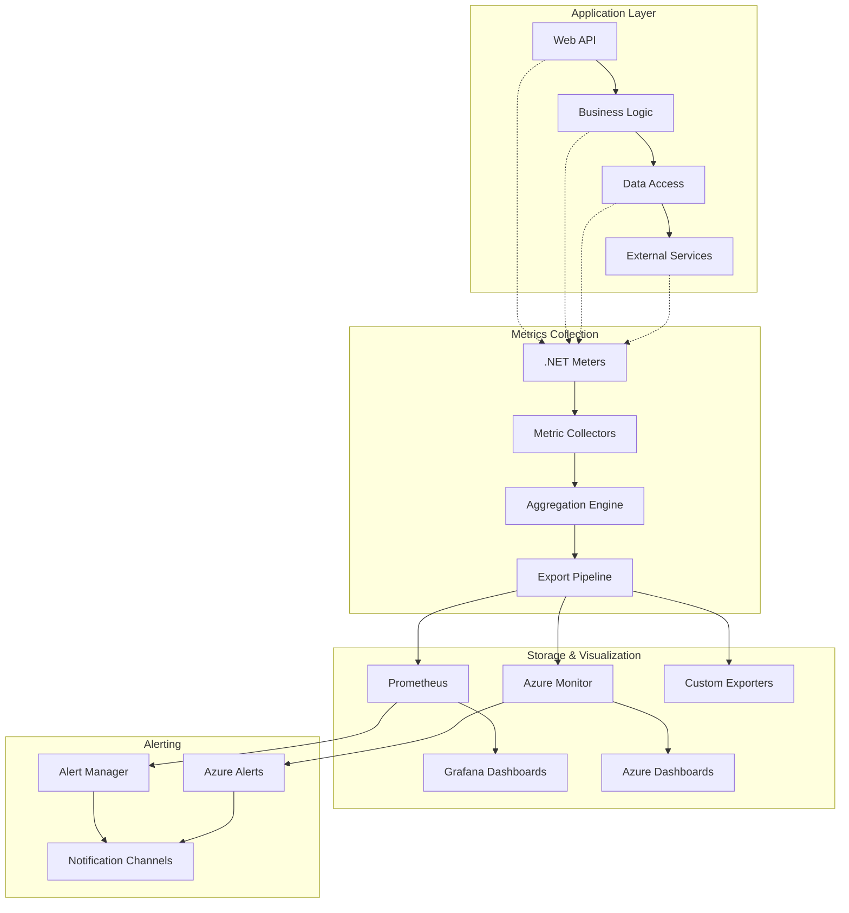

# Metrics Collection and Monitoring

**Description**: Comprehensive application metrics collection patterns using .NET metrics APIs, Prometheus integration, and custom performance monitoring for distributed document processing systems.

**Integration Pattern**: Cross-cutting metrics infrastructure that provides real-time insights into application performance, resource utilization, and business KPIs.

## Metrics Collection Architecture

Modern applications require sophisticated metrics collection to monitor performance, track business KPIs, and enable data-driven decision making.



## 1. .NET Metrics Configuration

### Core Metrics Infrastructure

```csharp
// src/Shared/Observability/MetricsConfiguration.cs
using System.Diagnostics.Metrics;

namespace DocumentProcessing.Shared.Observability;

public static class MetricsConfiguration
{
    public static readonly Meter ApplicationMeter = new(
        ServiceConstants.ServiceName, 
        ServiceConstants.ServiceVersion);
    
    public static void AddApplicationMetrics(this IServiceCollection services, IConfiguration configuration)
    {
        var metricsOptions = configuration.GetSection("Metrics").Get<MetricsOptions>() ?? new MetricsOptions();
        services.Configure<MetricsOptions>(configuration.GetSection("Metrics"));
        
        // Register metrics providers
        services.AddSingleton<IMetricsCollector, MetricsCollector>();
        services.AddSingleton<IBusinessMetricsCollector, BusinessMetricsCollector>();
        services.AddSingleton<IPerformanceMetricsCollector, PerformanceMetricsCollector>();
        
        // Configure OpenTelemetry metrics
        services.AddOpenTelemetry()
            .WithMetrics(metrics => metrics
                .AddMeter(ApplicationMeter.Name)
                .AddMeter("Microsoft.AspNetCore.Hosting")
                .AddMeter("Microsoft.AspNetCore.Server.Kestrel")
                .AddMeter("System.Net.Http")
                .AddMeter("Microsoft.EntityFrameworkCore")
                .AddAspNetCoreInstrumentation()
                .AddHttpClientInstrumentation()
                .AddRuntimeInstrumentation()
                .ConfigureMetricsExporters(metricsOptions));
        
        // Add metrics middleware
        services.AddSingleton<MetricsMiddleware>();
    }
    
    private static void ConfigureMetricsExporters(this MeterProviderBuilder metrics, MetricsOptions options)
    {
        if (options.EnableConsoleExporter)
        {
            metrics.AddConsoleExporter();
        }
        
        if (options.EnablePrometheusExporter)
        {
            metrics.AddPrometheusExporter();
        }
        
        if (options.EnableOtlpExporter && !string.IsNullOrEmpty(options.OtlpEndpoint))
        {
            metrics.AddOtlpExporter(otlp =>
            {
                otlp.Endpoint = new Uri(options.OtlpEndpoint);
                otlp.Protocol = OpenTelemetry.Exporter.OtlpExportProtocol.Grpc;
            });
        }
        
        if (options.EnableAzureMonitorExporter && !string.IsNullOrEmpty(options.ApplicationInsightsConnectionString))
        {
            metrics.AddAzureMonitorMetricExporter(azure =>
            {
                azure.ConnectionString = options.ApplicationInsightsConnectionString;
            });
        }
    }
}

public class MetricsOptions
{
    public bool EnableConsoleExporter { get; set; } = false;
    public bool EnablePrometheusExporter { get; set; } = true;
    public bool EnableOtlpExporter { get; set; } = false;
    public bool EnableAzureMonitorExporter { get; set; } = true;
    
    public string? OtlpEndpoint { get; set; }
    public string? ApplicationInsightsConnectionString { get; set; }
    public int CollectionIntervalSeconds { get; set; } = 15;
    public bool EnableDetailedMetrics { get; set; } = false;
}
```

### Metrics Collection Service

```csharp
// src/Shared/Observability/MetricsCollector.cs
using System.Diagnostics.Metrics;

namespace DocumentProcessing.Shared.Observability;

public interface IMetricsCollector
{
    void IncrementCounter(string name, long value = 1, params KeyValuePair<string, object?>[] tags);
    void RecordHistogram(string name, double value, params KeyValuePair<string, object?>[] tags);
    void RecordGauge(string name, long value, params KeyValuePair<string, object?>[] tags);
    IDisposable StartTimer(string name, params KeyValuePair<string, object?>[] tags);
}

public class MetricsCollector : IMetricsCollector
{
    private readonly Dictionary<string, Counter<long>> counters = new();
    private readonly Dictionary<string, Histogram<double>> histograms = new();
    private readonly Dictionary<string, ObservableGauge<long>> gauges = new();
    private readonly Dictionary<string, long> gaugeValues = new();
    private readonly object lockObject = new();
    
    public MetricsCollector()
    {
        // Initialize common metrics
        InitializeCommonMetrics();
    }
    
    public void IncrementCounter(string name, long value = 1, params KeyValuePair<string, object?>[] tags)
    {
        var counter = GetOrCreateCounter(name);
        counter.Add(value, tags);
    }
    
    public void RecordHistogram(string name, double value, params KeyValuePair<string, object?>[] tags)
    {
        var histogram = GetOrCreateHistogram(name);
        histogram.Record(value, tags);
    }
    
    public void RecordGauge(string name, long value, params KeyValuePair<string, object?>[] tags)
    {
        lock (lockObject)
        {
            gaugeValues[name] = value;
            GetOrCreateGauge(name); // Ensure gauge exists
        }
    }
    
    public IDisposable StartTimer(string name, params KeyValuePair<string, object?>[] tags)
    {
        return new MetricsTimer(this, name, tags);
    }
    
    private Counter<long> GetOrCreateCounter(string name)
    {
        if (counters.TryGetValue(name, out var counter))
            return counter;
        
        lock (lockObject)
        {
            if (counters.TryGetValue(name, out counter))
                return counter;
            
            counter = MetricsConfiguration.ApplicationMeter.CreateCounter<long>(
                name, 
                "count", 
                GetMetricDescription(name));
            
            counters[name] = counter;
            return counter;
        }
    }
    
    private Histogram<double> GetOrCreateHistogram(string name)
    {
        if (histograms.TryGetValue(name, out var histogram))
            return histogram;
        
        lock (lockObject)
        {
            if (histograms.TryGetValue(name, out histogram))
                return histogram;
            
            histogram = MetricsConfiguration.ApplicationMeter.CreateHistogram<double>(
                name, 
                GetMetricUnit(name), 
                GetMetricDescription(name));
            
            histograms[name] = histogram;
            return histogram;
        }
    }
    
    private ObservableGauge<long> GetOrCreateGauge(string name)
    {
        if (gauges.TryGetValue(name, out var gauge))
            return gauge;
        
        lock (lockObject)
        {
            if (gauges.TryGetValue(name, out gauge))
                return gauge;
            
            gauge = MetricsConfiguration.ApplicationMeter.CreateObservableGauge<long>(
                name,
                () => gaugeValues.GetValueOrDefault(name, 0),
                GetMetricUnit(name),
                GetMetricDescription(name));
            
            gauges[name] = gauge;
            return gauge;
        }
    }
    
    private void InitializeCommonMetrics()
    {
        // HTTP request metrics
        GetOrCreateCounter("httpRequestsTotal");
        GetOrCreateHistogram("httpRequestDurationSeconds");
        GetOrCreateCounter("httpRequestsErrorsTotal");
        
        // Document processing metrics
        GetOrCreateCounter("documentsProcessedTotal");
        GetOrCreateHistogram("documentProcessingDurationSeconds");
        GetOrCreateCounter("documentProcessingErrorsTotal");
        
        // System metrics
        GetOrCreateGauge("activeConnections");
        GetOrCreateGauge("memoryUsageBytes");
        GetOrCreateGauge("cpuUsagePercent");
    }
    
    private static string GetMetricDescription(string name) => name switch
    {
        "httpRequestsTotal" => "Total number of HTTP requests processed",
        "httpRequestDurationSeconds" => "HTTP request processing duration in seconds",
        "httpRequestsErrorsTotal" => "Total number of HTTP request errors",
        "documentsProcessedTotal" => "Total number of documents processed",
        "documentProcessingDurationSeconds" => "Document processing duration in seconds",
        "documentProcessingErrorsTotal" => "Total number of document processing errors",
        "activeConnections" => "Number of active connections",
        "memoryUsageBytes" => "Memory usage in bytes",
        "cpuUsagePercent" => "CPU usage percentage",
        _ => $"Metric: {name}"
    };
    
    private static string GetMetricUnit(string name) => name switch
    {
        var n when n.Contains("duration") && n.Contains("seconds") => "s",
        var n when n.Contains("bytes") => "bytes",
        var n when n.Contains("percent") => "%",
        var n when n.Contains("total") || n.Contains("count") => "count",
        _ => "unit"
    };
}

public class MetricsTimer : IDisposable
{
    private readonly IMetricsCollector metricsCollector;
    private readonly string metricName;
    private readonly KeyValuePair<string, object?>[] tags;
    private readonly long startTimestamp;
    private bool disposed = false;
    
    public MetricsTimer(IMetricsCollector metricsCollector, string metricName, KeyValuePair<string, object?>[] tags)
    {
        this.metricsCollector = metricsCollector;
        this.metricName = metricName;
        this.tags = tags;
        startTimestamp = Stopwatch.GetTimestamp();
    }
    
    public void Dispose()
    {
        if (!disposed)
        {
            var elapsedSeconds = Stopwatch.GetElapsedTime(startTimestamp).TotalSeconds;
            metricsCollector.RecordHistogram(metricName, elapsedSeconds, tags);
            disposed = true;
        }
    }
}
```

## 2. Business Metrics Collection

### Domain-Specific Metrics

```csharp
// src/Services/BusinessMetricsCollector.cs
namespace DocumentProcessing.Services;

public interface IBusinessMetricsCollector
{
    void RecordDocumentProcessed(string documentType, TimeSpan processingTime, bool success);
    void RecordUserActivity(string userId, string action);
    void RecordMLModelPerformance(string modelName, double accuracy, TimeSpan inferenceTime);
    void RecordStorageOperation(string operation, long sizeBytes, TimeSpan duration);
    void RecordCacheHitRate(string cacheType, bool hit);
}

public class BusinessMetricsCollector(IMetricsCollector metricsCollector) : IBusinessMetricsCollector
{
    public void RecordDocumentProcessed(string documentType, TimeSpan processingTime, bool success)
    {
        var tags = new[]
        {
            new KeyValuePair<string, object?>("documentType", documentType),
            new KeyValuePair<string, object?>("success", success.ToString().ToLower())
        };
        
        metricsCollector.IncrementCounter("documentsProcessedTotal", 1, tags);
        metricsCollector.RecordHistogram("documentProcessingDurationSeconds", processingTime.TotalSeconds, tags);
        
        if (!success)
        {
            metricsCollector.IncrementCounter("documentProcessingErrorsTotal", 1, 
                new KeyValuePair<string, object?>("documentType", documentType));
        }
    }
    
    public void RecordUserActivity(string userId, string action)
    {
        var tags = new[]
        {
            new KeyValuePair<string, object?>("user_id", userId),
            new KeyValuePair<string, object?>("action", action)
        };
        
        metricsCollector.IncrementCounter("user_activities_total", 1, tags);
    }
    
    public void RecordMLModelPerformance(string modelName, double accuracy, TimeSpan inferenceTime)
    {
        var tags = new[]
        {
            new KeyValuePair<string, object?>("model_name", modelName)
        };
        
        metricsCollector.RecordHistogram("ml_model_accuracy", accuracy, tags);
        metricsCollector.RecordHistogram("ml_inference_duration_seconds", inferenceTime.TotalSeconds, tags);
        metricsCollector.IncrementCounter("ml_inferences_total", 1, tags);
    }
    
    public void RecordStorageOperation(string operation, long sizeBytes, TimeSpan duration)
    {
        var tags = new[]
        {
            new KeyValuePair<string, object?>("operation", operation)
        };
        
        metricsCollector.IncrementCounter("storage_operations_total", 1, tags);
        metricsCollector.RecordHistogram("storage_operation_duration_seconds", duration.TotalSeconds, tags);
        metricsCollector.RecordHistogram("storage_operation_size_bytes", sizeBytes, tags);
    }
    
    public void RecordCacheHitRate(string cacheType, bool hit)
    {
        var tags = new[]
        {
            new KeyValuePair<string, object?>("cache_type", cacheType),
            new KeyValuePair<string, object?>("result", hit ? "hit" : "miss")
        };
        
        metricsCollector.IncrementCounter("cache_operations_total", 1, tags);
    }
}
```

### Performance Metrics Collection

```csharp
// src/Services/PerformanceMetricsCollector.cs
using System.Diagnostics;

namespace DocumentProcessing.Services;

public interface IPerformanceMetricsCollector
{
    void StartPerformanceMonitoring();
    void StopPerformanceMonitoring();
    Task<SystemPerformanceSnapshot> GetCurrentPerformanceAsync();
}

public class PerformanceMetricsCollector(
    IMetricsCollector metricsCollector,
    ILogger<PerformanceMetricsCollector> logger) : IPerformanceMetricsCollector, IDisposable
{
    private readonly Timer performanceTimer = new(CollectPerformanceMetrics, null, TimeSpan.Zero, TimeSpan.FromSeconds(30));
    private readonly Process currentProcess = Process.GetCurrentProcess();
    private long lastCpuTime = 0;
    private DateTime lastCpuCheck = DateTime.UtcNow;
    
    public void StartPerformanceMonitoring()
    {
        logger.LogInformation("Started performance metrics collection");
        performanceTimer.Change(TimeSpan.Zero, TimeSpan.FromSeconds(30));
    }
    
    public void StopPerformanceMonitoring()
    {
        logger.LogInformation("Stopped performance metrics collection");
        performanceTimer.Change(Timeout.Infinite, Timeout.Infinite);
    }
    
    public async Task<SystemPerformanceSnapshot> GetCurrentPerformanceAsync()
    {
        await Task.Yield(); // Make async for consistency
        
        var memoryUsage = GC.GetTotalMemory(false);
        var workingSet = currentProcess.WorkingSet64;
        var cpuUsage = GetCpuUsage();
        var threadCount = currentProcess.Threads.Count;
        var handleCount = currentProcess.HandleCount;
        
        var gen0Collections = GC.CollectionCount(0);
        var gen1Collections = GC.CollectionCount(1);
        var gen2Collections = GC.CollectionCount(2);
        
        return new SystemPerformanceSnapshot
        {
            Timestamp = DateTime.UtcNow,
            MemoryUsageBytes = memoryUsage,
            WorkingSetBytes = workingSet,
            CpuUsagePercent = cpuUsage,
            ThreadCount = threadCount,
            HandleCount = handleCount,
            Gen0Collections = gen0Collections,
            Gen1Collections = gen1Collections,
            Gen2Collections = gen2Collections
        };
    }
    
    private void CollectPerformanceMetrics(object? state)
    {
        try
        {
            var performance = GetCurrentPerformanceAsync().Result;
            
            metricsCollector.RecordGauge("memoryUsageBytes", performance.MemoryUsageBytes);
            metricsCollector.RecordGauge("working_set_bytes", performance.WorkingSetBytes);
            metricsCollector.RecordGauge("cpuUsagePercent", (long)performance.CpuUsagePercent);
            metricsCollector.RecordGauge("thread_count", performance.ThreadCount);
            metricsCollector.RecordGauge("handle_count", performance.HandleCount);
            
            metricsCollector.RecordGauge("gc_gen0_collections", performance.Gen0Collections);
            metricsCollector.RecordGauge("gc_gen1_collections", performance.Gen1Collections);
            metricsCollector.RecordGauge("gc_gen2_collections", performance.Gen2Collections);
        }
        catch (Exception ex)
        {
            logger.LogError(ex, "Error collecting performance metrics");
        }
    }
    
    private double GetCpuUsage()
    {
        try
        {
            var currentCpuTime = currentProcess.TotalProcessorTime.Ticks;
            var currentTime = DateTime.UtcNow;
            
            if (lastCpuTime == 0)
            {
                lastCpuTime = currentCpuTime;
                lastCpuCheck = currentTime;
                return 0;
            }
            
            var cpuUsedMs = (currentCpuTime - lastCpuTime) / TimeSpan.TicksPerMillisecond;
            var totalMsPassed = (currentTime - lastCpuCheck).TotalMilliseconds;
            var cpuUsageTotal = cpuUsedMs / (Environment.ProcessorCount * totalMsPassed);
            var cpuUsagePercent = cpuUsageTotal * 100;
            
            lastCpuTime = currentCpuTime;
            lastCpuCheck = currentTime;
            
            return Math.Min(100, Math.Max(0, cpuUsagePercent));
        }
        catch
        {
            return 0;
        }
    }
    
    public void Dispose()
    {
        performanceTimer.Dispose();
        currentProcess.Dispose();
    }
}

public record SystemPerformanceSnapshot
{
    public required DateTime Timestamp { get; init; }
    public required long MemoryUsageBytes { get; init; }
    public required long WorkingSetBytes { get; init; }
    public required double CpuUsagePercent { get; init; }
    public required int ThreadCount { get; init; }
    public required int HandleCount { get; init; }
    public required int Gen0Collections { get; init; }
    public required int Gen1Collections { get; init; }
    public required int Gen2Collections { get; init; }
}
```

## 3. Metrics Middleware

### HTTP Request Metrics

```csharp
// src/Middleware/MetricsMiddleware.cs
namespace DocumentProcessing.Middleware;

public class MetricsMiddleware(
    RequestDelegate next,
    IMetricsCollector metricsCollector,
    ILogger<MetricsMiddleware> logger)
{
    public async Task InvokeAsync(HttpContext context)
    {
        var method = context.Request.Method;
        var path = context.Request.Path.Value ?? "unknown";
        var route = context.GetRouteValue("action")?.ToString() ?? "unknown";
        
        var tags = new[]
        {
            new KeyValuePair<string, object?>("method", method),
            new KeyValuePair<string, object?>("route", route),
            new KeyValuePair<string, object?>("path", path)
        };
        
        using var timer = metricsCollector.StartTimer("httpRequestDurationSeconds", tags);
        metricsCollector.IncrementCounter("httpRequestsTotal", 1, tags);
        
        var startTime = Stopwatch.GetTimestamp();
        
        try
        {
            await next(context);
            
            var statusCode = context.Response.StatusCode;
            var statusTags = tags.Concat(new[]
            {
                new KeyValuePair<string, object?>("status_code", statusCode.ToString()),
                new KeyValuePair<string, object?>("status_class", GetStatusClass(statusCode))
            }).ToArray();
            
            metricsCollector.IncrementCounter("http_responses_total", 1, statusTags);
            
            if (statusCode >= 400)
            {
                metricsCollector.IncrementCounter("httpRequestsErrorsTotal", 1, statusTags);
            }
            
            var elapsedMs = Stopwatch.GetElapsedTime(startTime).TotalMilliseconds;
            if (elapsedMs > 1000) // Log slow requests
            {
                logger.LogWarning("Slow request detected: {Method} {Path} took {ElapsedMs}ms", 
                    method, path, elapsedMs);
            }
        }
        catch (Exception ex)
        {
            var errorTags = tags.Concat(new[]
            {
                new KeyValuePair<string, object?>("error_type", ex.GetType().Name),
                new KeyValuePair<string, object?>("status_code", "500"),
                new KeyValuePair<string, object?>("status_class", "5xx")
            }).ToArray();
            
            metricsCollector.IncrementCounter("httpRequestsErrorsTotal", 1, errorTags);
            metricsCollector.IncrementCounter("http_responses_total", 1, errorTags);
            
            throw;
        }
    }
    
    private static string GetStatusClass(int statusCode) => statusCode switch
    {
        >= 100 and < 200 => "1xx",
        >= 200 and < 300 => "2xx",
        >= 300 and < 400 => "3xx",
        >= 400 and < 500 => "4xx",
        >= 500 => "5xx",
        _ => "unknown"
    };
}

// Extension method for easy registration
public static class MetricsMiddlewareExtensions
{
    public static IApplicationBuilder UseApplicationMetrics(this IApplicationBuilder builder)
    {
        return builder.UseMiddleware<MetricsMiddleware>();
    }
}
```

## 4. Custom Metrics Dashboard Service

### Real-time Metrics API

```csharp
// src/Controllers/MetricsController.cs
[ApiController]
[Route("api/[controller]")]
public class MetricsController(
    IMetricsCollector metricsCollector,
    IPerformanceMetricsCollector performanceCollector,
    IBusinessMetricsCollector businessCollector) : ControllerBase
{
    [HttpGet("system")]
    public async Task<IActionResult> GetSystemMetrics()
    {
        var performance = await performanceCollector.GetCurrentPerformanceAsync();
        
        var metrics = new
        {
            timestamp = DateTime.UtcNow,
            system = new
            {
                memory_usage_mb = performance.MemoryUsageBytes / (1024 * 1024),
                working_set_mb = performance.WorkingSetBytes / (1024 * 1024),
                cpu_usage_percent = performance.CpuUsagePercent,
                thread_count = performance.ThreadCount,
                handle_count = performance.HandleCount,
                gc_collections = new
                {
                    gen0 = performance.Gen0Collections,
                    gen1 = performance.Gen1Collections,
                    gen2 = performance.Gen2Collections
                }
            }
        };
        
        return Ok(metrics);
    }
    
    [HttpGet("application")]
    public IActionResult GetApplicationMetrics([FromQuery] string? timeRange = "1h")
    {
        // In a real implementation, this would query stored metrics
        var metrics = new
        {
            timestamp = DateTime.UtcNow,
            time_range = timeRange,
            application = new
            {
                requests = new
                {
                    total = 15240,
                    success_rate = 99.2,
                    average_duration_ms = 125.5,
                    p95_duration_ms = 450.0
                },
                documents = new
                {
                    processed_total = 8920,
                    processing_rate_per_minute = 34.2,
                    average_processing_time_ms = 2340.0,
                    error_rate = 0.8
                },
                ml_models = new
                {
                    inferences_total = 12450,
                    average_accuracy = 94.7,
                    average_inference_time_ms = 85.3
                }
            }
        };
        
        return Ok(metrics);
    }
    
    [HttpPost("custom")]
    public IActionResult RecordCustomMetric([FromBody] CustomMetricRequest request)
    {
        var tags = request.Tags?.Select(kvp => new KeyValuePair<string, object?>(kvp.Key, kvp.Value)).ToArray() 
                   ?? Array.Empty<KeyValuePair<string, object?>>();
        
        switch (request.Type?.ToLower())
        {
            case "counter":
                metricsCollector.IncrementCounter(request.Name, request.Value ?? 1, tags);
                break;
            case "histogram":
                metricsCollector.RecordHistogram(request.Name, request.DoubleValue ?? request.Value ?? 0, tags);
                break;
            case "gauge":
                metricsCollector.RecordGauge(request.Name, request.Value ?? 0, tags);
                break;
            default:
                return BadRequest("Invalid metric type. Supported types: counter, histogram, gauge");
        }
        
        return Ok(new { message = "Metric recorded successfully" });
    }
}

public class CustomMetricRequest
{
    public required string Name { get; set; }
    public required string Type { get; set; }
    public long? Value { get; set; }
    public double? DoubleValue { get; set; }
    public Dictionary<string, string>? Tags { get; set; }
}
```

## 5. Prometheus Integration

### Prometheus Configuration

```yaml
# prometheus.yml
global:
  scrapeinterval: 15s
  evaluationinterval: 15s

rulefiles:
  - "alert_rules.yml"

scrapeconfigs:
  - jobname: 'document-processing-api'
    staticconfigs:
      - targets: ['localhost:5000']
    scrapeinterval: 10s
    metricspath: '/metrics'
    
  - jobname: 'document-processing-worker'
    staticconfigs:
      - targets: ['localhost:5001']
    scrapeinterval: 15s
    metricspath: '/metrics'

alerting:
  alertmanagers:
    - staticconfigs:
        - targets:
          - alertmanager:9093
```

### Grafana Dashboard Configuration

```json
{
  "dashboard": {
    "id": null,
    "title": "Document Processing Metrics",
    "tags": ["document-processing", "ml"],
    "timezone": "browser",
    "panels": [
      {
        "id": 1,
        "title": "Request Rate",
        "type": "stat",
        "targets": [
          {
            "expr": "rate(httpRequestsTotal[5m])",
            "legendFormat": "Requests/sec"
          }
        ],
        "fieldConfig": {
          "defaults": {
            "unit": "reqps",
            "thresholds": {
              "steps": [
                { "color": "green", "value": null },
                { "color": "red", "value": 100 }
              ]
            }
          }
        }
      },
      {
        "id": 2,
        "title": "Response Time",
        "type": "timeseries",
        "targets": [
          {
            "expr": "histogram_quantile(0.95, rate(httpRequestDurationSeconds_bucket[5m]))",
            "legendFormat": "95th percentile"
          },
          {
            "expr": "histogram_quantile(0.50, rate(httpRequestDurationSeconds_bucket[5m]))",
            "legendFormat": "50th percentile"
          }
        ]
      },
      {
        "id": 3,
        "title": "Document Processing Rate",
        "type": "timeseries",
        "targets": [
          {
            "expr": "rate(documentsProcessedTotal[5m])",
            "legendFormat": "Documents/sec"
          }
        ]
      },
      {
        "id": 4,
        "title": "Error Rate",
        "type": "timeseries",
        "targets": [
          {
            "expr": "rate(httpRequestsErrorsTotal[5m]) / rate(httpRequestsTotal[5m])",
            "legendFormat": "Error Rate %"
          }
        ]
      }
    ],
    "time": {
      "from": "now-1h",
      "to": "now"
    },
    "refresh": "5s"
  }
}
```

### Alert Rules

```yaml
# alert_rules.yml
groups:
  - name: document_processing_alerts
    rules:
      - alert: HighErrorRate
        expr: rate(httpRequestsErrorsTotal[5m]) / rate(httpRequestsTotal[5m]) > 0.05
        for: 2m
        labels:
          severity: warning
        annotations:
          summary: "High error rate detected"
          description: "Error rate is {{ $value | humanizePercentage }} for the last 5 minutes"
          
      - alert: SlowResponseTime
        expr: histogram_quantile(0.95, rate(httpRequestDurationSeconds_bucket[5m])) > 1.0
        for: 5m
        labels:
          severity: warning
        annotations:
          summary: "Slow response time detected"
          description: "95th percentile response time is {{ $value }}s"
          
      - alert: HighMemoryUsage
        expr: memory_usage_bytes / (1024*1024*1024) > 2.0
        for: 5m
        labels:
          severity: critical
        annotations:
          summary: "High memory usage detected"
          description: "Memory usage is {{ $value | humanize }}GB"
          
      - alert: DocumentProcessingStalled
        expr: rate(documentsProcessedTotal[10m]) == 0
        for: 5m
        labels:
          severity: critical
        annotations:
          summary: "Document processing has stalled"
          description: "No documents processed in the last 10 minutes"
```

## Configuration Examples

### appsettings.json

```json
{
  "Metrics": {
    "EnableConsoleExporter": false,
    "EnablePrometheusExporter": true,
    "EnableOtlpExporter": false,
    "EnableAzureMonitorExporter": true,
    "OtlpEndpoint": "http://otel-collector:4317",
    "ApplicationInsightsConnectionString": "InstrumentationKey=your-key-here",
    "CollectionIntervalSeconds": 15,
    "EnableDetailedMetrics": true
  }
}
```

## Metrics Best Practices

| Practice | Implementation | Benefit |
|----------|---------------|---------|
| **Cardinality Control** | Limit tag values to prevent metric explosion | Prevents storage/query issues |
| **Naming Convention** | Use consistent metric naming (snake_case) | Improves discoverability |
| **Unit Specification** | Always specify units in metric names | Clear interpretation |
| **Business Alignment** | Track business KPIs alongside technical metrics | Business value visibility |
| **Alert Thresholds** | Set meaningful alert thresholds based on SLIs | Actionable notifications |

---

**Key Benefits**: Real-time monitoring, performance optimization, proactive alerting, business insights, operational visibility

**When to Use**: All production applications, performance-critical systems, business monitoring requirements, SLA/SLO tracking

**Performance**: Minimal overhead with efficient collection, configurable sampling, optimized storage and querying