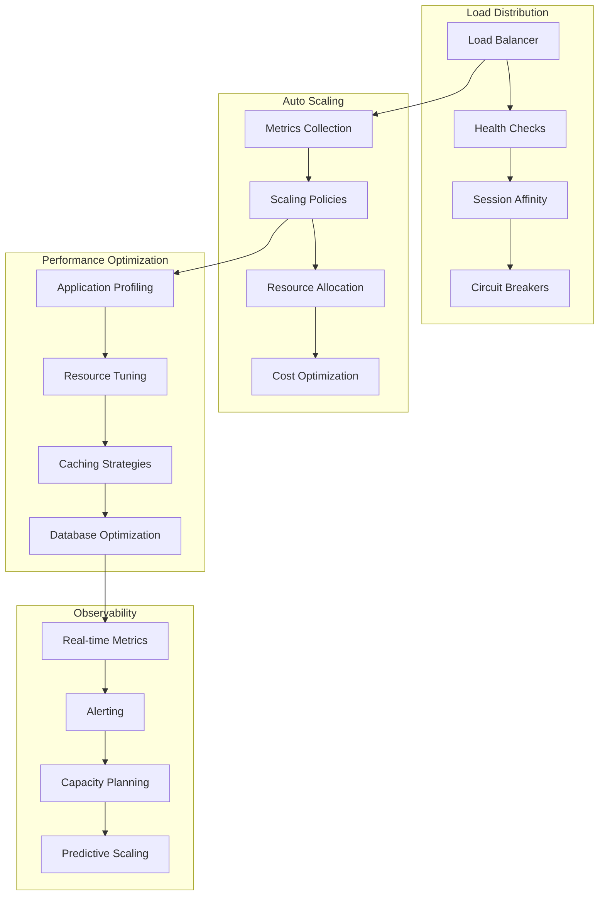

# Scaling Strategies and Performance Optimization

**Description**: Comprehensive scaling strategies covering horizontal and vertical scaling, auto-scaling policies, load balancing, resource optimization, and performance tuning for distributed applications.

**Integration Pattern**: End-to-end performance optimization from application-level scaling through infrastructure auto-scaling and intelligent load distribution.

## Scaling Architecture Overview

Modern applications require dynamic scaling capabilities that adapt to changing load patterns while maintaining performance and cost efficiency.



## 1. Horizontal Pod Auto-scaling (HPA)

### Advanced HPA Configuration

```yaml
# k8s/hpa-advanced.yaml
apiVersion: autoscaling/v2
kind: HorizontalPodAutoscaler
metadata:
  name: webapi-advanced-hpa
  namespace: document-processing
spec:
  scaleTargetRef:
    apiVersion: apps/v1
    kind: Deployment
    name: webapi-deployment
  minReplicas: 2
  maxReplicas: 50
  metrics:
  # CPU utilization
  - type: Resource
    resource:
      name: cpu
      target:
        type: Utilization
        averageUtilization: 70
  # Memory utilization
  - type: Resource
    resource:
      name: memory
      target:
        type: Utilization
        averageUtilization: 80
  # Custom metrics - requests per second
  - type: Pods
    pods:
      metric:
        name: requests_per_second
      target:
        type: AverageValue
        averageValue: "100"
  # External metrics - queue length
  - type: External
    external:
      metric:
        name: azure_servicebus_queue_length
        selector:
          matchLabels:
            queue: document-processing
      target:
        type: Value
        value: "10"
  behavior:
    scaleDown:
      stabilizationWindowSeconds: 300
      policies:
      - type: Percent
        value: 10
        periodSeconds: 60
      - type: Pods
        value: 1
        periodSeconds: 60
      selectPolicy: Min
    scaleUp:
      stabilizationWindowSeconds: 60
      policies:
      - type: Percent
        value: 50
        periodSeconds: 60
      - type: Pods
        value: 5
        periodSeconds: 60
      selectPolicy: Max

---
# k8s/custom-metrics.yaml
apiVersion: v1
kind: ConfigMap
metadata:
  name: prometheus-adapter-config
  namespace: monitoring
data:
  config.yaml: |
    rules:
    - seriesQuery: 'http_requests_per_second{namespace!="",pod!=""}'
      resources:
        overrides:
          namespace: {resource: "namespace"}
          pod: {resource: "pod"}
      name:
        matches: "^http_requests_per_second"
        as: "requests_per_second"
      metricsQuery: 'sum(rate(<<.Series>>{<<.LabelMatchers>>}[2m])) by (<<.GroupBy>>)'
    - seriesQuery: 'azure_servicebus_active_message_count{queue!=""}'
      name:
        matches: "^azure_servicebus_active_message_count"
        as: "azure_servicebus_queue_length"
      metricsQuery: 'max(<<.Series>>{<<.LabelMatchers>>}) by (<<.GroupBy>>)'
```

### Custom Metrics Auto-scaler Service

```csharp
// Infrastructure/Scaling/CustomMetricsCollector.cs
namespace DocumentProcessing.Infrastructure.Scaling;

public class CustomMetricsCollector(ILogger<CustomMetricsCollector> logger, IConfiguration configuration) : BackgroundService
{
    private readonly MetricServer metricServer = new(port: 8080);
    private readonly Counter requestCounter = Metrics.CreateCounter("http_requests_total", "Total HTTP requests");
    private readonly Gauge requestsPerSecond = Metrics.CreateGauge("http_requests_per_second", "HTTP requests per second");
    private readonly Histogram requestDuration = Metrics.CreateHistogram("http_request_duration_seconds", "HTTP request duration");
    private readonly Gauge queueLength = Metrics.CreateGauge("azure_servicebus_queue_length", "Azure Service Bus queue length", ["queue"]);
    
    protected override async Task ExecuteAsync(CancellationToken stoppingToken)
    {
        metricServer.Start();
        logger.LogInformation("Custom metrics collector started");
        
        var requestsPerSecondCalculator = new RequestsPerSecondCalculator(requestCounter, requestsPerSecond);
        var queueMonitor = new ServiceBusQueueMonitor(queueLength, configuration, logger);
        
        await Task.WhenAll(
            requestsPerSecondCalculator.StartAsync(stoppingToken),
            queueMonitor.StartAsync(stoppingToken)
        );
    }
    
    public override async Task StopAsync(CancellationToken cancellationToken)
    {
        metricServer.Stop();
        await base.StopAsync(cancellationToken);
    }
}

public class RequestsPerSecondCalculator(Counter requestCounter, Gauge requestsPerSecond)
{
    private double lastRequestCount = 0;
    private DateTime lastCalculation = DateTime.UtcNow;
    
    public async Task StartAsync(CancellationToken cancellationToken)
    {
        while (!cancellationToken.IsCancellationRequested)
        {
            var currentTime = DateTime.UtcNow;
            var currentCount = requestCounter.Value;
            var timeDiff = (currentTime - lastCalculation).TotalSeconds;
            
            if (timeDiff >= 1.0) // Calculate every second
            {
                var requestsDiff = currentCount - lastRequestCount;
                var rps = requestsDiff / timeDiff;
                
                requestsPerSecond.Set(rps);
                
                lastRequestCount = currentCount;
                lastCalculation = currentTime;
            }
            
            await Task.Delay(1000, cancellationToken);
        }
    }
}

public class ServiceBusQueueMonitor(Gauge queueLength, IConfiguration configuration, ILogger logger)
{
    private readonly ServiceBusAdministrationClient adminClient = new(configuration.GetConnectionString("ServiceBus"));
    
    public async Task StartAsync(CancellationToken cancellationToken)
    {
        var queues = configuration.GetSection("Monitoring:Queues").Get<string[]>() ?? ["document-processing"];
        
        while (!cancellationToken.IsCancellationRequested)
        {
            foreach (var queueName in queues)
            {
                try
                {
                    var queueProperties = await adminClient.GetQueueRuntimePropertiesAsync(queueName, cancellationToken);
                    queueLength.WithLabels(queueName).Set(queueProperties.Value.ActiveMessageCount);
                }
                catch (Exception ex)
                {
                    logger.LogError(ex, "Failed to get queue length for {QueueName}", queueName);
                }
            }
            
            await Task.Delay(TimeSpan.FromSeconds(10), cancellationToken);
        }
    }
}
```

## 2. Vertical Pod Auto-scaling (VPA)

### VPA Configuration and Implementation

```yaml
# k8s/vpa-config.yaml
apiVersion: autoscaling.k8s.io/v1
kind: VerticalPodAutoscaler
metadata:
  name: webapi-vpa
  namespace: document-processing
spec:
  targetRef:
    apiVersion: apps/v1
    kind: Deployment
    name: webapi-deployment
  updatePolicy:
    updateMode: "Auto"
    evictionRequirements:
    - resources: ["cpu", "memory"]
      changeRequirement: "TargetHigherThanRequests"
  resourcePolicy:
    containerPolicies:
    - containerName: webapi
      maxAllowed:
        cpu: 2
        memory: 4Gi
      minAllowed:
        cpu: 100m
        memory: 128Mi
      controlledResources: ["cpu", "memory"]
      controlledValues: RequestsAndLimits

---
# k8s/resource-quotas.yaml
apiVersion: v1
kind: ResourceQuota
metadata:
  name: document-processing-quota
  namespace: document-processing
spec:
  hard:
    requests.cpu: "20"
    requests.memory: 40Gi
    limits.cpu: "40"
    limits.memory: 80Gi
    persistentvolumeclaims: "10"
    pods: "50"
    services: "10"
    secrets: "10"
    configmaps: "10"

---
apiVersion: v1
kind: LimitRange
metadata:
  name: document-processing-limits
  namespace: document-processing
spec:
  limits:
  - type: Container
    default:
      cpu: 500m
      memory: 512Mi
    defaultRequest:
      cpu: 100m
      memory: 128Mi
    max:
      cpu: 2
      memory: 4Gi
    min:
      cpu: 50m
      memory: 64Mi
  - type: PersistentVolumeClaim
    max:
      storage: 100Gi
    min:
      storage: 1Gi
```

### Resource Optimization Service

```csharp
// Infrastructure/Scaling/ResourceOptimizationService.cs
namespace DocumentProcessing.Infrastructure.Scaling;

public class ResourceOptimizationService(
    IKubernetes kubernetesClient, 
    ILogger<ResourceOptimizationService> logger,
    IOptionsMonitor<ResourceOptimizationOptions> options) : IHostedService
{
    private readonly Timer optimizationTimer = new(OptimizeResources);
    
    public Task StartAsync(CancellationToken cancellationToken)
    {
        var interval = options.CurrentValue.OptimizationInterval;
        optimizationTimer.Change(interval, interval);
        logger.LogInformation("Resource optimization service started with interval {Interval}", interval);
        return Task.CompletedTask;
    }
    
    private async void OptimizeResources(object? state)
    {
        try
        {
            await AnalyzeAndOptimizeResources();
        }
        catch (Exception ex)
        {
            logger.LogError(ex, "Error during resource optimization");
        }
    }
    
    private async Task AnalyzeAndOptimizeResources()
    {
        var namespace_ = options.CurrentValue.Namespace;
        var deployments = await kubernetesClient.AppsV1.ListNamespacedDeploymentAsync(namespace_);
        
        foreach (var deployment in deployments.Items)
        {
            await OptimizeDeployment(deployment, namespace_);
        }
    }
    
    private async Task OptimizeDeployment(V1Deployment deployment, string namespace_)
    {
        var pods = await kubernetesClient.CoreV1.ListNamespacedPodAsync(
            namespace_, 
            labelSelector: $"app={deployment.Metadata.Labels["app"]}"
        );
        
        var metrics = await AnalyzePodMetrics(pods.Items);
        var recommendations = GenerateResourceRecommendations(metrics);
        
        if (recommendations.Any())
        {
            logger.LogInformation("Generated {Count} resource recommendations for deployment {Name}", 
                recommendations.Count, deployment.Metadata.Name);
            
            await ApplyResourceRecommendations(deployment, recommendations, namespace_);
        }
    }
    
    private async Task<PodMetricsAnalysis> AnalyzePodMetrics(IList<V1Pod> pods)
    {
        var analysis = new PodMetricsAnalysis();
        
        foreach (var pod in pods.Where(p => p.Status.Phase == "Running"))
        {
            var metrics = await GetPodMetrics(pod);
            analysis.AddPodMetrics(metrics);
        }
        
        return analysis;
    }
    
    private async Task<PodMetrics> GetPodMetrics(V1Pod pod)
    {
        // Integration with metrics API
        var metricsClient = new MetricsV1beta1Api(kubernetesClient.BaseUri, kubernetesClient.DefaultHeaders);
        var podMetrics = await metricsClient.ReadNamespacedPodMetricsAsync(pod.Metadata.Name, pod.Metadata.Namespace);
        
        return new PodMetrics
        {
            PodName = pod.Metadata.Name,
            CpuUsage = ParseCpuUsage(podMetrics.Containers.First().Usage["cpu"]),
            MemoryUsage = ParseMemoryUsage(podMetrics.Containers.First().Usage["memory"]),
            Timestamp = DateTime.UtcNow
        };
    }
    
    private List<ResourceRecommendation> GenerateResourceRecommendations(PodMetricsAnalysis analysis)
    {
        var recommendations = new List<ResourceRecommendation>();
        var options_ = options.CurrentValue;
        
        // CPU recommendations
        if (analysis.AverageCpuUsage < options_.CpuDownscaleThreshold)
        {
            recommendations.Add(new ResourceRecommendation
            {
                ResourceType = "cpu",
                Action = "decrease",
                CurrentValue = analysis.AverageCpuUsage,
                RecommendedValue = Math.Max(analysis.AverageCpuUsage * 1.2, options_.MinCpuRequest),
                Reason = "CPU usage consistently below threshold"
            });
        }
        else if (analysis.AverageCpuUsage > options_.CpuUpscaleThreshold)
        {
            recommendations.Add(new ResourceRecommendation
            {
                ResourceType = "cpu",
                Action = "increase",
                CurrentValue = analysis.AverageCpuUsage,
                RecommendedValue = Math.Min(analysis.AverageCpuUsage * 1.5, options_.MaxCpuLimit),
                Reason = "CPU usage consistently above threshold"
            });
        }
        
        // Memory recommendations
        if (analysis.AverageMemoryUsage < options_.MemoryDownscaleThreshold)
        {
            recommendations.Add(new ResourceRecommendation
            {
                ResourceType = "memory",
                Action = "decrease",
                CurrentValue = analysis.AverageMemoryUsage,
                RecommendedValue = Math.Max(analysis.AverageMemoryUsage * 1.2, options_.MinMemoryRequest),
                Reason = "Memory usage consistently below threshold"
            });
        }
        else if (analysis.AverageMemoryUsage > options_.MemoryUpscaleThreshold)
        {
            recommendations.Add(new ResourceRecommendation
            {
                ResourceType = "memory",
                Action = "increase",
                CurrentValue = analysis.AverageMemoryUsage,
                RecommendedValue = Math.Min(analysis.AverageMemoryUsage * 1.5, options_.MaxMemoryLimit),
                Reason = "Memory usage consistently above threshold"
            });
        }
        
        return recommendations;
    }
    
    private async Task ApplyResourceRecommendations(
        V1Deployment deployment, 
        List<ResourceRecommendation> recommendations,
        string namespace_)
    {
        var patch = CreateResourcePatch(recommendations);
        
        await kubernetesClient.AppsV1.PatchNamespacedDeploymentAsync(
            new V1Patch(patch, V1Patch.PatchType.MergePatch),
            deployment.Metadata.Name,
            namespace_
        );
        
        logger.LogInformation("Applied resource recommendations to deployment {Name}: {Recommendations}", 
            deployment.Metadata.Name, 
            string.Join(", ", recommendations.Select(r => $"{r.ResourceType}: {r.Action}")));
    }
    
    public Task StopAsync(CancellationToken cancellationToken)
    {
        optimizationTimer.Dispose();
        return Task.CompletedTask;
    }
}

public class ResourceOptimizationOptions
{
    public string Namespace { get; set; } = "document-processing";
    public TimeSpan OptimizationInterval { get; set; } = TimeSpan.FromMinutes(15);
    public double CpuUpscaleThreshold { get; set; } = 0.8;
    public double CpuDownscaleThreshold { get; set; } = 0.3;
    public double MemoryUpscaleThreshold { get; set; } = 0.85;
    public double MemoryDownscaleThreshold { get; set; } = 0.4;
    public double MinCpuRequest { get; set; } = 0.1; // 100m
    public double MaxCpuLimit { get; set; } = 2.0;   // 2 CPU
    public long MinMemoryRequest { get; set; } = 134217728; // 128Mi
    public long MaxMemoryLimit { get; set; } = 4294967296;   // 4Gi
}

public record PodMetrics
{
    public string PodName { get; init; } = string.Empty;
    public double CpuUsage { get; init; }
    public long MemoryUsage { get; init; }
    public DateTime Timestamp { get; init; }
}

public class PodMetricsAnalysis
{
    private readonly List<PodMetrics> metrics = [];
    
    public void AddPodMetrics(PodMetrics podMetrics) => metrics.Add(podMetrics);
    
    public double AverageCpuUsage => metrics.Count > 0 ? metrics.Average(m => m.CpuUsage) : 0;
    public long AverageMemoryUsage => metrics.Count > 0 ? (long)metrics.Average(m => m.MemoryUsage) : 0;
    public double MaxCpuUsage => metrics.Count > 0 ? metrics.Max(m => m.CpuUsage) : 0;
    public long MaxMemoryUsage => metrics.Count > 0 ? metrics.Max(m => m.MemoryUsage) : 0;
}

public record ResourceRecommendation
{
    public string ResourceType { get; init; } = string.Empty;
    public string Action { get; init; } = string.Empty;
    public double CurrentValue { get; init; }
    public double RecommendedValue { get; init; }
    public string Reason { get; init; } = string.Empty;
}
```

## 3. Load Balancing Strategies

### Advanced Load Balancer Configuration

```yaml
# k8s/load-balancer-config.yaml
apiVersion: v1
kind: Service
metadata:
  name: webapi-loadbalancer
  namespace: document-processing
  annotations:
    # AWS Load Balancer Controller annotations
    service.beta.kubernetes.io/aws-load-balancer-type: "nlb"
    service.beta.kubernetes.io/aws-load-balancer-scheme: "internet-facing"
    service.beta.kubernetes.io/aws-load-balancer-cross-zone-load-balancing-enabled: "true"
    service.beta.kubernetes.io/aws-load-balancer-backend-protocol: "http"
    service.beta.kubernetes.io/aws-load-balancer-healthcheck-path: "/health"
    service.beta.kubernetes.io/aws-load-balancer-healthcheck-interval-seconds: "10"
    service.beta.kubernetes.io/aws-load-balancer-healthcheck-timeout-seconds: "5"
    service.beta.kubernetes.io/aws-load-balancer-healthy-threshold-count: "2"
    service.beta.kubernetes.io/aws-load-balancer-unhealthy-threshold-count: "3"
    # Session affinity
    service.beta.kubernetes.io/aws-load-balancer-attributes: "load_balancing.algorithm.type=least_outstanding_requests"
spec:
  type: LoadBalancer
  ports:
  - port: 80
    targetPort: 8080
    protocol: TCP
    name: http
  - port: 443
    targetPort: 8081
    protocol: TCP
    name: https
  selector:
    app: webapi
  sessionAffinity: ClientIP
  sessionAffinityConfig:
    clientIP:
      timeoutSeconds: 3600

---
# Ingress with advanced load balancing
apiVersion: networking.k8s.io/v1
kind: Ingress
metadata:
  name: webapi-ingress-advanced
  namespace: document-processing
  annotations:
    kubernetes.io/ingress.class: "nginx"
    nginx.ingress.kubernetes.io/load-balance: "ewma"  # Exponentially Weighted Moving Average
    nginx.ingress.kubernetes.io/upstream-hash-by: "$request_uri"
    nginx.ingress.kubernetes.io/affinity: "cookie"
    nginx.ingress.kubernetes.io/session-cookie-name: "webapi-session"
    nginx.ingress.kubernetes.io/session-cookie-expires: "3600"
    nginx.ingress.kubernetes.io/session-cookie-max-age: "3600"
    nginx.ingress.kubernetes.io/session-cookie-path: "/"
    nginx.ingress.kubernetes.io/rate-limit: "100"
    nginx.ingress.kubernetes.io/rate-limit-window: "1m"
    nginx.ingress.kubernetes.io/connection-proxy-header: "keep-alive"
    nginx.ingress.kubernetes.io/proxy-connect-timeout: "60"
    nginx.ingress.kubernetes.io/proxy-send-timeout: "60"
    nginx.ingress.kubernetes.io/proxy-read-timeout: "60"
spec:
  rules:
  - host: api.documentprocessing.com
    http:
      paths:
      - path: /
        pathType: Prefix
        backend:
          service:
            name: webapi-service
            port:
              number: 80
```

### Smart Load Balancing Service

```csharp
// Infrastructure/Scaling/SmartLoadBalancingService.cs
namespace DocumentProcessing.Infrastructure.Scaling;

public class SmartLoadBalancingService(
    IServiceDiscovery serviceDiscovery,
    ILogger<SmartLoadBalancingService> logger,
    IOptionsMonitor<LoadBalancingOptions> options) : ILoadBalancingService
{
    private readonly ConcurrentDictionary<string, ServiceEndpoint> healthyEndpoints = new();
    private readonly ConcurrentDictionary<string, EndpointMetrics> endpointMetrics = new();
    private readonly Timer healthCheckTimer = new(CheckEndpointHealth);
    
    public async Task<ServiceEndpoint?> SelectEndpoint(string serviceName, LoadBalancingStrategy strategy = LoadBalancingStrategy.RoundRobin)
    {
        var endpoints = await GetHealthyEndpoints(serviceName);
        if (!endpoints.Any()) return null;
        
        return strategy switch
        {
            LoadBalancingStrategy.RoundRobin => SelectRoundRobin(endpoints),
            LoadBalancingStrategy.LeastConnections => SelectLeastConnections(endpoints),
            LoadBalancingStrategy.WeightedRoundRobin => SelectWeightedRoundRobin(endpoints),
            LoadBalancingStrategy.ResponseTime => SelectByResponseTime(endpoints),
            LoadBalancingStrategy.ResourceBased => await SelectByResourceUsage(endpoints),
            _ => endpoints.First()
        };
    }
    
    private async Task<IEnumerable<ServiceEndpoint>> GetHealthyEndpoints(string serviceName)
    {
        var allEndpoints = await serviceDiscovery.GetEndpoints(serviceName);
        return allEndpoints.Where(e => IsEndpointHealthy(e));
    }
    
    private bool IsEndpointHealthy(ServiceEndpoint endpoint)
    {
        var key = $"{endpoint.Host}:{endpoint.Port}";
        return healthyEndpoints.ContainsKey(key) && 
               endpointMetrics.TryGetValue(key, out var metrics) && 
               metrics.IsHealthy;
    }
    
    private ServiceEndpoint SelectRoundRobin(IEnumerable<ServiceEndpoint> endpoints)
    {
        var endpointList = endpoints.ToList();
        var index = Interlocked.Increment(ref roundRobinCounter) % endpointList.Count;
        return endpointList[index];
    }
    private int roundRobinCounter = 0;
    
    private ServiceEndpoint SelectLeastConnections(IEnumerable<ServiceEndpoint> endpoints)
    {
        return endpoints
            .Select(e => new { Endpoint = e, Connections = GetActiveConnections(e) })
            .OrderBy(x => x.Connections)
            .First()
            .Endpoint;
    }
    
    private ServiceEndpoint SelectWeightedRoundRobin(IEnumerable<ServiceEndpoint> endpoints)
    {
        var weightedEndpoints = endpoints
            .SelectMany(e => Enumerable.Repeat(e, GetEndpointWeight(e)))
            .ToList();
            
        if (!weightedEndpoints.Any()) return endpoints.First();
        
        var index = Interlocked.Increment(ref weightedRoundRobinCounter) % weightedEndpoints.Count;
        return weightedEndpoints[index];
    }
    private int weightedRoundRobinCounter = 0;
    
    private ServiceEndpoint SelectByResponseTime(IEnumerable<ServiceEndpoint> endpoints)
    {
        return endpoints
            .Select(e => new { Endpoint = e, ResponseTime = GetAverageResponseTime(e) })
            .OrderBy(x => x.ResponseTime)
            .First()
            .Endpoint;
    }
    
    private async Task<ServiceEndpoint> SelectByResourceUsage(IEnumerable<ServiceEndpoint> endpoints)
    {
        var endpointMetrics = new List<(ServiceEndpoint Endpoint, double Score)>();
        
        foreach (var endpoint in endpoints)
        {
            var metrics = await GetEndpointResourceMetrics(endpoint);
            var score = CalculateResourceScore(metrics);
            endpointMetrics.Add((endpoint, score));
        }
        
        return endpointMetrics
            .OrderBy(x => x.Score)
            .First()
            .Endpoint;
    }
    
    private int GetActiveConnections(ServiceEndpoint endpoint)
    {
        var key = $"{endpoint.Host}:{endpoint.Port}";
        return endpointMetrics.TryGetValue(key, out var metrics) ? metrics.ActiveConnections : 0;
    }
    
    private int GetEndpointWeight(ServiceEndpoint endpoint)
    {
        // Weight based on instance size/capacity
        return endpoint.Metadata.TryGetValue("weight", out var weight) && int.TryParse(weight, out var w) ? w : 1;
    }
    
    private TimeSpan GetAverageResponseTime(ServiceEndpoint endpoint)
    {
        var key = $"{endpoint.Host}:{endpoint.Port}";
        return endpointMetrics.TryGetValue(key, out var metrics) ? metrics.AverageResponseTime : TimeSpan.MaxValue;
    }
    
    private async Task<ResourceMetrics> GetEndpointResourceMetrics(ServiceEndpoint endpoint)
    {
        try
        {
            using var httpClient = new HttpClient();
            httpClient.Timeout = TimeSpan.FromSeconds(5);
            
            var metricsUrl = $"http://{endpoint.Host}:{endpoint.Port}/metrics";
            var response = await httpClient.GetStringAsync(metricsUrl);
            
            return ParsePrometheusMetrics(response);
        }
        catch (Exception ex)
        {
            logger.LogWarning(ex, "Failed to get resource metrics from {Host}:{Port}", endpoint.Host, endpoint.Port);
            return new ResourceMetrics { CpuUsage = 100, MemoryUsage = 100 }; // Penalty for unreachable endpoints
        }
    }
    
    private double CalculateResourceScore(ResourceMetrics metrics)
    {
        // Lower score is better (less loaded)
        return (metrics.CpuUsage * 0.6) + (metrics.MemoryUsage * 0.4);
    }
    
    private async void CheckEndpointHealth(object? state)
    {
        try
        {
            var allServices = await serviceDiscovery.GetAllServices();
            
            foreach (var service in allServices)
            {
                var endpoints = await serviceDiscovery.GetEndpoints(service);
                await Parallel.ForEachAsync(endpoints, new ParallelOptions 
                { 
                    MaxDegreeOfParallelism = 10 
                }, async (endpoint, ct) =>
                {
                    await CheckSingleEndpointHealth(endpoint, ct);
                });
            }
        }
        catch (Exception ex)
        {
            logger.LogError(ex, "Error during health check cycle");
        }
    }
    
    private async Task CheckSingleEndpointHealth(ServiceEndpoint endpoint, CancellationToken cancellationToken)
    {
        var key = $"{endpoint.Host}:{endpoint.Port}";
        var stopwatch = Stopwatch.StartNew();
        
        try
        {
            using var httpClient = new HttpClient();
            httpClient.Timeout = TimeSpan.FromSeconds(5);
            
            var healthUrl = $"http://{endpoint.Host}:{endpoint.Port}/health";
            var response = await httpClient.GetAsync(healthUrl, cancellationToken);
            
            var isHealthy = response.IsSuccessStatusCode;
            var responseTime = stopwatch.Elapsed;
            
            UpdateEndpointMetrics(key, isHealthy, responseTime);
            
            if (isHealthy)
            {
                healthyEndpoints.TryAdd(key, endpoint);
            }
            else
            {
                healthyEndpoints.TryRemove(key, out _);
            }
        }
        catch (Exception ex)
        {
            logger.LogDebug(ex, "Health check failed for {Host}:{Port}", endpoint.Host, endpoint.Port);
            healthyEndpoints.TryRemove(key, out _);
            UpdateEndpointMetrics(key, false, stopwatch.Elapsed);
        }
    }
    
    private void UpdateEndpointMetrics(string key, bool isHealthy, TimeSpan responseTime)
    {
        endpointMetrics.AddOrUpdate(key, 
            new EndpointMetrics { IsHealthy = isHealthy, LastResponseTime = responseTime },
            (k, existing) => existing with 
            { 
                IsHealthy = isHealthy, 
                LastResponseTime = responseTime,
                AverageResponseTime = TimeSpan.FromMilliseconds(
                    (existing.AverageResponseTime.TotalMilliseconds * 0.8) + (responseTime.TotalMilliseconds * 0.2)
                )
            });
    }
    
    public void StartHealthChecking()
    {
        var interval = options.CurrentValue.HealthCheckInterval;
        healthCheckTimer.Change(TimeSpan.Zero, interval);
        logger.LogInformation("Started health checking with interval {Interval}", interval);
    }
    
    public void StopHealthChecking()
    {
        healthCheckTimer.Dispose();
        logger.LogInformation("Stopped health checking");
    }
}

public enum LoadBalancingStrategy
{
    RoundRobin,
    LeastConnections,
    WeightedRoundRobin,
    ResponseTime,
    ResourceBased
}

public record ServiceEndpoint
{
    public string Host { get; init; } = string.Empty;
    public int Port { get; init; }
    public Dictionary<string, string> Metadata { get; init; } = new();
}

public record EndpointMetrics
{
    public bool IsHealthy { get; init; }
    public TimeSpan LastResponseTime { get; init; }
    public TimeSpan AverageResponseTime { get; init; } = TimeSpan.Zero;
    public int ActiveConnections { get; init; }
    public DateTime LastChecked { get; init; } = DateTime.UtcNow;
}

public record ResourceMetrics
{
    public double CpuUsage { get; init; }
    public double MemoryUsage { get; init; }
}

public class LoadBalancingOptions
{
    public TimeSpan HealthCheckInterval { get; set; } = TimeSpan.FromSeconds(30);
    public TimeSpan RequestTimeout { get; set; } = TimeSpan.FromSeconds(5);
    public int MaxRetries { get; set; } = 3;
}
```

## 4. Performance Optimization Strategies

### Application Performance Monitoring

```csharp
// Infrastructure/Performance/PerformanceOptimizationService.cs
namespace DocumentProcessing.Infrastructure.Performance;

public class PerformanceOptimizationService(
    ILogger<PerformanceOptimizationService> logger,
    IMemoryCache memoryCache,
    IDistributedCache distributedCache,
    IOptionsMonitor<PerformanceOptions> options) : IHostedService
{
    private readonly Timer optimizationTimer = new(OptimizePerformance);
    private readonly ConcurrentDictionary<string, PerformanceMetrics> performanceMetrics = new();
    
    public Task StartAsync(CancellationToken cancellationToken)
    {
        var interval = options.CurrentValue.OptimizationInterval;
        optimizationTimer.Change(interval, interval);
        logger.LogInformation("Performance optimization service started");
        return Task.CompletedTask;
    }
    
    private async void OptimizePerformance(object? state)
    {
        try
        {
            await OptimizeMemoryCache();
            await OptimizeDistributedCache();
            await OptimizeGarbageCollection();
            await OptimizeThreadPool();
        }
        catch (Exception ex)
        {
            logger.LogError(ex, "Error during performance optimization");
        }
    }
    
    private async Task OptimizeMemoryCache()
    {
        var options_ = options.CurrentValue;
        
        if (memoryCache is MemoryCache mc)
        {
            var field = typeof(MemoryCache).GetField("_coherentState", 
                BindingFlags.NonPublic | BindingFlags.Instance);
            if (field?.GetValue(mc) is not IDictionary coherentState) return;
            
            var entriesCollection = coherentState.Values;
            var cacheSize = entriesCollection.Count;
            
            if (cacheSize > options_.MaxCacheEntries)
            {
                // Trigger cache compaction
                mc.Compact(0.25); // Remove 25% of entries
                logger.LogInformation("Memory cache compacted: removed {Percentage}% of entries", 25);
            }
            
            // Update performance metrics
            performanceMetrics.AddOrUpdate("memory_cache", 
                new PerformanceMetrics { Value = cacheSize, LastUpdated = DateTime.UtcNow },
                (key, existing) => existing with { Value = cacheSize, LastUpdated = DateTime.UtcNow });
        }
    }
    
    private async Task OptimizeDistributedCache()
    {
        if (distributedCache is not IDistributedCacheExtended extendedCache) return;
        
        try
        {
            // Get cache statistics if available
            var stats = await extendedCache.GetStatisticsAsync();
            
            if (stats.HitRatio < options.CurrentValue.MinCacheHitRatio)
            {
                logger.LogWarning("Cache hit ratio is low: {HitRatio:P2}", stats.HitRatio);
                // Could trigger cache warming strategies
            }
            
            performanceMetrics.AddOrUpdate("distributed_cache_hit_ratio",
                new PerformanceMetrics { Value = stats.HitRatio, LastUpdated = DateTime.UtcNow },
                (key, existing) => existing with { Value = stats.HitRatio, LastUpdated = DateTime.UtcNow });
        }
        catch (Exception ex)
        {
            logger.LogWarning(ex, "Failed to get distributed cache statistics");
        }
    }
    
    private Task OptimizeGarbageCollection()
    {
        var gcMemoryBefore = GC.GetTotalMemory(false);
        
        // Check if GC optimization is needed
        var gen0Collections = GC.CollectionCount(0);
        var gen1Collections = GC.CollectionCount(1);
        var gen2Collections = GC.CollectionCount(2);
        
        var options_ = options.CurrentValue;
        
        // If Gen2 collections are frequent, consider manual optimization
        if (gen2Collections > options_.MaxGen2Collections)
        {
            logger.LogInformation("High Gen2 GC pressure detected, triggering manual collection");
            GC.Collect(2, GCCollectionMode.Optimized, false);
            GC.WaitForPendingFinalizers();
            
            var gcMemoryAfter = GC.GetTotalMemory(false);
            var memoryFreed = gcMemoryBefore - gcMemoryAfter;
            
            logger.LogInformation("Manual GC freed {MemoryFreed} bytes", memoryFreed);
            
            performanceMetrics.AddOrUpdate("gc_memory_freed",
                new PerformanceMetrics { Value = memoryFreed, LastUpdated = DateTime.UtcNow },
                (key, existing) => existing with { Value = memoryFreed, LastUpdated = DateTime.UtcNow });
        }
        
        return Task.CompletedTask;
    }
    
    private Task OptimizeThreadPool()
    {
        ThreadPool.GetAvailableThreads(out var availableWorkerThreads, out var availableCompletionPortThreads);
        ThreadPool.GetMaxThreads(out var maxWorkerThreads, out var maxCompletionPortThreads);
        
        var workerThreadUtilization = 1.0 - (double)availableWorkerThreads / maxWorkerThreads;
        var completionPortUtilization = 1.0 - (double)availableCompletionPortThreads / maxCompletionPortThreads;
        
        var options_ = options.CurrentValue;
        
        // If thread pool utilization is high, consider adjustments
        if (workerThreadUtilization > options_.MaxThreadPoolUtilization)
        {
            var newMinWorkerThreads = Math.Min(maxWorkerThreads, 
                (int)(maxWorkerThreads * options_.ThreadPoolGrowthFactor));
            
            ThreadPool.SetMinThreads(newMinWorkerThreads, maxCompletionPortThreads / 2);
            
            logger.LogInformation("Adjusted ThreadPool minimum threads to {MinWorkerThreads}", newMinWorkerThreads);
        }
        
        performanceMetrics.AddOrUpdate("threadpool_worker_utilization",
            new PerformanceMetrics { Value = workerThreadUtilization, LastUpdated = DateTime.UtcNow },
            (key, existing) => existing with { Value = workerThreadUtilization, LastUpdated = DateTime.UtcNow });
            
        performanceMetrics.AddOrUpdate("threadpool_completion_port_utilization",
            new PerformanceMetrics { Value = completionPortUtilization, LastUpdated = DateTime.UtcNow },
            (key, existing) => existing with { Value = completionPortUtilization, LastUpdated = DateTime.UtcNow });
        
        return Task.CompletedTask;
    }
    
    public Task StopAsync(CancellationToken cancellationToken)
    {
        optimizationTimer.Dispose();
        return Task.CompletedTask;
    }
}

public class PerformanceOptions
{
    public TimeSpan OptimizationInterval { get; set; } = TimeSpan.FromMinutes(5);
    public int MaxCacheEntries { get; set; } = 10000;
    public double MinCacheHitRatio { get; set; } = 0.8;
    public int MaxGen2Collections { get; set; } = 10;
    public double MaxThreadPoolUtilization { get; set; } = 0.8;
    public double ThreadPoolGrowthFactor { get; set; } = 1.5;
}

public record PerformanceMetrics
{
    public double Value { get; init; }
    public DateTime LastUpdated { get; init; }
}
```

## 5. Predictive Scaling with Machine Learning

### ML-Based Scaling Predictor

```csharp
// Infrastructure/Scaling/PredictiveScalingService.cs
namespace DocumentProcessing.Infrastructure.Scaling;

public class PredictiveScalingService(
    ILogger<PredictiveScalingService> logger,
    IMLContext mlContext,
    IOptionsMonitor<PredictiveScalingOptions> options) : IHostedService
{
    private readonly Timer predictionTimer = new(GeneratePredictions);
    private ITransformer? scalingModel;
    
    public Task StartAsync(CancellationToken cancellationToken)
    {
        Task.Run(async () => await InitializeModel(), cancellationToken);
        
        var interval = options.CurrentValue.PredictionInterval;
        predictionTimer.Change(interval, interval);
        
        logger.LogInformation("Predictive scaling service started");
        return Task.CompletedTask;
    }
    
    private async Task InitializeModel()
    {
        try
        {
            var trainingData = await LoadHistoricalData();
            scalingModel = TrainScalingModel(trainingData);
            logger.LogInformation("Scaling prediction model initialized successfully");
        }
        catch (Exception ex)
        {
            logger.LogError(ex, "Failed to initialize scaling prediction model");
        }
    }
    
    private async void GeneratePredictions(object? state)
    {
        if (scalingModel == null)
        {
            logger.LogWarning("Scaling model not initialized, skipping prediction");
            return;
        }
        
        try
        {
            var currentMetrics = await CollectCurrentMetrics();
            var predictions = GenerateScalingPredictions(currentMetrics);
            
            await ApplyScalingDecisions(predictions);
        }
        catch (Exception ex)
        {
            logger.LogError(ex, "Error during predictive scaling cycle");
        }
    }
    
    private async Task<IEnumerable<ScalingMetrics>> LoadHistoricalData()
    {
        // Load historical scaling data from database or time series database
        // This would typically include:
        // - Timestamp
        // - CPU usage
        // - Memory usage
        // - Request rate
        // - Response time
        // - Current replica count
        // - Queue length
        // - Business metrics (e.g., time of day, day of week)
        
        var query = @"
            SELECT 
                timestamp,
                cpu_usage,
                memory_usage,
                request_rate,
                response_time_ms,
                replica_count,
                queue_length,
                EXTRACT(hour FROM timestamp) as hour_of_day,
                EXTRACT(dow FROM timestamp) as day_of_week
            FROM scaling_metrics 
            WHERE timestamp >= NOW() - INTERVAL '30 days'
            ORDER BY timestamp";
            
        // Mock implementation - replace with actual database call
        await Task.Delay(100);
        
        return GenerateMockHistoricalData();
    }
    
    private ITransformer TrainScalingModel(IEnumerable<ScalingMetrics> trainingData)
    {
        var dataView = mlContext.Data.LoadFromEnumerable(trainingData);
        
        var pipeline = mlContext.Transforms.CopyColumns("Label", "OptimalReplicaCount")
            .Append(mlContext.Transforms.Concatenate("Features", 
                "CpuUsage", "MemoryUsage", "RequestRate", "ResponseTime", 
                "QueueLength", "HourOfDay", "DayOfWeek"))
            .Append(mlContext.Regression.Trainers.FastTree());
        
        var model = pipeline.Fit(dataView);
        
        // Evaluate model
        var predictions = model.Transform(dataView);
        var metrics = mlContext.Regression.Evaluate(predictions);
        
        logger.LogInformation("Model training completed - R²: {RSquared:F4}, MAE: {MeanAbsoluteError:F2}", 
            metrics.RSquared, metrics.MeanAbsoluteError);
            
        return model;
    }
    
    private async Task<CurrentSystemMetrics> CollectCurrentMetrics()
    {
        // Collect current system metrics
        return new CurrentSystemMetrics
        {
            CpuUsage = await GetCurrentCpuUsage(),
            MemoryUsage = await GetCurrentMemoryUsage(),
            RequestRate = await GetCurrentRequestRate(),
            ResponseTime = await GetCurrentResponseTime(),
            QueueLength = await GetCurrentQueueLength(),
            HourOfDay = DateTime.UtcNow.Hour,
            DayOfWeek = (int)DateTime.UtcNow.DayOfWeek
        };
    }
    
    private ScalingPrediction GenerateScalingPredictions(CurrentSystemMetrics currentMetrics)
    {
        var predictionEngine = mlContext.Model.CreatePredictionEngine<ScalingMetrics, ScalingPredictionResult>(scalingModel!);
        
        var inputData = new ScalingMetrics
        {
            CpuUsage = (float)currentMetrics.CpuUsage,
            MemoryUsage = (float)currentMetrics.MemoryUsage,
            RequestRate = (float)currentMetrics.RequestRate,
            ResponseTime = (float)currentMetrics.ResponseTime,
            QueueLength = (float)currentMetrics.QueueLength,
            HourOfDay = currentMetrics.HourOfDay,
            DayOfWeek = currentMetrics.DayOfWeek
        };
        
        var result = predictionEngine.Predict(inputData);
        
        return new ScalingPrediction
        {
            PredictedOptimalReplicas = Math.Max(1, (int)Math.Round(result.Score)),
            Confidence = CalculateConfidence(result.Score, currentMetrics),
            Timestamp = DateTime.UtcNow
        };
    }
    
    private async Task ApplyScalingDecisions(ScalingPrediction prediction)
    {
        var options_ = options.CurrentValue;
        
        if (prediction.Confidence < options_.MinConfidenceThreshold)
        {
            logger.LogDebug("Prediction confidence {Confidence:P2} below threshold, skipping scaling decision", 
                prediction.Confidence);
            return;
        }
        
        var currentReplicas = await GetCurrentReplicaCount();
        var replicaDifference = Math.Abs(prediction.PredictedOptimalReplicas - currentReplicas);
        
        if (replicaDifference >= options_.MinReplicaChangeThreshold)
        {
            logger.LogInformation("Predictive scaling: Current replicas: {Current}, Predicted optimal: {Predicted}, Confidence: {Confidence:P2}",
                currentReplicas, prediction.PredictedOptimalReplicas, prediction.Confidence);
                
            // Apply gradual scaling to avoid shock
            var targetReplicas = CalculateGradualScalingTarget(currentReplicas, prediction.PredictedOptimalReplicas);
            
            await ScaleDeployment(targetReplicas);
        }
    }
    
    private int CalculateGradualScalingTarget(int currentReplicas, int predictedReplicas)
    {
        var maxChange = Math.Max(1, currentReplicas / 2); // Never change by more than 50%
        var desiredChange = predictedReplicas - currentReplicas;
        
        if (Math.Abs(desiredChange) <= maxChange)
        {
            return predictedReplicas;
        }
        
        return desiredChange > 0 
            ? currentReplicas + maxChange 
            : currentReplicas - maxChange;
    }
    
    public Task StopAsync(CancellationToken cancellationToken)
    {
        predictionTimer.Dispose();
        return Task.CompletedTask;
    }
}

public class ScalingMetrics
{
    public float CpuUsage { get; set; }
    public float MemoryUsage { get; set; }
    public float RequestRate { get; set; }
    public float ResponseTime { get; set; }
    public float QueueLength { get; set; }
    public int HourOfDay { get; set; }
    public int DayOfWeek { get; set; }
    public float OptimalReplicaCount { get; set; }
}

public class ScalingPredictionResult
{
    public float Score { get; set; }
}

public record CurrentSystemMetrics
{
    public double CpuUsage { get; init; }
    public double MemoryUsage { get; init; }
    public double RequestRate { get; init; }
    public double ResponseTime { get; init; }
    public double QueueLength { get; init; }
    public int HourOfDay { get; init; }
    public int DayOfWeek { get; init; }
}

public record ScalingPrediction
{
    public int PredictedOptimalReplicas { get; init; }
    public double Confidence { get; init; }
    public DateTime Timestamp { get; init; }
}

public class PredictiveScalingOptions
{
    public TimeSpan PredictionInterval { get; set; } = TimeSpan.FromMinutes(5);
    public double MinConfidenceThreshold { get; set; } = 0.7;
    public int MinReplicaChangeThreshold { get; set; } = 1;
}
```

## Scaling Strategy Selection Guide

| Strategy | Use Case | Latency | Cost Efficiency | Complexity |
|----------|----------|---------|-----------------|------------|
| HPA (CPU/Memory) | Standard web applications | Medium | Good | Low |
| Custom Metrics HPA | Queue-based systems | Low | Very Good | Medium |
| VPA | Resource optimization | High | Excellent | Medium |
| Predictive Scaling | Predictable load patterns | Very Low | Excellent | High |
| Manual Scaling | Critical/sensitive workloads | Variable | Variable | Low |

---

**Key Benefits**: Optimal resource utilization, cost efficiency, improved performance, automated decision-making, predictive capabilities

**When to Use**: High-traffic applications, variable load patterns, cost optimization requirements, performance-critical systems

**Performance**: Reduced response times, improved throughput, efficient resource allocation, proactive scaling decisions
