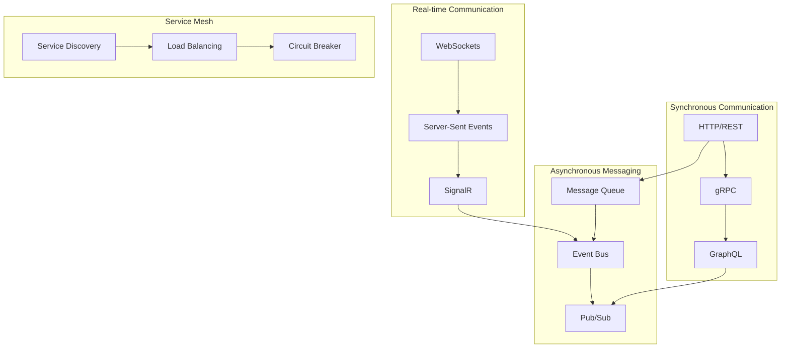

# Service Communication Patterns

**Description**: Inter-service messaging and RPC patterns demonstrating various communication strategies between distributed services including synchronous calls, asynchronous messaging, event-driven architecture, and real-time communication patterns.

**Integration Pattern**: Comprehensive service communication covering REST APIs, gRPC, message queues, event buses, and WebSocket connections with proper error handling and observability.

## Communication Patterns Overview

Modern distributed systems require robust communication patterns that handle various scenarios from simple request-response to complex event-driven workflows.



## 1. Synchronous Communication Patterns

### HTTP/REST with Polly Resilience

```csharp
namespace ServiceCommunication.Http;

using Polly;
using Polly.Extensions.Http;
using Microsoft.Extensions.Http.Resilience;

public class DocumentApiClient
{
    private readonly HttpClient httpClient;
    private readonly ILogger<DocumentApiClient> logger;
    private readonly IAsyncPolicy<HttpResponseMessage> retryPolicy;

    public DocumentApiClient(HttpClient httpClient, ILogger<DocumentApiClient> logger)
    {
        this.httpClient = httpClient;
        this.logger = logger;
        
        // Configure resilience policy
        retryPolicy = Policy
            .HandleResult<HttpResponseMessage>(r => !r.IsSuccessStatusCode)
            .Or<HttpRequestException>()
            .WaitAndRetryAsync(
                retryCount: 3,
                sleepDurationProvider: retryAttempt => TimeSpan.FromSeconds(Math.Pow(2, retryAttempt)),
                onRetry: (outcome, timespan, retryCount, context) =>
                {
                    logger.LogWarning("Retry {RetryCount} for {Operation} in {Delay}ms",
                        retryCount, context.OperationKey, timespan.TotalMilliseconds);
                });
    }

    public async Task<Document?> GetDocumentAsync(string documentId, CancellationToken cancellationToken = default)
    {
        var context = new Context($"GetDocument-{documentId}");
        
        var response = await retryPolicy.ExecuteAsync(async (ctx) =>
        {
            logger.LogDebug("Fetching document {DocumentId}", documentId);
            return await httpClient.GetAsync($"/api/documents/{documentId}", cancellationToken);
        }, context);

        if (response.IsSuccessStatusCode)
        {
            var json = await response.Content.ReadAsStringAsync(cancellationToken);
            return JsonSerializer.Deserialize<Document>(json);
        }

        logger.LogError("Failed to retrieve document {DocumentId}: {StatusCode}", 
            documentId, response.StatusCode);
        return null;
    }

    public async Task<ProcessingResult> ProcessDocumentAsync(
        ProcessDocumentRequest request, 
        CancellationToken cancellationToken = default)
    {
        var context = new Context($"ProcessDocument-{request.DocumentId}");
        
        var response = await retryPolicy.ExecuteAsync(async (ctx) =>
        {
            var json = JsonSerializer.Serialize(request);
            var content = new StringContent(json, Encoding.UTF8, "application/json");
            
            logger.LogInformation("Processing document {DocumentId}", request.DocumentId);
            return await httpClient.PostAsync("/api/documents/process", content, cancellationToken);
        }, context);

        var responseJson = await response.Content.ReadAsStringAsync(cancellationToken);
        return JsonSerializer.Deserialize<ProcessingResult>(responseJson) ?? 
               ProcessingResult.Failure("Invalid response format");
    }
}

// Extension for service registration
public static class HttpClientExtensions
{
    public static IServiceCollection AddDocumentApiClient(
        this IServiceCollection services, 
        Action<HttpClientOptions> configureOptions)
    {
        services.AddHttpClient<DocumentApiClient>((serviceProvider, client) =>
        {
            var options = new HttpClientOptions();
            configureOptions(options);
            
            client.BaseAddress = new Uri(options.BaseUrl);
            client.Timeout = options.Timeout;
            client.DefaultRequestHeaders.Add("User-Agent", options.UserAgent);
        })
        .AddStandardResilienceHandler(); // Built-in resilience patterns

        return services;
    }
}
```

### gRPC Communication with Streaming

```csharp
namespace ServiceCommunication.Grpc;

using Grpc.Core;
using Grpc.Net.Client;

// Proto service definition would be:
// service DocumentService {
//   rpc ProcessDocument(ProcessDocumentRequest) returns (ProcessDocumentResponse);
//   rpc StreamDocuments(StreamDocumentsRequest) returns (stream Document);
//   rpc BatchProcessDocuments(stream ProcessDocumentRequest) returns (BatchProcessResponse);
// }

public class GrpcDocumentClient
{
    private readonly DocumentService.DocumentServiceClient client;
    private readonly ILogger<GrpcDocumentClient> logger;

    public GrpcDocumentClient(GrpcChannel channel, ILogger<GrpcDocumentClient> logger)
    {
        client = new DocumentService.DocumentServiceClient(channel);
        this.logger = logger;
    }

    // Unary RPC call
    public async Task<ProcessDocumentResponse> ProcessDocumentAsync(
        ProcessDocumentRequest request,
        CancellationToken cancellationToken = default)
    {
        try
        {
            using var activity = Activity.Current?.Source.StartActivity("GrpcProcessDocument");
            activity?.SetTag("document.id", request.DocumentId);

            logger.LogDebug("Processing document {DocumentId} via gRPC", request.DocumentId);
            
            var response = await client.ProcessDocumentAsync(request, 
                deadline: DateTime.UtcNow.AddMinutes(5),
                cancellationToken: cancellationToken);

            logger.LogInformation("Document {DocumentId} processed successfully", request.DocumentId);
            return response;
        }
        catch (RpcException ex)
        {
            logger.LogError(ex, "gRPC call failed for document {DocumentId}: {Status}", 
                request.DocumentId, ex.Status);
            throw;
        }
    }

    // Server streaming RPC
    public async IAsyncEnumerable<Document> StreamDocumentsAsync(
        StreamDocumentsRequest request,
        [EnumeratorCancellation] CancellationToken cancellationToken = default)
    {
        using var call = client.StreamDocuments(request, cancellationToken: cancellationToken);
        
        logger.LogInformation("Starting document stream for query: {Query}", request.Query);
        
        await foreach (var document in call.ResponseStream.ReadAllAsync(cancellationToken))
        {
            logger.LogDebug("Received document {DocumentId} from stream", document.Id);
            yield return document;
        }
        
        logger.LogInformation("Document stream completed");
    }

    // Client streaming RPC
    public async Task<BatchProcessResponse> BatchProcessDocumentsAsync(
        IAsyncEnumerable<ProcessDocumentRequest> requests,
        CancellationToken cancellationToken = default)
    {
        using var call = client.BatchProcessDocuments(cancellationToken: cancellationToken);
        
        var processedCount = 0;
        await foreach (var request in requests)
        {
            await call.RequestStream.WriteAsync(request);
            processedCount++;
            
            if (processedCount % 10 == 0)
            {
                logger.LogDebug("Sent {Count} documents for batch processing", processedCount);
            }
        }
        
        await call.RequestStream.CompleteAsync();
        var response = await call.ResponseAsync;
        
        logger.LogInformation("Batch processing completed: {ProcessedCount} documents", 
            response.ProcessedCount);
        
        return response;
    }
}
```

## 2. Asynchronous Messaging Patterns

### Message Queue with Azure Service Bus

```csharp
namespace ServiceCommunication.Messaging;

using Azure.Messaging.ServiceBus;
using System.Text.Json;

public class ServiceBusMessageHandler
{
    private readonly ServiceBusClient serviceBusClient;
    private readonly ILogger<ServiceBusMessageHandler> logger;
    private readonly IServiceProvider serviceProvider;

    public ServiceBusMessageHandler(
        ServiceBusClient serviceBusClient,
        ILogger<ServiceBusMessageHandler> logger,
        IServiceProvider serviceProvider)
    {
        this.serviceBusClient = serviceBusClient;
        this.logger = logger;
        this.serviceProvider = serviceProvider;
    }

    public async Task SendMessageAsync<T>(string queueName, T message, MessageProperties? properties = null)
    {
        var sender = serviceBusClient.CreateSender(queueName);
        
        var json = JsonSerializer.Serialize(message);
        var serviceBusMessage = new ServiceBusMessage(json)
        {
            MessageId = properties?.MessageId ?? Guid.NewGuid().ToString(),
            CorrelationId = properties?.CorrelationId,
            Subject = typeof(T).Name,
            ContentType = "application/json"
        };

        // Add custom properties
        if (properties?.CustomProperties != null)
        {
            foreach (var prop in properties.CustomProperties)
            {
                serviceBusMessage.ApplicationProperties[prop.Key] = prop.Value;
            }
        }

        logger.LogDebug("Sending message {MessageId} to queue {QueueName}", 
            serviceBusMessage.MessageId, queueName);

        await sender.SendMessageAsync(serviceBusMessage);
        
        logger.LogInformation("Message {MessageId} sent successfully to {QueueName}", 
            serviceBusMessage.MessageId, queueName);
    }

    public async Task StartMessageProcessorAsync<T>(
        string queueName,
        Func<T, MessageContext, Task> messageHandler,
        CancellationToken cancellationToken = default)
    {
        var processor = serviceBusClient.CreateProcessor(queueName, new ServiceBusProcessorOptions
        {
            MaxConcurrentCalls = 4,
            AutoCompleteMessages = false,
            MaxAutoLockRenewalDuration = TimeSpan.FromMinutes(10)
        });

        processor.ProcessMessageAsync += async args =>
        {
            using var activity = Activity.Current?.Source.StartActivity("ProcessMessage");
            activity?.SetTag("message.id", args.Message.MessageId);
            activity?.SetTag("queue.name", queueName);

            try
            {
                var message = JsonSerializer.Deserialize<T>(args.Message.Body.ToString());
                if (message == null)
                {
                    logger.LogWarning("Failed to deserialize message {MessageId}", args.Message.MessageId);
                    await args.DeadLetterMessageAsync(args.Message);
                    return;
                }

                var context = new MessageContext
                {
                    MessageId = args.Message.MessageId,
                    CorrelationId = args.Message.CorrelationId,
                    DeliveryCount = args.Message.DeliveryCount,
                    Properties = args.Message.ApplicationProperties
                };

                logger.LogDebug("Processing message {MessageId} (delivery count: {DeliveryCount})",
                    args.Message.MessageId, args.Message.DeliveryCount);

                await messageHandler(message, context);
                await args.CompleteMessageAsync(args.Message);

                logger.LogInformation("Message {MessageId} processed successfully", args.Message.MessageId);
            }
            catch (Exception ex)
            {
                logger.LogError(ex, "Error processing message {MessageId}", args.Message.MessageId);

                // Handle retry logic
                if (args.Message.DeliveryCount < 3)
                {
                    // Abandon message for retry
                    await args.AbandonMessageAsync(args.Message);
                }
                else
                {
                    // Send to dead letter queue after max retries
                    await args.DeadLetterMessageAsync(args.Message, "MaxRetryExceeded", ex.Message);
                }
            }
        };

        processor.ProcessErrorAsync += args =>
        {
            logger.LogError(args.Exception, "Error in message processor for queue {QueueName}", queueName);
            return Task.CompletedTask;
        };

        await processor.StartProcessingAsync(cancellationToken);
        logger.LogInformation("Message processor started for queue {QueueName}", queueName);

        // Keep processing until cancellation is requested
        while (!cancellationToken.IsCancellationRequested)
        {
            await Task.Delay(1000, cancellationToken);
        }

        await processor.StopProcessingAsync();
        logger.LogInformation("Message processor stopped for queue {QueueName}", queueName);
    }
}

public class MessageContext
{
    public string MessageId { get; set; } = "";
    public string? CorrelationId { get; set; }
    public int DeliveryCount { get; set; }
    public IReadOnlyDictionary<string, object> Properties { get; set; } = new Dictionary<string, object>();
}

public class MessageProperties
{
    public string? MessageId { get; set; }
    public string? CorrelationId { get; set; }
    public Dictionary<string, object>? CustomProperties { get; set; }
}
```

### Event Bus Pattern with MediatR

```csharp
namespace ServiceCommunication.Events;

using MediatR;

public interface IEventBus
{
    Task PublishAsync<T>(T @event) where T : IEvent;
    Task PublishAsync<T>(T @event, CancellationToken cancellationToken) where T : IEvent;
}

public class EventBus : IEventBus
{
    private readonly IMediator mediator;
    private readonly ILogger<EventBus> logger;
    private readonly IEventStore eventStore;

    public EventBus(IMediator mediator, ILogger<EventBus> logger, IEventStore eventStore)
    {
        this.mediator = mediator;
        this.logger = logger;
        this.eventStore = eventStore;
    }

    public async Task PublishAsync<T>(T @event) where T : IEvent
    {
        await PublishAsync(@event, CancellationToken.None);
    }

    public async Task PublishAsync<T>(T @event, CancellationToken cancellationToken) where T : IEvent
    {
        using var activity = Activity.Current?.Source.StartActivity("PublishEvent");
        activity?.SetTag("event.type", typeof(T).Name);
        activity?.SetTag("event.id", @event.EventId);

        logger.LogDebug("Publishing event {EventType} with ID {EventId}", typeof(T).Name, @event.EventId);

        try
        {
            // Store event for replay/audit purposes
            await eventStore.StoreEventAsync(@event, cancellationToken);

            // Publish through MediatR for in-process handling
            await mediator.Publish(@event, cancellationToken);

            logger.LogInformation("Event {EventType} published successfully", typeof(T).Name);
        }
        catch (Exception ex)
        {
            logger.LogError(ex, "Failed to publish event {EventType} with ID {EventId}", 
                typeof(T).Name, @event.EventId);
            throw;
        }
    }
}

// Base event interface
public interface IEvent : INotification
{
    string EventId { get; }
    DateTime OccurredAt { get; }
    string EventType { get; }
}

// Document processing events
public record DocumentProcessedEvent : IEvent
{
    public string EventId { get; init; } = Guid.NewGuid().ToString();
    public DateTime OccurredAt { get; init; } = DateTime.UtcNow;
    public string EventType => nameof(DocumentProcessedEvent);
    
    public string DocumentId { get; init; } = "";
    public string UserId { get; init; } = "";
    public MLProcessingResults ProcessingResults { get; init; } = new();
    public TimeSpan ProcessingDuration { get; init; }
}

public record DocumentFailedEvent : IEvent
{
    public string EventId { get; init; } = Guid.NewGuid().ToString();
    public DateTime OccurredAt { get; init; } = DateTime.UtcNow;
    public string EventType => nameof(DocumentFailedEvent);
    
    public string DocumentId { get; init; } = "";
    public string Error { get; init; } = "";
    public string? StackTrace { get; init; }
}

// Event handlers
public class DocumentProcessedEventHandler : INotificationHandler<DocumentProcessedEvent>
{
    private readonly INotificationService notificationService;
    private readonly IAnalyticsService analyticsService;
    private readonly ILogger<DocumentProcessedEventHandler> logger;

    public DocumentProcessedEventHandler(
        INotificationService notificationService,
        IAnalyticsService analyticsService,
        ILogger<DocumentProcessedEventHandler> logger)
    {
        this.notificationService = notificationService;
        this.analyticsService = analyticsService;
        this.logger = logger;
    }

    public async Task Handle(DocumentProcessedEvent notification, CancellationToken cancellationToken)
    {
        logger.LogDebug("Handling DocumentProcessedEvent for {DocumentId}", notification.DocumentId);

        // Send notification to user
        await notificationService.SendDocumentProcessedNotificationAsync(
            notification.UserId,
            notification.DocumentId,
            cancellationToken);

        // Update analytics
        await analyticsService.RecordDocumentProcessingAsync(
            notification.DocumentId,
            notification.ProcessingDuration,
            notification.ProcessingResults,
            cancellationToken);

        logger.LogInformation("DocumentProcessedEvent handled for {DocumentId}", notification.DocumentId);
    }
}
```

## 3. Real-time Communication with SignalR

```csharp
namespace ServiceCommunication.Realtime;

using Microsoft.AspNetCore.SignalR;

public class DocumentProcessingHub : Hub
{
    private readonly ILogger<DocumentProcessingHub> logger;

    public DocumentProcessingHub(ILogger<DocumentProcessingHub> logger)
    {
        this.logger = logger;
    }

    public async Task JoinDocumentGroup(string documentId)
    {
        await Groups.AddToGroupAsync(Context.ConnectionId, $"document_{documentId}");
        logger.LogDebug("Client {ConnectionId} joined document group {DocumentId}", 
            Context.ConnectionId, documentId);
    }

    public async Task LeaveDocumentGroup(string documentId)
    {
        await Groups.RemoveFromGroupAsync(Context.ConnectionId, $"document_{documentId}");
        logger.LogDebug("Client {ConnectionId} left document group {DocumentId}", 
            Context.ConnectionId, documentId);
    }

    public override async Task OnConnectedAsync()
    {
        logger.LogInformation("Client {ConnectionId} connected", Context.ConnectionId);
        await base.OnConnectedAsync();
    }

    public override async Task OnDisconnectedAsync(Exception? exception)
    {
        logger.LogInformation("Client {ConnectionId} disconnected", Context.ConnectionId);
        await base.OnDisconnectedAsync(exception);
    }
}

public class DocumentProcessingNotificationService
{
    private readonly IHubContext<DocumentProcessingHub> hubContext;
    private readonly ILogger<DocumentProcessingNotificationService> logger;

    public DocumentProcessingNotificationService(
        IHubContext<DocumentProcessingHub> hubContext,
        ILogger<DocumentProcessingNotificationService> logger)
    {
        this.hubContext = hubContext;
        this.logger = logger;
    }

    public async Task NotifyDocumentProcessingStatusAsync(string documentId, DocumentProcessingStatus status)
    {
        var groupName = $"document_{documentId}";
        
        logger.LogDebug("Sending processing status update to group {GroupName}: {Status}", 
            groupName, status.Status);

        await hubContext.Clients.Group(groupName).SendAsync("DocumentProcessingUpdate", new
        {
            DocumentId = documentId,
            Status = status.Status,
            Progress = status.Progress,
            CurrentStep = status.CurrentStep,
            EstimatedTimeRemaining = status.EstimatedTimeRemaining,
            UpdatedAt = DateTime.UtcNow
        });
    }

    public async Task NotifyDocumentProcessingCompleteAsync(string documentId, MLProcessingResults results)
    {
        var groupName = $"document_{documentId}";
        
        logger.LogInformation("Sending processing completion notification to group {GroupName}", groupName);

        await hubContext.Clients.Group(groupName).SendAsync("DocumentProcessingComplete", new
        {
            DocumentId = documentId,
            Results = results,
            CompletedAt = DateTime.UtcNow
        });
    }
}
```

## 4. Service Discovery and Load Balancing

```csharp
namespace ServiceCommunication.Discovery;

using Microsoft.Extensions.ServiceDiscovery;

public class ServiceDiscoveryConfiguration
{
    public static IServiceCollection AddServiceDiscovery(this IServiceCollection services)
    {
        services.AddServiceDiscovery(options =>
        {
            // Configure service discovery endpoints
            options.Services.AddEndpoint("document-api", "https://localhost:7001");
            options.Services.AddEndpoint("ml-service", "https://localhost:7002");
            options.Services.AddEndpoint("vector-db", "https://localhost:6333");
        });

        // Add HTTP clients with service discovery
        services.AddHttpClient<IDocumentApiClient, DocumentApiClient>(
            (serviceProvider, client) =>
            {
                var serviceEndpoint = serviceProvider.GetRequiredService<ServiceEndpointResolver>();
                var endpoint = serviceEndpoint.GetEndpoint("document-api");
                client.BaseAddress = new Uri(endpoint.ToString());
            });

        services.AddHttpClient<IMLServiceClient, MLServiceClient>(
            (serviceProvider, client) =>
            {
                var serviceEndpoint = serviceProvider.GetRequiredService<ServiceEndpointResolver>();
                var endpoint = serviceEndpoint.GetEndpoint("ml-service");
                client.BaseAddress = new Uri(endpoint.ToString());
            });

        return services;
    }
}

// Service health monitoring
public class ServiceHealthChecker : BackgroundService
{
    private readonly IServiceProvider serviceProvider;
    private readonly ILogger<ServiceHealthChecker> logger;
    private readonly TimeSpan checkInterval = TimeSpan.FromMinutes(1);

    public ServiceHealthChecker(IServiceProvider serviceProvider, ILogger<ServiceHealthChecker> logger)
    {
        this.serviceProvider = serviceProvider;
        this.logger = logger;
    }

    protected override async Task ExecuteAsync(CancellationToken stoppingToken)
    {
        while (!stoppingToken.IsCancellationRequested)
        {
            await CheckServiceHealthAsync();
            await Task.Delay(checkInterval, stoppingToken);
        }
    }

    private async Task CheckServiceHealthAsync()
    {
        using var scope = serviceProvider.CreateScope();
        var httpClientFactory = scope.ServiceProvider.GetRequiredService<IHttpClientFactory>();

        var services = new[] { "document-api", "ml-service", "vector-db" };
        
        foreach (var serviceName in services)
        {
            try
            {
                using var client = httpClientFactory.CreateClient(serviceName);
                var response = await client.GetAsync("/health");
                
                if (response.IsSuccessStatusCode)
                {
                    logger.LogDebug("Service {ServiceName} is healthy", serviceName);
                }
                else
                {
                    logger.LogWarning("Service {ServiceName} health check failed: {StatusCode}", 
                        serviceName, response.StatusCode);
                }
            }
            catch (Exception ex)
            {
                logger.LogError(ex, "Service {ServiceName} health check failed", serviceName);
            }
        }
    }
}
```

## Communication Pattern Selection Guide

| Pattern | Use Case | Latency | Reliability | Complexity |
|---------|----------|---------|-------------|------------|
| HTTP/REST | CRUD operations, public APIs | Medium | Medium | Low |
| gRPC | Internal services, streaming | Low | High | Medium |
| GraphQL | Complex queries, real-time | Medium | Medium | Medium |
| Message Queue | Async processing, decoupling | High | High | Medium |
| Event Bus | Event-driven, notifications | Low | Medium | Low |
| SignalR | Real-time updates, collaboration | Low | Medium | Low |

---

**Key Benefits**: Flexible communication options, resilient message delivery, real-time capabilities, comprehensive error handling

**When to Use**: Distributed architectures, microservices, event-driven systems, real-time applications

**Performance**: Optimized for different communication patterns, built-in resilience, efficient resource utilization
