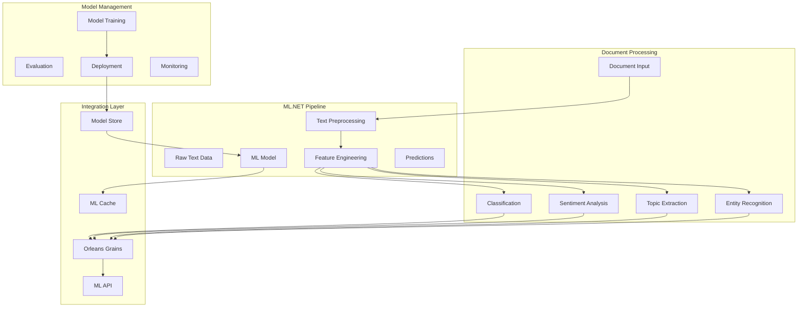

# ML.NET Integration Patterns

**Description**: Comprehensive ML.NET patterns for text processing, document classification, topic modeling, and custom model training within distributed document processing pipelines.

**ML.NET** is Microsoft's cross-platform, open-source machine learning framework for .NET developers. It provides high-level APIs for common ML scenarios and low-level APIs for advanced customization.

## Key Capabilities for Document Processing

- **Text Classification**: Categorize documents into predefined classes
- **Sentiment Analysis**: Analyze emotional tone and opinion mining
- **Topic Modeling**: Extract themes and topics from document collections
- **Named Entity Recognition**: Identify persons, organizations, locations
- **Text Clustering**: Group similar documents automatically
- **Custom Model Training**: Train domain-specific models on your data
- **ONNX Integration**: Use pre-trained models from other frameworks

## Index

### Core ML Patterns

- [Text Classification](text-classification.md) - Document categorization and multi-class prediction
- [Sentiment Analysis](sentiment-analysis.md) - Opinion mining and emotion detection
- [Topic Modeling](topic-modeling.md) - Theme extraction and document clustering
- [Named Entity Recognition](named-entity-recognition.md) - Entity extraction and linking

### Advanced Patterns

- [Custom Model Training](custom-model-training.md) - Training domain-specific models
- [Feature Engineering](feature-engineering.md) - Text preprocessing and transformation
- [Model Evaluation](model-evaluation.md) - Performance metrics and validation strategies
- [Model Deployment](model-deployment.md) - Production deployment and versioning

### Integration Patterns

- [Orleans Integration](orleans-integration.md) - ML.NET with Orleans grains
- [Aspire Orchestration](../aspire/ml-service-orchestration.md) - Service coordination patterns
- [Local ML Development](../aspire/local-ml-development.md) - Local development with provider patterns
- [Real-time Processing](realtime-processing.md) - Streaming ML with SignalR
- [Batch Processing](batch-processing.md) - Large-scale document processing

## Architecture Overview



## Text Classification Patterns

### Document Classifier Implementation

```csharp
namespace DocumentProcessor.ML;

using Microsoft.ML;
using Microsoft.ML.Data;

[Serializable]
public class DocumentData
{
    [LoadColumn(0)] public string Text { get; set; } = string.Empty;
    [LoadColumn(1)] public string Label { get; set; } = string.Empty;
    [LoadColumn(2)] public float Score { get; set; }
}

[Serializable]
public class DocumentPrediction
{
    [ColumnName("PredictedLabel")] public string PredictedCategory { get; set; } = string.Empty;
    [ColumnName("Score")] public float[] Scores { get; set; } = Array.Empty<float>();
    public float Confidence => Scores.Max();
    public Dictionary<string, float> CategoryScores { get; set; } = new();
}

public interface IDocumentClassifier
{
    Task<DocumentPrediction> ClassifyAsync(string text);
    Task<List<DocumentPrediction>> ClassifyBatchAsync(IEnumerable<string> texts);
    Task<ModelMetrics> EvaluateModelAsync(IEnumerable<DocumentData> testData);
    Task RetrainModelAsync(IEnumerable<DocumentData> trainingData);
}

public class DocumentClassifier : IDocumentClassifier
{
    private readonly MLContext _mlContext;
    private readonly ILogger<DocumentClassifier> _logger;
    private readonly IMemoryCache _modelCache;
    private ITransformer? _model;
    private PredictionEngine<DocumentData, DocumentPrediction>? _predictionEngine;
    private readonly string[] _categories;

    public DocumentClassifier(
        MLContext mlContext, 
        ILogger<DocumentClassifier> logger,
        IMemoryCache modelCache,
        IConfiguration configuration)
    {
        _mlContext = mlContext;
        _logger = logger;
        _modelCache = modelCache;
        _categories = configuration.GetSection("ML:Categories").Get<string[]>() ?? Array.Empty<string>();
        
        LoadModel();
    }

    public async Task<DocumentPrediction> ClassifyAsync(string text)
    {
        if (_predictionEngine == null)
        {
            throw new InvalidOperationException("Model not loaded");
        }

        var input = new DocumentData { Text = text };
        var prediction = _predictionEngine.Predict(input);
        
        // Map scores to category names
        prediction.CategoryScores = _categories
            .Zip(prediction.Scores, (category, score) => new { category, score })
            .ToDictionary(x => x.category, x => x.score);

        _logger.LogDebug("Classified text with confidence {Confidence:P2} as {Category}", 
            prediction.Confidence, prediction.PredictedCategory);

        return await Task.FromResult(prediction);
    }

    public async Task<List<DocumentPrediction>> ClassifyBatchAsync(IEnumerable<string> texts)
    {
        if (_model == null)
        {
            throw new InvalidOperationException("Model not loaded");
        }

        var inputData = texts.Select(text => new DocumentData { Text = text });
        var dataView = _mlContext.Data.LoadFromEnumerable(inputData);
        var predictions = _model.Transform(dataView);
        
        var results = _mlContext.Data.CreateEnumerable<DocumentPrediction>(predictions, reuseRowObject: false)
            .ToList();

        // Map scores for each prediction
        foreach (var prediction in results)
        {
            prediction.CategoryScores = _categories
                .Zip(prediction.Scores, (category, score) => new { category, score })
                .ToDictionary(x => x.category, x => x.score);
        }

        _logger.LogInformation("Classified batch of {Count} documents", results.Count);
        return results;
    }

    public async Task<ModelMetrics> EvaluateModelAsync(IEnumerable<DocumentData> testData)
    {
        if (_model == null)
        {
            throw new InvalidOperationException("Model not loaded");
        }

        var testDataView = _mlContext.Data.LoadFromEnumerable(testData);
        var predictions = _model.Transform(testDataView);
        
        var metrics = _mlContext.MulticlassClassification.Evaluate(predictions);
        
        _logger.LogInformation("Model evaluation - Accuracy: {Accuracy:P2}, MacroAccuracy: {MacroAccuracy:P2}",
            metrics.MicroAccuracy, metrics.MacroAccuracy);

        return new ModelMetrics(
            Accuracy: metrics.MicroAccuracy,
            MacroAccuracy: metrics.MacroAccuracy,
            LogLoss: metrics.LogLoss,
            ConfusionMatrix: metrics.ConfusionMatrix.GetFormattedConfusionTable());
    }

    public async Task RetrainModelAsync(IEnumerable<DocumentData> trainingData)
    {
        _logger.LogInformation("Starting model retraining with {Count} samples", trainingData.Count());

        var dataView = _mlContext.Data.LoadFromEnumerable(trainingData);
        
        // Define training pipeline
        var pipeline = _mlContext.Transforms.Conversion
            .MapValueToKey("Label")
            .Append(_mlContext.Transforms.Text.FeaturizeText("Features", "Text"))
            .Append(_mlContext.MulticlassClassification.Trainers.SdcaMaximumEntropy("Label", "Features"))
            .Append(_mlContext.Transforms.Conversion.MapKeyToValue("PredictedLabel"));

        // Train the model
        _model = pipeline.Fit(dataView);
        
        // Update prediction engine
        _predictionEngine = _mlContext.Model.CreatePredictionEngine<DocumentData, DocumentPrediction>(_model);
        
        // Save model
        await SaveModelAsync();
        
        _logger.LogInformation("Model retraining completed successfully");
    }

    private void LoadModel()
    {
        try
        {
            if (_modelCache.TryGetValue("document-classifier", out ITransformer? cachedModel) && 
                cachedModel != null)
            {
                _model = cachedModel;
                _predictionEngine = _mlContext.Model.CreatePredictionEngine<DocumentData, DocumentPrediction>(_model);
                _logger.LogInformation("Loaded model from cache");
                return;
            }

            var modelPath = "models/document-classifier.zip";
            if (File.Exists(modelPath))
            {
                _model = _mlContext.Model.Load(modelPath, out _);
                _predictionEngine = _mlContext.Model.CreatePredictionEngine<DocumentData, DocumentPrediction>(_model);
                
                // Cache the model
                _modelCache.Set("document-classifier", _model, TimeSpan.FromHours(1));
                
                _logger.LogInformation("Loaded model from file: {ModelPath}", modelPath);
            }
            else
            {
                _logger.LogWarning("Model file not found: {ModelPath}. Model training required.", modelPath);
            }
        }
        catch (Exception ex)
        {
            _logger.LogError(ex, "Failed to load classification model");
        }
    }

    private async Task SaveModelAsync()
    {
        if (_model == null) return;

        var modelPath = "models/document-classifier.zip";
        Directory.CreateDirectory(Path.GetDirectoryName(modelPath)!);
        
        _mlContext.Model.Save(_model, null, modelPath);
        
        // Update cache
        _modelCache.Set("document-classifier", _model, TimeSpan.FromHours(1));
        
        _logger.LogInformation("Model saved to: {ModelPath}", modelPath);
        await Task.CompletedTask;
    }
}

public record ModelMetrics(
    double Accuracy,
    double MacroAccuracy,
    double LogLoss,
    string ConfusionMatrix);
```

## Sentiment Analysis Patterns

### Advanced Sentiment Analyzer

```csharp
namespace DocumentProcessor.ML;

using Microsoft.ML;
using Microsoft.ML.Data;

[Serializable]
public class SentimentData
{
    [LoadColumn(0)] public string Text { get; set; } = string.Empty;
    [LoadColumn(1)] public bool Label { get; set; } // true = positive, false = negative
}

[Serializable]
public class SentimentPrediction
{
    [ColumnName("PredictedLabel")] public bool IsPositive { get; set; }
    [ColumnName("Probability")] public float Probability { get; set; }
    [ColumnName("Score")] public float Score { get; set; }
    
    public SentimentClass SentimentClass => Probability switch
    {
        >= 0.8f => SentimentClass.VeryPositive,
        >= 0.6f => SentimentClass.Positive,
        >= 0.4f => SentimentClass.Neutral,
        >= 0.2f => SentimentClass.Negative,
        _ => SentimentClass.VeryNegative
    };
    
    public double Confidence => Math.Abs(Probability - 0.5) * 2; // 0 to 1 scale
}

public enum SentimentClass
{
    VeryNegative,
    Negative,
    Neutral,
    Positive,
    VeryPositive
}

public interface ISentimentAnalyzer
{
    Task<SentimentPrediction> AnalyzeAsync(string text);
    Task<List<SentimentPrediction>> AnalyzeBatchAsync(IEnumerable<string> texts);
    Task<SentimentDistribution> AnalyzeDistributionAsync(IEnumerable<string> texts);
    Task<EmotionAnalysis> AnalyzeEmotionsAsync(string text);
}

public class SentimentAnalyzer : ISentimentAnalyzer
{
    private readonly MLContext _mlContext;
    private readonly ILogger<SentimentAnalyzer> _logger;
    private readonly ITransformer _model;
    private readonly PredictionEngine<SentimentData, SentimentPrediction> _predictionEngine;

    public SentimentAnalyzer(MLContext mlContext, ILogger<SentimentAnalyzer> logger)
    {
        _mlContext = mlContext;
        _logger = logger;
        
        // Load pre-trained sentiment model or create new one
        _model = LoadOrCreateModel();
        _predictionEngine = _mlContext.Model.CreatePredictionEngine<SentimentData, SentimentPrediction>(_model);
    }

    public async Task<SentimentPrediction> AnalyzeAsync(string text)
    {
        var input = new SentimentData { Text = text };
        var prediction = _predictionEngine.Predict(input);
        
        _logger.LogDebug("Analyzed sentiment: {Sentiment} with confidence {Confidence:P2}", 
            prediction.SentimentClass, prediction.Confidence);

        return await Task.FromResult(prediction);
    }

    public async Task<List<SentimentPrediction>> AnalyzeBatchAsync(IEnumerable<string> texts)
    {
        var inputData = texts.Select(text => new SentimentData { Text = text });
        var dataView = _mlContext.Data.LoadFromEnumerable(inputData);
        var predictions = _model.Transform(dataView);
        
        var results = _mlContext.Data.CreateEnumerable<SentimentPrediction>(predictions, reuseRowObject: false)
            .ToList();

        _logger.LogInformation("Analyzed sentiment for batch of {Count} texts", results.Count);
        return results;
    }

    public async Task<SentimentDistribution> AnalyzeDistributionAsync(IEnumerable<string> texts)
    {
        var predictions = await AnalyzeBatchAsync(texts);
        
        var distribution = predictions
            .GroupBy(p => p.SentimentClass)
            .ToDictionary(g => g.Key, g => g.Count());

        var totalCount = predictions.Count;
        var averageScore = predictions.Average(p => p.Score);
        var averageConfidence = predictions.Average(p => p.Confidence);

        return new SentimentDistribution(
            Distribution: distribution,
            TotalCount: totalCount,
            AverageScore: averageScore,
            AverageConfidence: averageConfidence,
            DominantSentiment: distribution.OrderByDescending(kvp => kvp.Value).First().Key);
    }

    public async Task<EmotionAnalysis> AnalyzeEmotionsAsync(string text)
    {
        // This would integrate with Azure Cognitive Services or custom emotion models
        // For now, we'll derive emotions from sentiment analysis
        
        var sentiment = await AnalyzeAsync(text);
        
        // Simple emotion mapping based on sentiment
        var emotions = new Dictionary<string, float>();
        
        if (sentiment.IsPositive)
        {
            emotions["joy"] = sentiment.Probability;
            emotions["satisfaction"] = sentiment.Probability * 0.8f;
            emotions["excitement"] = Math.Max(0, (sentiment.Probability - 0.7f) * 3);
        }
        else
        {
            emotions["sadness"] = 1 - sentiment.Probability;
            emotions["frustration"] = (1 - sentiment.Probability) * 0.7f;
            emotions["anger"] = Math.Max(0, (0.3f - sentiment.Probability) * 2);
        }

        // Add neutral emotions
        emotions["neutral"] = (float)(1 - sentiment.Confidence);

        return new EmotionAnalysis(
            PrimaryEmotion: emotions.OrderByDescending(kvp => kvp.Value).First().Key,
            EmotionScores: emotions,
            OverallSentiment: sentiment.SentimentClass,
            Confidence: sentiment.Confidence);
    }

    private ITransformer LoadOrCreateModel()
    {
        // This is a simplified version - in practice, you'd load a pre-trained model
        // or train one using your domain-specific data
        
        var sampleData = new[]
        {
            new SentimentData { Text = "This is fantastic!", Label = true },
            new SentimentData { Text = "I love this product", Label = true },
            new SentimentData { Text = "This is terrible", Label = false },
            new SentimentData { Text = "I hate this", Label = false }
        };

        var dataView = _mlContext.Data.LoadFromEnumerable(sampleData);
        
        var pipeline = _mlContext.Transforms.Text
            .FeaturizeText("Features", "Text")
            .Append(_mlContext.BinaryClassification.Trainers.SdcaLogisticRegression());

        return pipeline.Fit(dataView);
    }
}

public record SentimentDistribution(
    Dictionary<SentimentClass, int> Distribution,
    int TotalCount,
    double AverageScore,
    double AverageConfidence,
    SentimentClass DominantSentiment);

public record EmotionAnalysis(
    string PrimaryEmotion,
    Dictionary<string, float> EmotionScores,
    SentimentClass OverallSentiment,
    double Confidence);
```

## Topic Modeling Implementation

### Latent Dirichlet Allocation (LDA) Topic Extractor

```csharp
namespace DocumentProcessor.ML;

using Microsoft.ML;
using Microsoft.ML.Data;

[Serializable]
public class DocumentText
{
    [LoadColumn(0)] public string Id { get; set; } = string.Empty;
    [LoadColumn(1)] public string Text { get; set; } = string.Empty;
    [LoadColumn(2)] public string[] Tokens { get; set; } = Array.Empty<string>();
}

[Serializable]
public class TopicPrediction
{
    [VectorType()] public float[] Features { get; set; } = Array.Empty<float>();
    public Dictionary<int, float> TopicDistribution { get; set; } = new();
    public int DominantTopic => TopicDistribution.OrderByDescending(kvp => kvp.Value).First().Key;
    public float DominantTopicScore => TopicDistribution.Values.Max();
}

public interface ITopicExtractor
{
    Task<TopicModelResult> ExtractTopicsAsync(IEnumerable<string> documents, int topicCount = 10);
    Task<TopicPrediction> PredictTopicsAsync(string document);
    Task<List<string>> GetTopicKeywordsAsync(int topicId, int keywordCount = 10);
    Task<TopicCoherence> CalculateCoherenceAsync(TopicModelResult model);
}

public class TopicExtractor : ITopicExtractor
{
    private readonly MLContext _mlContext;
    private readonly ILogger<TopicExtractor> _logger;
    private readonly ITextPreprocessor _preprocessor;
    private ITransformer? _model;
    private TopicModelResult? _lastModel;

    public TopicExtractor(
        MLContext mlContext, 
        ILogger<TopicExtractor> logger,
        ITextPreprocessor preprocessor)
    {
        _mlContext = mlContext;
        _logger = logger;
        _preprocessor = preprocessor;
    }

    public async Task<TopicModelResult> ExtractTopicsAsync(IEnumerable<string> documents, int topicCount = 10)
    {
        _logger.LogInformation("Extracting {TopicCount} topics from {DocumentCount} documents", 
            topicCount, documents.Count());

        // Preprocess documents
        var preprocessedDocs = new List<DocumentText>();
        var docId = 0;
        
        foreach (var doc in documents)
        {
            var tokens = await _preprocessor.PreprocessAsync(doc);
            preprocessedDocs.Add(new DocumentText 
            { 
                Id = $"doc_{docId++}", 
                Text = doc, 
                Tokens = tokens.ToArray() 
            });
        }

        var dataView = _mlContext.Data.LoadFromEnumerable(preprocessedDocs);

        // Build LDA pipeline
        var pipeline = _mlContext.Transforms.Text
            .ProduceNgrams("Features", "Tokens", 
                ngramLength: 2, 
                useAllLengths: true,
                weighting: NgramExtractingEstimator.WeightingCriteria.Tf)
            .Append(_mlContext.Transforms.Text.LatentDirichletAllocation(
                "TopicProbabilities", 
                "Features", 
                numberOfTopics: topicCount,
                alphaSum: 100,
                beta: 0.01,
                samplingStepCount: 10,
                maximumNumberOfIterations: 200));

        // Train the model
        _model = pipeline.Fit(dataView);
        var transformedData = _model.Transform(dataView);

        // Extract topic-word distributions
        var topics = await ExtractTopicDefinitionsAsync(transformedData, topicCount);
        
        // Get document-topic distributions
        var predictions = _mlContext.Data.CreateEnumerable<TopicPrediction>(
            transformedData, reuseRowObject: false).ToList();

        var documentTopics = preprocessedDocs.Zip(predictions, (doc, pred) => 
            new DocumentTopicAssignment(
                DocumentId: doc.Id,
                Text: doc.Text,
                TopicDistribution: ExtractTopicDistribution(pred.Features, topicCount),
                DominantTopic: pred.DominantTopic,
                Confidence: pred.DominantTopicScore))
            .ToList();

        _lastModel = new TopicModelResult(
            Topics: topics,
            DocumentAssignments: documentTopics,
            TopicCount: topicCount,
            DocumentCount: documents.Count(),
            CreatedAt: DateTime.UtcNow);

        _logger.LogInformation("Topic extraction completed. Found {TopicCount} topics", topicCount);
        return _lastModel;
    }

    public async Task<TopicPrediction> PredictTopicsAsync(string document)
    {
        if (_model == null)
        {
            throw new InvalidOperationException("Model not trained. Call ExtractTopicsAsync first.");
        }

        var tokens = await _preprocessor.PreprocessAsync(document);
        var docData = new DocumentText 
        { 
            Id = "prediction", 
            Text = document, 
            Tokens = tokens.ToArray() 
        };

        var dataView = _mlContext.Data.LoadFromEnumerable(new[] { docData });
        var prediction = _model.Transform(dataView);
        
        var result = _mlContext.Data.CreateEnumerable<TopicPrediction>(
            prediction, reuseRowObject: false).First();

        var topicCount = _lastModel?.TopicCount ?? 10;
        result.TopicDistribution = ExtractTopicDistribution(result.Features, topicCount);

        return result;
    }

    public async Task<List<string>> GetTopicKeywordsAsync(int topicId, int keywordCount = 10)
    {
        if (_lastModel == null)
        {
            throw new InvalidOperationException("No model available. Train a model first.");
        }

        if (!_lastModel.Topics.ContainsKey(topicId))
        {
            throw new ArgumentException($"Topic {topicId} not found");
        }

        var topic = _lastModel.Topics[topicId];
        var keywords = topic.Keywords
            .OrderByDescending(kvp => kvp.Value)
            .Take(keywordCount)
            .Select(kvp => kvp.Key)
            .ToList();

        return await Task.FromResult(keywords);
    }

    public async Task<TopicCoherence> CalculateCoherenceAsync(TopicModelResult model)
    {
        _logger.LogInformation("Calculating topic coherence for {TopicCount} topics", model.TopicCount);

        var coherenceScores = new Dictionary<int, double>();
        
        foreach (var (topicId, topic) in model.Topics)
        {
            // Calculate C_V coherence score
            var topKeywords = topic.Keywords
                .OrderByDescending(kvp => kvp.Value)
                .Take(10)
                .Select(kvp => kvp.Key)
                .ToList();

            var coherenceScore = await CalculateTopicCoherenceScore(topKeywords, model.DocumentAssignments);
            coherenceScores[topicId] = coherenceScore;
        }

        var averageCoherence = coherenceScores.Values.Average();
        var minCoherence = coherenceScores.Values.Min();
        var maxCoherence = coherenceScores.Values.Max();

        return new TopicCoherence(
            OverallCoherence: averageCoherence,
            TopicScores: coherenceScores,
            MinCoherence: minCoherence,
            MaxCoherence: maxCoherence,
            CoherenceMetric: "C_V");
    }

    private async Task<Dictionary<int, Topic>> ExtractTopicDefinitionsAsync(IDataView transformedData, int topicCount)
    {
        // This is a simplified implementation
        // In practice, you'd extract the actual topic-word distributions from the LDA model
        
        var topics = new Dictionary<int, Topic>();
        var random = new Random(42);
        
        var sampleKeywords = new[] { 
            "technology", "innovation", "digital", "software", "data", "analytics", 
            "business", "market", "strategy", "growth", "customer", "service",
            "research", "development", "science", "analysis", "report", "study"
        };

        for (int i = 0; i < topicCount; i++)
        {
            var keywords = sampleKeywords
                .OrderBy(_ => random.Next())
                .Take(10)
                .ToDictionary(k => k, k => (float)random.NextDouble());

            topics[i] = new Topic(
                Id: i,
                Label: $"Topic_{i}",
                Keywords: keywords,
                Coherence: random.NextDouble());
        }

        return await Task.FromResult(topics);
    }

    private Dictionary<int, float> ExtractTopicDistribution(float[] features, int topicCount)
    {
        var distribution = new Dictionary<int, float>();
        
        // Assuming features represent topic probabilities
        var probSum = features.Take(topicCount).Sum();
        
        for (int i = 0; i < Math.Min(topicCount, features.Length); i++)
        {
            distribution[i] = probSum > 0 ? features[i] / probSum : 0;
        }

        return distribution;
    }

    private async Task<double> CalculateTopicCoherenceScore(List<string> keywords, List<DocumentTopicAssignment> documents)
    {
        // Simplified coherence calculation
        // In practice, you'd use more sophisticated metrics like C_V, UMass, etc.
        
        var cooccurrenceCount = 0;
        var totalPairs = 0;

        for (int i = 0; i < keywords.Count; i++)
        {
            for (int j = i + 1; j < keywords.Count; j++)
            {
                var keyword1 = keywords[i];
                var keyword2 = keywords[j];
                
                var docsWithBoth = documents.Count(doc => 
                    doc.Text.Contains(keyword1, StringComparison.OrdinalIgnoreCase) &&
                    doc.Text.Contains(keyword2, StringComparison.OrdinalIgnoreCase));
                
                if (docsWithBoth > 0)
                {
                    cooccurrenceCount++;
                }
                
                totalPairs++;
            }
        }

        return await Task.FromResult(totalPairs > 0 ? (double)cooccurrenceCount / totalPairs : 0.0);
    }
}

public record Topic(
    int Id,
    string Label,
    Dictionary<string, float> Keywords,
    double Coherence);

public record DocumentTopicAssignment(
    string DocumentId,
    string Text,
    Dictionary<int, float> TopicDistribution,
    int DominantTopic,
    float Confidence);

public record TopicModelResult(
    Dictionary<int, Topic> Topics,
    List<DocumentTopicAssignment> DocumentAssignments,
    int TopicCount,
    int DocumentCount,
    DateTime CreatedAt);

public record TopicCoherence(
    double OverallCoherence,
    Dictionary<int, double> TopicScores,
    double MinCoherence,
    double MaxCoherence,
    string CoherenceMetric);
```

## Service Registration and DI

### ML.NET Service Configuration

```csharp
namespace DocumentProcessor.ML;

public static class ServiceCollectionExtensions
{
    public static IServiceCollection AddMLNetServices(this IServiceCollection services, IConfiguration configuration)
    {
        // Register ML Context as singleton
        services.AddSingleton(provider => new MLContext(seed: 42));
        
        // Register memory cache for models
        services.AddMemoryCache();
        
        // Register ML services
        services.AddScoped<IDocumentClassifier, DocumentClassifier>();
        services.AddScoped<ISentimentAnalyzer, SentimentAnalyzer>();
        services.AddScoped<ITopicExtractor, TopicExtractor>();
        services.AddScoped<INamedEntityRecognizer, NamedEntityRecognizer>();
        
        // Register preprocessing services
        services.AddScoped<ITextPreprocessor, TextPreprocessor>();
        services.AddScoped<IFeatureEngineer, FeatureEngineer>();
        
        // Register model management services
        services.AddScoped<IModelManager, ModelManager>();
        services.AddScoped<IModelEvaluator, ModelEvaluator>();
        
        // Configure ML options
        services.Configure<MLOptions>(configuration.GetSection("ML"));
        
        // Add health checks
        services.AddHealthChecks()
            .AddCheck<MLModelHealthCheck>("ml-models")
            .AddCheck<MLServiceHealthCheck>("ml-services");

        return services;
    }
}

public class MLOptions
{
    public const string SectionName = "ML";
    
    public string ModelStorePath { get; set; } = "./models";
    public string[] Categories { get; set; } = Array.Empty<string>();
    public int DefaultTopicCount { get; set; } = 10;
    public double ConfidenceThreshold { get; set; } = 0.7;
    public Dictionary<string, ModelConfiguration> Models { get; set; } = new();
}

public class ModelConfiguration
{
    public string Path { get; set; } = string.Empty;
    public string Type { get; set; } = string.Empty;
    public bool AutoLoad { get; set; } = true;
    public Dictionary<string, object> Parameters { get; set; } = new();
}
```

## Best Practices

### Model Management

- **Model Versioning** - Track model versions and performance metrics
- **A/B Testing** - Compare model performance with different configurations
- **Model Monitoring** - Track prediction accuracy and drift over time
- **Automated Retraining** - Set up pipelines for regular model updates

### Performance Optimization

- **Model Caching** - Cache loaded models in memory for faster predictions
- **Batch Processing** - Process multiple documents together for efficiency
- **Feature Caching** - Cache expensive feature engineering operations
- **Async Processing** - Use async/await for non-blocking ML operations

### Data Quality

- **Text Preprocessing** - Normalize, clean, and tokenize text consistently
- **Feature Engineering** - Create meaningful features from raw text
- **Data Validation** - Validate input data quality and completeness
- **Bias Detection** - Monitor for model bias and fairness issues

## Related Patterns

- [Aspire ML Orchestration](../aspire/ml-service-orchestration.md) - Service coordination patterns
- [Orleans Integration](orleans-integration.md) - ML.NET with Orleans grains
- [Text Classification](text-classification.md) - Detailed classification patterns
- [Custom Model Training](custom-model-training.md) - Domain-specific model development

---

**Key Benefits**: Native .NET integration, high-performance inference, customizable pipelines, comprehensive ML capabilities

**When to Use**: Building document classification systems, sentiment analysis, topic modeling, custom ML workflows

**Performance**: Optimized for .NET runtime, efficient memory usage, scalable batch processing, model caching