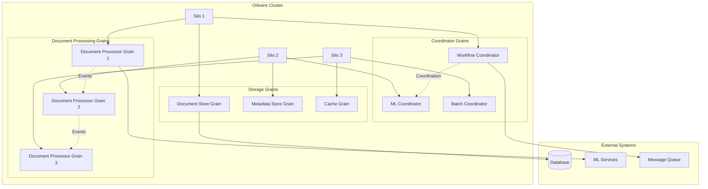

# Enterprise Orleans Distributed Actor Architecture

**Description**: Production-grade Orleans virtual actor framework for building mission-critical distributed systems with advanced fault tolerance, intelligent grain placement, enterprise monitoring, and cloud-native scalability for high-performance applications.

**Orleans 8.0+** delivers enterprise-scale distributed computing using the virtual actor model with automatic clustering, intelligent resource management, advanced persistence patterns, and comprehensive observability for cloud-native microservices architectures.

## Enterprise Capabilities

### Core Architecture

- **Intelligent Virtual Actors**: Stateful grains with advanced lifecycle management, resource optimization, and enterprise monitoring
- **Zero-Downtime Activation**: On-demand grain activation with intelligent caching, pre-warming, and performance optimization
- **Global Location Transparency**: Seamless distributed computing with automatic service discovery and intelligent routing
- **Enterprise State Management**: Multi-tier persistence with ACID guarantees, backup strategies, and disaster recovery
- **High-Throughput Streaming**: Real-time event processing with backpressure handling and guaranteed delivery
- **Autonomous Cluster Operations**: Self-healing clusters with intelligent membership, automatic failover, and elastic scaling

### Production Features

- **Mission-Critical Resilience**: Circuit breakers, bulkhead patterns, timeout strategies, and comprehensive fault tolerance
- **Enterprise Security**: End-to-end encryption, role-based access control, audit trails, and compliance frameworks
- **Advanced Monitoring**: Real-time performance metrics, distributed tracing, health checks, and predictive analytics
- **Cloud-Native Integration**: Kubernetes orchestration, Azure Service Fabric support, and multi-cloud deployment strategies

## Index

### Enterprise Patterns

#### Foundation Architecture

- [Enterprise Grain Fundamentals](grain-fundamentals.md) - Production-ready grain patterns with advanced lifecycle management and enterprise monitoring
- [Distributed Document Processing](document-processing-grains.md) - High-performance document workflows with intelligent grain coordination and fault tolerance
- [Enterprise State Management](state-management.md) - Multi-tier persistence with ACID guarantees, backup strategies, and disaster recovery
- [Real-Time Streaming Architecture](streaming-patterns.md) - Event-driven processing with guaranteed delivery and comprehensive monitoring

#### Production Optimization

- [Intelligent Grain Placement](grain-placement.md) - Advanced placement strategies with resource optimization and performance analytics
- [Enterprise Performance Tuning](performance-optimization.md) - Production scaling with predictive analytics and intelligent resource management
- [Mission-Critical Error Handling](error-handling.md) - Comprehensive resilience patterns with circuit breakers and automated recovery
- [Production Testing Frameworks](testing-strategies.md) - Enterprise testing with chaos engineering and performance validation

#### Enterprise Integration

- [Database Integration Patterns](database-integration.md) - Multi-database persistence with transaction coordination and consistency guarantees
- [External Service Integration](external-services.md) - Resilient service communication with advanced retry policies and circuit breakers  
- [Production Monitoring & Diagnostics](monitoring-diagnostics.md) - Comprehensive observability with distributed tracing and predictive analytics

### Integration Patterns

- [Aspire Integration](../aspire/orleans-integration.md) - Orleans with .NET Aspire orchestration
- [Database Integration](database-integration.md) - Connecting grains to data stores
- [External Services](external-services.md) - Integrating with APIs and message queues
- [Monitoring and Diagnostics](monitoring-diagnostics.md) - Observability patterns

## Architecture Overview



## Common Use Cases

### Document Processing Pipeline

- **Document Ingestion**: Single grain per document for processing coordination
- **Workflow Management**: Coordinator grains manage complex multi-step workflows
- **Result Aggregation**: Collector grains aggregate results from multiple processors
- **Cache Management**: Cache grains provide distributed caching with eviction policies

### Distributed Coordination

- **Task Distribution**: Manager grains distribute work across worker grains
- **State Synchronization**: Ensure consistent state across distributed operations
- **Event Processing**: Stream processors handle high-volume event streams
- **Resource Management**: Pool managers control access to limited resources

## Core Grain Patterns

### Basic Document Grain

```csharp
namespace DocumentProcessor.Grains;

using Orleans;
using Orleans.Runtime;

[GenerateSerializer]
public record DocumentMetadata(
    string Title,
    string Author,
    DateTime CreatedAt,
    Dictionary<string, string> Properties);

[GenerateSerializer]
public class DocumentState
{
    [Id(0)] public string Content { get; set; } = string.Empty;
    [Id(1)] public DocumentMetadata? Metadata { get; set; }
    [Id(2)] public ProcessingStatus Status { get; set; } = ProcessingStatus.Pending;
    [Id(3)] public List<ProcessingResult> Results { get; set; } = new();
    [Id(4)] public DateTime LastUpdated { get; set; } = DateTime.UtcNow;
}

public interface IDocumentGrain : IGrainWithStringKey
{
    Task SetContentAsync(string content, DocumentMetadata metadata);
    Task<string> GetContentAsync();
    Task<DocumentMetadata?> GetMetadataAsync();
    Task UpdateStatusAsync(ProcessingStatus status);
    Task<ProcessingStatus> GetStatusAsync();
    Task AddResultAsync(ProcessingResult result);
    Task<List<ProcessingResult>> GetResultsAsync();
}

public class DocumentGrain : Grain, IDocumentGrain
{
    private readonly IPersistentState<DocumentState> state;
    private readonly ILogger<DocumentGrain> logger;

    public DocumentGrain(
        [PersistentState("document", "DocumentStore")] IPersistentState<DocumentState> state,
        ILogger<DocumentGrain> logger)
    {
        state = state;
        logger = logger;
    }

    public async Task SetContentAsync(string content, DocumentMetadata metadata)
    {
        logger.LogInformation("Setting content for document {DocumentId}", this.GetPrimaryKeyString());
        
        state.State.Content = content;
        state.State.Metadata = metadata;
        state.State.Status = ProcessingStatus.Ready;
        state.State.LastUpdated = DateTime.UtcNow;
        
        await state.WriteStateAsync();
    }

    public Task<string> GetContentAsync()
    {
        return Task.FromResult(state.State.Content);
    }

    public Task<DocumentMetadata?> GetMetadataAsync()
    {
        return Task.FromResult(state.State.Metadata);
    }

    public async Task UpdateStatusAsync(ProcessingStatus status)
    {
        logger.LogDebug("Updating status to {Status} for document {DocumentId}", 
            status, this.GetPrimaryKeyString());
        
        state.State.Status = status;
        state.State.LastUpdated = DateTime.UtcNow;
        
        await state.WriteStateAsync();
    }

    public Task<ProcessingStatus> GetStatusAsync()
    {
        return Task.FromResult(state.State.Status);
    }

    public async Task AddResultAsync(ProcessingResult result)
    {
        logger.LogInformation("Adding processing result for document {DocumentId}", 
            this.GetPrimaryKeyString());
        
        state.State.Results.Add(result);
        state.State.LastUpdated = DateTime.UtcNow;
        
        await state.WriteStateAsync();
    }

    public Task<List<ProcessingResult>> GetResultsAsync()
    {
        return Task.FromResult(state.State.Results);
    }

    public override async Task OnActivateAsync(CancellationToken cancellationToken)
    {
        logger.LogDebug("Activating document grain {DocumentId}", this.GetPrimaryKeyString());
        await base.OnActivateAsync(cancellationToken);
    }

    public override async Task OnDeactivateAsync(DeactivationReason reason, CancellationToken cancellationToken)
    {
        logger.LogDebug("Deactivating document grain {DocumentId} due to {Reason}", 
            this.GetPrimaryKeyString(), reason);
        
        await state.WriteStateAsync();
        await base.OnDeactivateAsync(reason, cancellationToken);
    }
}

public enum ProcessingStatus
{
    Pending,
    Ready,
    Processing,
    Completed,
    Failed,
    Archived
}
```

### Workflow Coordinator Grain

```csharp
namespace DocumentProcessor.Grains;

using Orleans;
using Orleans.Streams;

[GenerateSerializer]
public record WorkflowDefinition(
    string Id,
    string Name,
    List<WorkflowStep> Steps,
    Dictionary<string, object> Parameters);

[GenerateSerializer]
public record WorkflowExecution(
    string WorkflowId,
    string ExecutionId,
    WorkflowStatus Status,
    Dictionary<string, object> StepResults,
    DateTime StartedAt,
    DateTime? CompletedAt);

public interface IWorkflowCoordinatorGrain : IGrainWithStringKey
{
    Task<string> StartWorkflowAsync(WorkflowDefinition workflow, string documentId);
    Task<WorkflowExecution?> GetExecutionAsync(string executionId);
    Task<List<WorkflowExecution>> GetActiveExecutionsAsync();
    Task PauseExecutionAsync(string executionId);
    Task ResumeExecutionAsync(string executionId);
    Task CancelExecutionAsync(string executionId);
}

public class WorkflowCoordinatorGrain : Grain, IWorkflowCoordinatorGrain
{
    private readonly IPersistentState<WorkflowCoordinatorState> state;
    private readonly ILogger<WorkflowCoordinatorGrain> logger;
    private IAsyncStream<WorkflowEvent>? eventStream;

    public WorkflowCoordinatorGrain(
        [PersistentState("workflow", "WorkflowStore")] IPersistentState<WorkflowCoordinatorState> state,
        ILogger<WorkflowCoordinatorGrain> logger)
    {
        state = state;
        logger = logger;
    }

    public override async Task OnActivateAsync(CancellationToken cancellationToken)
    {
        var streamProvider = this.GetStreamProvider("WorkflowEvents");
        eventStream = streamProvider.GetStream<WorkflowEvent>("workflow-events", this.GetPrimaryKeyString());
        
        await base.OnActivateAsync(cancellationToken);
    }

    public async Task<string> StartWorkflowAsync(WorkflowDefinition workflow, string documentId)
    {
        var executionId = Guid.NewGuid().ToString();
        
        logger.LogInformation("Starting workflow {WorkflowId} for document {DocumentId} with execution {ExecutionId}",
            workflow.Id, documentId, executionId);

        var execution = new WorkflowExecution(
            workflow.Id,
            executionId,
            WorkflowStatus.Running,
            new Dictionary<string, object>(),
            DateTime.UtcNow,
            null);

        state.State.Executions[executionId] = execution;
        await state.WriteStateAsync();

        // Start workflow execution
        this.RegisterTimer(async _ => await ExecuteWorkflowAsync(workflow, execution, documentId),
            null, TimeSpan.Zero, TimeSpan.FromSeconds(1));

        // Publish workflow started event
        if (eventStream != null)
        {
            await eventStream.OnNextAsync(new WorkflowEvent(
                WorkflowEventType.Started,
                workflow.Id,
                executionId,
                documentId));
        }

        return executionId;
    }

    private async Task ExecuteWorkflowAsync(WorkflowDefinition workflow, WorkflowExecution execution, string documentId)
    {
        try
        {
            var documentGrain = GrainFactory.GetGrain<IDocumentGrain>(documentId);
            
            foreach (var step in workflow.Steps.OrderBy(s => s.Order))
            {
                if (execution.Status != WorkflowStatus.Running)
                {
                    break; // Workflow was paused or cancelled
                }

                logger.LogDebug("Executing step {StepName} in workflow {WorkflowId}", 
                    step.Name, workflow.Id);

                var stepResult = await ExecuteWorkflowStepAsync(step, documentGrain, execution.StepResults);
                execution.StepResults[step.Name] = stepResult;

                // Update execution state
                state.State.Executions[execution.ExecutionId] = execution;
                await state.WriteStateAsync();
            }

            // Mark workflow as completed
            var completedExecution = execution with 
            { 
                Status = WorkflowStatus.Completed,
                CompletedAt = DateTime.UtcNow 
            };
            
            state.State.Executions[execution.ExecutionId] = completedExecution;
            await state.WriteStateAsync();

            // Publish workflow completed event
            if (eventStream != null)
            {
                await eventStream.OnNextAsync(new WorkflowEvent(
                    WorkflowEventType.Completed,
                    workflow.Id,
                    execution.ExecutionId,
                    documentId));
            }

            logger.LogInformation("Completed workflow {WorkflowId} execution {ExecutionId}",
                workflow.Id, execution.ExecutionId);
        }
        catch (Exception ex)
        {
            logger.LogError(ex, "Failed workflow {WorkflowId} execution {ExecutionId}",
                workflow.Id, execution.ExecutionId);

            var failedExecution = execution with 
            { 
                Status = WorkflowStatus.Failed,
                CompletedAt = DateTime.UtcNow 
            };
            
            state.State.Executions[execution.ExecutionId] = failedExecution;
            await state.WriteStateAsync();
        }
    }

    public Task<WorkflowExecution?> GetExecutionAsync(string executionId)
    {
        state.State.Executions.TryGetValue(executionId, out var execution);
        return Task.FromResult(execution);
    }

    public Task<List<WorkflowExecution>> GetActiveExecutionsAsync()
    {
        var activeExecutions = state.State.Executions.Values
            .Where(e => e.Status == WorkflowStatus.Running || e.Status == WorkflowStatus.Paused)
            .ToList();
        
        return Task.FromResult(activeExecutions);
    }
}
```

## Getting Started

### Prerequisites

- **.NET 9.0 or later**
- **Orleans 9.0+** - Latest Orleans framework
- **Database** - SQL Server, PostgreSQL, or Azure Storage for persistence
- **Message Queue** - Azure Service Bus, RabbitMQ, or Kafka for streaming

### Basic Silo Setup

```csharp
using Orleans;
using Orleans.Hosting;

var builder = Host.CreateApplicationBuilder(args);

builder.UseOrleans(siloBuilder =>
{
    siloBuilder
        .UseLocalhostClustering()
        .ConfigureLogging(logging => logging.AddConsole())
        .UseDashboard(options => { })
        .AddAdoNetGrainStorage("DocumentStore", options =>
        {
            options.ConnectionString = builder.Configuration.GetConnectionString("DefaultConnection");
            options.Invariant = "System.Data.SqlClient";
        })
        .AddSimpleMessageStreamProvider("StreamProvider")
        .AddMemoryGrainStorage("PubSubStore")
        .ConfigureApplicationParts(parts =>
        {
            parts.AddApplicationPart(typeof(DocumentGrain).Assembly).WithReferences();
        });
});

var host = builder.Build();
await host.RunAsync();
```

### Basic Client Setup

```csharp
using Orleans;
using Orleans.Configuration;

var clientBuilder = new ClientBuilder()
    .UseLocalhostClustering()
    .ConfigureLogging(logging => logging.AddConsole())
    .ConfigureApplicationParts(parts =>
    {
        parts.AddApplicationPart(typeof(IDocumentGrain).Assembly).WithReferences();
    });

using var client = clientBuilder.Build();
await client.Connect();

// Use grains
var documentGrain = client.GetGrain<IDocumentGrain>("doc-123");
await documentGrain.SetContentAsync("Sample content", new DocumentMetadata(
    "Sample Document",
    "Author",
    DateTime.UtcNow,
    new Dictionary<string, string>()));
```

## Best Practices

### Grain Design Principles

- **Single Responsibility** - Each grain type should handle one specific domain concept
- **Immutable Messages** - Use record types for method parameters and return values
- **Async All the Way** - Never block on async operations within grains
- **Idempotent Operations** - Design operations to be safely retryable

### State Management

- **Minimize State Size** - Keep grain state as small as possible for performance
- **Version Your State** - Plan for state schema evolution over time
- **Batch State Updates** - Group multiple changes before writing state
- **Handle Activation/Deactivation** - Properly manage grain lifecycle events

### Performance Optimization

- **Grain Placement** - Use placement strategies to optimize data locality
- **Stateless Workers** - Use for CPU-intensive operations that don't need state
- **Streaming** - Use Orleans Streams for high-throughput event processing
- **Request Coalescing** - Batch similar requests when possible

### Error Handling

- **Graceful Degradation** - Continue operating when non-critical services fail
- **Exponential Backoff** - Implement retry policies with increasing delays
- **Circuit Breakers** - Protect against cascading failures
- **Monitoring** - Implement comprehensive logging and metrics

## Related Patterns

- [Document Processing Grains](document-processing-grains.md) - Specialized grains for document workflows
- [Streaming Patterns](streaming-patterns.md) - Event-driven communication patterns
- [State Management](state-management.md) - Advanced persistence patterns
- [Aspire Integration](../aspire/orleans-integration.md) - Orleans with .NET Aspire

---

**Key Benefits**: Virtual actor model, automatic scaling, fault tolerance, location transparency, distributed state management

**When to Use**: Building stateful distributed services, managing complex workflows, coordinating document processing pipelines

**Performance**: Automatic clustering, load balancing, resource optimization, horizontal scaling
